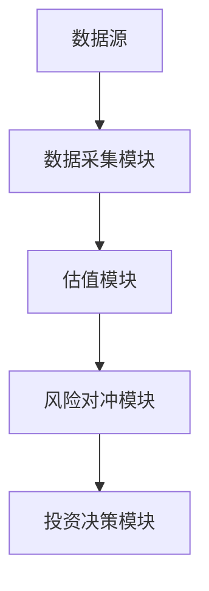
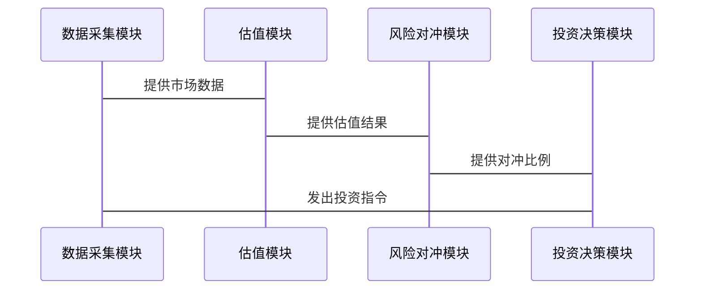

                 


# 如何将特价股票策略应用于新兴市场本地货币债券投资

> 关键词：特价股票策略，新兴市场，本地货币债券，投资策略，算法原理，系统架构

> 摘要：本文深入探讨了如何将特价股票策略应用于新兴市场本地货币债券投资，从背景分析、核心概念、算法原理、系统架构到实战案例，层层剖析，结合理论与实践，为投资者提供了一套系统化的解决方案。

---

# 第一部分: 特价股票策略与新兴市场本地货币债券投资概述

## 第1章: 特价股票策略与新兴市场本地货币债券投资概述

### 1.1 特价股票策略的基本概念
#### 1.1.1 特价股票的定义与特点
特价股票是指价格被市场低估的股票，通常具有较高的潜在回报率。其特点包括低估值、高分红率和低流动性。

#### 1.1.2 特价股票策略的核心要素
- 低市盈率（P/E比率）：市盈率低于行业平均水平。
- 低市净率（P/B比率）：市净率低于行业平均水平。
- 高股息率：股息收益率较高。
- 公司基本面良好：盈利能力强，财务状况健康。

#### 1.1.3 特价股票策略在投资中的作用
- 把握市场低估机会，获取超额收益。
- 在熊市或震荡市中提供避险功能。
- 适合长期价值投资者。

### 1.2 新兴市场本地货币债券的基本概念
#### 1.2.1 新兴市场的定义与特点
新兴市场是指经济快速增长、市场机制逐步完善的国家或地区，如中国、印度、巴西等。

#### 1.2.2 本地货币债券的定义与属性
本地货币债券是以新兴市场国家的本币计价的债券，具有以下属性：
- 利息收入：按票面利率支付。
- 本金偿还：到期偿还本金。
- 汇率风险：债券以本币计价，存在汇率波动风险。

#### 1.2.3 新兴市场本地货币债券的投资价值
- 高收益：新兴市场债券收益率通常高于发达市场。
- 多样化：新兴市场分布广泛，提供多样化投资机会。
- 市场流动性逐步提高。

### 1.3 特价股票策略应用于新兴市场本地货币债券投资的背景
#### 1.3.1 当前金融市场环境分析
- 全球低利率环境，债券收益率普遍走低。
- 新兴市场债券收益率相对较高，吸引全球投资者。
- 特价股票策略在股票市场中的应用较为成熟，但其在债券市场的应用尚处探索阶段。

#### 1.3.2 新兴市场债券投资的机遇与挑战
- 机遇：新兴市场经济增长快，债券收益率高。
- 挑战：汇率风险、信用风险、流动性风险。

#### 1.3.3 特价股票策略的适用性与局限性
- 适用性：新兴市场债券市场流动性逐步提高，适合套利和价值投资。
- 局限性：新兴市场债券市场波动较大，套利空间有限。

## 第2章: 特价股票策略与新兴市场本地货币债券投资的核心概念

### 2.1 特价股票策略的数学模型与公式
#### 2.1.1 特价股票策略的基本公式
- 市盈率（P/E）= 股价 / 每股净利润
- 市净率（P/B）= 股价 / 每股净资产
- 股息率 = 每股股息 / 股价

#### 2.1.2 特价股票策略的数学模型
$$
\text{价值} = \sum_{t=1}^{n} \frac{\text{现金流}}{(1 + r)^t}
$$

其中，$r$ 是折现率，$\text{现金流}$ 是未来现金流。

#### 2.1.3 特价股票策略与债券投资的数学关系
- 特价股票策略通过低估模型确定股票价值，而债券投资通过现金流折现法确定债券价值。

### 2.2 新兴市场本地货币债券的数学模型与公式
#### 2.2.1 本地货币债券的定价公式
$$
\text{债券价格} = \sum_{t=1}^{n} \frac{\text{利息}}{(1 + r)^t} + \frac{\text{面值}}{(1 + r)^n}
$$

其中，$r$ 是债券的收益率，$n$ 是债券期限。

#### 2.2.2 新兴市场债券的收益率计算
- 名义收益率：$$\text{收益率} = \frac{\text{年利息}}{\text{面值}} \times 100\%$$
- 实际收益率：$$\text{实际收益率} = \text{名义收益率} - \text{通货膨胀率}$$

#### 2.2.3 新兴市场债券的风险评估模型
- 信用风险模型：$$\text{违约风险} = f(\text{企业财务状况}, \text{行业风险}, \text{宏观经济环境})$$
- 汇率风险模型：$$\text{汇率风险} = f(\text{汇率波动}, \text{债券期限})$$

### 2.3 特价股票策略与新兴市场本地货币债券投资的核心概念对比
#### 2.3.1 对比表格：特价股票策略与本地货币债券的核心要素对比

| 比较维度 | 特价股票策略 | 新兴市场本地货币债券 |
|----------|--------------|-----------------------|
| 投资标的 | 股票          | 债券                  |
| 收益来源 | 股价上涨      | 利息收入和本金偿还    |
| 风险类型 | 市场风险、流动性风险 | 信用风险、汇率风险   |
| 投资策略 | 价值投资      | 套利、长期配置        |

#### 2.3.2 对比表格：两种投资策略的风险与收益对比

| 风险与收益维度 | 特价股票策略 | 新兴市场本地货币债券 |
|----------------|--------------|-----------------------|
| 高收益潜力     | 高           | 中高                  |
| 高风险         | 高           | 中高                  |
| 流动性风险     | 高           | 中                   |
| 汇率风险       | 无           | 有                   |
| 信用风险       | 低           | 高                   |

#### 2.3.3 对比表格：两种投资策略的适用场景对比

| 适用场景维度 | 特价股票策略 | 新兴市场本地货币债券 |
|----------------|--------------|-----------------------|
| 市场周期       | 熊市、震荡市  | 经济复苏、增长期     |
| 投资期限       | 中长期       | 中长期               |
| 投资者类型     | 价值投资者   | 机构投资者、长期投资者 |

## 第3章: 特价股票策略应用于新兴市场本地货币债券投资的算法原理

### 3.1 特价股票策略的算法原理
#### 3.1.1 特价股票策略的套利模型
- 套利模型：通过比较股票的市场价格与内在价值，寻找价格低于内在价值的股票进行投资。
- 模型公式：$$\text{内在价值} = \sum_{t=1}^{n} \frac{\text{现金流}}{(1 + r)^t}$$

#### 3.1.2 特价股票策略的统计套利方法
- 统计套利：利用历史数据和统计方法，寻找价格与价值偏离较大的股票。
- 方法步骤：
  1. 计算股票的市盈率、市净率等估值指标。
  2. 比较当前估值与历史平均值，寻找低估股票。
  3. 建立多头头寸，等待股价回归。

#### 3.1.3 特价股票策略的风险对冲方法
- 风险对冲：通过股指期货、融券等方式对冲市场风险。
- 对冲模型：
  $$\text{对冲比例} = \frac{\text{股票组合市值}}{\text{股指期货合约价值}}$$

### 3.2 新兴市场本地货币债券的套利模型
#### 3.2.1 本地货币债券的套利机会
- 套利机会：新兴市场债券收益率较高，但存在汇率风险。
- 套利策略：通过做空汇率对冲，锁定债券收益率。

#### 3.2.2 新兴市场债券的套利模型
- 模型公式：
  $$
  \text{预期收益} = \text{债券收益率} - \text{汇率波动预期}
  $$

#### 3.2.3 债券套利的风险管理
- 风险管理：通过期权对冲汇率风险，设定止损点。

### 3.3 特价股票策略与本地货币债券投资的结合
#### 3.3.1 模型结合思路
- 将股票的内在价值评估模型应用于债券定价。
- 结合债券的收益率和股票的估值指标，寻找低估债券。

#### 3.3.2 结合算法流程
1. 选取新兴市场本地货币债券。
2. 计算债券的内在价值。
3. 比较债券市场价格与内在价值，寻找低估债券。
4. 建立债券多头头寸，对冲汇率风险。

---

## 第4章: 特价股票策略与新兴市场本地货币债券投资的系统架构设计

### 4.1 系统架构设计
#### 4.1.1 系统功能模块
- 数据采集模块：采集股票和债券市场数据。
- 估值模块：计算股票和债券的内在价值。
- 风险对冲模块：对冲汇率和市场风险。
- 投资决策模块：根据模型结果，发出投资指令。

#### 4.1.2 系统架构图



### 4.2 系统接口设计
#### 4.2.1 数据接口
- 数据接口类型：API接口。
- 数据接口功能：实时获取股票和债券市场数据。

#### 4.2.2 对冲接口
- 对冲方式：汇率对冲和市场对冲。
- 对冲工具：股指期货、期权、外汇远期合约。

### 4.3 系统交互设计
#### 4.3.1 系统交互流程
1. 数据采集模块获取市场数据。
2. 估值模块计算股票和债券的内在价值。
3. 风险对冲模块根据模型计算对冲比例。
4. 投资决策模块根据模型结果发出投资指令。

#### 4.3.2 系统交互图



---

## 第5章: 特价股票策略与新兴市场本地货币债券投资的项目实战

### 5.1 项目环境安装
#### 5.1.1 环境要求
- 操作系统：Windows、Linux、macOS。
- 开发工具：Python、Jupyter Notebook、IDE。

#### 5.1.2 依赖安装
```bash
pip install pandas numpy matplotlib requests
```

### 5.2 核心代码实现
#### 5.2.1 数据采集模块
```python
import requests

def get_stock_data(ticker):
    url = f"https://api.example.com/stock/{ticker}"
    response = requests.get(url)
    return response.json()

def get_bond_data(isin):
    url = f"https://api.example.com/bond/{isin}"
    response = requests.get(url)
    return response.json()
```

#### 5.2.2 估值模块
```python
import pandas as pd

def calculate_intrinsic_value(ticker):
    data = get_stock_data(ticker)
    eps = data['eps']
    growth_rate = data['growth_rate']
    discount_rate = 0.1
    cash_flows = [eps * (1 + growth_rate) ** i for i in range(5)]
    intrinsic_value = sum(cash_flows / (1 + discount_rate) ** i for i in range(5))
    return intrinsic_value
```

#### 5.2.3 风险对冲模块
```python
import numpy as np

def hedge_currency_risk(position_size, spot_rate, forward_rate):
    risk_delta = position_size * (forward_rate - spot_rate)
    hedge_ratio = risk_delta / (spot_rate - forward_rate)
    return hedge_ratio
```

### 5.3 项目小结
- 项目实现了将特价股票策略应用于新兴市场本地货币债券投资的系统架构。
- 通过代码实现，展示了数据采集、估值、风险对冲的具体步骤。
- 为投资者提供了一套系统化的解决方案，帮助其在新兴市场中实现套利和价值投资。

---

## 第6章: 特价股票策略与新兴市场本地货币债券投资的注意事项与拓展阅读

### 6.1 注意事项
- 汇率波动对债券投资的影响。
- 新兴市场债券市场的流动性风险。
- 本地货币债券的信用风险。

### 6.2 拓展阅读
- 建议阅读《投资学》（教材）。
- 建议学习Python和数据分析工具，如Pandas、NumPy。
- 建议深入研究新兴市场的宏观经济环境。

---

## 第7章: 总结与展望

### 7.1 总结
- 本文深入探讨了将特价股票策略应用于新兴市场本地货币债券投资的理论与实践。
- 结合数学模型、算法原理和系统架构，为投资者提供了一套系统化的解决方案。

### 7.2 展望
- 随着新兴市场债券市场的不断发展，特价股票策略在其中的应用将更加广泛。
- 未来可以通过机器学习等技术，进一步提升模型的准确性和效率。

---

## 作者：AI天才研究院/AI Genius Institute & 禅与计算机程序设计艺术/Zen And The Art of Computer Programming

