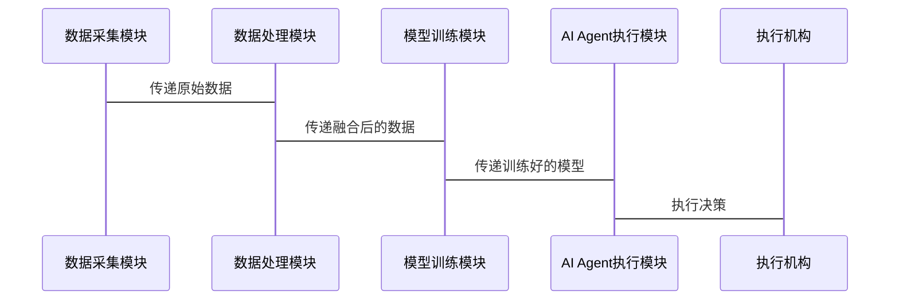

                 


# 开发具有多模态学习能力的AI Agent

> 关键词：多模态学习、AI Agent、深度学习、模型融合、跨模态交互

> 摘要：本文详细探讨了开发具有多模态学习能力的AI Agent的核心概念、算法原理、系统架构和项目实战。通过分析多模态学习的原理和AI Agent的架构设计，结合具体的算法实现和系统案例，展示了如何通过多模态数据的融合与处理，提升AI Agent的智能水平和应用场景。本文内容涵盖从理论到实践的各个方面，旨在为读者提供一个全面的指导。

## 第一章 多模态学习与AI Agent的背景介绍

### 1.1 多模态学习的定义与特点

#### 1.1.1 多模态数据的定义
多模态数据指的是来自多种感官渠道的信息，如文本、图像、语音、视频、传感器数据等。这些数据类型各自携带不同的信息，共同构成了对现实世界的多维度描述。

#### 1.1.2 多模态学习的核心特点
- **信息丰富性**：多模态数据能够提供更全面的信息，帮助模型更好地理解复杂场景。
- **互补性**：不同模态的数据可以相互补充，弥补单一模态数据的不足。
- **多样性**：多模态学习能够处理不同类型的数据，增强了模型的适应性和鲁棒性。

#### 1.1.3 多模态学习与单模态学习的对比
| 特性 | 单模态学习 | 多模态学习 |
|------|------------|------------|
| 数据来源 | 单一类型 | 多种类型 |
| 信息丰富性 | 较低 | 高 |
| 模型复杂性 | 较低 | 较高 |
| 应用场景 | 有限 | 广泛 |

### 1.2 AI Agent的基本概念

#### 1.2.1 AI Agent的定义
AI Agent（人工智能代理）是指能够感知环境、自主决策并执行任务的智能实体。它可以是一个软件程序，也可以是一个物理设备。

#### 1.2.2 AI Agent的核心功能
- **感知**：通过传感器或数据接口获取环境信息。
- **决策**：基于感知信息进行分析和推理，制定行动计划。
- **执行**：通过执行机构或接口将决策转化为实际操作。

#### 1.2.3 AI Agent的应用场景
- **智能家居**：控制家中各种设备，提供智能化服务。
- **自动驾驶**：通过多模态数据感知环境，做出驾驶决策。
- **智能助手**：帮助用户完成各种任务，如 Siri、Alexa 等。

### 1.3 多模态学习在AI Agent中的作用

#### 1.3.1 多模态数据对AI Agent能力的提升
通过整合多种模态的数据，AI Agent能够更全面地理解环境，做出更准确的决策。

#### 1.3.2 多模态学习与AI Agent的结合
- **数据融合**：将文本、图像、语音等多种数据进行融合，提升感知能力。
- **联合学习**：通过多模态数据的协同学习，增强模型的泛化能力。

#### 1.3.3 多模态学习对AI Agent应用的推动
- **提升准确性**：通过多模态数据的相互验证，减少单一模态数据的不确定性。
- **增强适应性**：在复杂环境中，多模态数据能够提供更多的冗余信息，提高系统的鲁棒性。

## 第二章 多模态学习与AI Agent的核心概念

### 2.1 多模态学习的原理

#### 2.1.1 多模态数据的融合方式
- **早期融合**：在数据预处理阶段进行融合。
- **晚期融合**：在特征提取或决策阶段进行融合。
- **中间融合**：在数据转换或特征提取过程中进行融合。

#### 2.1.2 多模态学习的核心技术
- **跨模态对齐**：将不同模态的数据对齐到同一个语义空间。
- **模态权重分配**：根据任务需求，动态调整不同模态的重要性。
- **联合表示学习**：通过多模态数据的协同学习，生成统一的语义表示。

#### 2.1.3 多模态学习的挑战
- **数据异构性**：不同模态的数据具有不同的特征和表示方式。
- **计算复杂度**：多模态数据的处理需要更高的计算资源。
- **模型设计**：如何有效融合不同模态的数据是一个开放性问题。

### 2.2 AI Agent的架构设计

#### 2.2.1 AI Agent的模块划分
- **感知模块**：负责数据的采集和初步处理。
- **推理模块**：负责对感知数据进行分析和推理。
- **决策模块**：根据推理结果制定行动计划。
- **执行模块**：将决策转化为具体的操作。

#### 2.2.2 模块之间的关系
感知模块将环境信息传递给推理模块，推理模块通过分析信息生成决策，并将决策传递给执行模块，执行模块根据决策执行具体操作。

#### 2.2.3 模块的功能与交互
通过模块之间的协同工作，AI Agent能够完成从感知到执行的完整流程。

### 2.3 多模态学习与AI Agent的结合

#### 2.3.1 多模态数据如何驱动AI Agent
通过多模态数据的融合，AI Agent能够更全面地理解环境信息，做出更准确的决策。

#### 2.3.2 多模态学习如何提升AI Agent的智能水平
通过多模态数据的学习，AI Agent能够掌握更多的知识和技能，提升其智能水平。

#### 2.3.3 多模态学习在AI Agent中的具体应用
- **智能助手**：通过整合语音、文本和用户行为数据，提供更智能化的服务。
- **自动驾驶**：通过融合视觉、雷达和 GPS 数据，提高自动驾驶的准确性和安全性。

## 第三章 多模态学习与AI Agent的核心算法

### 3.1 多模态数据处理算法

#### 3.1.1 多模态数据的预处理
- **数据清洗**：去除噪声和无关信息。
- **数据标准化**：将数据转换为统一的格式和尺度。
- **数据增强**：通过增加数据的多样性和复杂性，提高模型的鲁棒性。

#### 3.1.2 多模态数据的特征提取
- **文本特征提取**：使用词袋模型、TF-IDF 或深度学习模型（如 LSTM、BERT）提取文本特征。
- **图像特征提取**：使用CNN等深度学习模型提取图像特征。
- **语音特征提取**：使用STFT、MFCC等方法提取语音特征。

#### 3.1.3 多模态数据的融合策略
- **直接融合**：将不同模态的特征直接拼接。
- **加权融合**：根据模态的重要性进行加权。
- **对齐融合**：将不同模态的数据对齐到同一空间后进行融合。

### 3.2 AI Agent的算法实现

#### 3.2.1 AI Agent的感知算法
- **环境感知**：通过传感器或数据接口获取环境信息。
- **数据处理**：对感知数据进行预处理和特征提取。
- **信息融合**：将多模态数据进行融合，生成统一的语义表示。

#### 3.2.2 AI Agent的决策算法
- **基于规则的决策**：根据预定义的规则进行决策。
- **基于模型的决策**：使用机器学习模型进行预测和决策。
- **基于强化学习的决策**：通过强化学习优化决策策略。

#### 3.2.3 AI Agent的执行算法
- **动作规划**：根据决策结果规划具体的动作序列。
- **动作执行**：通过执行机构或接口将决策转化为具体操作。
- **反馈处理**：根据执行结果调整后续的决策和动作。

### 3.3 多模态学习与AI Agent算法的结合

#### 3.3.1 多模态学习算法在AI Agent中的应用
- **联合表示学习**：通过多模态数据的协同学习，生成统一的语义表示。
- **跨模态对齐**：将不同模态的数据对齐到同一个语义空间。
- **模态权重分配**：根据任务需求，动态调整不同模态的重要性。

#### 3.3.2 多模态学习如何优化AI Agent的算法性能
- **提升准确性**：通过多模态数据的相互验证，减少单一模态数据的不确定性。
- **增强适应性**：在复杂环境中，多模态数据能够提供更多的冗余信息，提高系统的鲁棒性。

#### 3.3.3 多模态学习与AI Agent算法的未来发展趋势
- **更复杂的多模态融合方法**：探索更有效的多模态数据融合策略。
- **更智能的决策算法**：结合深度学习和强化学习，提升AI Agent的决策能力。
- **更高效的计算方法**：通过优化算法和硬件加速，提高多模态学习的计算效率。

## 第四章 多模态学习与AI Agent的系统架构

### 4.1 系统整体架构设计

#### 4.1.1 系统功能模块划分
- **数据采集模块**：负责多模态数据的采集和预处理。
- **数据处理模块**：负责对采集的数据进行特征提取和融合。
- **模型训练模块**：负责训练多模态学习模型。
- **AI Agent执行模块**：负责根据模型的输出进行决策和执行。

#### 4.1.2 系统模块之间的交互流程
1. 数据采集模块采集多模态数据，并将其传递给数据处理模块。
2. 数据处理模块对数据进行预处理、特征提取和融合，生成统一的语义表示。
3. 模型训练模块利用融合后的数据训练多模态学习模型。
4. AI Agent执行模块根据模型的输出进行决策和执行。

#### 4.1.3 系统的可扩展性设计
- **模块化设计**：各模块相对独立，便于扩展和维护。
- **接口标准化**：通过标准化的接口进行模块之间的交互，便于系统的扩展。

### 4.2 各功能模块的具体实现

#### 4.2.1 数据采集模块的设计与实现
- **数据采集**：通过传感器、摄像头、麦克风等设备采集多模态数据。
- **数据预处理**：对采集的数据进行清洗、标准化和增强。

#### 4.2.2 数据处理模块的设计与实现
- **特征提取**：对不同模态的数据进行特征提取。
- **数据融合**：将不同模态的特征进行融合，生成统一的语义表示。

#### 4.2.3 模型训练模块的设计与实现
- **模型选择**：选择适合的多模态学习模型。
- **模型训练**：利用融合后的数据训练模型。
- **模型优化**：通过调参和优化算法提高模型的性能。

#### 4.2.4 AI Agent执行模块的设计与实现
- **决策制定**：根据模型的输出制定行动计划。
- **动作规划**：根据决策结果规划具体的动作序列。
- **动作执行**：通过执行机构或接口将决策转化为具体操作。
- **反馈处理**：根据执行结果调整后续的决策和动作。

### 4.3 系统架构设计

#### 4.3.1 系统架构的分层结构
- **数据层**：负责数据的存储和管理。
- **处理层**：负责数据的处理和融合。
- **模型层**：负责多模态学习模型的训练和部署。
- **执行层**：负责AI Agent的决策和执行。

#### 4.3.2 系统架构的模块划分
- **数据采集模块**：负责数据的采集和预处理。
- **数据处理模块**：负责数据的特征提取和融合。
- **模型训练模块**：负责多模态学习模型的训练和优化。
- **AI Agent执行模块**：负责决策和执行。

#### 4.3.3 系统架构的交互流程
1. 数据采集模块采集多模态数据，并将其传递给数据处理模块。
2. 数据处理模块对数据进行预处理、特征提取和融合，生成统一的语义表示。
3. 模型训练模块利用融合后的数据训练多模态学习模型。
4. AI Agent执行模块根据模型的输出进行决策和执行。

### 4.4 系统接口设计与交互流程

#### 4.4.1 系统接口设计
- **数据接口**：定义数据的格式和传输方式。
- **模型接口**：定义模型的输入和输出接口。
- **执行接口**：定义执行模块的动作接口。

#### 4.4.2 系统交互流程
1. 数据采集模块通过数据接口将采集的数据传递给数据处理模块。
2. 数据处理模块通过数据接口将融合后的数据传递给模型训练模块。
3. 模型训练模块通过模型接口将训练好的模型传递给AI Agent执行模块。
4. AI Agent执行模块通过执行接口将决策结果传递给执行机构。

### 4.5 系统交互流程图



## 第五章 多模态学习与AI Agent的项目实战

### 5.1 项目背景介绍

#### 5.1.1 项目目标
开发一个具有多模态学习能力的AI Agent，能够在多种环境下完成复杂的任务。

#### 5.1.2 项目需求
- **多模态数据采集**：支持多种模态数据的采集和处理。
- **多模态数据融合**：能够将不同模态的数据进行融合，生成统一的语义表示。
- **AI Agent决策**：能够根据融合后的数据进行决策和执行。

### 5.2 系统核心实现

#### 5.2.1 环境安装与配置
- **安装Python**：确保安装了最新版本的Python。
- **安装依赖库**：安装必要的深度学习框架（如TensorFlow、PyTorch）和其他工具库。
- **配置开发环境**：配置IDE和开发工具，确保环境能够运行项目代码。

#### 5.2.2 核心代码实现

##### 5.2.2.1 数据采集模块实现
```python
import numpy as np

def collect_data():
    # 采集多模态数据
    text = "今天天气很好，适合外出。"
    image = np.random.rand(100, 100, 3)
    audio = np.random.rand(1000)
    return text, image, audio

text, image, audio = collect_data()
print("文本数据:", text)
print("图像数据形状:", image.shape)
print("音频数据形状:", audio.shape)
```

##### 5.2.2.2 数据处理模块实现
```python
from tensorflow.keras import layers, Model

def process_data(text, image, audio):
    # 文本特征提取
    text_features = layers.Dense(64, activation='relu')(text)
    # 图像特征提取
    image_features = layers.Conv2D(64, (3,3), activation='relu')(image)
    # 音频特征提取
    audio_features = layers.Dense(64, activation='relu')(audio)
    # 特征融合
    features = layers.Concatenate()([text_features, image_features, audio_features])
    return features

input_text = layers.Input(shape=(None, 1))
input_image = layers.Input(shape=(100, 100, 3))
input_audio = layers.Input(shape=(1000,))
features = process_data(input_text, input_image, input_audio)
model = Model(inputs=[input_text, input_image, input_audio], outputs=features)
model.summary()
```

##### 5.2.2.3 模型训练模块实现
```python
from tensorflow.keras.callbacks import EarlyStopping

def train_model(model, X, y):
    model.compile(optimizer='adam', loss='binary_crossentropy', metrics=['accuracy'])
    early_stop = EarlyStopping(monitor='val_loss', patience=5)
    history = model.fit(X, y, epochs=100, batch_size=32, validation_split=0.2, callbacks=[early_stop])
    return history

# 假设X为输入数据，y为标签
history = train_model(model, X, y)
print("训练完成，历史记录:", history.history)
```

##### 5.2.2.4 AI Agent执行模块实现
```python
def execute_agent(model, input_data):
    # 接收输入数据
    prediction = model.predict(input_data)
    # 根据预测结果执行相应动作
    if prediction[0] > 0.5:
        print("执行动作1")
    else:
        print("执行动作2")

execute_agent(model, input_data)
```

#### 5.2.3 代码功能解读
- **数据采集模块**：负责采集多模态数据，包括文本、图像和音频。
- **数据处理模块**：对采集的数据进行特征提取和融合，生成统一的语义表示。
- **模型训练模块**：利用融合后的数据训练多模态学习模型。
- **AI Agent执行模块**：根据模型的输出进行决策和执行。

### 5.3 项目实战分析

#### 5.3.1 实际案例分析
- **案例描述**：假设我们开发一个智能助手，能够通过语音和文本理解用户的需求，并执行相应的操作。
- **数据采集**：采集用户的语音指令和相关文本信息。
- **数据处理**：对语音和文本数据进行特征提取和融合。
- **模型训练**：训练一个多模态模型，能够理解用户的指令并生成相应的文本响应。
- **决策执行**：根据模型的输出，执行相应的操作，如播放音乐、设置提醒等。

#### 5.3.2 案例分析与解读
通过实际案例分析，展示了多模态学习在AI Agent中的具体应用，以及如何通过系统架构和算法实现提升AI Agent的智能水平。

#### 5.3.3 项目总结
- **项目成果**：成功开发了一个具有多模态学习能力的AI Agent。
- **经验总结**：在项目实施过程中，需要注意多模态数据的融合和模型的优化，确保系统的准确性和高效性。

### 5.4 项目最佳实践

#### 5.4.1 小结
通过本项目的实施，我们掌握了多模态学习在AI Agent中的应用方法，以及系统的整体架构和实现细节。

#### 5.4.2 注意事项
- **数据质量**：确保数据的准确性和完整性。
- **模型优化**：通过调参和优化算法提高模型的性能。
- **系统维护**：定期更新模型和系统，确保系统的稳定性和先进性。

#### 5.4.3 拓展阅读
- **推荐书籍**：《Deep Learning》、《Pattern Recognition and Machine Learning》
- **推荐论文**：《Multimodal Deep Learning for Visual Recognition》、《Attention Is All You Need》
- **在线课程**：推荐相关的在线课程，如Coursera上的《Introduction to AI》。

---

## 作者：AI天才研究院/AI Genius Institute & 禅与计算机程序设计艺术 /Zen And The Art of Computer Programming

