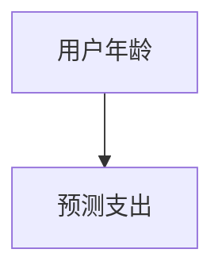
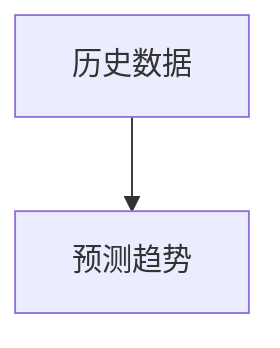
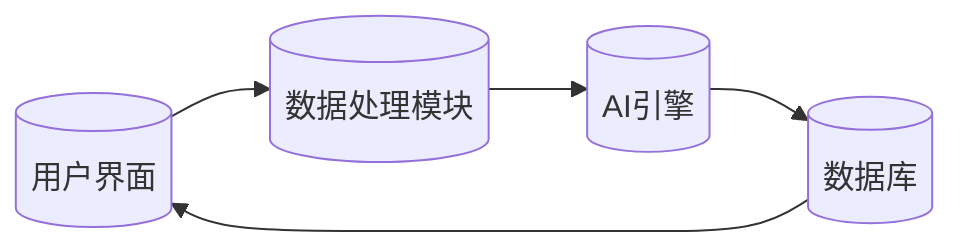

                 


# 开发智能化的个人退休规划助手

## 关键词：人工智能、退休规划、机器学习、系统架构、数据可视化

## 摘要：随着人口老龄化加剧，个人退休规划的重要性日益凸显。智能化退休规划助手通过结合AI技术，能够为用户提供个性化的退休计划和实时的财务建议。本文将从背景、核心概念、算法原理、系统架构、项目实战等方面，详细阐述开发智能化个人退休规划助手的全过程。

---

# 第一部分: 智能化个人退休规划助手的背景与核心概念

## 第1章: 退休规划的现状与挑战

### 1.1 退休规划的背景与问题背景

#### 1.1.1 退休规划的定义与目标
退休规划是帮助个人在退休后维持生活质量的重要财务规划工具。其目标包括确保退休后有足够的资金来源、优化资产配置以实现保值增值、以及应对突发的财务风险。

#### 1.1.2 当前退休规划的主要问题
传统退休规划存在以下问题：
- **信息不对称**：用户难以获取专业的财务知识和市场动态。
- **计算复杂性**：涉及多变量的财务模型难以手动计算。
- **个性化不足**：传统规划往往基于固定模板，缺乏个性化定制。
- **动态调整能力不足**：市场波动和用户需求变化难以实时响应。

#### 1.1.3 智能化退休规划助手的必要性
智能化退休规划助手通过AI技术，能够实时分析用户需求、市场动态，并提供个性化、动态化的财务建议，弥补传统规划的不足。

---

### 1.2 退休规划的核心要素与边界

#### 1.2.1 退休规划的核心要素分析
退休规划的核心要素包括：
- **用户基本信息**：年龄、收入、资产、负债。
- **财务目标**：退休后的生活质量、资产规模。
- **市场环境**：通货膨胀率、利率、市场波动。

#### 1.2.2 退休规划的边界与外延
- **边界**：专注于个人退休规划，不涉及企业或机构的退休计划。
- **外延**：可扩展至退休后的健康管理、遗产规划等。

#### 1.2.3 核心概念的结构与组成
退休规划的核心结构可以分为三个层次：
1. **输入层**：用户基本信息、财务目标、市场环境。
2. **处理层**：数据处理、模型计算、决策逻辑。
3. **输出层**：规划方案、建议、实时反馈。

---

## 第2章: 智能化退休规划助手的核心概念

### 2.1 用户画像与需求分析

#### 2.1.1 用户画像的定义与作用
用户画像是基于用户基本信息和行为特征构建的模型，用于精准分析用户需求。

#### 2.1.2 不同用户的退休规划需求分析
| 用户群体 | 需求特点 |
|----------|----------|
| 年轻用户 | 注重长期资产增值，风险承受能力强。 |
| 中年用户 | 关注稳定收益，注重风险控制。 |
| 老年用户 | 更关注资产保值和现金流稳定性。 |

#### 2.1.3 用户需求的层次化分析
- **显性需求**：明确的财务目标，如“希望在退休后每年有10万元收入”。
- **隐性需求**：未明说但实际需要的服务，如“希望规划能应对突发重大疾病支出”。

---

### 2.2 数据分析与决策支持

#### 2.2.1 数据分析的核心作用
数据分析是智能化退休规划助手的基础，通过分析历史数据和市场趋势，为用户提供科学的决策依据。

#### 2.2.2 数据分析的关键指标与维度
| 指标维度 | 具体指标 |
|----------|----------|
| 用户维度 | 年龄、收入、资产规模。 |
| 市场维度 | 通货膨胀率、利率、市场波动率。 |
| 时间维度 | 短期（1-3年）、中期（3-5年）、长期（5年以上）。 |

#### 2.2.3 数据分析的边界与外延
- **边界**：专注于财务数据，不涉及非财务因素。
- **外延**：可扩展至健康数据、消费数据等。

---

### 2.3 AI技术在退休规划中的应用

#### 2.3.1 AI技术的核心作用
AI技术通过机器学习算法，能够实现以下功能：
- **数据建模**：建立用户画像和市场模型。
- **预测分析**：预测市场趋势和用户需求。
- **动态调整**：实时优化规划方案。

#### 2.3.2 AI技术在退休规划中的应用场景
- **需求预测**：预测用户的退休资金需求。
- **资产配置**：根据市场波动动态调整投资组合。
- **风险预警**：识别潜在的财务风险。

#### 2.3.3 AI技术与传统退休规划的对比分析
| 对比维度 | 传统规划 | AI驱动规划 |
|----------|----------|------------|
| 精准度 | 低 | 高 |
| 及时性 | 低 | 高 |
| 个性化 | 有限 | 强 |

---

### 2.4 核心概念的ER实体关系图

```mermaid
erDiagram
    user {
        id : int
        name : string
        age : int
        income : float
        savings : float
        retirement_goal : float
    }
    market {
        id : int
        date : date
        inflation : float
        interest_rate : float
        market_return : float
    }
    plan {
        id : int
        user_id : int
        start_date : date
        end_date : date
        target_amount : float
        strategy : string
    }
    risk_assessment {
        id : int
        plan_id : int
        risk_level : string
        recommendation : string
    }
```

---

# 第3章: 智能化退休规划助手的核心算法

## 3.1 算法原理概述

### 3.1.1 线性回归算法
线性回归用于预测退休后的年支出。



数学模型：
$$ \text{支出} = \beta_0 + \beta_1 \times \text{年龄} + \epsilon $$

### 3.1.2 时间序列预测
时间序列预测用于预测未来的市场趋势。



数学模型：
$$ \text{趋势} = \alpha \times \text{历史平均值} + (1-\alpha) \times \text{当前值} $$

---

## 3.2 算法实现与优化

### 3.2.1 机器学习模型的训练
使用Python的scikit-learn库进行模型训练。

```python
from sklearn.linear_model import LinearRegression

# 训练数据
X = df[['age']]
y = df[['expenses']]

model = LinearRegression()
model.fit(X, y)
```

### 3.2.2 模型优化
通过交叉验证优化模型参数。

```python
from sklearn.model_selection import cross_val_score

scores = cross_val_score(model, X, y, cv=5)
print("平均准确率：", scores.mean())
```

---

## 3.3 算法的数学模型与公式

### 3.3.1 线性回归的数学模型
$$ y = \beta_0 + \beta_1 x + \epsilon $$

### 3.3.2 时间序列预测的数学模型
$$ \hat{y}_t = \alpha \hat{y}_{t-1} + (1-\alpha) y_{t-1} $$

---

## 3.4 算法的优缺点分析

| 算法 | 优点 | 缺点 |
|------|------|------|
| 线性回归 | 简单易懂 | 无法处理非线性关系 |
| 时间序列预测 | 能够捕捉趋势 | 对异常值敏感 |

---

## 3.5 算法的实战案例

### 3.5.1 数据收集与预处理
使用公开的金融数据和用户调查数据。

### 3.5.2 模型训练与验证
通过历史数据训练模型，并进行交叉验证。

### 3.5.3 模型部署与应用
将模型部署到实时系统中，提供动态的退休规划建议。

---

## 3.6 本章小结

---

# 第4章: 智能化退休规划助手的系统架构设计

## 4.1 系统架构概述

### 4.1.1 系统功能模块
- **用户界面**：提供交互界面。
- **数据处理模块**：处理用户数据和市场数据。
- **AI引擎**：运行机器学习模型。
- **数据库**：存储用户数据和规划方案。

### 4.1.2 系统架构图



---

## 4.2 系统接口设计

### 4.2.1 API接口定义
- `/api/v1/users`：用户信息接口。
- `/api/v1/plans`：规划方案接口。

### 4.2.2 接口交互流程图

```mermaid
graph LR
    User[(用户)] --> UI[(用户界面)]
    UI --> API Gateway[(API网关)]
    API Gateway --> DataProcessing[(数据处理模块)]
    DataProcessing --> AIEngine[(AI引擎)]
    AIEngine --> Database[(数据库)]
    Database --> API Gateway
    API Gateway --> UI
    UI --> User
```

---

## 4.3 系统交互设计

### 4.3.1 用户登录与注册
用户通过界面完成登录或注册，系统验证用户信息。

### 4.3.2 规划方案生成
用户输入基本信息，系统生成个性化规划方案。

---

## 4.4 系统架构的优缺点分析

| 架构 | 优点 | 缺点 |
|------|------|------|
| 微服务架构 | 高度模块化 | 开发和维护成本较高 |
| 单体架构 | 简单易懂 | 扩展性差 |

---

## 4.5 系统架构的优化建议

- **模块化设计**：将系统划分为多个功能模块。
- **高可用性**：通过负载均衡和容灾设计提升系统稳定性。
- **安全性**：加强数据加密和访问控制。

---

## 4.6 本章小结

---

# 第5章: 项目实战——开发智能化退休规划助手

## 5.1 项目介绍

### 5.1.1 项目目标
开发一个智能化的退休规划助手，帮助用户实现个性化的退休规划。

### 5.1.2 项目技术选型
- **前端**：React或Vue。
- **后端**：Python + Flask。
- **机器学习**：scikit-learn。
- **数据库**：MySQL或MongoDB。

---

## 5.2 环境安装与配置

### 5.2.1 安装Python
```bash
python --version
pip install numpy scikit-learn
```

### 5.2.2 安装依赖
```bash
pip install flask
pip install pandas
pip install matplotlib
```

---

## 5.3 核心功能实现

### 5.3.1 数据预处理
```python
import pandas as pd
data = pd.read_csv('data.csv')
data.head()
```

### 5.3.2 模型训练
```python
from sklearn.linear_model import LinearRegression
model = LinearRegression()
model.fit(X, y)
```

### 5.3.3 模型预测
```python
predicted = model.predict(X_test)
```

---

## 5.4 项目案例分析

### 5.4.1 案例背景
假设一个用户，年龄35岁，年收入50万元，希望在60岁时实现1000万元的资产。

### 5.4.2 数据分析
- 当前资产：50万元。
- 年支出：50万元。
- 预期寿命：80岁。
- 通货膨胀率：3%。

### 5.4.3 规划方案
- **资产配置**：60%股票，30%债券，10%现金。
- **年金计划**：每年投资10万元，预期收益8%。

### 5.4.4 实施步骤
1. 计算当前资产的年化收益。
2. 根据通货膨胀调整支出预算。
3. 优化资产配置比例。
4. 制定定期调整计划。

---

## 5.5 项目小结

---

# 第6章: 最佳实践与注意事项

## 6.1 最佳实践

### 6.1.1 数据隐私保护
- 加密存储用户数据。
- 严格控制数据访问权限。

### 6.1.2 模型持续优化
- 定期更新市场数据。
- 根据用户反馈优化模型。

### 6.1.3 用户教育与引导
- 提供用户教育资料。
- 设计友好的交互界面。

---

## 6.2 注意事项

### 6.2.1 数据质量问题
- 确保数据准确性和完整性。
- 处理缺失值和异常值。

### 6.2.2 模型局限性
- 线性回归模型无法处理非线性关系。
- 时间序列预测对异常值敏感。

### 6.2.3 系统稳定性
- 设计高可用性架构。
- 制定容灾计划。

---

## 6.3 拓展阅读

- 《Python机器学习实战》
- 《深入浅出数据分析》
- 《系统架构设计实战》

---

# 第7章: 小结与展望

## 7.1 本章小结
智能化个人退休规划助手通过AI技术，能够为用户提供个性化的退休规划方案。本文从背景、核心概念、算法原理、系统架构、项目实战等多个方面，详细阐述了开发智能化退休规划助手的全过程。

## 7.2 未来展望
随着AI技术的不断发展，智能化退休规划助手将更加智能化和个性化。未来的研究方向包括：
- **多模态技术**：结合文本、图像等多种数据源。
- **强化学习**：优化决策过程。
- **可解释性AI**：提升用户信任度。

---

# 作者

作者：AI天才研究院/AI Genius Institute  
& 禅与计算机程序设计艺术/Zen And The Art of Computer Programming

