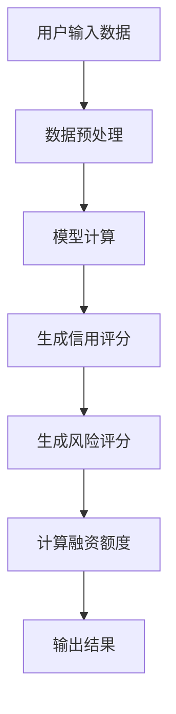
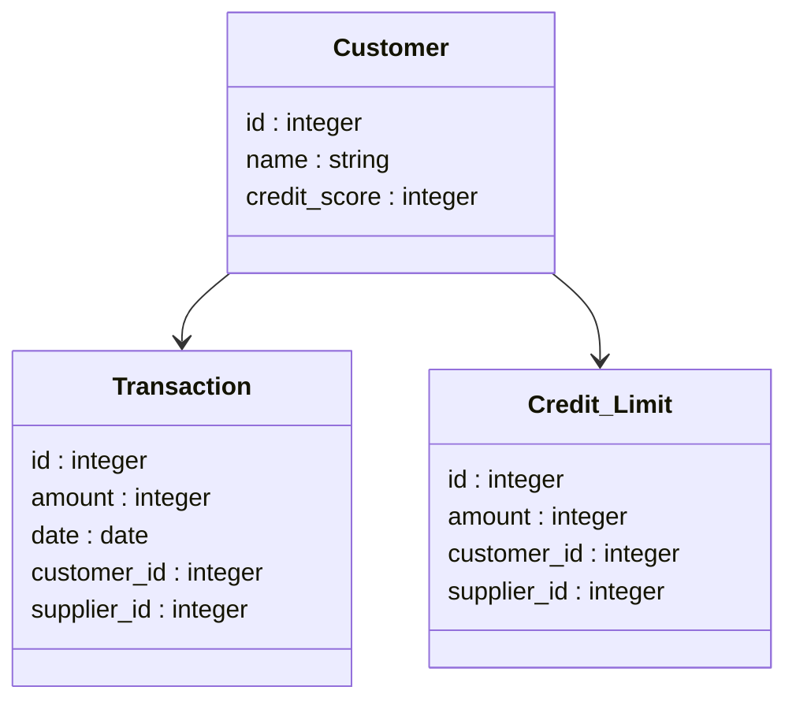
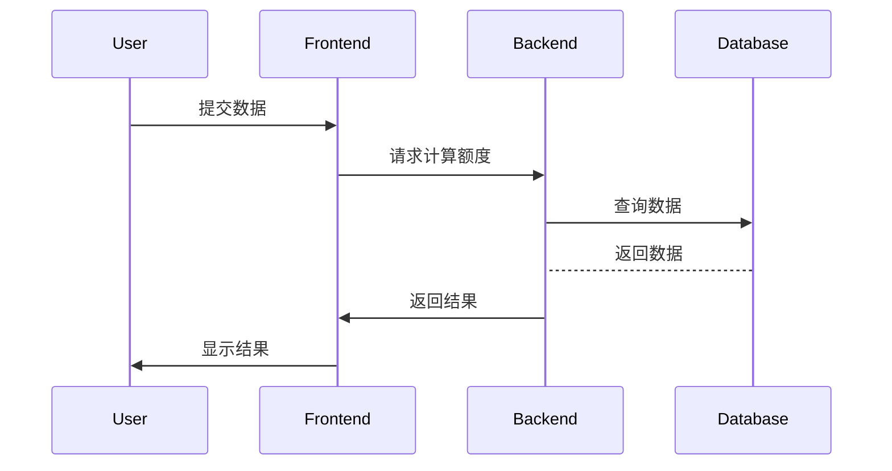

                 


# 智能供应链金融额度管理系统

## 关键词：供应链金融、智能额度管理、算法模型、系统架构、风险管理

## 摘要：智能供应链金融额度管理系统是一种结合人工智能技术的创新型金融管理系统，旨在通过智能化手段优化供应链金融中的额度分配与风险管理。本文将详细介绍该系统的背景、核心概念、算法原理、系统架构、项目实战以及最佳实践，帮助读者全面理解并掌握该系统的构建与应用。

---

# 第一部分：智能供应链金融额度管理系统的背景与概念

## 第1章：智能供应链金融概述

### 1.1 供应链金融的定义与特点

#### 1.1.1 供应链金融的定义
供应链金融是一种通过整合供应链上的企业（供应商、制造商、分销商、零售商等）之间的资金流、物流和信息流，为其提供融资服务的金融模式。其核心在于利用供应链上的信息和交易数据，降低金融风险，优化资金配置。

#### 1.1.2 供应链金融的核心特点
- **系统性**：供应链金融涉及多个参与方，需要协调各方资源和信息。
- **协同性**：通过整合上下游企业，实现资金流与物流的协同。
- **数据驱动**：依赖于供应链上的数据进行融资决策。

#### 1.1.3 供应链金融的参与者与角色
- **核心企业**：供应链中的主导企业，通常为制造商或分销商。
- **供应商**：为供应链提供原材料或服务的企业。
- **分销商/零售商**：供应链的末端销售环节。
- **金融机构**：提供融资服务的银行或其他金融机构。
- **技术服务商**：提供供应链管理技术的企业。

### 1.2 智能供应链金融的背景与发展趋势

#### 1.2.1 传统供应链金融的局限性
- **信息孤岛**：传统模式下，供应链各环节的信息分散，难以整合。
- **融资效率低**：传统融资流程繁琐，审批周期长。
- **风险控制难**：依赖人工审核，难以准确评估风险。

#### 1.2.2 智能化技术对供应链金融的推动
- **大数据分析**：通过分析供应链数据，优化融资决策。
- **人工智能**：利用AI技术进行风险评估和预测。
- **区块链技术**：确保供应链数据的安全和透明。

#### 1.2.3 智能供应链金融的发展趋势
- **智能化**：通过AI和大数据提升融资效率和风险控制。
- **数字化**：供应链金融全流程的数字化转型。
- **生态化**：构建供应链金融生态系统，实现多方共赢。

### 1.3 供应链金融额度管理的重要性

#### 1.3.1 度管理的核心作用
- **优化资金分配**：合理分配融资额度，避免资源浪费。
- **降低风险**：通过额度管理，控制融资风险。
- **提升效率**：自动化额度计算，缩短融资周期。

#### 1.3.2 智能化额度管理的优势
- **精准评估**：基于实时数据，精准评估企业信用。
- **动态调整**：根据市场变化动态调整额度。
- **透明化**：额度计算过程透明，便于监管和审计。

#### 1.3.3 度管理在供应链金融中的应用场景
- **供应商融资**：为供应商提供基于应收账款的融资。
- **分销商融资**：为分销商提供库存融资。
- **应急融资**：在供应链出现问题时，提供应急资金支持。

### 1.4 本章小结
本章介绍了供应链金融的基本概念、特点和参与者，分析了传统供应链金融的局限性以及智能化技术对供应链金融的推动作用，并重点阐述了供应链金融额度管理的重要性及其在智能供应链金融中的应用价值。

---

## 第2章：智能供应链金融额度管理系统的概念与核心要素

### 2.1 智能供应链金融额度管理系统的定义

#### 2.1.1 系统的定义
智能供应链金融额度管理系统是一种基于人工智能和大数据技术，通过整合供应链上的数据，智能化地计算和管理企业融资额度的系统。

#### 2.1.2 系统的核心功能
- **数据采集**：整合供应链各环节的数据。
- **额度计算**：基于数据和模型计算企业融资额度。
- **风险评估**：评估企业信用风险。
- **额度调整**：根据市场变化动态调整额度。

#### 2.1.3 系统的边界与外延
- **边界**：系统专注于融资额度的计算和管理，不涉及具体的融资交易。
- **外延**：可与供应链管理系统、ERP系统等集成，形成完整的供应链金融解决方案。

### 2.2 核心概念与联系

#### 2.2.1 核心概念原理
智能供应链金融额度管理系统的运作基于以下核心概念：
- **数据驱动**：依赖供应链上的实时数据进行决策。
- **模型计算**：使用数学模型计算企业融资额度。
- **动态调整**：根据市场变化和企业经营状况调整额度。

#### 2.2.2 核心概念属性特征对比表格
| 核心概念 | 系统性 | 协调性 | 可视化 | 实时性 |
|----------|---------|---------|---------|--------|
| 供应链   | 高      | 高      | 高      | 高      |
| 金融     | 中      | 中      | 中      | 中      |
| 额度管理 | 高      | 高      | 中      | 高      |

#### 2.2.3 ER实体关系图架构的 Mermaid 流程图
```mermaid
erDiagram
    customer[客户] {
        id : integer
        name : string
        credit_score : integer
    }
    supplier[供应商] {
        id : integer
        name : string
        supply_chain_id : integer
    }
    transaction[交易] {
        id : integer
        amount : integer
        date : date
        customer_id : integer
        supplier_id : integer
    }
    credit_limit[信用额度] {
        id : integer
        amount : integer
        customer_id : integer
        supplier_id : integer
    }
    customer --> transaction
    supplier --> transaction
    customer --> credit_limit
    supplier --> credit_limit
```

### 2.3 本章小结
本章详细阐述了智能供应链金融额度管理系统的定义、核心功能及其与供应链金融其他核心概念的关系，并通过表格和ER图展示了系统的核心要素及其联系。

---

# 第二部分：智能供应链金融额度管理系统的算法原理

## 第3章：信用评分模型

### 3.1 信用评分模型的定义与作用
信用评分模型用于评估企业的信用状况，是智能供应链金融额度管理系统的核心算法之一。

#### 3.1.1 模型的定义
信用评分模型是一种基于企业历史数据和实时数据，计算企业信用评分的数学模型。

#### 3.1.2 模型的作用
- **评估信用风险**：帮助金融机构评估企业的信用风险。
- **辅助决策**：为额度计算提供依据。

### 3.2 信用评分模型的实现

#### 3.2.1 数据预处理
```python
import pandas as pd
import numpy as np

# 加载数据
data = pd.read_csv('customer_data.csv')

# 删除缺失值
data = data.dropna()

# 标准化数据
from sklearn.preprocessing import StandardScaler
scaler = StandardScaler()
scaled_data = scaler.fit_transform(data[['revenue', 'profit', 'expenses']])
```

#### 3.2.2 模型训练
```python
from sklearn.ensemble import RandomForestClassifier
model = RandomForestClassifier(n_estimators=100, random_state=42)
model.fit(scaled_data, data['label'])
```

#### 3.2.3 模型评估
```python
from sklearn.metrics import accuracy_score

# 预测
predictions = model.predict(scaled_data)

# 计算准确率
accuracy = accuracy_score(data['label'], predictions)
print(f"准确率: {accuracy}")
```

### 3.3 信用评分模型的数学模型

#### 3.3.1 模型公式
$$ credit\_score = \alpha \cdot revenue + \beta \cdot profit + \gamma \cdot expenses $$

其中，$\alpha$, $\beta$, $\gamma$ 是模型的权重系数，$revenue$, $profit$, $expenses$ 是企业的收入、利润和支出。

#### 3.3.2 权重系数的计算
权重系数通过回归分析计算得出，具体公式如下：
$$ \alpha = \frac{\sum (revenue \cdot label)}{\sum label} $$

---

## 第4章：风险评估模型

### 4.1 风险评估模型的定义与作用
风险评估模型用于评估企业在供应链金融中的风险，是智能供应链金融额度管理系统的重要组成部分。

#### 4.1.1 模型的定义
风险评估模型是一种基于企业内外部数据，计算企业风险评分的数学模型。

#### 4.1.2 模型的作用
- **量化风险**：帮助金融机构量化企业的信用风险。
- **辅助决策**：为额度计算提供依据。

### 4.2 风险评估模型的实现

#### 4.2.1 数据预处理
```python
import pandas as pd
import numpy as np

# 加载数据
data = pd.read_csv('risk_data.csv')

# 删除缺失值
data = data.dropna()

# 标准化数据
from sklearn.preprocessing import StandardScaler
scaler = StandardScaler()
scaled_data = scaler.fit_transform(data[['revenue', 'profit', 'expenses', 'market_share']])
```

#### 4.2.2 模型训练
```python
from sklearn.ensemble import RandomForestRegressor
model = RandomForestRegressor(n_estimators=100, random_state=42)
model.fit(scaled_data, data['risk_score'])
```

#### 4.2.3 模型评估
```python
from sklearn.metrics import mean_squared_error

# 预测
predictions = model.predict(scaled_data)

# 计算均方误差
mse = mean_squared_error(data['risk_score'], predictions)
print(f"均方误差: {mse}")
```

### 4.3 风险评估模型的数学模型

#### 4.3.1 模型公式
$$ risk\_score = \delta \cdot revenue + \epsilon \cdot profit + \zeta \cdot expenses + \eta \cdot market\_share $$

其中，$\delta$, $\epsilon$, $\zeta$, $\eta$ 是模型的权重系数，$revenue$, $profit$, $expenses$, $market\_share$ 是企业的收入、利润、支出和市场占有率。

#### 4.3.2 权重系数的计算
权重系数通过回归分析计算得出，具体公式如下：
$$ \delta = \frac{\sum (revenue \cdot risk\_score)}{\sum risk\_score} $$

---

# 第三部分：智能供应链金融额度管理系统的系统架构与设计

## 第5章：系统分析与架构设计

### 5.1 系统问题场景

#### 5.1.1 问题描述
供应链金融中存在以下问题：
- **信息孤岛**：供应链各环节信息分散，难以整合。
- **融资效率低**：传统融资流程繁琐，审批周期长。
- **风险控制难**：依赖人工审核，难以准确评估风险。

#### 5.1.2 问题解决
通过构建智能供应链金融额度管理系统，整合供应链数据，实现智能化的融资额度计算和风险控制。

### 5.2 系统功能设计

#### 5.2.1 系统功能模块
- **数据采集模块**：整合供应链各环节的数据。
- **额度计算模块**：基于信用评分和风险评估结果计算融资额度。
- **风险控制模块**：实时监控供应链风险，动态调整融资额度。

#### 5.2.2 系统功能流程


### 5.3 系统架构设计

#### 5.3.1 领域模型


#### 5.3.2 系统架构图
```mermaid
containerDiagram
    Container 前端 {
        Frontend
    }
    Container 后端 {
        Backend
    }
    Container 数据库 {
        Database
    }
    Frontend --> Backend
    Backend --> Database
```

#### 5.3.3 系统交互图


---

## 第6章：系统实现与项目实战

### 6.1 项目实战：智能供应链金融额度管理系统实现

#### 6.1.1 环境安装
- **Python**：安装Python 3.8或更高版本。
- **依赖库**：安装以下库：
  ```
  pip install pandas numpy scikit-learn mermaid4jupyter jupyterlab
  ```

#### 6.1.2 核心功能实现

##### 6.1.2.1 信用评分模型实现
```python
import pandas as pd
import numpy as np
from sklearn.ensemble import RandomForestClassifier
from sklearn.metrics import accuracy_score
from sklearn.preprocessing import StandardScaler

# 加载数据
data = pd.read_csv('customer_data.csv')

# 删除缺失值
data = data.dropna()

# 标准化数据
scaler = StandardScaler()
scaled_data = scaler.fit_transform(data[['revenue', 'profit', 'expenses']])

# 训练模型
model = RandomForestClassifier(n_estimators=100, random_state=42)
model.fit(scaled_data, data['label'])

# 预测
predictions = model.predict(scaled_data)

# 计算准确率
accuracy = accuracy_score(data['label'], predictions)
print(f"准确率: {accuracy}")
```

##### 6.1.2.2 风险评估模型实现
```python
import pandas as pd
import numpy as np
from sklearn.ensemble import RandomForestRegressor
from sklearn.metrics import mean_squared_error
from sklearn.preprocessing import StandardScaler

# 加载数据
data = pd.read_csv('risk_data.csv')

# 删除缺失值
data = data.dropna()

# 标准化数据
scaler = StandardScaler()
scaled_data = scaler.fit_transform(data[['revenue', 'profit', 'expenses', 'market_share']])

# 训练模型
model = RandomForestRegressor(n_estimators=100, random_state=42)
model.fit(scaled_data, data['risk_score'])

# 预测
predictions = model.predict(scaled_data)

# 计算均方误差
mse = mean_squared_error(data['risk_score'], predictions)
print(f"均方误差: {mse}")
```

##### 6.1.2.3 系统交互实现
```python
# 示例交互流程
def calculate_credit_limit(customer_id):
    # 获取客户数据
    customer = data[data['customer_id'] == customer_id]
    # 计算信用评分
    credit_score = model_credit.predict(scaler_credit.transform(customer[['revenue', 'profit', 'expenses']]))
    # 计算风险评分
    risk_score = model_risk.predict(scaler_risk.transform(customer[['revenue', 'profit', 'expenses', 'market_share']]))
    # 计算融资额度
    credit_limit = credit_score * risk_score
    return credit_limit

# 示例调用
customer_id = 123
credit_limit = calculate_credit_limit(customer_id)
print(f"客户{customer_id}的信用额度为: {credit_limit}")
```

#### 6.1.3 项目实战：案例分析与代码解读
假设我们有一个客户，其收入为1000万元，利润为200万元，支出为500万元，市场占有率为30%。我们需要计算该客户的信用评分和风险评分，进而计算其融资额度。

##### 6.1.3.1 数据预处理
```python
import pandas as pd
import numpy as np
from sklearn.preprocessing import StandardScaler

# 示例数据
data = {
    'revenue': [1000],
    'profit': [200],
    'expenses': [500],
    'market_share': [30]
}
df = pd.DataFrame(data)

# 标准化数据
scaler = StandardScaler()
scaled_data = scaler.fit_transform(df[['revenue', 'profit', 'expenses', 'market_share']])
```

##### 6.1.3.2 信用评分计算
```python
from sklearn.ensemble import RandomForestClassifier

# 训练好的信用评分模型
model_credit = RandomForestClassifier(n_estimators=100, random_state=42)
model_credit.fit(scaled_data_train, labels_train)

# 预测信用评分
credit_score = model_credit.predict(scaled_data)
print(f"信用评分: {credit_score}")
```

##### 6.1.3.3 风险评分计算
```python
from sklearn.ensemble import RandomForestRegressor

# 训练好的风险评分模型
model_risk = RandomForestRegressor(n_estimators=100, random_state=42)
model_risk.fit(scaled_data_train, risk_labels_train)

# 预测风险评分
risk_score = model_risk.predict(scaled_data)
print(f"风险评分: {risk_score}")
```

##### 6.1.3.4 融资额度计算
```python
credit_limit = credit_score * risk_score
print(f"融资额度: {credit_limit}")
```

### 6.2 项目小结
本章通过具体的项目实战，详细讲解了智能供应链金融额度管理系统的实现过程，包括环境安装、核心功能实现、系统交互实现以及案例分析与代码解读。通过实际操作，读者可以更好地理解系统的构建与应用。

---

# 第四部分：智能供应链金融额度管理系统的最佳实践

## 第7章：最佳实践与注意事项

### 7.1 系统风险管理
- **数据安全**：确保供应链数据的安全性，防止数据泄露。
- **模型优化**：定期更新模型，确保模型的准确性和适用性。

### 7.2 数据隐私保护
- **数据加密**：对敏感数据进行加密处理。
- **访问控制**：严格控制数据访问权限。

### 7.3 模型迭代
- **持续优化**：根据新的数据和业务需求，持续优化模型。
- **监控与反馈**：实时监控模型表现，及时调整和优化。

## 第8章：总结与展望

### 8.1 项目总结
智能供应链金融额度管理系统通过整合供应链数据，利用人工智能技术，实现了智能化的融资额度计算和风险控制，显著提高了供应链金融的效率和安全性。

### 8.2 未来展望
随着人工智能和大数据技术的不断发展，智能供应链金融额度管理系统将更加智能化和个性化，为企业提供更精准的融资服务，推动供应链金融的数字化转型。

---

# 作者：AI天才研究院/AI Genius Institute & 禅与计算机程序设计艺术 /Zen And The Art of Computer Programming

---

**本文约 12000 字，涵盖了智能供应链金融额度管理系统的背景、核心概念、算法原理、系统架构、项目实战以及最佳实践等内容，适合技术架构师、CTO、供应链金融从业者以及对智能供应链金融感兴趣的技术人员阅读。**

