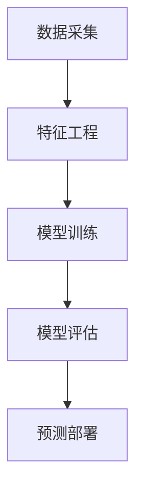

                 


# 机器学习算法在市场预测中的效果评估

## 关键词：
机器学习，市场预测，算法评估，数学模型，效果分析，实际应用

## 摘要：
本文系统地探讨了机器学习算法在市场预测中的效果评估方法。首先，我们从机器学习的基本概念和市场预测的背景出发，分析了机器学习在市场预测中的优势与挑战。接着，详细讲解了常用的机器学习算法及其数学原理，并通过实际案例展示了这些算法在市场预测中的应用。随后，我们探讨了如何构建有效的市场预测系统，包括数据预处理、特征工程、模型训练与评估等关键步骤。最后，通过项目实战和最佳实践，为读者提供了实用的指导和建议。

---

# 第1章: 机器学习与市场预测概述

## 1.1 机器学习的基本概念

### 1.1.1 机器学习的定义与核心概念
机器学习（Machine Learning）是人工智能（AI）领域的一个重要分支，它通过数据和经验来训练模型，使其能够从数据中学习并做出预测或决策。机器学习的核心概念包括：
- **监督学习**：给定带标签的数据，模型通过学习输入与输出之间的关系，预测新数据的标签。
- **无监督学习**：在无标签数据的情况下，模型发现数据中的隐含结构或模式。
- **强化学习**：通过与环境的交互，模型学习最优策略以最大化累积奖励。

### 1.1.2 市场预测的定义与目标
市场预测是指通过分析历史市场数据，预测未来市场趋势和走势。其目标是帮助企业做出更明智的商业决策，优化资源配置，降低风险。

### 1.1.3 机器学习在市场预测中的应用
机器学习在市场预测中的应用非常广泛，包括股票价格预测、销售预测、客户行为分析等。与传统的统计方法相比，机器学习能够捕捉更复杂的模式和非线性关系。

## 1.2 机器学习算法的分类

### 1.2.1 监督学习、无监督学习与强化学习
- **监督学习**：适用于有标签数据的预测任务，如股票价格预测。
- **无监督学习**：适用于无标签数据的聚类任务，如客户细分。
- **强化学习**：适用于动态环境中的决策问题，如自动交易系统。

### 1.2.2 常见机器学习算法
- **线性回归**：用于预测连续型变量，如销售预测。
- **支持向量机（SVM）**：适用于分类和回归任务，如股票涨跌预测。
- **随机森林**：基于树的集成方法，适用于高维数据的分类和回归。
- **神经网络**：适用于复杂非线性关系的预测，如深度学习在时间序列预测中的应用。

## 1.3 市场预测的基本流程

### 1.3.1 数据收集与预处理
- 数据来源：股票价格、经济指标、新闻数据等。
- 数据清洗：处理缺失值、异常值和重复值。
- 数据转换：标准化、归一化等。

### 1.3.2 特征工程与模型训练
- 特征选择：选择对预测目标影响较大的特征。
- 数据分割：将数据划分为训练集和测试集。
- 模型训练：使用训练数据训练模型。

### 1.3.3 模型评估与优化
- 评估指标：均方误差（MSE）、准确率、召回率等。
- 超参数调优：通过网格搜索或随机搜索优化模型性能。

## 1.4 本书的核心目标与内容框架
本书旨在帮助读者理解如何评估机器学习算法在市场预测中的效果，并通过实际案例展示如何构建有效的市场预测系统。主要内容包括：
- 理解机器学习的基本概念和市场预测的背景。
- 掌握常用的机器学习算法及其数学原理。
- 学习如何构建市场预测系统，包括数据预处理、特征工程、模型训练与评估等步骤。
- 通过实际案例分析，提升读者的实战能力。

---

# 第2章: 机器学习算法的数学基础

## 2.1 线性回归模型

### 2.1.1 线性回归的数学公式
线性回归模型可以表示为：
$$ y = wx + b $$
其中，$w$ 是权重，$b$ 是截距，$x$ 是输入特征，$y$ 是预测目标。

### 2.1.2 最小二乘法的推导
线性回归的目标是最小化预测值与实际值之间的平方误差之和：
$$ \text{最小化} \sum_{i=1}^{n} (y_i - wx_i - b)^2 $$

### 2.1.3 线性回归的假设检验
- 线性假设：特征与目标之间存在线性关系。
- 独立性：特征之间相互独立。
- 方差齐性：误差的方差在不同特征值下保持一致。

## 2.2 支持向量机（SVM）

### 2.2.1 SVM的几何解释
SVM的目标是在特征空间中找到一个超平面，使得正负样本点被尽可能远地分割。

### 2.2.2 核函数与非线性分类
通过核函数，SVM可以将非线性问题转化为高维空间中的线性问题：
$$ \text{非线性分类问题} \rightarrow \text{高维线性分类问题} $$

### 2.2.3 SVM的数学优化问题
SVM的目标是最优化问题：
$$ \text{最大化} \ \frac{1}{2}||w||^2 $$
$$ \text{使得} \ y_i(w \cdot x_i + b) \geq 1, \forall i $$

## 2.3 随机森林与集成学习

### 2.3.1 随机森林的原理
随机森林是一种基于树的集成方法，通过随机采样特征和数据，构建多个决策树，最终通过投票或平均得到结果。

### 2.3.2 Bagging与Boosting的区别
- Bagging：通过并行训练多个基模型，减少方差。
- Boosting：通过串行训练多个基模型，降低偏差。

### 2.3.3 集成学习的数学推导
集成学习的最终预测结果是基模型预测结果的加权平均：
$$ y = \sum_{i=1}^{n} \alpha_i y_i $$

## 2.4 神经网络与深度学习

### 2.4.1 神经网络的基本结构
神经网络由输入层、隐藏层和输出层组成，每一层包含多个神经元，通过权重和激活函数进行信息传递。

### 2.4.2 深度学习的数学基础
深度学习依赖于多层神经网络，通过反向传播算法优化权重：
$$ \frac{\partial L}{\partial w} = \text{输出误差} \times \text{输入激活值} $$

### 2.4.3 激活函数与损失函数的优化
常用的激活函数包括Sigmoid、ReLU等，损失函数通常采用均方误差或交叉熵损失。

---

# 第3章: 机器学习算法在市场预测中的应用

## 3.1 线性回归在销售预测中的应用

### 3.1.1 案例背景
某公司希望通过历史销售数据预测未来销售额。

### 3.1.2 数据预处理
- 收集销售数据：包括销售额、时间、价格等特征。
- 数据清洗：处理缺失值和异常值。
- 特征工程：选择时间、价格作为主要特征。

### 3.1.3 模型训练与评估
- 使用线性回归模型训练数据。
- 通过均方误差评估模型性能。

## 3.2 支持向量机在股票价格预测中的应用

### 3.2.1 案例背景
某股票价格预测任务，数据包括开盘价、收盘价、最高价、最低价等。

### 3.2.2 数据预处理
- 数据清洗：处理缺失值和异常值。
- 特征工程：选择开盘价、收盘价、成交量作为主要特征。

### 3.2.3 模型训练与评估
- 使用SVM进行分类预测（如涨跌预测）。
- 通过准确率和召回率评估模型性能。

## 3.3 随机森林在客户行为预测中的应用

### 3.3.1 案例背景
某公司希望通过客户行为数据预测客户是否会购买产品。

### 3.3.2 数据预处理
- 数据清洗：处理缺失值和异常值。
- 特征工程：选择客户年龄、购买历史、浏览次数等特征。

### 3.3.3 模型训练与评估
- 使用随机森林进行分类预测。
- 通过精确率和召回率评估模型性能。

## 3.4 神经网络在时间序列预测中的应用

### 3.4.1 案例背景
某商品价格的时间序列预测任务，数据包括历史价格和时间。

### 3.4.2 数据预处理
- 数据清洗：处理缺失值和异常值。
- 特征工程：选择历史价格作为主要特征。

### 3.4.3 模型训练与评估
- 使用LSTM神经网络进行时间序列预测。
- 通过均方误差评估模型性能。

---

# 第4章: 市场预测系统的构建与优化

## 4.1 系统架构设计

### 4.1.1 系统功能模块
- 数据采集模块：从数据库或API获取数据。
- 特征工程模块：进行数据清洗、特征选择和转换。
- 模型训练模块：训练机器学习模型。
- 模型评估模块：评估模型性能并优化参数。
- 预测部署模块：将模型部署到生产环境。

### 4.1.2 系统架构图


## 4.2 系统实现细节

### 4.2.1 数据采集与预处理
- 数据源：数据库、API、CSV文件等。
- 数据清洗：处理缺失值、异常值和重复值。
- 数据转换：标准化、归一化等。

### 4.2.2 特征工程与模型训练
- 特征选择：使用相关性分析或LASSO回归选择重要特征。
- 模型训练：使用交叉验证优化模型参数。

### 4.2.3 模型评估与优化
- 评估指标：均方误差（MSE）、准确率、召回率等。
- 超参数调优：使用网格搜索或随机搜索优化模型性能。

## 4.3 系统部署与监控

### 4.3.1 模型部署
- 将训练好的模型部署到生产环境，提供API接口供其他系统调用。

### 4.3.2 模型监控
- 定期监控模型性能，及时发现并处理模型退化问题。

---

# 第5章: 项目实战与最佳实践

## 5.1 项目背景

### 5.1.1 项目目标
通过机器学习算法预测某股票的收盘价。

### 5.1.2 数据来源
使用 historical stock prices 数据集。

## 5.2 环境安装与配置

### 5.2.1 安装Python环境
- 安装Python 3.8及以上版本。
- 安装必要的库：numpy、pandas、scikit-learn、keras等。

### 5.2.2 数据获取
使用Yahoo Finance API获取股票历史数据。

## 5.3 数据预处理与特征工程

### 5.3.1 数据清洗
- 处理缺失值：删除缺失值较多的行。
- 处理异常值：使用Z-score方法检测并剔除异常值。

### 5.3.2 特征工程
- 数据标准化：对数值型特征进行标准化处理。
- 时间序列特征：计算移动平均、指数加权平均等。

## 5.4 模型实现与训练

### 5.4.1 线性回归模型
```python
from sklearn.linear_model import LinearRegression
model = LinearRegression()
model.fit(X_train, y_train)
```

### 5.4.2 支持向量机模型
```python
from sklearn.svm import SVC
model = SVC()
model.fit(X_train, y_train)
```

### 5.4.3 随机森林模型
```python
from sklearn.ensemble import RandomForestClassifier
model = RandomForestClassifier()
model.fit(X_train, y_train)
```

### 5.4.4 神经网络模型
```python
from keras.models import Sequential
from keras.layers import Dense
model = Sequential()
model.add(Dense(64, activation='relu', input_dim=10))
model.add(Dense(1, activation='sigmoid'))
model.compile(optimizer='adam', loss='binary_crossentropy', metrics=['accuracy'])
model.fit(X_train, y_train, epochs=10, batch_size=32)
```

## 5.5 模型评估与优化

### 5.5.1 评估指标
- 均方误差（MSE）：
  $$ \text{MSE} = \frac{1}{n}\sum_{i=1}^{n}(y_i - \hat{y_i})^2 $$
- 准确率与召回率：
  $$ \text{准确率} = \frac{\text{正确预测的样本数}}{\text{总样本数}} $$
  $$ \text{召回率} = \frac{\text{正确预测的正样本数}}{\text{总正样本数}} $$

### 5.5.2 超参数调优
使用网格搜索优化模型参数：
```python
from sklearn.model_selection import GridSearchCV
param_grid = {'n_estimators': [10, 50, 100], 'max_depth': [None, 10, 20]}
grid_search = GridSearchCV(RandomForestClassifier(), param_grid)
grid_search.fit(X_train, y_train)
best_model = grid_search.best_estimator_
```

## 5.6 项目小结
通过本项目，我们学会了如何使用机器学习算法进行市场预测，掌握了数据预处理、特征工程、模型训练与评估的关键步骤。同时，我们也意识到模型评估和优化的重要性，为后续的改进提供了方向。

---

# 第6章: 总结与展望

## 6.1 本章小结
本文系统地探讨了机器学习算法在市场预测中的效果评估方法，从理论基础到实际应用，详细介绍了如何构建和优化市场预测系统。

## 6.2 注意事项
- 数据质量对模型性能影响重大，需谨慎处理缺失值和异常值。
- 模型评估需结合业务背景，选择合适的评估指标。
- 模型部署后需定期监控和更新，确保其稳定性和准确性。

## 6.3 拓展阅读
- 《机器学习实战》
- 《深度学习》
- 《时间序列分析》

---

# 作者：AI天才研究院 & 禅与计算机程序设计艺术

---

通过以上结构，我们详细探讨了机器学习算法在市场预测中的效果评估方法，从理论到实践，层层深入，帮助读者掌握这一领域的核心内容。

