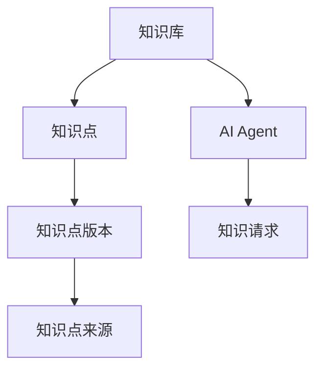
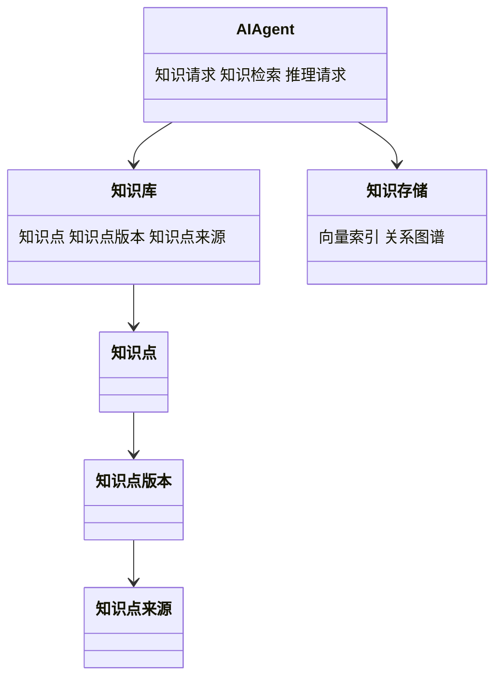
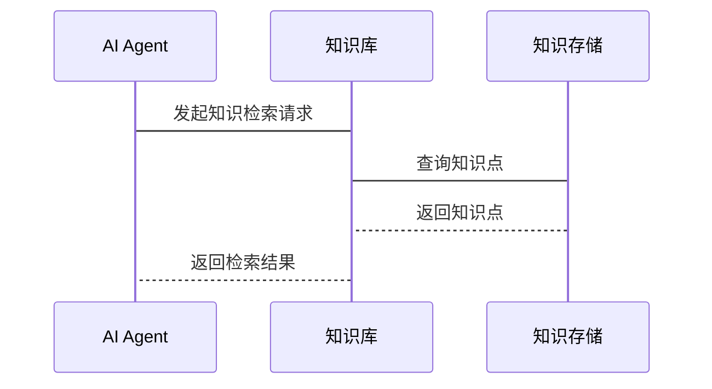

                 


# 《构建AI Agent的动态知识库管理系统》

> 关键词：AI Agent, 动态知识库, 知识管理, 系统架构, 算法原理

> 摘要：本文详细探讨了构建AI Agent的动态知识库管理系统的各个方面，包括背景介绍、核心概念、算法原理、系统架构设计以及项目实战。文章从理论到实践，逐步分析了动态知识库管理的必要性、实现方法以及实际应用，为AI Agent的知识管理提供了全面的解决方案。

---

# 第一部分: AI Agent与动态知识库管理概述

## 第1章: AI Agent与动态知识库管理的背景介绍

### 1.1 问题背景与问题描述

#### 1.1.1 知识库管理的传统挑战
传统知识库管理面临以下挑战：
1. **静态性**：知识库内容固定，难以适应动态变化的需求。
2. **效率问题**：在大规模数据下，知识检索和更新效率低下。
3. **一致性问题**：分布式系统中知识更新的不一致性导致数据冗余和不准确。

#### 1.1.2 AI Agent的动态知识需求
AI Agent需要动态调整其知识库以适应实时变化的环境，具体需求包括：
1. **实时更新**：能够快速响应外部数据变化。
2. **自适应性**：根据任务需求自动调整知识库结构。
3. **高效检索**：支持快速的知识检索和推理。

#### 1.1.3 当前知识库管理的痛点与不足
现有知识库管理系统存在以下问题：
1. **静态结构**：难以适应动态知识需求。
2. **性能瓶颈**：在高并发场景下，知识更新和检索效率受限。
3. **缺乏智能性**：无法根据上下文进行智能推理和关联。

### 1.2 问题解决与边界定义

#### 1.2.1 动态知识库管理的目标与范围
动态知识库管理的目标是实现知识的实时更新、高效检索和智能推理。其范围包括：
1. 知识的采集、存储、更新和检索。
2. 知识库的分布式管理与一致性维护。
3. 支持AI Agent的动态知识需求。

#### 1.2.2 AI Agent与知识库管理的边界
AI Agent的知识库管理边界包括：
1. 知识库内容的生成与维护。
2. 知识检索与推理接口的设计。
3. 知识库的安全性和访问控制。

#### 1.2.3 知识库管理的外延与扩展
知识库管理的外延包括：
1. 数据源的多样性：支持结构化、半结构化和非结构化数据。
2. 知识表示的多样性：支持符号、向量和图结构等多种表示方式。
3. 知识应用的多样性：支持推理、推荐和决策等多种应用场景。

### 1.3 核心概念与组成要素

#### 1.3.1 动态知识库的核心概念
动态知识库的核心概念包括：
1. **动态更新**：知识库内容能够实时更新。
2. **分布式存储**：支持多节点存储和一致性维护。
3. **智能推理**：基于知识图谱进行推理和关联。

#### 1.3.2 AI Agent的知识需求特征
AI Agent的知识需求特征包括：
1. **实时性**：需要最新的知识。
2. **个性化**：根据任务需求定制知识。
3. **可解释性**：推理过程需要可解释。

#### 1.3.3 知识库管理系统的组成要素
知识库管理系统的组成要素包括：
1. **数据源**：知识的采集和输入渠道。
2. **存储层**：知识的存储和组织。
3. **计算层**：知识的处理和推理。
4. **接口层**：与AI Agent的交互接口。

### 1.4 本章小结

#### 1.4.1 本章核心要点回顾
本章介绍了动态知识库管理的背景、挑战和目标，明确了AI Agent的知识需求和知识库管理系统的组成要素。

#### 1.4.2 下一章内容预告
下一章将深入探讨动态知识库管理的核心概念与系统架构，包括核心概念的原理、属性对比和系统架构设计。

---

## 第2章: 核心概念与系统架构

### 2.1 核心概念原理

#### 2.1.1 动态知识库的更新机制
动态知识库的更新机制包括：
1. **实时更新**：基于事件驱动的知识更新。
2. **批量更新**：定期批量处理知识更新。
3. **按需更新**：根据AI Agent的需求动态触发更新。

#### 2.1.2 AI Agent的知识检索与推理
AI Agent的知识检索与推理过程包括：
1. **知识检索**：基于关键词或上下文进行知识检索。
2. **关联推理**：基于知识图谱进行关联推理。

#### 2.1.3 知识库的分布式存储与一致性
动态知识库的分布式存储与一致性维护包括：
1. **分布式存储**：使用分布式文件系统或数据库进行存储。
2. **一致性协议**：通过共识算法（如RAFT、PAXOS）保证一致性。

### 2.2 核心概念属性对比

#### 2.2.1 知识库类型对比表
| 知识库类型 | 特点 | 适用场景 |
|-----------|------|----------|
| 结构化知识库 | 高结构化 | 数据分析、数据库查询 |
| 半结构化知识库 | 中等结构化 | 文档管理、日志分析 |
| 非结构化知识库 | 低结构化 | 自然语言处理、内容管理 |

#### 2.2.2 动态更新频率对比
| 更新频率 | 优缺点 | 适用场景 |
|----------|--------|----------|
| 实时更新 | 延迟低，资源消耗高 | 实时决策、实时反馈 |
| 批量更新 | 延迟高，资源消耗低 | 数据备份、定期统计 |

#### 2.2.3 知识表示形式对比
| 表示形式 | 优缺点 | 适用场景 |
|----------|--------|----------|
| 符号表示 | 易理解，但表达能力有限 | 逻辑推理、规则引擎 |
| 向量表示 | 表达能力强，但计算复杂 | 深度学习、相似度计算 |
| 图结构表示 | 表达能力强，支持关联推理 | 知识图谱、语义网络 |

### 2.3 ER实体关系图



### 2.4 本章小结

#### 2.4.1 核心概念总结
本章详细探讨了动态知识库的核心概念，包括更新机制、知识检索与推理、分布式存储与一致性。

#### 2.4.2 系统架构的初步框架
本章为后续的系统架构设计奠定了基础，明确了系统的主要组成部分和交互关系。

---

## 第3章: 动态知识库管理的算法原理

### 3.1 向量数据库与相似度计算

#### 3.1.1 向量空间模型
向量空间模型将知识表示为向量空间中的点，通过向量运算进行相似度计算。

#### 3.1.2 余弦相似度计算
余弦相似度计算公式为：
$$\text{相似度} = \frac{\vec{A} \cdot \vec{B}}{|\vec{A}| |\vec{B}|}$$
其中，$\vec{A}$和$\vec{B}$分别为两个向量。

#### 3.1.3 向量数据库实现
向量数据库的实现步骤包括：
1. **向量化**：将知识转化为向量表示。
2. **索引构建**：构建向量索引以提高检索效率。
3. **相似度计算**：基于向量进行相似度计算。

### 3.2 动态知识更新算法

#### 3.2.1 基于时间戳的更新机制
时间戳更新机制通过记录数据的修改时间戳，确保最新的数据优先被更新。

#### 3.2.2 基于权重的更新策略
权重更新策略根据知识点的重要性进行加权更新，公式如下：
$$\text{权重} = \alpha \times \text{更新频率} + \beta \times \text{访问频率}$$
其中，$\alpha$和$\beta$为权重系数。

#### 3.2.3 分布式更新的共识算法
分布式更新的共识算法包括RAFT和PAXOS，确保分布式系统中知识更新的一致性。

### 3.3 知识推理与关联规则

#### 3.3.1 基于图的推理算法
基于图的推理算法通过构建知识图谱进行路径搜索和关联推理。

#### 3.3.2 关联规则挖掘
关联规则挖掘通过频繁项集挖掘，发现知识点之间的关联规则。

#### 3.3.3 知识图谱构建与查询
知识图谱的构建与查询包括：
1. **图构建**：基于知识点的关联关系构建知识图谱。
2. **图查询**：使用SPARQL等查询语言进行图数据查询。

### 3.4 算法实现示例

#### 3.4.1 向量相似度计算代码
```python
import numpy as np

def cosine_similarity(vector1, vector2):
    dot_product = np.dot(vector1, vector2)
    magnitude1 = np.linalg.norm(vector1)
    magnitude2 = np.linalg.norm(vector2)
    return dot_product / (magnitude1 * magnitude2)
```

#### 3.4.2 权重更新策略代码
```python
def update_weight(weight, update_freq, access_freq, alpha=0.7, beta=0.3):
    new_weight = alpha * update_freq + beta * access_freq
    return new_weight
```

---

## 第4章: 系统分析与架构设计

### 4.1 问题场景介绍

#### 4.1.1 知识采集场景
知识采集场景包括：
1. **数据源采集**：从多种数据源采集知识。
2. **数据预处理**：对采集的数据进行清洗和转换。

#### 4.1.2 知识更新场景
知识更新场景包括：
1. **实时更新**：根据事件触发知识更新。
2. **批量更新**：定期批量处理知识更新。

#### 4.1.3 知识检索场景
知识检索场景包括：
1. **关键词检索**：基于关键词进行知识检索。
2. **上下文检索**：基于上下文进行智能检索。

### 4.2 系统功能设计

#### 4.2.1 领域模型
领域模型的类图如下：



#### 4.2.2 系统架构设计
系统架构设计包括：
1. **数据采集层**：负责知识的采集和预处理。
2. **知识存储层**：负责知识的分布式存储和管理。
3. **计算层**：负责知识的处理、推理和更新。
4. **接口层**：负责与AI Agent的交互接口设计。

#### 4.2.3 接口设计
接口设计包括：
1. **知识更新接口**：支持知识点的实时更新和批量更新。
2. **知识检索接口**：支持基于关键词和上下文的智能检索。
3. **推理接口**：支持基于知识图谱的关联推理。

#### 4.2.4 交互序列图
交互序列图如下：



### 4.3 本章小结

#### 4.3.1 系统分析总结
本章通过对问题场景的分析，设计了系统的功能模块和架构，并提出了接口设计和交互流程。

#### 4.3.2 下一章内容预告
下一章将通过项目实战，详细讲解系统的实现过程，包括环境安装、核心代码实现和案例分析。

---

## 第5章: 项目实战

### 5.1 环境安装

#### 5.1.1 安装Python环境
安装Python 3.8或更高版本，并安装以下库：
```bash
pip install numpy
pip install networkx
pip install spacy
```

#### 5.1.2 安装向量数据库
安装向量数据库（如FAISS）：
```bash
pip install faiss-cpu
```

#### 5.1.3 安装知识图谱库
安装知识图谱库（如NetworkX）：
```bash
pip install networkx
```

### 5.2 核心代码实现

#### 5.2.1 向量相似度计算
```python
import numpy as np
from sklearn.metrics.pairwise import cosine_similarity

def compute_similarity(vectors):
    return cosine_similarity(vectors)
```

#### 5.2.2 知识图谱构建
```python
import networkx as nx

def build_knowledge_graph(nodes, edges):
    graph = nx.Graph()
    graph.add_nodes_from(nodes)
    graph.add_edges_from(edges)
    return graph
```

### 5.3 代码应用解读与分析

#### 5.3.1 向量相似度计算解读
向量相似度计算通过余弦相似度衡量向量之间的相似性，适用于文本匹配和推荐系统。

#### 5.3.2 知识图谱构建解读
知识图谱构建基于NetworkX库，通过节点和边构建知识图谱，支持关联推理和路径查询。

### 5.4 实际案例分析

#### 5.4.1 案例背景
假设我们有一个医疗领域的知识库，需要支持医生的智能问答。

#### 5.4.2 系统实现
1. **知识采集**：从医疗数据库中采集疾病、症状、治疗方法等知识点。
2. **向量计算**：将每个知识点转换为向量表示。
3. **知识图谱构建**：构建疾病-症状-治疗方法的知识图谱。
4. **智能问答**：基于向量相似度和知识图谱进行智能问答。

#### 5.4.3 系统效果
系统实现了医疗知识的动态更新和智能检索，支持医生快速获取最新的医疗知识。

### 5.5 本章小结

#### 5.5.1 项目实现总结
本章通过实际案例，详细讲解了动态知识库管理系统的实现过程，包括环境安装、核心代码实现和系统效果分析。

#### 5.5.2 系统优化建议
建议进一步优化系统的性能，例如通过分布式存储和并行计算提高处理效率。

---

## 第6章: 总结与展望

### 6.1 核心要点总结

#### 6.1.1 系统架构总结
动态知识库管理系统由数据采集层、知识存储层、计算层和接口层组成，支持知识的动态更新、高效检索和智能推理。

#### 6.1.2 算法原理总结
向量数据库和知识图谱是动态知识库管理的核心算法，通过向量相似度计算和图结构推理实现知识的智能管理。

### 6.2 最佳实践 tips

#### 6.2.1 环境配置建议
建议根据实际需求选择合适的开发环境和工具，例如使用虚拟环境管理依赖包。

#### 6.2.2 代码实现建议
建议在代码实现中充分考虑系统的可扩展性和可维护性，采用模块化设计。

#### 6.2.3 性能优化建议
建议通过分布式存储、缓存技术和并行计算优化系统的性能。

### 6.3 小结

#### 6.3.1 总结
本文详细探讨了构建AI Agent的动态知识库管理系统的各个方面，从理论到实践，全面分析了系统的实现过程。

#### 6.3.2 展望
未来的工作将致力于进一步优化系统的性能，探索新的知识表示方法和推理算法，以支持更复杂和多样化的知识管理需求。

---

## 作者：AI天才研究院/AI Genius Institute & 禅与计算机程序设计艺术/Zen And The Art of Computer Programming

---

**注：以上内容为文章的完整目录和部分内容的示例，实际撰写时需要根据具体需求进一步扩展和详细阐述每个章节的内容。**

