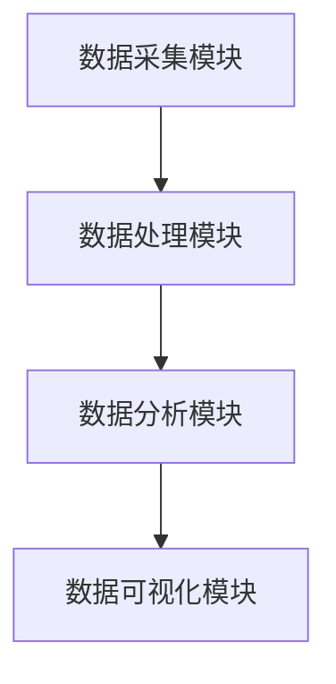
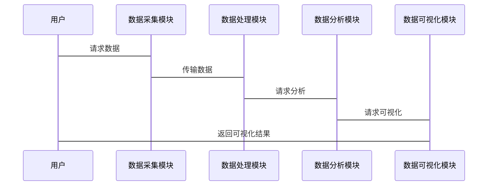

                 


# 特价股票投资中的数据分析和大数据应用

## 关键词：特价股票，数据分析，大数据，股票预测，机器学习，投资策略

## 摘要：  
特价股票是指价格低于其内在价值的股票，通常被视为投资机会。本文探讨了如何利用数据分析和大数据技术在特价股票投资中找到潜在机会。文章首先介绍了数据分析和大数据在股票投资中的重要性，接着详细讲解了数据分析基础、大数据技术、数据挖掘与机器学习在股票分析中的应用，最后通过一个基于大数据的股票预测模型案例，展示了如何在实际投资中应用这些技术。本文旨在为投资者提供一种基于数据驱动的决策方法，帮助他们在复杂多变的市场中找到投资机会。

---

# 第1章: 特价股票投资概述

## 1.1 特价股票的定义与特点

### 1.1.1 特价股票的定义  
特价股票（Cheap Stock）是指市场价格低于其内在价值的股票。这种股票通常被视为被市场低估的投资机会，适合长期投资者或价值投资者。

### 1.1.2 特价股票的特点  
- **低估值**：市场价格低于内在价值，通常表现为市盈率、市净率等指标低于行业平均水平。  
- **高分红潜力**：许多特价股票来自盈利稳定但暂时被市场忽视的公司，这些公司可能有较高的分红能力。  
- **风险与机会并存**：特价股票可能因市场情绪或公司基本面变化而波动较大。  

### 1.1.3 特价股票的投资价值  
特价股票的投资价值在于其潜在的上涨空间。通过数据分析和大数据技术，投资者可以识别那些被市场低估但具备长期增长潜力的股票。

---

## 1.2 数据分析在股票投资中的作用

### 1.2.1 数据分析的基本概念  
数据分析是指通过统计学方法和工具对数据进行整理、分析和解释的过程。在股票投资中，数据分析可以帮助投资者发现市场趋势、公司基本面信息以及潜在的投资机会。

### 1.2.2 数据分析在股票投资中的应用  
- **市场趋势分析**：通过分析历史价格数据，识别市场周期和趋势。  
- **公司基本面分析**：通过财务数据评估公司的盈利能力、资产负债情况等。  
- **风险评估**：通过分析历史波动率和相关指标，评估投资风险。  

### 1.2.3 大数据技术对股票投资的影响  
大数据技术能够处理海量数据，帮助投资者发现传统方法难以察觉的市场信号。例如，通过社交媒体数据分析市场情绪，或通过新闻数据挖掘潜在的公司事件对股价的影响。

---

## 1.3 本章小结  
本章介绍了特价股票的定义和特点，并探讨了数据分析在股票投资中的重要性。大数据技术的应用为投资者提供了更强大的工具，能够帮助他们更准确地识别投资机会和风险。

---

# 第2章: 数据分析基础

## 2.1 数据收集与处理

### 2.1.1 数据来源与获取方法  
- **金融数据提供商**：如Yahoo Finance、 Bloomberg、Reuters等。  
- **社交媒体数据**：通过爬虫获取社交媒体上的市场情绪数据。  
- **新闻数据**：通过新闻网站获取公司公告、行业动态等信息。  

### 2.1.2 数据清洗与预处理  
- **去除缺失值**：对缺失数据进行插值或删除处理。  
- **数据标准化**：将数据归一化，便于后续分析。  
- **异常值处理**：识别并处理异常值，确保数据的准确性。  

### 2.1.3 数据特征工程  
- **特征选择**：选择对投资决策影响较大的特征，如市盈率、市净率、ROE等。  
- **特征构建**：通过数据组合或计算新特征，如动量策略中的动量指标。  

---

## 2.2 数据可视化

### 2.2.1 数据可视化工具介绍  
- **Matplotlib**：用于绘制股票价格走势、K线图等。  
- **Pandas**：结合Matplotlib，快速生成数据图表。  
- **Tableau**：用于生成交互式数据仪表盘。  

### 2.2.2 数据可视化在股票分析中的应用  
- **价格走势分析**：通过K线图分析股票价格的短期波动。  
- **市场情绪分析**：通过词云或情感分析图展示市场情绪分布。  
- **数据分布分析**：通过箱线图分析股票价格的分布情况。  

### 2.2.3 常用的数据可视化图表  
- **折线图**：展示股票价格的长期趋势。  
- **柱状图**：比较不同股票的市盈率、市净率等指标。  
- **散点图**：分析股票价格与成交量之间的关系。  

---

## 2.3 数据分析方法

### 2.3.1 描述性分析  
描述性分析用于总结数据的基本特征，例如计算股票价格的均值、中位数、标准差等。  

### 2.3.2 预测性分析  
预测性分析通过回归分析、时间序列分析等方法，预测股票价格的未来走势。  

### 2.3.3 实证分析  
实证分析通过统计方法验证某种投资策略的有效性，例如动量策略、价值投资策略等。  

---

## 2.4 本章小结  
本章介绍了数据分析的基础知识，包括数据收集、处理、可视化和分析方法。这些方法为后续的股票分析和预测奠定了基础。

---

# 第3章: 大数据分析方法

## 3.1 大数据的基本概念

### 3.1.1 大数据的定义与特点  
大数据是指体量大、类型多样、处理速度快的海量数据。其特点包括：  
- **Volume**：数据量大。  
- **Variety**：数据类型多样。  
- **Velocity**：数据生成速度快。  
- **Value**：数据价值密度低。  

### 3.1.2 大数据的处理流程  
1. 数据采集：从多种数据源获取数据。  
2. 数据存储：将数据存储在分布式存储系统中。  
3. 数据处理：对数据进行清洗、转换和整合。  
4. 数据分析：利用大数据分析技术挖掘数据价值。  
5. 数据可视化：将分析结果以可视化形式呈现。  

### 3.1.3 大数据与传统数据的区别  
- **数据量**：大数据通常涉及海量数据，而传统数据量较小。  
- **数据类型**：大数据包括结构化和非结构化数据，而传统数据多为结构化数据。  
- **处理速度**：大数据要求实时处理，而传统数据处理速度较慢。  

---

## 3.2 大数据在股票投资中的应用

### 3.2.1 大数据在市场情绪分析中的应用  
通过分析社交媒体、新闻网站等非结构化数据，评估市场情绪对股价的影响。  

### 3.2.2 大数据在风险评估中的应用  
通过分析历史数据和实时数据，评估投资组合的风险。  

### 3.2.3 大数据在投资策略优化中的应用  
通过分析海量数据，优化投资策略，例如利用因子模型筛选股票。  

---

## 3.3 本章小结  
本章介绍了大数据的基本概念和特点，并探讨了大数据在股票投资中的应用，包括市场情绪分析、风险评估和投资策略优化。

---

# 第4章: 数据挖掘与机器学习在股票分析中的应用

## 4.1 数据挖掘的基本概念

### 4.1.1 数据挖掘的定义与特点  
数据挖掘是指从大量数据中挖掘出隐含信息的过程。其特点包括：  
- 数据量大。  
- 数据多样性。  
- 数据挖掘结果具有可解释性。  

### 4.1.2 数据挖掘的主要技术  
- **聚类分析**：将相似的股票分为一类，发现潜在的投资机会。  
- **分类分析**：根据历史数据，分类股票的涨跌趋势。  
- **关联规则挖掘**：发现股票价格与市场事件之间的关联性。  

---

## 4.2 机器学习在股票分析中的应用

### 4.2.1 机器学习的基本概念  
机器学习是一种人工智能技术，通过训练模型从数据中学习规律，并用于预测或分类。  

### 4.2.2 常用的机器学习算法  
- **线性回归**：用于预测股票价格。  
- **支持向量机（SVM）**：用于股票分类。  
- **随机森林**：用于股票预测和特征重要性分析。  

### 4.2.3 机器学习在股票预测中的应用  
- **训练模型**：利用历史数据训练股票预测模型。  
- **模型评估**：通过回测验证模型的有效性。  
- **实时预测**：利用模型预测未来的股票价格。  

---

## 4.3 数据挖掘与机器学习的结合

### 4.3.1 数据挖掘与机器学习的结合方式  
- **特征选择**：利用数据挖掘技术选择重要的特征，再用机器学习模型进行预测。  
- **数据预处理**：利用数据挖掘技术清洗数据，再用机器学习模型进行分析。  

### 4.3.2 数据挖掘与机器学习在股票分析中的优势  
- **提高准确性**：通过结合数据挖掘和机器学习，能够更准确地预测股票价格。  
- **发现潜在规律**：通过数据挖掘，发现隐藏在数据中的规律，再通过机器学习进行验证。  

### 4.3.3 数据挖掘与机器学习的挑战  
- **计算资源需求高**：处理海量数据需要大量的计算资源。  
- **模型过拟合**：需要防止模型过拟合，确保模型的泛化能力。  

---

## 4.4 本章小结  
本章介绍了数据挖掘和机器学习在股票分析中的应用，探讨了它们的结合方式和优势，同时也提到了面临的挑战。

---

# 第5章: 基于大数据的股票预测模型

## 5.1 数据预处理与特征选择

### 5.1.1 数据清洗与预处理  
- **去除缺失值**：对数据进行插值或删除处理。  
- **数据标准化**：将数据归一化，便于后续分析。  

### 5.1.2 特征选择与降维  
- **特征选择**：选择对股票价格影响较大的特征，如市盈率、市净率、ROE等。  
- **降维**：通过主成分分析（PCA）减少特征数量，降低模型复杂度。  

### 5.1.3 数据增强与样本平衡  
- **数据增强**：通过生成合成数据增加样本数量。  
- **样本平衡**：通过过采样和欠采样技术，平衡不同类别样本的数量。  

---

## 5.2 模型选择与训练

### 5.2.1 常用的股票预测模型  
- **线性回归模型**：用于预测股票价格。  
- **随机森林模型**：用于股票分类和回归。  
- **长短期记忆网络（LSTM）**：用于时间序列预测。  

### 5.2.2 模型训练与优化  
- **训练模型**：利用历史数据训练股票预测模型。  
- **模型优化**：通过交叉验证和超参数调优，优化模型性能。  

### 5.2.3 模型评估与验证  
- **回测**：通过历史数据验证模型的有效性。  
- **指标评估**：通过准确率、召回率、F1分数等指标评估模型性能。  

---

## 5.3 基于大数据的股票预测案例

### 5.3.1 案例背景  
假设我们希望利用大数据技术预测某只股票的价格走势，数据来源包括历史价格数据、财务数据、新闻数据和社交媒体数据。

### 5.3.2 数据获取与处理  
- **数据获取**：从Yahoo Finance获取历史价格数据，从新闻网站获取新闻数据，从社交媒体获取市场情绪数据。  
- **数据清洗**：去除缺失值，处理异常值。  
- **特征工程**：选择市盈率、市净率、动量指标等特征。  

### 5.3.3 模型训练与预测  
- **选择模型**：选择随机森林模型进行股票价格预测。  
- **训练模型**：利用历史数据训练模型。  
- **预测结果**：利用训练好的模型预测未来一段时间内的股票价格。  

### 5.3.4 模型优化与验证  
- **优化模型**：通过超参数调优，提高模型性能。  
- **验证模型**：通过回测验证模型的有效性。  

---

## 5.4 本章小结  
本章通过一个基于大数据的股票预测案例，展示了如何利用数据分析和大数据技术进行股票预测。通过数据预处理、特征选择、模型训练和优化，可以提高股票预测的准确性。

---

# 第6章: 系统架构与投资策略

## 6.1 系统架构设计

### 6.1.1 系统功能设计  
- **数据采集模块**：从多种数据源获取数据。  
- **数据处理模块**：对数据进行清洗和预处理。  
- **数据分析模块**：利用数据分析和机器学习技术进行股票预测。  
- **数据可视化模块**：将分析结果以可视化形式呈现。  

### 6.1.2 系统架构图  


### 6.1.3 系统交互流程  


---

## 6.2 投资策略设计

### 6.2.1 基于数据分析的投资策略  
- **动量策略**：买入价格趋势向上的股票。  
- **价值策略**：买入价格低于内在价值的股票。  

### 6.2.2 基于大数据的策略优化  
- **结合市场情绪**：在市场情绪高涨时避免买入，市场情绪低落时积极买入。  
- **结合新闻事件**：利用新闻数据预测公司业绩变化。  

---

## 6.3 本章小结  
本章介绍了系统架构设计和投资策略设计，展示了如何利用大数据技术构建一个完整的股票投资系统。

---

# 第7章: 项目实战与总结

## 7.1 项目实战

### 7.1.1 项目背景  
通过大数据分析和机器学习技术，构建一个股票预测模型，帮助投资者识别特价股票投资机会。

### 7.1.2 项目实现  
- **环境搭建**：安装Python、Pandas、Scikit-learn、TensorFlow等工具。  
- **数据获取**：从Yahoo Finance获取历史价格数据。  
- **数据处理**：清洗数据，选择特征。  
- **模型训练**：训练随机森林模型，预测股票价格。  
- **结果可视化**：将预测结果以图表形式展示。  

### 7.1.3 代码实现  
```python
import pandas as pd
from sklearn.ensemble import RandomForestRegressor
from sklearn.metrics import mean_squared_error

# 数据获取与处理
data = pd.read_csv('stock_data.csv')
X = data[['PE', 'PB', 'ROE']]
y = data['Price']

# 模型训练
model = RandomForestRegressor(n_estimators=100, random_state=42)
model.fit(X, y)

# 模型预测
y_pred = model.predict(X)

# 模型评估
 mse = mean_squared_error(y, y_pred)
 print(f'Mean Squared Error: {mse}')
```

---

## 7.2 项目总结

### 7.2.1 项目成果  
通过大数据分析和机器学习技术，构建了一个股票预测模型，能够帮助投资者识别特价股票投资机会。  

### 7.2.2 经验与教训  
- **数据质量**：数据质量对模型性能影响重大，需高度重视数据清洗和特征选择。  
- **模型选择**：不同模型适用于不同的场景，需根据实际情况选择合适的模型。  

### 7.2.3 未来展望  
未来可以进一步优化模型，引入更多数据源，如新闻数据、社交媒体数据等，提高模型的预测精度。

---

# 第8章: 总结与展望

## 8.1 本文总结  
本文探讨了特价股票投资中的数据分析和大数据应用，介绍了数据分析基础、大数据技术、数据挖掘与机器学习在股票分析中的应用，并通过一个基于大数据的股票预测模型案例，展示了如何在实际投资中应用这些技术。  

## 8.2 未来展望  
未来，随着大数据和人工智能技术的不断发展，股票分析和预测将更加精准。投资者可以利用更多的数据源和更先进的技术，找到更多的投资机会。

---

# 作者：AI天才研究院/AI Genius Institute & 禅与计算机程序设计艺术 /Zen And The Art of Computer Programming

