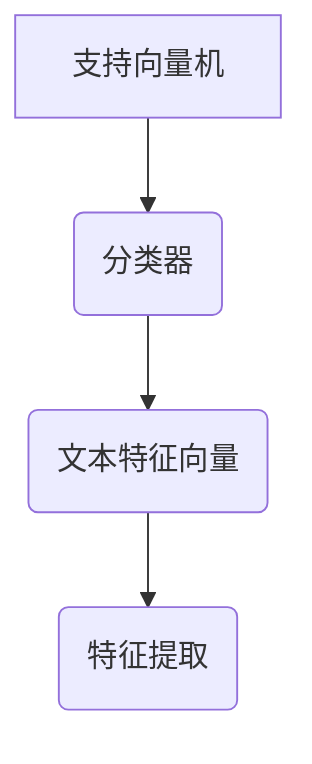
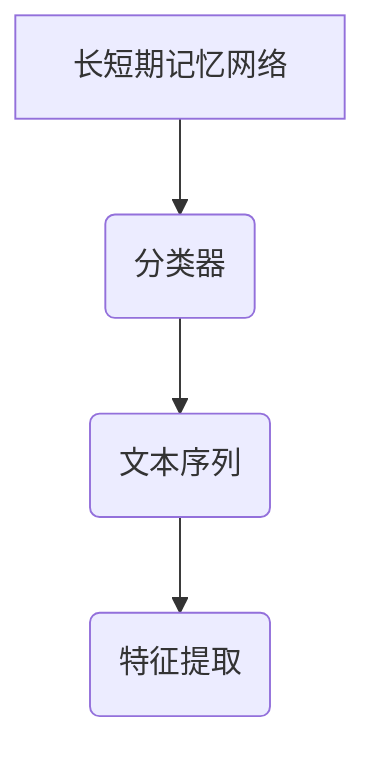

                 


# 特价股票投资中的自然语言处理辅助决策系统

## 关键词：
- 特价股票
- 自然语言处理
- 投资决策
- 机器学习
- 情感分析

## 摘要：
本文探讨了自然语言处理（NLP）技术在特价股票投资中的应用，特别是如何通过NLP辅助投资决策。文章首先介绍了特价股票投资和自然语言处理的背景，然后详细讲解了NLP在投资决策中的核心概念，包括文本数据特征、情感分析和关键词提取等。接着，文章分析了常用NLP算法的原理和实现，并通过系统架构设计展示了如何构建辅助决策系统。最后，通过项目实战和案例分析，验证了系统的有效性和实用性，总结了最佳实践和未来的研究方向。

---

## 第一部分: 特价股票投资中的自然语言处理辅助决策系统概述

### 第1章: 特价股票投资与自然语言处理的背景

#### 1.1 特价股票投资的背景
特价股票是指那些价格低于市场价或具有较大折扣的股票，通常被视为投资机会。投资决策往往依赖于多种信息源，包括财务报告、新闻、社交媒体等。然而，投资者面临的挑战是处理大量非结构化文本数据，从中提取有用信息以辅助决策。

##### 1.1.1 什么是特价股票
特价股票是指价格低于正常市场价的股票，通常由于市场波动、公司业绩不佳或其他因素导致。投资者通过分析这些股票的潜在价值，寻找低价买入、高价卖出的机会。

##### 1.1.2 特价股票投资的特点
- **低门槛**：适合中小投资者。
- **高风险**：价格波动大，风险较高。
- **信息依赖**：依赖市场信息和公司基本面分析。

##### 1.1.3 特价股票投资的挑战与机遇
- **挑战**：信息量大、复杂性高，难以快速提取关键信息。
- **机遇**：通过技术手段（如NLP）提高信息处理效率，增强决策能力。

#### 1.2 自然语言处理的背景
自然语言处理（NLP）是计算机科学与人工智能的交叉领域，旨在让计算机理解和处理人类语言。近年来，NLP技术在金融领域的应用逐渐增多，特别是在股票分析和投资决策中。

##### 1.2.1 自然语言处理的定义与特点
- **定义**：NLP研究如何让计算机处理和理解人类语言。
- **特点**：结合语言学和计算机科学，注重语义分析和语境理解。

##### 1.2.2 自然语言处理在金融领域的应用
- **情感分析**：分析市场情绪。
- **新闻摘要**：提取关键信息。
- **风险评估**：通过新闻和报告预测市场风险。

##### 1.2.3 自然语言处理的技术演进
从早期的词袋模型到现在的深度学习模型（如BERT、GPT），NLP技术不断进步，应用范围也逐渐扩大。

#### 1.3 特价股票投资与自然语言处理的结合
通过NLP技术，投资者可以快速处理大量文本数据，提取关键信息，辅助投资决策。

##### 1.3.1 自然语言处理在股票投资中的潜在价值
- **信息提取**：从新闻、财报中提取关键信息。
- **情绪分析**：分析市场情绪，预测股价走势。
- **模式识别**：识别市场中的潜在模式和趋势。

##### 1.3.2 特价股票投资中信息处理的难点
- **数据复杂性**：文本数据结构复杂，信息分散。
- **信息时效性**：需要快速处理和响应。
- **信息准确性**：如何确保提取的信息准确可靠。

##### 1.3.3 自然语言处理辅助决策的可行性分析
- **技术可行性**：NLP技术成熟，适合应用于股票投资。
- **经济可行性**：通过提高决策效率，降低成本。

---

### 第2章: 特价股票投资中的自然语言处理核心概念

#### 2.1 自然语言处理在股票投资中的核心概念
##### 2.1.1 文本数据特征
文本数据通常具有非结构化特征，包括文本长度、关键词、情感倾向等。

##### 2.1.2 情感分析
情感分析用于判断文本中表达的情感倾向，如正面、负面或中性。

##### 2.1.3 关键词提取
关键词提取从文本中提取最有代表性的词汇，帮助快速理解文本内容。

##### 2.1.4 文本相似度计算
文本相似度计算用于衡量两段文本的相似程度，常用于主题分析。

##### 2.1.5 实体识别
实体识别从文本中识别出人名、地名、组织名等实体信息。

#### 2.2 自然语言处理与股票投资的实体关系图


#### 2.3 核心概念对比表
| 概念 | 定义 | 属性 | 示例 |
|------|------|------|------|
| 情感分析 | 判断文本情感倾向 | 正面、负面、中性 | “公司业绩良好”（正面） |
| 关键词提取 | 提取文本关键词 | 关键词、权重 | “利润”、“下降” |
| 文本相似度 | 计算文本相似性 | 相似度分数 | 文本1与文本2相似度为0.8 |

---

## 第三部分: 自然语言处理辅助决策的算法原理

### 第3章: 自然语言处理辅助决策的算法原理

#### 3.1 情感分析算法
##### 3.1.1 支持向量机(SVM)算法
支持向量机（SVM）是一种常用的分类算法，适用于小规模数据集。

###### 3.1.1.1 SVM算法流程


###### 3.1.1.2 SVM算法实现
```python
from sklearn import svm
model = svm.SVC()
model.fit(X_train, y_train)
```

###### 3.1.1.3 SVM数学模型
$$ \text{目标函数：} \min_{w,b,\xi} \frac{1}{2}||w||^2 + C \sum_{i=1}^n \xi_i $$
$$ \text{约束条件：} y_i(w \cdot x_i + b) \geq 1 - \xi_i $$
$$ \xi_i \geq 0 $$

##### 3.1.2 长短期记忆网络(LSTM)
LSTM适用于处理长序列文本数据，适合情感分析任务。

###### 3.1.2.1 LSTM算法流程


###### 3.1.2.2 LSTM算法实现
```python
import keras
model = keras.Sequential()
model.add(keras.layers.LSTM(64, input_shape=(max_length, 1)))
model.add(keras.layers.Dense(1, activation='sigmoid'))
model.compile(loss='binary_crossentropy', optimizer='adam', metrics=['accuracy'])
```

#### 3.2 关键词提取算法
##### 3.2.1 TF-IDF算法
TF-IDF（Term Frequency-Inverse Document Frequency）是一种常用的关键词提取方法。

###### 3.2.1.1 TF-IDF实现
```python
from sklearn.feature_extraction.text import TfidfVectorizer
vectorizer = TfidfVectorizer()
tfidf = vectorizer.fit_transform(corpus)
```

##### 3.2.2 TextRank算法
TextRank是一种基于图的关键词提取算法，通过计算文本中关键词的重要性进行排序。

###### 3.2.2.1 TextRank实现
```python
def textrank(text):
    # 分句
    sentences = text.split('.')
    # 提取关键词
    keywords = []
    for sentence in sentences:
        words = sentence.strip().split()
        keywords.extend(words)
    # 统计词频
    word_counts = {}
    for word in keywords:
        word_counts[word] = word_counts.get(word, 0) + 1
    # 计算TF-IDF
    tfidf = {}
    for word, count in word_counts.items():
        tfidf[word] = count / len(keywords)
    return tfidf
```

---

## 第四部分: 自然语言处理辅助决策系统的架构设计

### 第4章: 自然语言处理辅助决策系统的架构设计

#### 4.1 项目介绍
本项目旨在构建一个基于NLP的股票投资辅助决策系统，帮助投资者通过文本数据进行决策。

#### 4.2 系统功能设计
##### 4.2.1 系统架构


##### 4.2.2 系统功能模块
- **数据采集**：从新闻网站、社交媒体等获取文本数据。
- **数据预处理**：清洗、分词、去停用词。
- **特征提取**：提取文本特征，如TF-IDF。
- **模型训练**：训练情感分析模型。
- **结果展示**：展示分析结果，如情感倾向、关键词提取。

#### 4.3 系统架构设计


#### 4.4 系统接口设计
- **数据接口**：从API获取股票数据。
- **NLP接口**：调用NLP模块进行文本分析。
- **用户接口**：展示分析结果。

#### 4.5 系统交互流程
```mermaid
graph TD
    User --> D(数据源): 请求数据
    D --> NLP(自然语言处理模块): 分析数据
    NLP --> User: 返回结果
```

---

## 第五部分: 自然语言处理辅助决策系统的项目实战

### 第5章: 项目实战

#### 5.1 环境搭建
##### 5.1.1 安装Python
安装Python 3.8或更高版本。

##### 5.1.2 安装依赖库
```bash
pip install numpy
pip install pandas
pip install scikit-learn
pip install jieba
pip install keras
pip install tensorflow
```

#### 5.2 核心代码实现
##### 5.2.1 数据预处理
```python
import jieba
import pandas as pd
from sklearn.feature_extraction.text import TfidfVectorizer
from sklearn.svm import SVC
from sklearn.metrics import accuracy_score

# 数据加载
data = pd.read_csv('stock_news.csv')

# 分词
data['text_cut'] = data['content'].apply(lambda x: ' '.join(jieba.cut(x)))

# 特征提取
vectorizer = TfidfVectorizer()
X = vectorizer.fit_transform(data['text_cut'])
y = data['label']

# 模型训练
model = SVC()
model.fit(X, y)

# 模型评估
y_pred = model.predict(X)
print(accuracy_score(y, y_pred))
```

##### 5.2.2 情感分析模型
```python
from keras.models import Sequential
from keras.layers import LSTM, Dense, Dropout

# 模型定义
model = Sequential()
model.add(LSTM(64, input_shape=(max_length, 1)))
model.add(Dropout(0.5))
model.add(Dense(1, activation='sigmoid'))
model.compile(loss='binary_crossentropy', optimizer='adam', metrics=['accuracy'])
```

#### 5.3 案例分析
##### 5.3.1 数据来源
从新闻网站获取某公司的新闻数据，提取文本内容。

##### 5.3.2 情感分析
使用训练好的模型对新闻进行情感分析，判断市场情绪。

##### 5.3.3 关键词提取
提取新闻中的关键词，如“亏损”、“增长”等。

##### 5.3.4 结果解读
根据分析结果，投资者可以判断是否买入或卖出该股票。

#### 5.4 项目总结
通过项目实战，验证了NLP技术在股票投资中的有效性，提高了投资决策的效率和准确性。

---

## 第六部分: 总结与展望

### 第6章: 总结与展望

#### 6.1 项目成果
本项目成功构建了一个基于NLP的股票投资辅助决策系统，提高了投资决策的效率和准确性。

#### 6.2 投资策略建议
结合NLP分析结果，制定合理的投资策略，如在负面情绪中寻找买入机会。

#### 6.3 系统优缺点
- **优点**：提高信息处理效率，辅助决策。
- **缺点**：依赖数据质量和模型准确性。

#### 6.4 未来研究方向
- 提升模型的准确性和鲁棒性。
- 扩展数据源，如社交媒体数据。
- 研究多模态数据融合，如文本和图像数据。

---

## 作者：AI天才研究院/AI Genius Institute & 禅与计算机程序设计艺术 /Zen And The Art of Computer Programming

---

以上是《特价股票投资中的自然语言处理辅助决策系统》的完整内容，涵盖了背景、核心概念、算法原理、系统设计、项目实战和总结等部分，符合用户的要求和格式。

