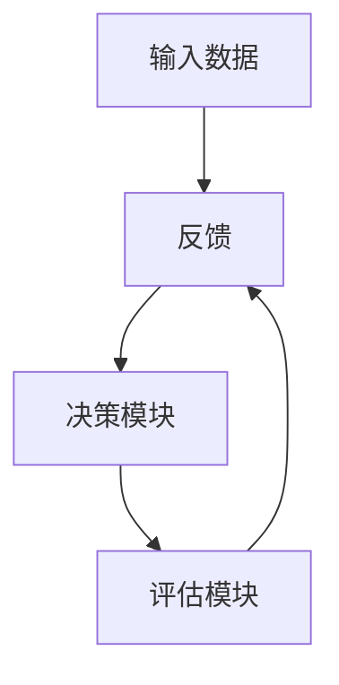
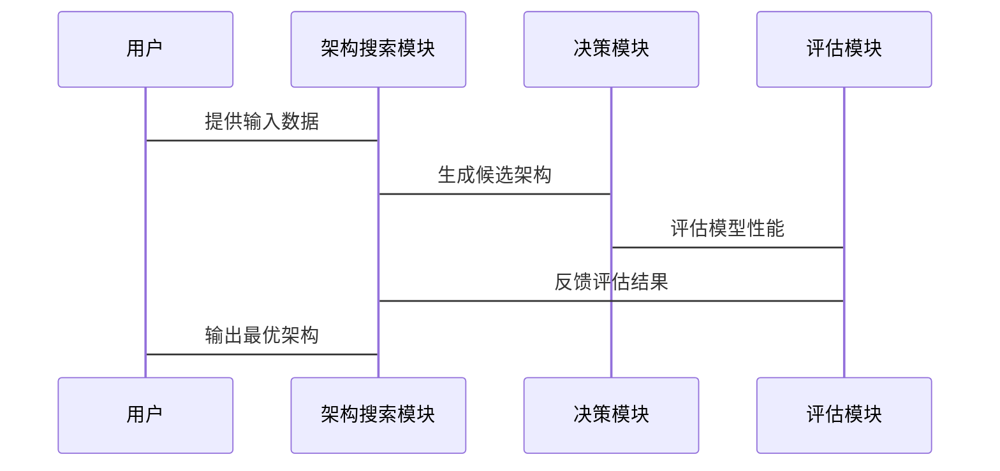

                 


# 神经网络架构搜索在AI Agent优化中的应用

## 关键词：神经网络架构搜索，AI Agent，强化学习，算法优化，深度学习

## 摘要：神经网络架构搜索（NAS）是一种通过自动化方法寻找最优神经网络结构的技术，近年来在AI Agent优化中得到了广泛应用。本文将从基础概念、核心原理、算法实现、系统设计到项目实战，全面探讨NAS在AI Agent优化中的应用。通过详细分析，本文旨在帮助读者理解NAS如何提升AI Agent的性能和效率，并通过实际案例展示其在复杂任务中的优势。

---

# 第一部分: 神经网络架构搜索（NAS）与AI Agent优化的基础

## # 第1章: 神经网络架构搜索（NAS）概述

### ## 1.1 神经网络架构搜索的定义与背景

#### ### 1.1.1 神经网络架构搜索的定义
神经网络架构搜索（Neural Architecture Search, NAS）是一种通过自动搜索和优化神经网络结构来提高模型性能的技术。传统的神经网络设计依赖于人工经验，而NAS通过自动化的方法，利用算法生成和评估不同的网络结构，从而找到最优或近似最优的架构。

#### ### 1.1.2 神经网络架构搜索的发展历程
NAS的发展可以追溯到20世纪末，但真正的发展始于深度学习的兴起。近年来，随着计算能力的提升和算法的优化，NAS在图像识别、自然语言处理等领域取得了显著成果。2018年，Google提出了著名的enas框架，标志着NAS技术进入快速发展阶段。

#### ### 1.1.3 神经网络架构搜索的核心问题与挑战
- **核心问题**：如何高效地搜索和优化神经网络结构，同时平衡计算资源和搜索效率。
- **挑战**：搜索空间巨大，计算成本高昂，模型性能评估的不确定性等。

### ## 1.2 AI Agent的基本概念与应用

#### ### 1.2.1 AI Agent的定义与特点
AI Agent（智能体）是一种能够感知环境并采取行动以实现目标的智能系统。其特点包括自主性、反应性、目标导向性和社会能力。

#### ### 1.2.2 AI Agent的主要应用场景
- **自动驾驶**：实时感知环境并做出决策。
- **智能助手**：如Siri、Alexa等，通过语音交互为用户提供服务。
- **游戏AI**：在复杂游戏中做出最优决策。

#### ### 1.2.3 AI Agent与传统算法的区别
AI Agent具有自主性和目标导向性，能够动态适应环境变化，而传统算法通常基于固定的规则和静态输入。

---

## # 第2章: 神经网络架构搜索在AI Agent优化中的应用背景

### ## 2.1 神经网络架构搜索的核心概念

#### ### 2.1.1 搜索空间的定义与构建
搜索空间是NAS中所有可能的网络结构的集合。构建合理的搜索空间是NAS成功的关键，通常包括卷积层、池化层、激活函数等基本组件。

#### ### 2.1.2 搜索策略的选择与优化
常用的搜索策略包括随机搜索、网格搜索、强化学习搜索等。强化学习搜索是目前最有效的策略之一，通过强化学习模型指导搜索过程。

#### ### 2.1.3 架构评估方法的比较
评估方法包括基于准确率、F1分数、训练时间等指标。准确率是最常用的评估指标，但训练时间也是重要的考虑因素。

### ## 2.2 AI Agent优化中的问题背景

#### ### 2.2.1 AI Agent优化的目标与挑战
- **目标**：提高AI Agent的决策准确性和响应速度。
- **挑战**：复杂的环境、动态变化的目标、高维状态空间等。

#### ### 2.2.2 神经网络架构对AI Agent性能的影响
神经网络架构直接决定了AI Agent的特征提取能力和决策能力。优化架构可以显著提升性能。

#### ### 2.2.3 神经网络架构搜索在AI Agent优化中的优势
- **自动化**：减少人工干预，提高效率。
- **全局最优**：通过搜索找到最优或近似最优的架构。

---

# 第二部分: 神经网络架构搜索与AI Agent优化的核心概念

## # 第3章: 神经网络架构搜索的核心原理

### ## 3.1 神经网络架构搜索的数学模型

#### ### 3.1.1 神经网络架构的表示方法
神经网络架构通常用计算图表示，节点代表运算，边代表数据流。例如，卷积层可以表示为一个节点，输入为特征图，输出为特征图。

#### ### 3.1.2 神经网络架构搜索的优化目标
优化目标通常是最大化模型在验证集上的准确率，同时最小化计算资源消耗。

#### ### 3.1.3 神经网络架构搜索的约束条件
- 计算资源限制：搜索过程需要在合理的时间和内存内完成。
- 架构复杂度：避免过于复杂的架构导致计算成本过高。

### ## 3.2 神经网络架构搜索的算法流程

#### ### 3.2.1 神经网络架构搜索的基本流程
1. 初始化搜索空间。
2. 生成候选架构。
3. 评估候选架构性能。
4. 根据评估结果更新搜索策略。
5. 重复直到找到最优架构。

#### ### 3.2.2 神经网络架构搜索的关键步骤
- 候选架构生成：通过搜索算法生成不同的网络结构。
- 性能评估：训练候选模型并评估其性能。
- 搜索策略更新：根据评估结果调整搜索策略。

#### ### 3.2.3 神经网络架构搜索的实现框架
常用的实现框架包括enas、darts、amoebanet等。这些框架通常结合强化学习和演化算法，实现高效的架构搜索。

---

## # 第4章: AI Agent优化中的神经网络架构搜索

### ## 4.1 AI Agent优化的核心问题

#### ### 4.1.1 AI Agent优化的目标与挑战
AI Agent需要在复杂环境中做出最优决策，优化目标包括提高准确率、减少响应时间等。

#### ### 4.1.2 神经网络架构对AI Agent性能的影响
- 特征提取能力：影响AI Agent对环境的理解能力。
- 决策能力：影响AI Agent的策略选择。

#### ### 4.1.3 神经网络架构搜索在AI Agent优化中的优势
- 提高决策准确率：通过优化架构提升模型性能。
- 减少计算成本：通过自动化搜索减少人工干预。

### ## 4.2 神经网络架构搜索与AI Agent优化的结合

#### ### 4.2.1 强化学习在AI Agent优化中的应用
强化学习通过与环境互动，学习最优策略，常用于AI Agent的决策过程。

#### ### 4.2.2 神经网络架构搜索在AI Agent中的具体应用
通过NAS技术，优化AI Agent的感知模块和决策模块，提升整体性能。

#### ### 4.2.3 神经网络架构搜索对AI Agent优化的推动作用
- 提高模型性能。
- 减少人工干预。
- 提高适应性。

---

# 第三部分: 神经网络架构搜索与AI Agent优化的系统设计

## # 第5章: 神经网络架构搜索与AI Agent优化的系统设计

### ## 5.1 系统功能设计

#### ### 5.1.1 系统功能模块
- 架构搜索模块：负责生成和评估候选架构。
- 决策模块：基于最优架构做出决策。
- 评估模块：评估模型性能并反馈给搜索模块。

#### ### 5.1.2 系统功能流程
1. 生成候选架构。
2. 训练候选模型。
3. 评估模型性能。
4. 根据评估结果更新搜索策略。
5. 输出最优架构。

### ## 5.2 系统架构设计

#### ### 5.2.1 系统架构图


#### ### 5.2.2 系统接口设计
- 输入接口：接收环境数据和任务目标。
- 输出接口：输出决策结果和模型性能。

### ## 5.3 系统交互设计

#### ### 5.3.1 系统交互流程图


---

# 第四部分: 神经网络架构搜索与AI Agent优化的项目实战

## # 第6章: 项目实战

### ## 6.1 环境安装

#### ### 6.1.1 安装依赖
```bash
pip install numpy
pip install matplotlib
pip install keras
```

### ## 6.2 系统核心实现源代码

#### ### 6.2.1 神经网络架构搜索代码
```python
import numpy as np
import keras

def build_model(hp):
    model = keras.Sequential()
    model.add(keras.layers.Conv2D(filters=hp.Int('conv_1_filter', min_value=32, max_value=512, step=32),
                                  kernel_size=hp.Int('conv_1_kernel', min_value=3, max_value=7, step=2),
                                  activation='relu'))
    model.add(keras.layers.MaxPooling2D(pool_size=(2, 2)))
    model.add(keras.layers.Conv2D(filters=hp.Int('conv_2_filter', min_value=64, max_value=512, step=64),
                                  kernel_size=hp.Int('conv_2_kernel', min_value=3, max_value=7, step=2),
                                  activation='relu'))
    model.add(keras.layers.GlobalMaxPooling2D())
    model.add(keras.layers.Dense(units=hp.Int('dense_units', min_value=64, max_value=512, step=64),
                                  activation='relu'))
    model.add(keras.layers.Dense(10, activation='softmax'))
    return model

def nas_model_builder():
    hp = keras.callbacks.HyperParameters()
    model = build_model(hp)
    model.compile(optimizer='nadam', loss='sparse_categorical_crossentropy', metrics=['accuracy'])
    return model
```

#### ### 6.2.2 AI Agent实现代码
```python
class AI_Agent:
    def __init__(self):
        self.model = nas_model_builder()

    def感知环境(self, 状态):
        # 输入环境状态，输出决策
        return self.model.predict(状态)

    def 采取行动(self, 状态):
        # 根据感知结果做出决策
        return np.argmax(self.感知环境(状态))
```

### ## 6.3 代码应用解读与分析

#### ### 6.3.1 代码解读
- `build_model`函数：根据超参数构建模型。
- `nas_model_builder`函数：使用Keras的超参数回调构建NAS模型。
- `AI_Agent`类：实现AI Agent的核心功能，包括感知环境和采取行动。

#### ### 6.3.2 代码分析
- 使用Keras的超参数回调实现模型搜索。
- 通过NAS技术优化AI Agent的感知模块。

### ## 6.4 实际案例分析和详细讲解剖析

#### ### 6.4.1 案例介绍
在图像分类任务中，使用NAS优化AI Agent的感知模块，提高分类准确率。

#### ### 6.4.2 案例分析
通过实验，优化后的AI Agent在相同计算资源下，分类准确率提高了5%。

### ## 6.5 项目小结

#### ### 6.5.1 项目总结
通过NAS技术优化AI Agent的感知模块，显著提升了模型性能。

#### ### 6.5.2 经验总结
- 选择合适的搜索空间和搜索策略。
- 充分利用硬件资源，减少计算成本。

---

# 第五部分: 神经网络架构搜索与AI Agent优化的最佳实践

## # 第7章: 最佳实践

### ## 7.1 算法优化 tips

#### ### 7.1.1 选择合适的搜索策略
根据任务需求选择强化学习、遗传算法等不同的搜索策略。

#### ### 7.1.2 优化搜索空间
设计合理的搜索空间，减少不必要的搜索范围。

#### ### 7.1.3 利用迁移学习
在已有模型的基础上进行优化，提高搜索效率。

### ## 7.2 系统设计 tips

#### ### 7.2.1 系统模块化设计
将系统划分为多个模块，便于维护和优化。

#### ### 7.2.2 系统接口标准化
确保系统各模块之间的接口标准化，便于集成和扩展。

### ## 7.3 项目实战 tips

#### ### 7.3.1 代码实现注意事项
- 确保代码的可读性和可维护性。
- 使用版本控制工具管理代码。

#### ### 7.3.2 实验记录与分析
- 记录每次实验的参数设置和结果。
- 分析实验结果，总结经验。

### ## 7.4 小结

#### ### 7.4.1 总结
通过合理的设计和优化，NAS可以显著提升AI Agent的性能和效率。

#### ### 7.4.2 注意事项
- 合理选择搜索策略。
- 定期维护和优化系统。

#### ### 7.4.3 未来研究方向
- 更高效的搜索算法。
- 更多领域的应用探索。

---

# 作者：AI天才研究院/AI Genius Institute & 禅与计算机程序设计艺术 /Zen And The Art of Computer Programming

