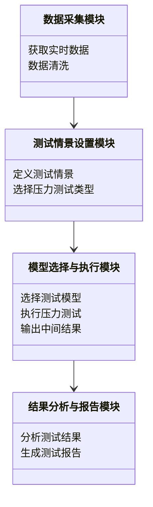
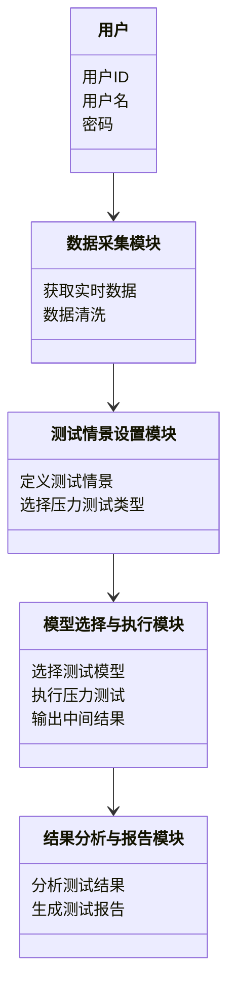

                 


# 金融市场流动性压力测试自动化平台

> 关键词：金融市场、流动性压力测试、自动化平台、风险管理、算法模型、数据处理、系统架构

> 摘要：本文构建了一个基于人工智能和大数据分析的金融市场流动性压力测试自动化平台。该平台通过整合实时市场数据和高级算法模型，能够高效、准确地评估金融机构在不同压力情景下的流动性风险。文章详细阐述了平台的设计理念、核心算法、系统架构，并通过实际案例展示了平台的应用效果，为金融机构的风险管理提供了有力支持。

---

# 第一部分: 金融市场流动性压力测试概述

# 第1章: 流动性压力测试的基本概念

## 1.1 流动性压力测试的定义与背景

### 1.1.1 什么是流动性压力测试

流动性压力测试是评估金融机构在极端市场条件下维持资产流动性能力的一种方法。它通过模拟各种不利情景，分析金融机构在这些情景下的现金流动和资产变现能力，确保其能够应对潜在的流动性危机。

$$\text{流动性压力测试} = \text{极端市场情景} \times \text{资产与负债分析}$$

### 1.1.2 流动性压力测试的背景与重要性

近年来，全球金融危机频发，许多金融机构因未能有效应对流动性风险而遭受重大损失。流动性压力测试作为风险管理的重要工具，已成为金融机构合规和稳健运营的核心要求。

### 1.1.3 流动性压力测试的目标与意义

- **目标**: 评估金融机构在极端情景下的流动性状况，确保其能够满足短期资金需求。
- **意义**: 提高金融机构的风险管理能力，增强市场信心，降低系统性风险。

## 1.2 金融市场流动性压力测试的分类

### 1.2.1 常规流动性压力测试

- **定义**: 在正常市场条件下进行的压力测试，评估金融机构的日常流动性状况。
- **特点**: 情景温和，周期较短。

### 1.2.2 针对特定情景的压力测试

- **定义**: 针对特定市场事件（如金融危机、疫情冲击）进行的压力测试。
- **特点**: 情景极端，周期较长。

### 1.2.3 综合流动性压力测试

- **定义**: 综合考虑多种市场因素（如利率波动、资产价格下跌）进行的压力测试。
- **特点**: 情景复杂，涉及多方面因素。

## 1.3 流动性压力测试的实施流程

### 1.3.1 确定测试目标

- 确定测试的主要目的和范围。

### 1.3.2 设定测试情景

- 选择合适的市场情景，如“市场下跌”、“利率上升”等。

### 1.3.3 选择测试模型

- 根据情景选择合适的测试模型，如VaR、CVaR等。

### 1.3.4 执行测试并分析结果

- 运行测试，分析结果，评估流动性风险。

### 1.3.5 输出测试报告

- 整理分析结果，撰写测试报告。

## 1.4 本章小结

本章介绍了流动性压力测试的基本概念、分类及其实施流程，为后续章节的深入分析奠定了基础。

---

# 第二部分: 流动性压力测试的核心概念与模型

# 第2章: 流动性压力测试的核心概念

## 2.1 流动性压力测试的主要输入参数

### 2.1.1 资产负债表结构

- 资产和负债的构成、期限和流动性。

### 2.1.2 现金流预测

- 预测未来一段时间内的现金流入和流出。

### 2.1.3 市场风险因素

- 利率、汇率、资产价格波动等风险因素。

## 2.2 流动性压力测试的关键输出指标

### 2.2.1 现金缺口分析

- 计算不同情景下的现金缺口，评估融资需求。

$$\text{现金缺口} = \text{预期现金流出} - \text{预期现金流入}$$

### 2.2.2 资产变现能力

- 评估资产在极端情景下的变现能力。

### 2.2.3 融资能力评估

- 分析金融机构在压力情景下的融资能力。

## 2.3 流动性压力测试的模型与方法

### 2.3.1 缺口分析法

- 计算资产和负债在不同时间段的缺口，评估流动性风险。

$$\text{缺口} = \text{负债} - \text{资产}$$

### 2.3.2 流动性覆盖率（LCR）

- 计算高流动性资产与短期负债的比例，确保金融机构有足够的流动性应对短期压力。

$$\text{LCR} = \frac{\text{合格高流动性资产}}{\text{短期净负债}}$$

### 2.3.3 净现金流分析法

- 通过模拟不同情景下的现金流，评估金融机构的流动性状况。

## 2.4 本章小结

本章详细讲解了流动性压力测试的核心概念和常用模型，为自动化平台的设计提供了理论基础。

---

# 第三部分: 流动性压力测试的自动化平台设计

# 第3章: 自动化平台的设计理念

## 3.1 自动化平台的目标与优势

### 3.1.1 提高测试效率

- 自动化平台能够快速处理大量数据，显著提高测试效率。

### 3.1.2 降低人为误差

- 自动化平台减少了人为操作带来的误差，提高了测试结果的准确性。

### 3.1.3 实现快速响应

- 通过实时数据处理和快速计算，平台能够快速生成测试结果，帮助金融机构及时应对风险。

## 3.2 自动化平台的功能模块

### 3.2.1 数据采集模块

- 从多种数据源获取实时市场数据，包括股票、债券、外汇等。

### 3.2.2 测试情景设置模块

- 允许用户自定义测试情景，如市场下跌、利率上升等。

### 3.2.3 模型选择与执行模块

- 提供多种测试模型，用户可以根据需求选择合适的模型进行测试。

### 3.2.4 结果分析与报告模块

- 自动生成测试报告，包含详细的分析结果和可视化图表。

## 3.3 自动化平台的系统架构

### 3.3.1 系统功能设计

- 使用领域模型图展示系统功能模块之间的关系。



### 3.3.2 系统架构设计

- 使用Mermaid图展示系统架构设计。


## 3.4 本章小结

本章介绍了自动化平台的设计理念和功能模块，展示了系统架构设计，为后续章节的实现提供了指导。

---

# 第四部分: 流动性压力测试的算法原理

# 第4章: 流动性压力测试的核心算法

## 4.1 VaR（Value at Risk）模型

### 4.1.1 VaR的定义与计算方法

- VaR是在给定置信水平下，可能遭受的最大损失。

$$\text{VaR} = \text{损失的第} \alpha \text{分位数}$$

### 4.1.2 VaR的计算步骤


### 4.1.3 VaR的Python实现

```python
import numpy as np

def calculate VaR(data, confidence_level):
    sorted_data = np.sort(data)
    index = int(len(data) * (1 - confidence_level))
    VaR = sorted_data[index]
    return VaR
```

## 4.2 CVaR（Conditional Value at Risk）模型

### 4.2.1 CVaR的定义与计算方法

- CVaR是VaR的条件期望，即在VaR水平下的平均损失。

$$\text{CVaR} = \mathbb{E}[L | L \geq \text{VaR}]$$

### 4.2.2 CVaR的计算步骤


### 4.2.3 CVaR的Python实现

```python
import numpy as np

def calculate CVaR(data, confidence_level):
    sorted_data = np.sort(data)
    index = int(len(data) * (1 - confidence_level))
    CVaR = np.mean(sorted_data[index:])
    return CVaR
```

## 4.3 算法的比较与选择

### 4.3.1 VaR与CVaR的比较

- VaR只考虑损失的分位数，而CVaR考虑超过VaR的平均损失。

### 4.3.2 算法选择的注意事项

- 根据具体需求选择合适的算法，如市场风险较大时选择CVaR。

## 4.4 本章小结

本章详细讲解了VaR和CVaR模型的原理和实现方法，为自动化平台的算法实现提供了参考。

---

# 第五部分: 系统分析与架构设计方案

# 第5章: 系统分析与架构设计

## 5.1 系统需求分析

### 5.1.1 功能需求

- 数据采集、测试情景设置、模型选择、结果分析。

### 5.1.2 性能需求

- 高效处理大规模数据，快速生成测试结果。

### 5.1.3 安全需求

- 数据安全，防止敏感信息泄露。

## 5.2 系统功能设计

### 5.2.1 领域模型图



## 5.3 系统架构设计

### 5.3.1 系统架构图


## 5.4 接口设计与交互流程

### 5.4.1 系统接口设计

- 数据接口：与数据源对接，获取实时数据。
- 测试接口：接收测试情景和模型选择，执行压力测试。
- 报告接口：生成并输出测试报告。

### 5.4.2 交互流程图


## 5.5 本章小结

本章通过系统分析和架构设计，明确了自动化平台的实现路径。

---

# 第六部分: 项目实战

# 第6章: 项目实战与案例分析

## 6.1 环境安装与配置

### 6.1.1 安装Python环境

- 安装Python 3.8及以上版本。
- 安装必要的库，如numpy、pandas、scipy。

### 6.1.2 安装可视化工具

- 安装Matplotlib或Seaborn用于数据可视化。

## 6.2 核心代码实现

### 6.2.1 数据采集模块

```python
import requests
import pandas as pd

def get_realtime_data(ticker):
    url = f"https://api.example.com/realtime_data/{ticker}"
    response = requests.get(url)
    data = response.json()
    df = pd.DataFrame(data)
    return df
```

### 6.2.2 模型实现模块

```python
def calculate_var(data, confidence_level):
    sorted_data = pd.Series(data).sort_values()
    index = int(len(sorted_data) * (1 - confidence_level))
    var = sorted_data[index]
    return var

def calculate_cvar(data, confidence_level):
    sorted_data = pd.Series(data).sort_values()
    index = int(len(sorted_data) * (1 - confidence_level))
    cvar = sorted_data[index:].mean()
    return cvar
```

### 6.2.3 报告生成模块

```python
import matplotlib.pyplot as plt

def generate_report(var, cvar):
    plt.figure(figsize=(10, 6))
    plt.bar('VaR', var, color='blue')
    plt.bar('CVaR', cvar, color='green')
    plt.title('Risk Analysis Report')
    plt.ylabel('Value')
    plt.show()
```

## 6.3 代码解读与分析

### 6.3.1 数据采集模块

- 使用requests库获取实时数据，转换为DataFrame格式。

### 6.3.2 模型实现模块

- 使用numpy和pandas库计算VaR和CVaR，提供详细的分析结果。

### 6.3.3 报告生成模块

- 使用Matplotlib生成可视化报告，直观展示VaR和CVaR的差异。

## 6.4 实际案例分析

### 6.4.1 案例背景

- 某银行在市场下跌10%的情况下进行压力测试。

### 6.4.2 数据准备

- 资产组合价值：$100 million
- 历史收益率数据：模拟市场下跌10%的情景。

### 6.4.3 模型计算

- 计算VaR和CVaR，评估潜在损失。

### 6.4.4 结果分析

- VaR为$10 million，CVaR为$15 million，表明在市场下跌10%的情况下，银行需要额外准备$5 million的流动性缓冲。

## 6.5 本章小结

本章通过实际案例展示了自动化平台的实现过程和应用效果，为读者提供了实践指导。

---

# 第七部分: 最佳实践与总结

# 第7章: 最佳实践与总结

## 7.1 最佳实践

### 7.1.1 数据质量

- 确保数据的准确性和实时性。

### 7.1.2 模型选择

- 根据具体情况选择合适的测试模型。

### 7.1.3 系统性能优化

- 使用分布式计算和缓存技术提高平台性能。

## 7.2 小结

### 7.2.1 系统优势

- 自动化平台能够高效、准确地进行流动性压力测试，帮助金融机构及时应对风险。

## 7.3 注意事项

### 7.3.1 数据隐私

- 注意数据的安全性，防止敏感信息泄露。

### 7.3.2 模型局限性

- 测试模型有一定的假设和局限性，需结合实际情况进行调整。

## 7.4 拓展阅读

### 7.4.1 相关书籍

- 《Financial Risk Management》
- 《Python for Finance》

### 7.4.2 网络资源

- 金融风险管理论坛
- 开源压力测试工具库

## 7.5 本章小结

本章总结了文章的主要内容，提出了实践中的注意事项和拓展方向。

---

# 作者：AI天才研究院/AI Genius Institute & 禅与计算机程序设计艺术/Zen And The Art of Computer Programming

