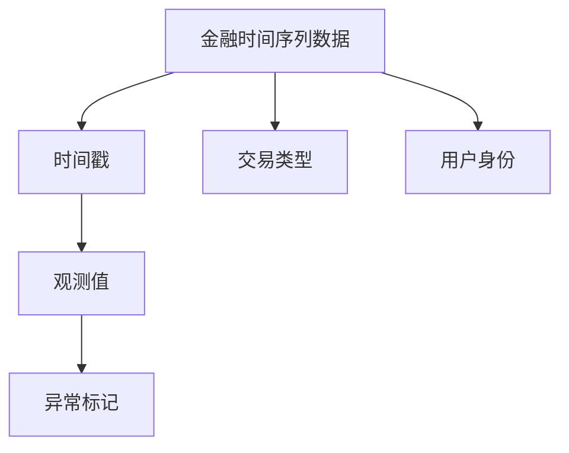
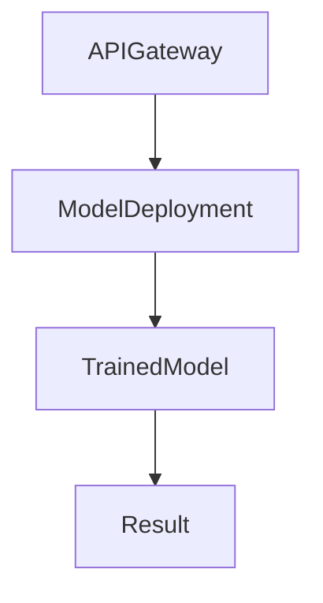

                 


# 《金融时间序列异常检测系统》

---

## 关键词：
- 金融时间序列
- 异常检测
- 机器学习
- 深度学习
- 系统架构

---

## 摘要：
本文深入探讨金融时间序列异常检测系统的构建与优化，从理论基础到实际应用，系统性地分析了时间序列数据的特征、异常检测的核心算法、系统架构设计以及项目实战。文章结合统计学、机器学习和深度学习方法，详细阐述了如何在金融场景中识别异常交易、监测市场波动并构建高效可靠的异常检测系统。通过案例分析和代码实现，本文为读者提供了从理论到实践的完整指南。

---

# 第一部分：金融时间序列异常检测系统背景介绍

## 第1章：问题背景与核心概念

### 1.1 问题背景
#### 1.1.1 金融时间序列数据的特点
- 连续性：金融数据通常是按时间顺序记录的，如股票价格、交易量等。
- 周期性：金融数据往往表现出明显的周期性特征，如日、周、月周期。
- 不可预测性：市场波动受多种因素影响，具有高度的不确定性。

#### 1.1.2 异常检测的定义与重要性
- 异常检测：识别数据中偏离正常模式的点或行为。
- 在金融领域的关键作用：
  - 检测欺诈交易。
  - 监测市场操纵。
  - 识别系统故障。

#### 1.1.3 金融领域中的异常检测场景
- 股票市场：检测异常波动。
- 交易系统：识别异常交易行为。
- 风险管理：提前预警潜在风险。

### 1.2 问题描述
#### 1.2.1 时间序列数据的连续性与周期性
- 数据的连续性：时间序列数据是连续的，每个时间点都有对应的观测值。
- 数据的周期性：周期性波动是时间序列数据的重要特征，如股票价格的季节性波动。

#### 1.2.2 异常检测的核心挑战
- 数据稀疏性：异常样本往往比正常样本少。
- 数据的时序依赖性：异常检测需要考虑数据的时间依赖性。
- 计算效率：金融数据量大，实时检测要求高。

#### 1.2.3 金融场景下的异常检测目标
- 实时性：要求快速检测，适用于实时交易监控。
- 准确性：减少误报和漏报。
- 可解释性：便于业务人员理解检测结果。

### 1.3 问题解决
#### 1.3.1 异常检测的基本方法
- 基于统计的方法：如Z-Score、LOF（局部 outlier factor）。
- 基于机器学习的方法：如孤立森林（Isolation Forest）、支持向量机（SVM）。
- 基于深度学习的方法：如LSTM、Transformer。

#### 1.3.2 时间序列异常检测的核心要素
- 数据预处理：缺失值处理、标准化、滑动窗口技术。
- 特征提取：统计特征、时频特征、模式特征。
- 模型选择：选择适合时间序列数据的算法。

#### 1.3.3 金融场景下的异常检测目标
- 实时监控：适用于高频交易场景。
- 历史分析：用于事后分析和风险管理。
- 综合分析：结合多种数据源（如市场数据、用户行为数据）进行异常检测。

### 1.4 概念结构与核心要素
#### 1.4.1 时间序列数据的结构化分析
- 时间戳：记录数据的时间信息。
- 观测值：每个时间点的数值。
- 状态信息：数据的其他属性，如交易类型、用户身份。

#### 1.4.2 异常检测的分类与对比
- 单变量与多变量：单变量异常检测基于单个特征，多变量异常检测基于多个特征的组合。
- 基于密度与基于聚类：基于密度的方法检测数据密集区域外的异常点，基于聚类的方法将数据分为簇，检测离群点。
- 基于统计与基于机器学习：统计方法基于概率分布，机器学习方法基于模型学习数据的分布。

#### 1.4.3 核心要素的特征分析
- 数据量：金融时间序列数据通常具有大样本特征。
- 数据维度：多维时间序列数据（如多只股票的价格、成交量）。
- 数据频率：从高频（秒级）到低频（日级）。

---

## 第2章：核心概念原理

### 2.1 异常检测的原理与方法
#### 2.1.1 统计学方法
- Z-Score：计算每个观测值与均值的差值，标准化后判断是否为异常值。
- 指数平滑法：通过加权平均预测下一个时间点的值，判断实际值与预测值的偏差是否超过阈值。
- 马尔可夫链模型：基于状态转移的概率模型，用于检测时间序列中的异常状态。

#### 2.1.2 机器学习方法
- Isolation Forest：基于树结构的无监督学习算法，适用于高维数据。
- One-Class SVM：仅基于正常数据训练的SVM模型，用于识别异常点。
- K-Nearest Neighbors（KNN）：基于密度的方法，通过计算每个点的K近邻距离来判断是否为异常点。

#### 2.1.3 深度学习方法
- LSTM网络：通过记忆单元捕捉时间序列的长期依赖关系，适用于复杂的时间序列模式识别。
- Transformer：基于自注意力机制，适用于捕捉时间序列中的全局模式。
- 深度自编码器（Autoencoder）：通过重建输入数据，识别异常点。

### 2.2 核心概念的特征对比
| 特征维度      | 统计学方法         | 机器学习方法       | 深度学习方法       |
|---------------|-------------------|-------------------|-------------------|
| 数据要求       | 需要正常样本数据   | 需要正常样本数据   | 需要正常样本数据   |
| 计算效率       | 高效               | 中等               | 较低               |
| 模型复杂度     | 低                 | 中等               | 高                 |
| 适用场景       | 线性关系明显的数据   | 非线性关系复杂的数据 | 复杂模式的数据       |

### 2.3 ER实体关系图架构


---

## 第3章：算法原理与实现

### 3.1 统计学方法的实现
#### 3.1.1 Z-Score方法
- 数学公式：
  $$ Z = \frac{x - \mu}{\sigma} $$
  其中，$\mu$是均值，$\sigma$是标准差。
- 实现步骤：
  1. 计算数据的均值和标准差。
  2. 计算每个观测值的Z-Score。
  3. 判断Z-Score是否超过阈值（通常取3或-3）。

#### 3.1.2 指数平滑法
- 数学公式：
  $$ S_t = \alpha \cdot x_t + (1-\alpha) \cdot S_{t-1} $$
  其中，$\alpha$是平滑因子，取值在0到1之间。
- 实现步骤：
  1. 初始化平滑序列。
  2. 计算每个时间点的平滑值。
  3. 预测下一个时间点的值，计算实际值与预测值的偏差。

#### 3.1.3 马尔可夫链模型
- 数学公式：
  $$ P(A|B) = \frac{P(B|A)P(A)}{P(B)} $$
  其中，$P(A|B)$是条件概率，表示状态A在状态B之后发生的概率。
- 实现步骤：
  1. 构建状态转移矩阵。
  2. 计算状态转移概率。
  3. 识别异常状态，即概率显著低于预期的状态。

### 3.2 机器学习方法的实现
#### 3.2.1 Isolation Forest
- 实现步骤：
  1. 训练孤立森林模型。
  2. 使用模型对数据进行异常检测。
  3. 根据异常分数判断是否为异常点。

#### 3.2.2 One-Class SVM
- 实现步骤：
  1. 训练One-Class SVM模型。
  2. 使用模型对数据进行分类。
  3. 判断是否属于异常类别。

#### 3.2.3 KNN
- 实现步骤：
  1. 计算每个点的K近邻距离。
  2. 根据距离判断是否为异常点。

### 3.3 深度学习方法的实现
#### 3.3.1 LSTM网络
- 实现步骤：
  1. 构建LSTM网络结构。
  2. 训练模型，学习时间序列的模式。
  3. 使用模型预测下一个时间点的值，判断实际值与预测值的偏差。

#### 3.3.2 Transformer
- 实现步骤：
  1. 构建Transformer模型结构。
  2. 训练模型，学习时间序列的全局模式。
  3. 使用模型进行异常检测。

#### 3.3.3 深度自编码器
- 实现步骤：
  1. 构建自编码器模型。
  2. 训练模型，学习数据的重建误差。
  3. 根据重建误差判断是否为异常点。

---

## 第4章：系统架构设计

### 4.1 问题场景介绍
- 数据采集：实时采集金融时间序列数据，如股票价格、交易量等。
- 数据预处理：清洗数据，处理缺失值、异常值。
- 模型训练：基于预处理后的数据训练异常检测模型。
- 模型部署：将训练好的模型部署到生产环境，进行实时检测。

### 4.2 项目介绍
- 项目目标：构建一个高效可靠的金融时间序列异常检测系统。
- 项目范围：涵盖数据采集、预处理、模型训练、部署监控等模块。
- 项目约束：实时性要求高，数据量大，计算资源有限。

### 4.3 系统功能设计
#### 4.3.1 数据采集模块
- 功能描述：实时采集金融时间序列数据，支持多种数据源。
- 数据流图：
  ```mermaid
  graph TD
      DataSource --> DataCollector
      DataCollector --> DataStorage
  ```

#### 4.3.2 数据预处理模块
- 功能描述：清洗数据，处理缺失值、异常值，进行数据标准化。
- 类图：
  ```mermaid
  classDiagram
      class DataPreprocessing {
          function cleanData();
          function normalizeData();
      }
  ```

#### 4.3.3 模型训练模块
- 功能描述：基于预处理后的数据训练异常检测模型。
- 模块设计：
  ```mermaid
  graph TD
      DataPreprocessing --> ModelTraining
      ModelTraining --> TrainedModel
  ```

#### 4.3.4 模型部署模块
- 功能描述：将训练好的模型部署到生产环境，进行实时检测。
- 接口设计：
  ```mermaid
  graph TD
      APIGateway --> ModelDeployment
      ModelDeployment --> TrainedModel
  ```

### 4.4 系统架构设计
#### 4.4.1 模块划分
- 数据采集模块：负责数据的实时采集。
- 数据预处理模块：负责数据的清洗和标准化。
- 模型训练模块：负责异常检测模型的训练。
- 模型部署模块：负责模型的实时检测和结果输出。

#### 4.4.2 模块间交互
- 数据采集模块将数据传递给数据预处理模块。
- 数据预处理模块将处理后的数据传递给模型训练模块。
- 模型训练模块将训练好的模型传递给模型部署模块。
- 模型部署模块通过API接口接收实时数据，进行异常检测并返回结果。

### 4.5 系统接口设计
- 数据采集接口：提供数据采集的API接口，支持多种数据源。
- 数据预处理接口：提供数据清洗和标准化的API接口。
- 模型训练接口：提供模型训练的API接口。
- 模型部署接口：提供实时检测的API接口。

### 4.6 系统交互设计
#### 4.6.1 交互流程
1. 数据采集模块通过API接口采集实时数据。
2. 数据预处理模块对数据进行清洗和标准化。
3. 模型训练模块基于处理后的数据训练异常检测模型。
4. 模型部署模块通过API接口接收实时数据，进行异常检测并返回结果。

#### 4.6.2 交互图


---

## 第5章：项目实战

### 5.1 环境安装
#### 5.1.1 安装Python环境
- 使用Anaconda安装Python 3.8及以上版本。
- 安装必要的库：numpy、pandas、scikit-learn、keras、tensorflow、pymermaid。

#### 5.1.2 安装Jupyter Notebook
- 使用命令`pip install jupyter`安装Jupyter Notebook。
- 启动Jupyter Notebook：`jupyter notebook`。

### 5.2 系统核心实现
#### 5.2.1 数据采集
- 使用Yahoo Finance API获取股票价格数据。
- 示例代码：
  ```python
  import yfinance as yf
  data = yf.download('AAPL', start='2023-01-01', end='2023-12-31')
  ```

#### 5.2.2 数据预处理
- 清洗数据，处理缺失值。
- 标准化数据。
- 示例代码：
  ```python
  import pandas as pd
  import numpy as np
  from sklearn.preprocessing import StandardScaler

  # 处理缺失值
  data = data.dropna()
  # 标准化数据
  scaler = StandardScaler()
  normalized_data = scaler.fit_transform(data['Close'].values.reshape(-1, 1))
  ```

#### 5.2.3 模型训练
- 训练Isolation Forest模型。
- 示例代码：
  ```python
  from sklearn.ensemble import IsolationForest

  model = IsolationForest(n_estimators=100, contamination=0.05, random_state=42)
  model.fit(normalized_data)
  ```

#### 5.2.4 模型部署
- 使用训练好的模型进行实时检测。
- 示例代码：
  ```python
  import requests

  # 发送请求到API接口
  response = requests.post('http://localhost:8000/predict', json={'data': normalized_data.tolist()})
  result = response.json()
  ```

### 5.3 代码应用解读与分析
- 数据采集模块：使用Yahoo Finance API获取股票价格数据。
- 数据预处理模块：清洗数据，处理缺失值，标准化数据。
- 模型训练模块：使用Isolation Forest算法训练异常检测模型。
- 模型部署模块：通过API接口接收实时数据，进行异常检测并返回结果。

### 5.4 实际案例分析
#### 5.4.1 数据分析
- 使用时间序列图分析股票价格的走势。
- 使用箱线图分析数据的分布情况。
- 示例代码：
  ```python
  import matplotlib.pyplot as plt

  plt.figure(figsize=(12, 6))
  plt.plot(data.index, data['Close'], label='Close Price')
  plt.title('Stock Price Trend')
  plt.xlabel('Date')
  plt.ylabel('Price')
  plt.legend()
  plt.show()
  ```

#### 5.4.2 模型评估
- 使用混淆矩阵评估模型的性能。
- 示例代码：
  ```python
  from sklearn.metrics import confusion_matrix

  y_pred = model.predict(normalized_data)
  y_true = [0] * len(y_pred)
  cm = confusion_matrix(y_true, y_pred)
  print(cm)
  ```

#### 5.4.3 案例分析
- 识别异常交易行为。
- 监测市场波动。
- 示例分析：
  - 异常点检测：识别出某一天的股票价格突然下跌，判断为异常点。
  - 市场波动监测：监测股票价格的波动幅度，判断是否超出正常范围。

### 5.5 项目总结
- 项目目标达成：构建了一个高效可靠的金融时间序列异常检测系统。
- 项目成果：实现了数据采集、预处理、模型训练和部署监控的完整流程。
- 项目经验：在实际应用中，需要考虑数据的实时性、模型的计算效率以及系统的可扩展性。

---

## 第6章：总结与展望

### 6.1 小结
- 本文系统性地介绍了金融时间序列异常检测系统的构建与优化，从理论基础到实际应用，详细阐述了时间序列数据的特征、异常检测的核心算法、系统架构设计以及项目实战。

### 6.2 注意事项
- 数据隐私：在处理金融数据时，需要注意数据的隐私保护。
- 模型解释性：在实际应用中，需要确保模型的解释性，便于业务人员理解检测结果。
- 系统稳定性：在系统设计时，需要考虑系统的稳定性和容错性。

### 6.3 拓展阅读
- 深入研究最新的深度学习模型，如Transformer在时间序列异常检测中的应用。
- 探索多模态数据的异常检测方法，如结合文本数据和时间序列数据进行异常检测。
- 研究异常检测的可解释性方法，如使用SHAP值解释模型的决策过程。

---

## 作者：
作者：AI天才研究院/AI Genius Institute  
作者：禅与计算机程序设计艺术/Zen And The Art of Computer Programming

