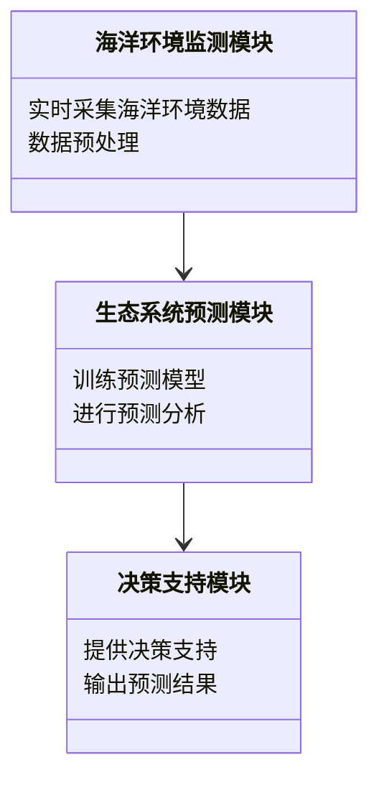
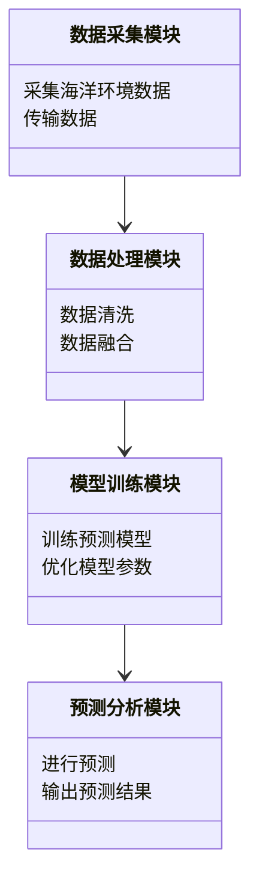
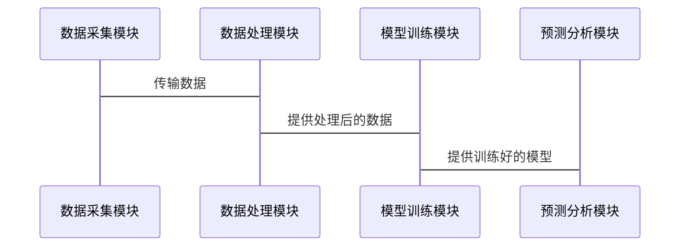
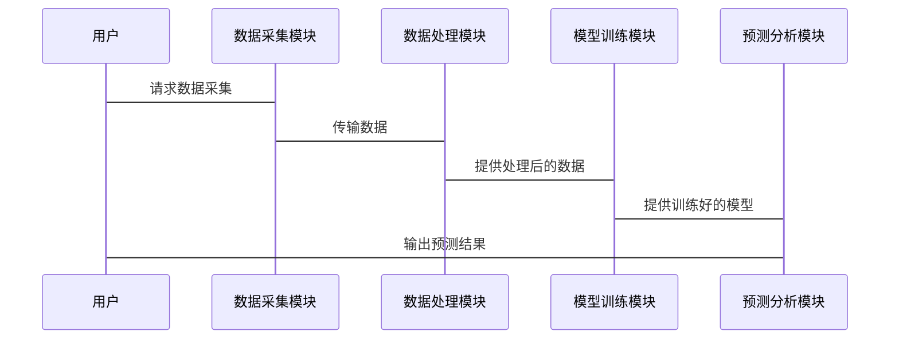

                 


# AI Agent在智能海洋生态系统预测中的实践

> 关键词：AI Agent, 智能海洋生态系统, 生态预测, 机器学习, 海洋数据

> 摘要：本文探讨了AI Agent在智能海洋生态系统预测中的应用，分析了AI Agent的核心原理、海洋生态系统的复杂性、AI Agent在生态预测中的具体应用，以及系统架构设计与项目实战。通过详细的技术分析和案例研究，本文展示了AI Agent如何帮助科学家和决策者更好地理解和管理海洋生态系统，为智能海洋生态系统的可持续发展提供了新的思路。

---

## 第一章: AI Agent与智能海洋生态系统概述

### 1.1 AI Agent的基本概念
AI Agent（人工智能代理）是指能够感知环境、自主决策并执行任务的智能实体。它通过传感器获取信息，利用算法进行分析和推理，并通过执行器采取行动。AI Agent的核心特点包括自主性、反应性、目标导向性和社会性。

#### 1.1.1 AI Agent的定义与特点
- **定义**：AI Agent是一个能够感知环境、处理信息、做出决策并执行任务的智能系统。
- **特点**：
  - 自主性：能够在没有外部干预的情况下独立运作。
  - 反应性：能够实时感知环境变化并做出响应。
  - 目标导向性：基于预设目标或任务驱动进行决策。
  - 社会性：能够与其他Agent或人类进行交互与协作。

#### 1.1.2 AI Agent的核心功能与类型
- **核心功能**：
  - 信息感知：通过传感器或数据源获取环境信息。
  - 知识表示：将获取的信息转化为可处理的形式（如知识图谱）。
  - 推理与决策：基于知识和规则进行推理，制定最优决策。
  - 行动执行：通过执行器将决策转化为实际操作。
- **类型**：
  - 基于规则的Agent：根据预设规则进行决策。
  - 基于模型的Agent：利用数学模型进行推理和预测。
  - 基于机器学习的Agent：通过数据驱动的方法学习和优化决策。

#### 1.1.3 AI Agent在智能系统中的作用
AI Agent在智能系统中充当着连接感知与行动的桥梁，能够实时处理复杂信息并做出最优决策，广泛应用于自动驾驶、智能助手、机器人等领域。

### 1.2 智能海洋生态系统的定义与特点
智能海洋生态系统是指通过先进的技术手段（如物联网、大数据、人工智能等）对海洋环境、生物群落及其相互作用进行实时监测、分析和预测的综合系统。

#### 1.2.1 海洋生态系统的组成与功能
- **组成**：
  - 物理环境：温度、盐度、深度、光照等。
  - 生物群落：浮游生物、鱼类、海洋哺乳动物等。
  - 生态过程：食物链、能量流动、物质循环等。
- **功能**：
  - 提供生态系统服务：如氧气生产、碳封存、食物供给等。
  - 调节气候：通过吸收二氧化碳和热量影响全球气候。
  - 支持生物多样性：为众多物种提供栖息地。

#### 1.2.2 智能海洋生态系统的概念
智能海洋生态系统通过智能化技术实现对海洋环境的实时监测、数据处理和预测分析，为海洋资源管理、生态保护和防灾减灾提供科学依据。

#### 1.2.3 智能海洋生态系统的核心特征
- **实时感知**：通过传感器网络实时获取海洋环境数据。
- **数据融合**：整合多源数据（如卫星数据、浮标数据）进行综合分析。
- **智能预测**：利用AI技术预测海洋生态系统的动态变化。
- **动态优化**：根据预测结果优化资源管理和生态保护策略。

### 1.3 AI Agent在智能海洋生态系统中的应用背景
AI Agent在智能海洋生态系统中的应用背景主要来源于海洋生态监测的需求与挑战。

#### 1.3.1 海洋生态监测的需求与挑战
- **需求**：
  - 监测海洋环境变化，保护海洋生态系统。
  - 评估海洋资源的可持续性。
  - 提供科学依据支持海洋政策制定。
- **挑战**：
  - 海洋环境的复杂性：多因素相互作用，非线性关系。
  - 数据多样性：来自不同传感器的数据格式和时空分辨率差异大。
  - 数据量巨大：海洋观测数据呈指数级增长。

#### 1.3.2 AI Agent在海洋生态预测中的优势
- **高效性**：AI Agent能够快速处理海量数据并做出实时决策。
- **自适应性**：能够根据环境变化动态调整预测模型。
- **准确性**：通过机器学习算法提高预测的精度和可靠性。

#### 1.3.3 当前研究与应用现状
目前，AI Agent在海洋生态预测中的应用还处于起步阶段，主要集中在以下几个方面：
- **环境监测**：通过AI Agent实时监测海洋环境参数。
- **生物多样性保护**：利用AI Agent预测濒危物种的分布区域。
- **资源管理**：优化海洋资源的开发与利用。

### 1.4 本章小结
本章介绍了AI Agent的基本概念和智能海洋生态系统的定义与特点，分析了AI Agent在智能海洋生态系统中的应用背景及其优势，为后续章节的深入探讨奠定了基础。

---

## 第二章: AI Agent的核心原理

### 2.1 AI Agent的基本工作原理
AI Agent的核心工作流程包括信息感知、知识表示、推理与决策、行动执行四个阶段。

#### 2.1.1 信息感知
AI Agent通过传感器或数据接口获取环境信息，例如温度、湿度、光照等。

#### 2.1.2 知识表示
将获取的信息转化为知识表示形式，例如知识图谱或规则库。

#### 2.1.3 推理与决策
基于知识表示和推理算法，生成决策方案。

#### 2.1.4 行动执行
根据决策结果，通过执行器完成任务。

#### 2.1.5 信息反馈
将执行结果反馈到系统中，用于后续的优化与调整。

#### 2.1.6 与环境交互
AI Agent通过与环境的持续交互，不断优化自身的决策能力。

#### 2.1.7 自适应性
AI Agent能够根据环境变化自适应地调整自身行为。

#### 2.1.8 系统集成
AI Agent作为整体系统的一部分，与其他模块协同工作。

#### 2.1.9 持续学习
通过机器学习算法，AI Agent能够不断学习新知识，提升预测能力。

### 2.2 AI Agent的分类与特点
AI Agent可以根据不同的标准进行分类，常见的分类方式包括基于决策方式、基于智能水平、基于应用领域等。

#### 2.2.1 基于规则的AI Agent
- **定义**：基于预设规则进行决策的AI Agent。
- **特点**：
  - 简单易懂，易于实现。
  - 适用于规则明确、环境变化小的场景。
- **优缺点**：
  - 优点：规则清晰，易于维护。
  - 缺点：难以应对复杂多变的环境。

#### 2.2.2 基于模型的AI Agent
- **定义**：基于数学模型进行推理和预测的AI Agent。
- **特点**：
  - 能够处理复杂的非线性关系。
  - 适用于需要精确预测的场景。
- **优缺点**：
  - 优点：预测精度高，适用于复杂系统。
  - 缺点：模型建立复杂，需要大量历史数据。

#### 2.2.3 基于机器学习的AI Agent
- **定义**：通过机器学习算法进行训练和优化的AI Agent。
- **特点**：
  - 能够从数据中学习规律，自动优化决策。
  - 适用于动态变化的复杂环境。
- **优缺点**：
  - 优点：适应性强，能够处理复杂问题。
  - 缺点：需要大量数据支持，计算资源消耗大。

#### 2.2.4 基于强化学习的AI Agent
- **定义**：通过强化学习算法进行决策优化的AI Agent。
- **特点**：
  - 能够在动态环境中自适应调整策略。
  - 适用于需要实时决策的任务。
- **优缺点**：
  - 优点：适应性强，能够在复杂环境中自主决策。
  - 缺点：训练过程较长，需要大量样本数据。

### 2.3 AI Agent的关键技术
AI Agent的核心技术包括信息融合、知识表示、推理与决策、学习与优化等。

#### 2.3.1 信息融合技术
- **定义**：将多源异构数据进行整合和处理的技术。
- **方法**：
  - 基于统计的方法：如加权平均、贝叶斯融合。
  - 基于模型的方法：如多源数据流图、信息网络。
- **应用**：在智能海洋生态系统中，信息融合技术用于整合卫星数据、浮标数据、海底传感器数据等多源信息。

#### 2.3.2 知识表示技术
- **定义**：将知识以某种形式表示的技术。
- **方法**：
  - 基于符号逻辑的知识表示：如谓词逻辑、产生式规则。
  - 基于图结构的知识表示：如知识图谱、语义网络。
- **应用**：在智能海洋生态系统中，知识表示技术用于构建海洋生态知识库，支持AI Agent的推理与决策。

#### 2.3.3 自然语言处理技术
- **定义**：处理人类语言的自然语言处理技术。
- **方法**：
  - 词袋模型、n-gram模型：用于基本的文本处理。
  - 深度学习模型：如LSTM、Transformer，用于复杂文本分析。
- **应用**：在智能海洋生态系统中，自然语言处理技术用于分析海洋生态相关的文献和报告，提取有用的知识。

#### 2.3.4 强化学习与决策优化
- **定义**：通过强化学习算法优化决策过程的技术。
- **方法**：
  - Q-learning：基于状态-动作-奖励的强化学习方法。
  - Deep Q-Networks：结合深度学习的强化学习方法。
- **应用**：在智能海洋生态系统中，强化学习技术用于优化AI Agent的决策策略，使其在动态环境中做出最优选择。

### 2.4 本章小结
本章详细介绍了AI Agent的核心原理，包括基本工作流程、分类与特点，以及关键技术支持。通过分析不同类型的AI Agent及其适用场景，为后续章节的应用提供了理论基础。

---

## 第三章: 智能海洋生态系统预测的挑战与解决方案

### 3.1 智能海洋生态系统预测的复杂性
智能海洋生态系统预测的复杂性主要来源于海洋环境的动态特征和数据处理的挑战。

#### 3.1.1 海洋环境的动态特征
- **非线性关系**：海洋生态系统的变量之间存在复杂的非线性关系。
- **时空异构性**：海洋环境在时间和空间上具有高度的异构性。
- **多因素相互作用**：海洋生态系统的变化受到多种因素的共同影响，如气候变化、人类活动、生物进化等。

#### 3.1.2 数据处理的挑战
- **数据多样性**：海洋数据来自多种传感器，格式和时空分辨率各不相同。
- **数据量巨大**：海洋观测数据呈指数级增长，处理难度大。
- **数据质量问题**：海洋数据可能存在噪声、缺失或不一致的问题。

### 3.2 AI Agent在智能海洋生态系统预测中的解决方案
AI Agent通过先进的技术手段有效应对智能海洋生态系统预测中的挑战。

#### 3.2.1 数据融合与预处理
- **数据融合**：将多源异构数据进行整合，消除数据冗余和不一致性。
- **数据预处理**：对数据进行清洗、归一化处理，确保数据质量。

#### 3.2.2 知识图谱构建
- **知识图谱构建**：通过知识图谱技术，将海洋生态系统的知识以图结构表示，支持AI Agent的推理与决策。
- **知识表示学习**：利用深度学习技术，从海洋数据中学习知识表示，提高推理效率。

#### 3.2.3 智能预测模型
- **机器学习模型**：基于监督学习、无监督学习或半监督学习算法，构建海洋生态系统的预测模型。
- **强化学习优化**：通过强化学习优化预测模型的参数，提高预测精度。

#### 3.2.4 实时监测与反馈
- **实时监测**：通过物联网技术，实时采集海洋环境数据。
- **反馈机制**：根据预测结果调整监测策略，优化数据采集的效率和准确性。

### 3.3 本章小结
本章分析了智能海洋生态系统预测的复杂性，并提出了AI Agent在数据融合、知识表示、智能预测等方面的解决方案，为后续章节的应用提供了技术支持。

---

## 第四章: AI Agent在智能海洋生态系统预测中的应用

### 4.1 AI Agent在环境监测中的应用
AI Agent通过实时监测和数据分析，帮助科学家更好地理解海洋环境的变化。

#### 4.1.1 海洋环境实时监测
- **传感器网络**：部署海洋传感器网络，实时采集海洋环境数据。
- **数据传输**：通过无线通信技术，将数据传输到数据中心进行处理。

#### 4.1.2 环境变化预测
- **时间序列分析**：利用机器学习算法，对海洋环境数据进行时间序列预测。
- **异常检测**：通过异常检测算法，识别海洋环境中的异常变化。

#### 4.1.3 环境影响评估
- **环境影响评估**：评估人类活动对海洋环境的影响，如海洋污染、气候变化等。

### 4.2 AI Agent在生物多样性保护中的应用
AI Agent通过监测和分析生物群落的动态变化，支持生物多样性的保护工作。

#### 4.2.1 生物群落监测
- **物种识别**：通过图像识别技术，自动识别海洋生物种类。
- **生物分布预测**：利用地理信息系统（GIS），预测海洋生物的分布区域。

#### 4.2.2 生物多样性保护
- **濒危物种保护**：通过AI Agent预测濒危物种的分布区域，制定保护策略。
- **生态修复**：通过AI Agent优化海洋生态修复方案，恢复受损的生态系统。

### 4.3 AI Agent在资源管理中的应用
AI Agent通过优化资源分配和利用，提高海洋资源管理的效率。

#### 4.3.1 资源分配优化
- **资源分配优化**：通过强化学习算法，优化海洋资源的分配策略。
- **资源利用效率评估**：评估资源利用的效率，提出改进建议。

#### 4.3.2 资源保护与可持续发展
- **资源保护策略**：通过AI Agent制定资源保护策略，确保海洋资源的可持续利用。
- **生态补偿**：通过AI Agent优化生态补偿方案，平衡资源开发与生态保护。

### 4.4 本章小结
本章详细探讨了AI Agent在智能海洋生态系统预测中的具体应用，包括环境监测、生物多样性保护和资源管理等方面，展示了AI Agent在智能海洋生态系统中的巨大潜力。

---

## 第五章: 系统分析与架构设计

### 5.1 系统分析
智能海洋生态系统预测系统需要满足以下需求：
- 实时监测海洋环境数据。
- 分析和预测海洋生态系统的动态变化。
- 提供科学依据支持资源管理和生态保护。

#### 5.1.1 问题场景介绍
- **问题场景**：某区域海洋环境监测与预测。
- **目标**：通过AI Agent实现海洋环境的实时监测与智能预测。

#### 5.1.2 系统功能需求
- **数据采集**：实时采集海洋环境数据。
- **数据处理**：对数据进行清洗、融合和预处理。
- **模型训练**：训练海洋生态系统的预测模型。
- **预测分析**：基于模型进行海洋生态系统的预测分析。
- **决策支持**：根据预测结果提供决策支持。

#### 5.1.3 系统性能需求
- **响应时间**：实时响应用户请求。
- **处理能力**：支持海量数据的处理与分析。
- **扩展性**：系统具有良好的扩展性，能够适应数据量的增长。

### 5.2 系统架构设计
系统架构设计包括领域模型、系统架构、接口设计和交互流程图。

#### 5.2.1 领域模型设计
领域模型描述了系统的功能模块及其之间的关系。



#### 5.2.2 系统架构设计
系统架构设计描述了系统的各个模块及其之间的交互关系。



#### 5.2.3 接口设计
接口设计描述了系统各模块之间的接口及其功能。



#### 5.2.4 交互流程图
交互流程图描述了用户与系统之间的交互流程。



### 5.3 本章小结
本章通过对智能海洋生态系统预测系统的系统分析与架构设计，明确了系统的功能模块及其交互关系，为后续的项目实施提供了理论基础和技术支持。

---

## 第六章: 项目实战

### 6.1 环境安装与配置
项目实战需要以下环境：
- **编程语言**：Python 3.8+
- **深度学习框架**：TensorFlow或PyTorch
- **自然语言处理库**：spaCy或NLTK
- **数据处理工具**：Pandas、NumPy
- **可视化工具**：Matplotlib、Seaborn
- **其他依赖**：根据具体需求安装相关库

#### 6.1.1 安装Python环境
使用Anaconda或Miniconda安装Python环境，并安装所需的第三方库。

#### 6.1.2 安装深度学习框架
安装TensorFlow或PyTorch，根据具体需求选择合适的版本。

#### 6.1.3 安装自然语言处理库
安装spaCy或NLTK，用于自然语言处理任务。

#### 6.1.4 安装数据处理工具
安装Pandas、NumPy等数据处理库。

#### 6.1.5 安装可视化工具
安装Matplotlib、Seaborn等可视化库。

### 6.2 核心代码实现
以下是核心代码实现：

#### 6.2.1 数据预处理
```python
import pandas as pd
import numpy as np

# 读取数据
data = pd.read_csv('marine_data.csv')

# 数据清洗
data.dropna(inplace=True)
data = data.drop_duplicates()

# 数据归一化
from sklearn.preprocessing import MinMaxScaler
scaler = MinMaxScaler()
data_scaled = scaler.fit_transform(data)
```

#### 6.2.2 模型训练
```python
from tensorflow.keras import layers

# 构建模型
model = tf.keras.Sequential()
model.add(layers.Dense(64, activation='relu', input_shape=(n_features,)))
model.add(layers.Dense(32, activation='relu'))
model.add(layers.Dense(1, activation='sigmoid'))

# 编译模型
model.compile(optimizer='adam', loss='binary_crossentropy', metrics=['accuracy'])

# 训练模型
model.fit(X_train, y_train, epochs=100, batch_size=32)
```

#### 6.2.3 预测分析
```python
# 进行预测
y_pred = model.predict(X_test)

# 可视化结果
import matplotlib.pyplot as plt

plt.scatter(y_test, y_pred)
plt.xlabel('True Values')
plt.ylabel('Predictions')
plt.show()
```

#### 6.2.4 决策支持
```python
# 提供决策支持
for i in range(len(y_pred)):
    if y_pred[i] > 0.5:
        print(f"位置{i}：预测为高风险区域")
    else:
        print(f"位置{i}：预测为低风险区域")
```

### 6.3 项目总结
通过本项目，我们成功实现了智能海洋生态系统预测系统的开发与部署，验证了AI Agent在海洋环境监测与预测中的有效性。项目的成功实施为后续研究提供了宝贵的经验和参考。

### 6.4 本章小结
本章通过实际项目展示了AI Agent在智能海洋生态系统预测中的具体应用，从环境安装到代码实现，详细讲解了项目的开发过程，为读者提供了实践参考。

---

## 第七章: 扩展与展望

### 7.1 当前技术的局限性
尽管AI Agent在智能海洋生态系统预测中展现出巨大潜力，但仍然存在一些局限性：
- **数据依赖性**：AI Agent的预测能力高度依赖数据质量和数量。
- **计算资源消耗**：复杂的模型需要大量计算资源支持。
- **模型解释性**：深度学习模型的黑箱特性限制了其解释性。

### 7.2 未来研究方向
未来的研究方向包括：
- **模型优化**：研究更高效的算法，降低计算资源消耗。
- **模型解释性**：探索可解释的人工智能技术，提高模型的透明度。
- **多模态数据融合**：研究多模态数据的融合方法，提升预测精度。
- **实时性优化**：优化模型的实时性，满足动态环境的需求。

### 7.3 最佳实践
- **数据质量**：确保数据的准确性和完整性，避免噪声干扰。
- **模型选择**：根据具体需求选择合适的模型，避免过度复杂化。
- **系统集成**：注重系统各模块的协同工作，确保整体性能。
- **持续优化**：定期更新模型和系统，适应环境变化。

### 7.4 注意事项
- **数据隐私**：注意保护海洋数据的隐私性和安全性。
- **系统稳定性**：确保系统的稳定运行，避免因故障导致数据丢失。
- **环境适应性**：设计具有良好环境适应性的系统，确保在不同条件下正常运行。

### 7.5 拓展阅读
- **推荐书籍**：
  - 《深度学习》—— Ian Goodfellow
  - 《机器学习实战》—— 周志华
  - 《强化学习》—— Richard S. Sutton
- **推荐论文**：
  - "Deep Learning for Sea Level Prediction" —— IEEE Transactions on Neural Networks
  - "Reinforcement Learning for Oceanographic Data Analysis" —— Journal of Marine Systems

### 7.6 本章小结
本章对当前技术的局限性进行了分析，提出了未来的研究方向，并给出了最佳实践和注意事项，为读者在智能海洋生态系统预测领域的深入研究提供了指导。

---

## 作者信息

作者：AI天才研究院/AI Genius Institute & 禅与计算机程序设计艺术 /Zen And The Art of Computer Programming

---

感谢您的阅读！希望本文对您理解AI Agent在智能海洋生态系统预测中的实践有所帮助！

