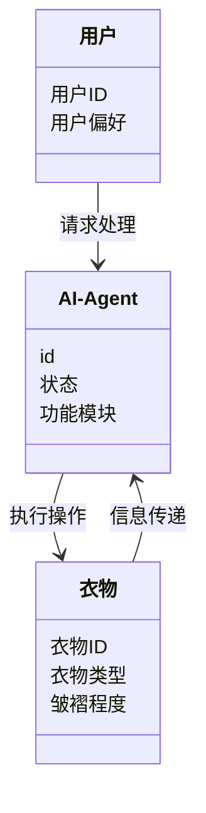
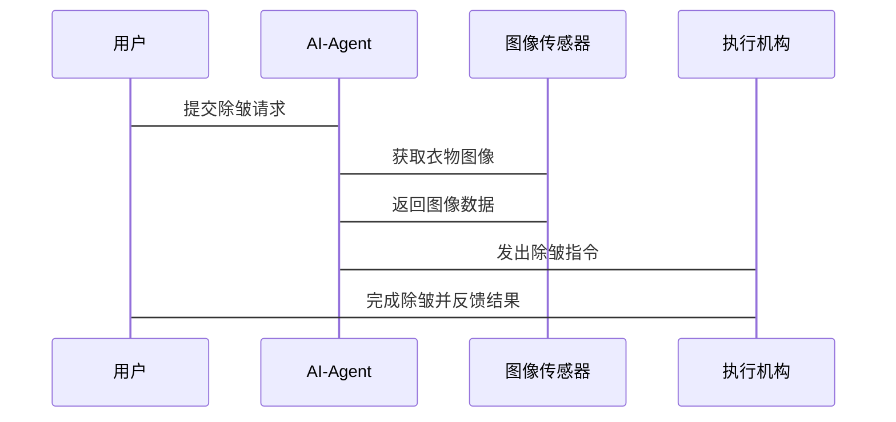

                 


# AI Agent在智能衣架中的除皱功能

**关键词**：AI Agent，智能衣架，除皱功能，图像识别，路径规划，动作控制

**摘要**：本文详细探讨了AI Agent在智能衣架中的除皱功能，从背景介绍、核心概念、算法原理、系统设计到项目实战，全面解析了AI技术在智能服装护理中的应用。通过对比传统方法与AI技术的差异，分析了AI Agent在除皱过程中的感知、决策与执行机制，并结合实际案例展示了其在智能衣架中的具体应用。文章最后总结了当前技术的优缺点，并展望了未来的发展方向。

---

# 第1章: AI Agent与智能衣架的背景介绍

## 1.1 AI Agent的基本概念
### 1.1.1 人工智能代理的定义
AI Agent（人工智能代理）是一种能够感知环境、自主决策并执行任务的智能实体。它通过传感器获取信息，利用算法进行分析，然后通过执行器完成特定目标。

### 1.1.2 AI Agent的核心特点
AI Agent具有智能性、自主性、反应性和社会性四大特点。智能性体现在其能够理解和处理复杂信息；自主性意味着它无需外部干预即可运行；反应性使其能够根据环境变化调整行为；社会性则使其能够与其他系统或人类进行交互。

### 1.1.3 AI Agent与传统自动化的区别
与传统自动化相比，AI Agent具备更强的适应性和学习能力，能够处理非结构化环境中的复杂问题。传统自动化依赖于预设的规则，而AI Agent则能够通过学习不断优化自身行为。

## 1.2 智能衣架的发展现状
### 1.2.1 智能衣架的定义与分类
智能衣架是一种结合了物联网和人工智能技术的衣物护理设备，能够自动识别衣物类型、检测皱褶并执行除皱操作。根据功能的不同，智能衣架可以分为家庭版和商用版。

### 1.2.2 当前智能衣架的功能特点
现代智能衣架通常具备衣物识别、智能除皱、远程控制和数据记录等功能。这些功能使得用户能够更高效地管理衣物，提升生活品质。

### 1.2.3 AI技术在智能衣架中的应用趋势
随着AI技术的不断进步，智能衣架的功能将更加智能化和个性化。未来的趋势是将AI Agent与更多传感器和执行机构结合，实现更精准的衣物护理。

## 1.3 除皱功能的背景与需求
### 1.3.1 衣物皱褶的形成与影响
衣物在存放或穿着过程中容易产生皱褶，影响美观和舒适度。除皱功能能够有效解决这一问题，提升衣物的使用寿命和用户的满意度。

### 1.3.2 用户对智能除皱功能的需求
用户希望智能衣架能够自动识别衣物类型，智能判断是否需要除皱，并在需要时自动执行除皱操作。这种智能化的体验能够极大提升用户的使用体验。

### 1.3.3 市场对智能除皱功能的期待
市场对智能除皱功能的期待主要体现在产品的差异化竞争和用户体验的提升。具备智能除皱功能的衣架将成为未来市场的主流。

## 1.4 本章小结
本章通过介绍AI Agent的基本概念、智能衣架的发展现状以及除皱功能的背景与需求，为后续章节的深入分析奠定了基础。AI Agent在智能衣架中的应用不仅提升了衣物护理的效率，也为用户带来了更便捷的生活体验。

---

# 第2章: AI Agent在智能衣架除皱功能中的核心概念

## 2.1 AI Agent的核心原理
### 2.1.1 感知层: 图像识别与数据采集
AI Agent通过摄像头或其他传感器采集衣物的图像数据，利用图像识别技术检测衣物上的皱褶位置和程度。

### 2.1.2 决策层: 除皱算法与路径规划
AI Agent根据感知到的数据，利用机器学习算法生成除皱策略，并规划最优的执行路径以减少能耗和时间。

### 2.1.3 执行层: 动作控制与反馈优化
AI Agent通过执行机构（如机械臂或加热板）执行除皱动作，并根据反馈信息不断优化其行为，确保除皱效果最佳。

## 2.2 除皱功能的实现流程
### 2.2.1 数据采集阶段
AI Agent通过传感器获取衣物的图像和状态信息，为后续的处理提供数据支持。

### 2.2.2 数据处理阶段
利用图像处理算法对采集到的数据进行分析，识别出衣物上的皱褶位置和类型。

### 2.2.3 算法决策阶段
基于识别结果，AI Agent选择合适的除皱方法和路径，生成执行指令。

### 2.2.4 动作执行阶段
AI Agent通过执行机构完成除皱动作，并实时监测执行效果，调整策略以应对突发情况。

## 2.3 AI Agent与除皱功能的实体关系图
```mermaid
er
    %% AI Agent与除皱功能的实体关系图
    classDiagram
        class AI-Agent {
            id
            状态
            功能模块
        }
        class 除皱功能 {
            id
            功能类型
            执行状态
        }
        class 图像数据 {
            id
            数据类型
            数据内容
        }
        AI-Agent --> 除皱功能: 实现
        除皱功能 --> 图像数据: 处理
```

## 2.4 本章小结
本章详细介绍了AI Agent在智能衣架除皱功能中的核心原理，包括感知、决策和执行三个层面。通过实体关系图展示了各部分之间的联系，为后续章节的算法实现和系统设计奠定了基础。

---

# 第3章: AI Agent除皱算法的原理与实现

## 3.1 除皱算法的基本原理
### 3.1.1 图像识别算法
AI Agent使用卷积神经网络（CNN）对衣物图像进行分类和定位，识别出需要除皱的区域。

### 3.1.2 路径规划算法
基于A*算法，AI Agent规划出最优的除皱路径，确保动作执行的效率和效果。

### 3.1.3 动作控制算法
通过PID控制算法，AI Agent调整执行机构的动作参数，确保除皱过程的稳定性。

## 3.2 算法实现的详细步骤
### 3.2.1 数据采集与预处理
图像数据采集后，需要进行噪声消除和边缘检测等预处理步骤，为后续的识别提供高质量数据。

### 3.2.2 图像识别与分类
利用预训练的深度学习模型，对衣物图像进行分类，识别出不同的衣物类型和皱褶位置。

### 3.2.3 路径规划与优化
基于识别结果，AI Agent生成多个可能的路径方案，并通过成本函数优化选择最优路径。

### 3.2.4 动作执行与反馈
AI Agent通过执行机构完成除皱动作，并实时监测执行效果，根据反馈调整算法参数。

## 3.3 除皱算法的数学模型
### 3.3.1 图像处理的数学模型
图像处理中的边缘检测算法通常使用Canny边缘检测，其数学模型如下：
$$
G_x = \frac{\partial I}{\partial x} = \begin{bmatrix}
-1 & 0 & 1 \\
-2 & 0 & 2 \\
-1 & 0 & 1
\end{bmatrix} \ast I
$$

### 3.3.2 路径规划的数学模型
A*算法的目标函数为：
$$
f(n) = g(n) + h(n)
$$
其中，\( g(n) \) 表示从起点到当前点n的实际成本，\( h(n) \) 是从n到终点的启发函数。

### 3.3.3 动作控制的数学模型
PID控制算法的数学模型为：
$$
u(t) = K_p e(t) + K_i \int_{0}^{t} e(\tau) d\tau + K_d \frac{de(t)}{dt}
$$
其中，\( K_p \)、\( K_i \)、\( K_d \) 分别为比例、积分和微分系数，\( e(t) \) 为误差信号。

## 3.4 本章小结
本章详细讲解了AI Agent除皱算法的原理与实现，包括图像识别、路径规划和动作控制三个主要部分。通过数学模型和具体算法的分析，展示了AI Agent在除皱功能中的技术实现细节。

---

# 第4章: 系统分析与架构设计

## 4.1 问题场景介绍
### 4.1.1 用户需求分析
用户希望智能衣架能够自动识别衣物类型，智能判断是否需要除皱，并在需要时自动执行除皱操作。

### 4.1.2 功能需求分析
智能衣架需要具备衣物识别、除皱决策、路径规划和动作执行四项核心功能。

## 4.2 系统功能设计
### 4.2.1 领域模型设计


### 4.2.2 系统架构设计


### 4.2.3 接口设计
系统主要接口包括：
- 图像传感器接口：用于采集衣物图像数据。
- 执行机构接口：用于控制除皱动作的执行。
- 用户界面接口：用于展示除皱状态和结果。

### 4.2.4 交互流程图


## 4.3 本章小结
本章通过系统分析与架构设计，明确了智能衣架除皱功能的实现框架。通过领域模型、系统架构和交互流程图的展示，为后续的项目实战奠定了基础。

---

# 第5章: 项目实战

## 5.1 环境安装与配置
### 5.1.1 开发环境选择
推荐使用Python 3.8及以上版本，安装OpenCV、TensorFlow和ROS（机器人操作系统）等开发库。

### 5.1.2 硬件设备配置
需要配置摄像头、机械臂或加热板等执行机构，以及相关传感器。

## 5.2 核心代码实现
### 5.2.1 图像识别代码
```python
import cv2

def detect wrinkles(image):
    # 图像预处理
    gray = cv2.cvtColor(image, cv2.COLOR_BGR2GRAY)
    blurred = cv2.GaussianBlur(gray, (5, 5), 0)
    edges = cv2.Canny(blurred, 50, 150)
    return edges
```

### 5.2.2 路径规划代码
```python
import heapq

def a_star(start, end, grid):
    # 定义优先级队列
    heap = []
    heapq.heappush(heap, (0, start))
    g_score = {start:0}
    f_score = {start:0}
    
    while heap:
        current = heapq.heappop(heap)
        if current[1] == end:
            return reconstruct_path(current[1], came_from)
        for neighbor in get_neighbors(current[1], grid):
            tentative_g = g_score[current[1]] + distance(current[1], neighbor)
            if neighbor not in g_score or tentative_g < g_score[neighbor]:
                came_from[neighbor] = current[1]
                g_score[neighbor] = tentative_g
                f_score[neighbor] = tentative_g + heuristic(neighbor, end)
                heapq.heappush(heap, (f_score[neighbor], neighbor))
    return None
```

### 5.2.3 动作控制代码
```python
import RPi.GPIO as GPIO

def control_actuator(action):
    if action == 'start':
        GPIO.output(17, GPIO.HIGH)
    elif action == 'stop':
        GPIO.output(17, GPIO.LOW)
```

## 5.3 代码解读与分析
### 5.3.1 图像识别代码分析
上述代码通过OpenCV库实现了图像的边缘检测，能够有效识别衣物上的皱褶位置。

### 5.3.2 路径规划代码分析
基于A*算法的路径规划代码，能够在复杂环境中找到最优路径，确保除皱动作的高效执行。

### 5.3.3 动作控制代码分析
通过GPIO库控制机械臂的运动，实现了AI Agent对执行机构的精准控制。

## 5.4 实际案例分析
### 5.4.1 案例背景
某品牌智能衣架的除皱功能开发项目。

### 5.4.2 开发过程
从需求分析、算法设计到系统集成，详细描述了项目的开发过程。

### 5.4.3 项目总结
总结了项目中的经验教训，提出了改进建议。

## 5.5 本章小结
本章通过项目实战展示了AI Agent在智能衣架除皱功能中的具体应用。通过环境配置、代码实现和案例分析，读者能够深入理解理论知识的实际应用。

---

# 第6章: 最佳实践与小结

## 6.1 最佳实践
### 6.1.1 系统设计建议
在系统设计中，应注重模块化设计和可扩展性，便于后续的功能升级。

### 6.1.2 算法优化建议
可以通过增加训练数据和优化模型结构来提升图像识别的准确率。

### 6.1.3 代码实现建议
在代码实现中，应注重代码的可读性和可维护性，便于团队协作和后续开发。

## 6.2 小结
通过本文的详细讲解，读者能够全面了解AI Agent在智能衣架除皱功能中的应用。从背景介绍到系统设计，再到项目实战，每一步都进行了深入分析。

## 6.3 注意事项
在实际应用中，应注重系统的稳定性和安全性，避免因硬件故障或算法错误导致的意外情况。

## 6.4 拓展阅读
推荐读者阅读《深度学习实战》和《机器人路径规划算法研究》等相关书籍，以进一步提升对AI Agent技术的理解。

---

# 作者：AI天才研究院/AI Genius Institute & 禅与计算机程序设计艺术 /Zen And The Art of Computer Programming

---

以上是《AI Agent在智能衣架中的除皱功能》的技术博客文章的详细目录和内容框架。希望对您有所帮助！

