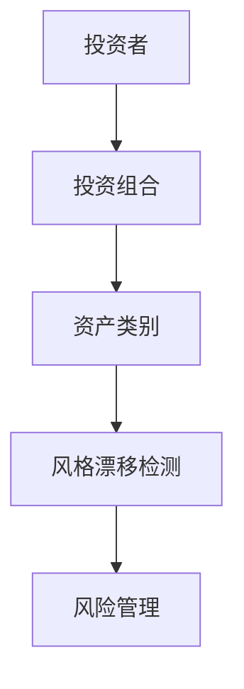
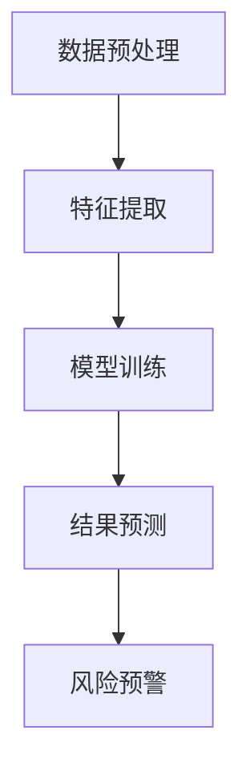
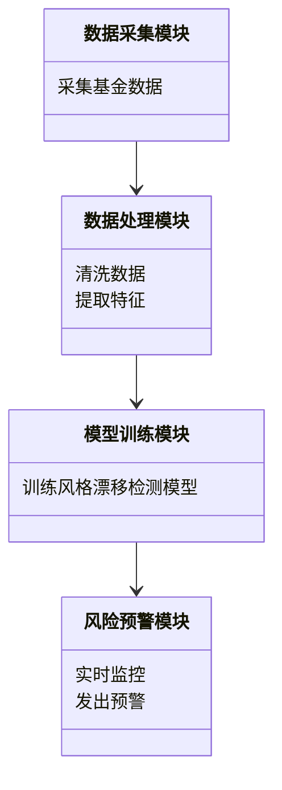
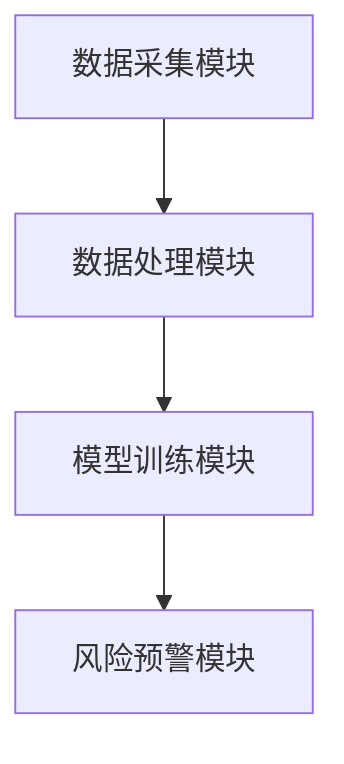
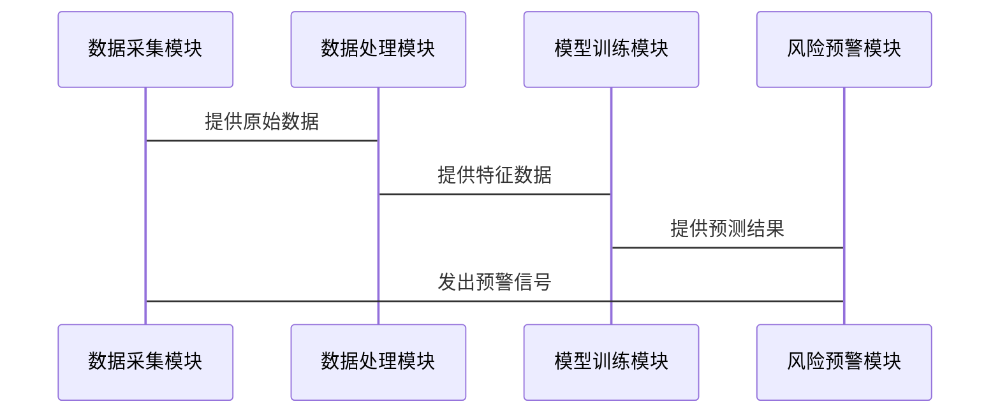

                 


# AI辅助的对冲基金风格漂移检测

> 关键词：对冲基金，风格漂移，AI，风险管理，机器学习，深度学习

> 摘要：本文详细探讨了利用人工智能技术辅助对冲基金风格漂移检测的方法与实现。通过分析风格漂移的核心概念、算法原理、系统架构以及实际应用案例，展示了如何利用AI技术提升对冲基金的风险管理能力。文章内容涵盖背景介绍、核心概念、算法实现、系统设计、项目实战以及最佳实践，为对冲基金行业在AI时代的风险管理提供了新的思路和解决方案。

---

# 第一部分: 背景与概念

## 第1章: 对冲基金与风格漂移概述

### 1.1 对冲基金的基本概念

#### 1.1.1 对冲基金的定义
对冲基金是一种通过利用市场套利、资产定价错误和风险对冲来实现投资收益的金融工具。它通常采用多空策略，既投资于上涨的资产，也投资于下跌的资产。

#### 1.1.2 对冲基金的主要策略
- **多空策略**：同时做多和做空相关资产，以对冲市场风险。
- **套利策略**：利用资产价格差异进行无风险或低风险套利。
- **事件驱动策略**：基于公司并购、重组等事件进行投资。

#### 1.1.3 对冲基金在金融市场的角色
对冲基金通过市场中性策略降低市场波动性，同时为投资者提供稳定的收益。

### 1.2 风格漂移的定义与影响

#### 1.2.1 风格漂移的定义
风格漂移是指对冲基金的投资策略或资产配置偏离其既定的投资目标或风格的现象。

#### 1.2.2 风格漂移的常见类型
- **策略漂移**：投资策略发生重大变化，偏离初始目标。
- **资产配置漂移**：资产分配比例与原计划不符。
- **风险敞口漂移**：风险暴露程度与预期不符。

#### 1.2.3 风格漂移对投资组合的影响
- **收益波动**：风格漂移可能导致投资收益偏离预期。
- **风险失控**：偏离初始策略可能增加投资组合的风险。
- **信任危机**：风格漂移会影响投资者对基金的信任。

### 1.3 AI技术在金融领域的应用前景

#### 1.3.1 AI在金融分析中的作用
AI技术能够通过大数据分析、模式识别和预测模型，帮助金融机构进行更精准的投资决策。

#### 1.3.2 AI在对冲基金中的潜在应用
- **交易决策支持**：利用AI进行实时数据分析和预测。
- **风险管理**：通过AI技术实时监控和预警风险。
- **策略优化**：利用机器学习优化投资策略。

#### 1.3.3 风险管理与AI的结合
AI技术能够实时监控市场变化，快速识别潜在风险，帮助对冲基金实现更高效的风格漂移检测。

### 1.4 本章小结
本章介绍了对冲基金的基本概念、风格漂移的定义与影响，以及AI技术在金融领域的应用前景。通过对冲基金的风格漂移检测，可以有效降低投资风险，提升投资收益。

---

## 第2章: 风格漂移检测的核心概念

### 2.1 风格漂移检测的定义与目标

#### 2.1.1 风格漂移检测的定义
风格漂移检测是指通过分析对冲基金的投资策略、资产配置和风险敞口，识别其是否偏离预定投资目标的过程。

#### 2.1.2 风格漂移检测的目标
- **实时监控**：持续跟踪基金的投资策略和资产配置。
- **风险预警**：及时发现潜在的风格漂移风险。
- **策略调整**：根据检测结果调整投资策略。

### 2.2 风格漂移检测的核心要素

#### 2.2.1 投资策略的稳定性
- **稳定性定义**：基金的投资策略是否稳定，是否存在重大调整。
- **稳定性评估**：通过历史数据和AI模型评估策略的稳定性。

#### 2.2.2 组合构成的变化
- **资产配置分析**：分析基金的资产分布是否偏离预期。
- **风险敞口分析**：评估基金的风险暴露是否与预期一致。

#### 2.2.3 市场环境的影响
- **市场周期分析**：不同市场环境下风格漂移的敏感性。
- **宏观经济因素**：宏观经济指标对风格漂移的影响。

### 2.3 风格漂移检测的边界与外延

#### 2.3.1 风格漂移的边界条件
- **时间范围**：风格漂移检测的时间窗口。
- **波动范围**：偏离预定目标的阈值。

#### 2.3.2 风格漂移的外延范围
- **相关性分析**：分析风格漂移与其他风险因素的关系。
- **影响范围**：评估风格漂移对投资组合的潜在影响。

#### 2.3.3 风格漂移与其他风险的关系
- **流动性风险**：风格漂移可能影响基金的流动性。
- **信用风险**：资产配置漂移可能导致信用风险上升。

### 2.4 本章小结
本章详细介绍了风格漂移检测的核心概念，包括定义、目标、核心要素以及边界与外延。通过对冲基金的风格漂移检测，可以有效识别和管理投资风险。

---

## 第3章: AI辅助风格漂移检测的核心概念与联系

### 3.1 AI技术在风格漂移检测中的作用

#### 3.1.1 AI技术的优势
- **数据处理能力**：AI能够快速处理大量金融数据。
- **模式识别能力**：通过机器学习算法识别风格漂移的模式。
- **实时监控能力**：AI可以实时监控市场变化和基金行为。

#### 3.1.2 AI技术的局限性
- **数据依赖性**：AI模型的准确性依赖于数据质量和数量。
- **模型解释性**：部分AI模型的黑箱特性可能影响解释性。

### 3.2 核心概念的原理与联系

#### 3.2.1 数据流的处理流程
1. 数据收集：获取基金的投资策略、资产配置和市场表现数据。
2. 数据清洗：处理缺失值、异常值。
3. 数据特征提取：提取关键特征用于风格漂移检测。
4. 数据建模：使用机器学习模型进行风格漂移预测。

#### 3.2.2 AI模型的输入输出关系
- **输入**：基金的历史数据、市场数据。
- **输出**：风格漂移的预警信号。

#### 3.2.3 检测结果的反馈机制
- **反馈输入**：将检测结果反馈到数据流中，优化模型。
- **反馈输出**：根据检测结果调整投资策略。

### 3.3 核心概念的属性特征对比

#### 3.3.1 不同检测方法的对比
| 检测方法 | 优点 | 缺点 |
|----------|------|------|
| 基于统计的方法 | 简单易行 | 易受噪声干扰 |
| 基于机器学习的方法 | 高准确性 | 需大量数据支持 |
| 基于深度学习的方法 | 强大学习能力 | 计算资源需求高 |

#### 3.3.2 不同模型的性能对比
| 模型类型 | 准确率 | 计算效率 |
|----------|--------|----------|
| 线性回归 | 中等 | 高 |
| 支持向量机 | 高 | 中等 |
| 神经网络 | 高 | 低 |

#### 3.3.3 不同数据源的特征对比
| 数据源 | 特征 | 适用场景 |
|--------|------|-----------|
| 历史数据 | 稳定性 | 长期趋势分析 |
| 实时数据 | 及时性 | 短期风险预警 |

### 3.4 ER实体关系图


### 3.5 本章小结
本章分析了AI技术在风格漂移检测中的作用，详细对比了不同方法和模型的优缺点，并通过ER实体关系图展示了核心概念之间的联系。

---

## 第4章: AI辅助风格漂移检测的算法原理

### 4.1 机器学习算法在风格漂移检测中的应用

#### 4.1.1 传统机器学习算法
- **线性回归**：用于预测风格漂移的趋势。
- **支持向量机（SVM）**：用于分类风格漂移和非风格漂移的情况。
- **随机森林**：用于特征重要性分析和分类。

#### 4.1.2 深度学习算法
- **神经网络**：用于复杂非线性关系的学习。
- **LSTM网络**：用于时间序列数据的分析。

#### 4.1.3 聚类分析与异常检测
- **聚类分析**：将基金分成不同类别，识别异常行为。
- **异常检测**：通过无监督学习识别风格漂移。

### 4.2 风格漂移检测的算法流程

#### 4.2.1 算法流程图


#### 4.2.2 数学模型与公式
- **线性回归模型**：$$ y = \beta_0 + \beta_1x + \epsilon $$
- **支持向量机模型**：$$ \text{maximize} \sum_{i=1}^n C_i (y_i - \text{sign}(\omega \cdot x_i + b)) $$
- **神经网络模型**：$$ \text{激活函数} = \sigma(wx + b) $$

#### 4.2.3 举例说明
假设我们有以下数据：
| 资产配置 | 风险敞口 | 标签（是否漂移） |
|----------|----------|-----------------|
| 0.6      | 0.8      | 0               |
| 0.5      | 0.7      | 1               |

通过训练模型，我们可以预测新的资产配置和风险敞口是否会导致风格漂移。

### 4.3 本章小结
本章详细介绍了机器学习和深度学习算法在风格漂移检测中的应用，包括算法流程、数学模型和举例说明。

---

## 第5章: 系统分析与架构设计方案

### 5.1 问题场景介绍

#### 5.1.1 系统目标
开发一个基于AI的风格漂移检测系统，实时监控对冲基金的投资策略和资产配置。

#### 5.1.2 系统范围
- 数据采集模块：采集基金的历史和实时数据。
- 数据处理模块：清洗和特征提取。
- 模型训练模块：训练风格漂移检测模型。
- 风险预警模块：实时监控并发出预警信号。

### 5.2 系统功能设计

#### 5.2.1 领域模型


#### 5.2.2 系统架构设计


#### 5.2.3 系统接口设计
- 数据接口：与数据源对接，获取基金数据。
- 模型接口：与第三方AI平台对接，调用训练好的模型。
- 预警接口：与投资管理系统对接，发送风险预警信号。

#### 5.2.4 系统交互流程图


### 5.3 本章小结
本章详细描述了AI辅助风格漂移检测系统的架构设计，包括功能模块、系统交互流程和接口设计。

---

## 第6章: 项目实战

### 6.1 环境安装

#### 6.1.1 安装Python环境
```bash
pip install python3
pip install numpy
pip install pandas
pip install scikit-learn
pip install keras
pip install tensorflow
```

#### 6.1.2 安装AI框架
```bash
pip install tensorflow
pip install keras
pip install scikit-learn
```

### 6.2 系统核心实现源代码

#### 6.2.1 数据预处理代码
```python
import pandas as pd
import numpy as np

# 数据加载
data = pd.read_csv('fund_data.csv')

# 数据清洗
data = data.dropna()
data = data.drop_duplicates()

# 特征提取
features = data[['asset_allocation', 'risk_exposure']]
labels = data['drift_label']
```

#### 6.2.2 模型训练代码
```python
from sklearn.model import SVC

# 模型训练
model = SVC()
model.fit(features, labels)

# 模型预测
predictions = model.predict(new_features)
```

#### 6.2.3 风险预警代码
```python
from sklearn.metrics import accuracy_score

# 模型评估
accuracy = accuracy_score(labels, predictions)
print(f"模型准确率：{accuracy}")
```

### 6.3 代码应用解读与分析

#### 6.3.1 数据预处理
- 数据清洗：删除缺失值和重复值。
- 特征提取：提取资产分配和风险敞口作为关键特征。

#### 6.3.2 模型训练
- 使用支持向量机模型进行分类训练，区分风格漂移和非风格漂移情况。

#### 6.3.3 模型评估
- 使用准确率评估模型性能，确保模型能够有效识别风格漂移。

### 6.4 实际案例分析

#### 6.4.1 数据来源
假设我们有以下数据：
| 资产配置 | 风险敞口 | 标签（是否漂移） |
|----------|----------|-----------------|
| 0.6      | 0.8      | 0               |
| 0.5      | 0.7      | 1               |

#### 6.4.2 模型训练
通过训练模型，我们可以得到一个能够预测风格漂移的分类器。

#### 6.4.3 结果讨论
- 如果模型准确率高，说明能够有效识别风格漂移。
- 如果准确率低，可能需要调整模型参数或增加更多特征。

### 6.5 本章小结
本章通过实际案例展示了AI辅助风格漂移检测系统的实现过程，包括环境安装、代码实现和结果分析。

---

## 第7章: 最佳实践

### 7.1 小结

- AI技术在风格漂移检测中的应用能够显著提升风险管理能力。
- 通过机器学习和深度学习算法，可以实现高精度的风格漂移检测。

### 7.2 注意事项

- 数据质量是模型性能的关键，需确保数据的准确性和完整性。
- 模型解释性可能影响实际应用，需选择合适的模型。
- 风险预警机制需与投资管理系统无缝对接，确保及时响应。

### 7.3 拓展阅读

- 《机器学习实战》：了解机器学习的基本概念和实现方法。
- 《深度学习》：深入理解深度学习的原理和应用。
- 《风险管理与对冲基金》：掌握对冲基金的风险管理策略。

### 7.4 本章小结
本章总结了AI辅助风格漂移检测的关键点，并提出了实际应用中的注意事项和拓展阅读方向。

---

# 作者：AI天才研究院/AI Genius Institute & 禅与计算机程序设计艺术 /Zen And The Art of Computer Programming

---

以上是《AI辅助的对冲基金风格漂移检测》的技术博客文章的完整目录和内容概览。

