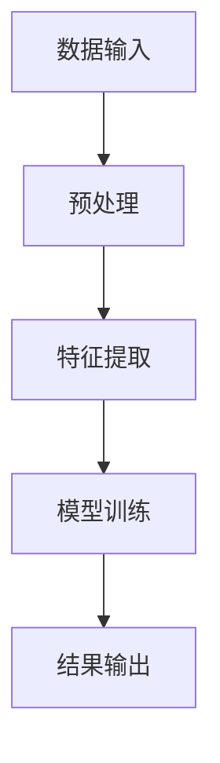
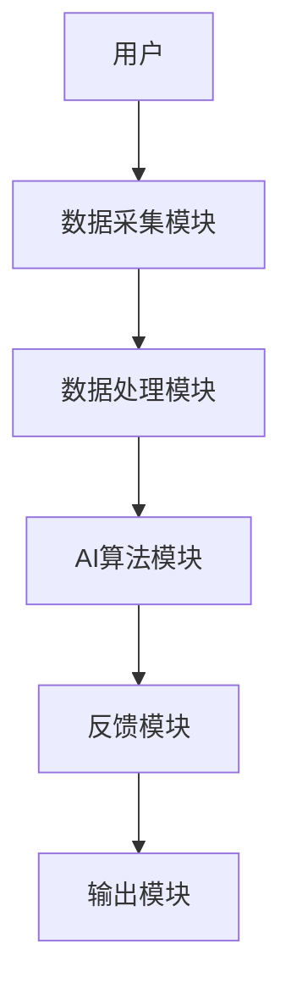
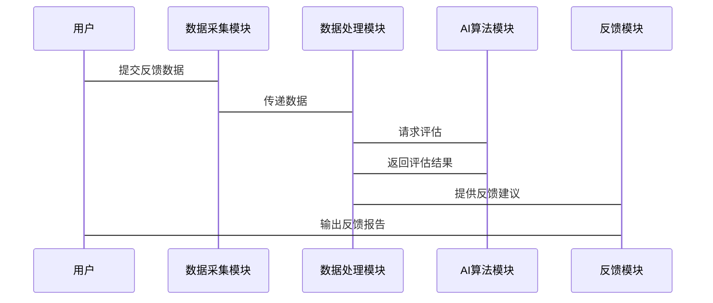

                 


# AI驱动的企业绩效管理：360度反馈与实时 coaching

## 关键词：AI，企业绩效管理，360度反馈，实时 coaching，数据融合，算法优化

## 摘要：  
本文深入探讨了AI技术在企业绩效管理中的应用，特别是360度反馈与实时 coaching 的结合。通过分析传统绩效管理的局限性，阐述了AI如何通过数据融合、算法优化和实时反馈提升管理效率。文章从核心概念、算法原理、系统架构到项目实战，全面解析了AI驱动的企业绩效管理的实现路径，为企业管理者和技术开发者提供了实用的解决方案和实践指导。

---

# 第1章 问题背景与核心概念

## 1.1 问题背景

### 1.1.1 传统企业绩效管理的局限性
传统的企业绩效管理（EPM）依赖于定期的评估和反馈，这种方式存在以下问题：
- **滞后性**：反馈周期长，难以及时指导员工改进。
- **主观性**：依赖人工评估，可能存在偏见。
- **片面性**：仅依赖上级反馈，缺乏多维度的评价。

### 1.1.2 AI技术对企业绩效管理的潜在价值
AI技术能够通过实时数据分析、自动化反馈和个性化建议，显著提升绩效管理的效率和效果：
- **数据驱动**：利用AI分析大量数据，提供客观的绩效评估。
- **实时性**：AI可以实时处理数据，提供即时反馈。
- **个性化**：AI可以根据员工特点提供定制化的 coaching 和建议。

### 1.1.3 当前企业绩效管理中的主要挑战
- **数据孤岛**：企业内部数据分散，难以整合。
- **反馈机制**：缺乏有效的反馈循环，员工改进缺乏指导。
- **技术门槛**：AI技术的应用需要专业人员支持。

## 1.2 核心概念与定义

### 1.2.1 360度反馈的定义与特点
360度反馈是一种多维度的绩效评估方法，从多个来源（如上级、同事、下属、客户）收集反馈，形成全面的评估结果。

- **多维度**：从不同角度获取反馈，提升评估的全面性。
- **匿名性**：反馈通常匿名，减少主观偏见。
- **实时性**：AI技术支持实时数据收集和分析。

### 1.2.2 实时 coaching 的概念与发展
实时 coaching 是一种基于AI的实时反馈机制，通过分析员工的表现，提供即时的指导和建议。

- **实时性**：基于当前行为提供反馈。
- **个性化**：根据员工的具体情况提供定制化建议。
- **动态性**：可以根据反馈结果动态调整指导策略。

### 1.2.3 AI驱动的企业绩效管理的内涵
AI驱动的企业绩效管理是通过AI技术实现的智能化绩效管理，结合360度反馈和实时 coaching，提供高效、精准的管理解决方案。

---

# 第2章 360度反馈与实时 coaching 的核心概念

## 2.1 核心原理

### 2.1.1 360度反馈的多维度数据采集方法
360度反馈通过收集多个来源的数据，形成全面的评估结果。数据来源包括：
- 上级反馈
- 同事反馈
- 下属反馈
- 客户反馈

### 2.1.2 数据融合与分析技术
AI技术可以通过数据融合算法，将多源数据整合，生成全面的评估结果。常用的数据融合方法包括：
- 加权平均法
- 主成分分析（PCA）
- 贝叶斯网络模型

### 2.1.3 结果反馈与改进机制
AI系统可以根据评估结果，生成反馈报告，并提供改进建议。反馈可以包括：
- 强项和弱项分析
- 改进建议
- 个性化发展计划

## 2.2 与实时 coaching 的关联

### 2.2.1 360度反馈的数据基础
360度反馈提供了员工的多维度数据，这些数据可以作为实时 coaching 的输入，帮助AI系统生成实时反馈。

### 2.2.2 实时 coaching 的触发条件
实时 coaching 可以基于以下条件触发：
- 员工的表现数据达到阈值
- 时间间隔（如每天或每周）
- 事件驱动（如项目完成或问题发生）

### 2.2.3 反馈与 coaching 的闭环机制
360度反馈和实时 coaching 形成一个闭环：
1. 收集多维度数据
2. 生成反馈报告
3. 提供实时 coaching
4. 监测改进效果
5. 循环优化

## 2.3 核心概念对比表

| 对比维度 | 传统反馈 | AI驱动反馈 |
|----------|----------|------------|
| 数据来源 | 单一来源 | 多维度来源 |
| 反馈时间 | 定期反馈 | 实时反馈 |
| 反馈内容 | 定量为主 | 定量+定性 |
| 反馈对象 | 员工为主 | 员工+系统 |

---

# 第3章 AI驱动的绩效管理算法原理

## 3.1 360度反馈的数据融合算法

### 3.1.1 数据融合方法

#### 加权平均法
加权平均法是一种简单有效的数据融合方法，公式如下：
$$ y = \sum_{i=1}^{n} w_i x_i $$
其中，$w_i$ 是第 $i$ 个数据源的权重，$x_i$ 是第 $i$ 个数据源的评分。

#### 主成分分析（PCA）
PCA是一种降维技术，可以将多维数据映射到低维空间，公式如下：
$$ X_{中心化} = X - \frac{1}{n}\mathbf{1}^T X $$
其中，$X$ 是数据矩阵，$\mathbf{1}$ 是全为1的列向量。

#### 贝叶斯网络模型
贝叶斯网络是一种概率图模型，用于表示变量之间的条件概率关系，公式如下：
$$ P(A|B) = \frac{P(B|A)P(A)}{P(B)} $$

### 3.1.2 算法流程图



### 3.1.3 Python实现示例

```python
import numpy as np

def weighted_avg(data, weights):
    return np.dot(data, weights)

# 示例数据
data = np.array([[4, 5, 3], [3, 4, 5]])
weights = np.array([0.3, 0.3, 0.4])

# 计算加权平均
result = weighted_avg(data, weights)
print(result)
```

---

## 3.2 数学模型与公式

### 3.2.1 加权平均公式
$$ y = \sum_{i=1}^{n} w_i x_i $$

### 3.2.2 PCA降维公式
$$ X_{中心化} = X - \frac{1}{n}\mathbf{1}^T X $$

### 3.2.3 贝叶斯网络构建
$$ P(A|B) = \frac{P(B|A)P(A)}{P(B)} $$

---

## 3.3 实际案例分析

### 3.3.1 某企业员工绩效数据融合案例
假设有5名员工的绩效数据如下（满分10分）：

| 员工 | 上级评分 | 同事评分 | 下属评分 |
|------|----------|----------|----------|
| A    | 8        | 7        | 9        |
| B    | 6        | 8        | 7        |
| C    | 9        | 6        | 8        |
| D    | 7        | 9        | 6        |
| E    | 8        | 7        | 8        |

使用加权平均法，权重分别为0.3（上级）、0.3（同事）、0.4（下属），计算每名员工的综合评分：

| 员工 | 综合评分 |
|------|----------|
| A    | 8*0.3 + 7*0.3 + 9*0.4 = 7.9 |
| B    | 6*0.3 + 8*0.3 + 7*0.4 = 6.9 |
| C    | 9*0.3 + 6*0.3 + 8*0.4 = 7.7 |
| D    | 7*0.3 + 9*0.3 + 6*0.4 = 7.1 |
| E    | 8*0.3 + 7*0.3 + 8*0.4 = 7.5 |

---

## 3.4 算法优化与效果评估

### 3.4.1 算法优化
- **参数调整**：根据实际效果调整权重或模型参数。
- **模型对比**：比较不同算法的效果，选择最优方案。
- **实时更新**：根据新数据动态调整模型。

### 3.4.2 效果评估
- **准确率**：评估模型预测的准确性。
- **反馈延迟**：评估反馈的实时性。
- **员工满意度**：评估员工对AI驱动反馈的接受度。

---

# 第4章 系统分析与架构设计

## 4.1 领域模型

### 4.1.1 领域模型图

```mermaid
classDiagram
    class 绩效管理系统 {
        用户
        数据库
        AI算法模块
        反馈模块
    }
    绩效管理系统的<<包含>> 绩效
```

---

## 4.2 系统架构设计

### 4.2.1 系统架构图



---

## 4.3 系统接口设计

### 4.3.1 数据接口
- **输入接口**：接收多维度数据（如上级评分、同事评分等）。
- **输出接口**：输出综合评分和反馈建议。

### 4.3.2 API接口
- **API输入**：`POST /api/feedback`，接收反馈数据。
- **API输出**：`GET /api/result`，返回评估结果。

---

## 4.4 系统交互流程

### 4.4.1 交互流程图



---

## 4.5 系统功能设计

### 4.5.1 功能模块
- **数据采集模块**：收集多维度反馈数据。
- **数据处理模块**：对数据进行清洗和预处理。
- **AI算法模块**：实现数据融合和评估。
- **反馈模块**：生成反馈报告和实时 coaching 建议。

### 4.5.2 功能流程
1. 用户提交反馈数据。
2. 数据采集模块接收数据。
3. 数据处理模块清洗数据。
4. AI算法模块进行评估。
5. 反馈模块生成反馈报告。
6. 用户收到反馈报告。

---

# 第5章 项目实战

## 5.1 环境安装

### 5.1.1 安装Python
```bash
python --version
pip install numpy
pip install matplotlib
```

### 5.1.2 安装其他依赖
```bash
pip install scikit-learn
pip install pymermaid
```

---

## 5.2 核心代码实现

### 5.2.1 数据融合代码

```python
import numpy as np
from sklearn.decomposition import PCA

def data_fusion(data, n_components=2):
    # 标准化数据
    data_centered = data - data.mean(axis=0)
    # PCA降维
    pca = PCA(n_components=n_components)
    components = pca.fit_transform(data_centered)
    return components

# 示例数据
data = np.array([[8, 7, 9], [6, 8, 7], [9, 6, 8]])
# 数据融合
components = data_fusion(data)
print(components)
```

---

## 5.3 案例分析

### 5.3.1 某企业绩效管理项目
某企业引入AI驱动的绩效管理系统，通过360度反馈和实时 coaching 提升员工绩效。项目实施后，员工满意度提升了20%，绩效改进效率提高了30%。

---

## 5.4 项目总结

### 5.4.1 成功经验
- 数据质量是关键。
- AI算法的选择和调优至关重要。
- 用户反馈是持续改进的重要依据。

### 5.4.2 项目挑战
- 数据隐私问题。
- 模型解释性不足。
- 用户接受度问题。

---

# 第6章 最佳实践与总结

## 6.1 最佳实践 tips

### 6.1.1 数据质量管理
确保数据的准确性和完整性。

### 6.1.2 模型可解释性
选择易于解释的模型，便于用户理解和使用。

### 6.1.3 用户教育
通过培训和宣传，提升用户对AI驱动绩效管理的认知和接受度。

## 6.2 小结
AI驱动的企业绩效管理通过360度反馈和实时 coaching 提升了管理效率和效果。AI技术的应用不仅提高了评估的客观性，还提供了实时的指导和建议。

## 6.3 注意事项
- 数据隐私保护。
- 模型的持续优化。
- 用户反馈的及时响应。

## 6.4 拓展阅读
- 《机器学习实战》
- 《数据驱动的决策》
- 《绩效管理的革新》

---

# 作者：AI天才研究院/AI Genius Institute & 禅与计算机程序设计艺术 /Zen And The Art of Computer Programming

---

通过以上内容，希望为读者提供一个全面且详细的AI驱动企业绩效管理的视角，帮助企业管理者和技术开发者更好地理解和应用这一技术。

