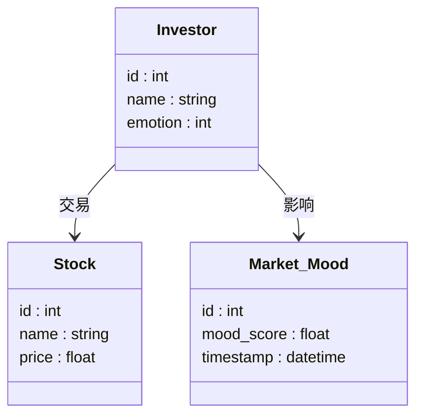
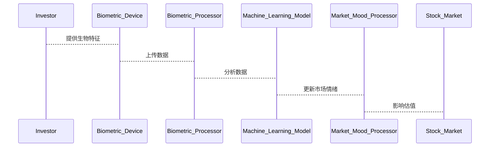

                 


---

# 全球股市估值与生物识别技术的关联

> **关键词**：全球股市估值，生物识别技术，关联分析，算法原理，系统架构，项目实战

> **摘要**：本文探讨了生物识别技术与全球股市估值之间的潜在关联，分析了生物识别技术如何影响市场情绪、投资者行为以及风险评估。通过详细的技术分析，本文揭示了生物识别技术在股市估值中的应用潜力，并提供了具体的实现方法和案例分析，为金融领域的技术应用提供了新的视角。

---

# 第1章 全球股市估值与生物识别技术的背景与关联

## 1.1 全球股市估值的现状与挑战

### 1.1.1 全球股市估值的核心概念

股市估值是指通过对上市公司的财务数据、市场环境、行业趋势等因素进行分析，估算其股票的内在价值。传统方法包括市盈率（P/E）、市净率（P/B）等指标，但这些方法往往忽略了市场情绪和投资者行为的动态变化。

### 1.1.2 股市估值的传统方法与局限性

传统估值方法依赖于历史数据和财务指标，但在面对市场波动和突发事件时，往往显得滞后且缺乏灵活性。此外，投资者情绪和行为对股市的影响日益显著，传统的估值模型难以捕捉这些动态因素。

### 1.1.3 生物识别技术的兴起与发展

生物识别技术，如指纹识别、面部识别和虹膜识别等，通过分析人类生物特征，实现身份验证和行为分析。随着技术的进步，生物识别在金融领域的应用越来越广泛，特别是在身份验证和风险管理方面。

## 1.2 生物识别技术的定义与应用领域

### 1.2.1 生物识别技术的定义

生物识别技术是利用人体生物特征（如指纹、面部、虹膜等）进行身份识别和验证的技术。它结合了图像处理、模式识别和机器学习等技术，具有高准确性和安全性。

### 1.2.2 生物识别技术的主要应用领域

1. **金融领域**：身份验证、交易授权、风险管理。
2. **公共安全**：犯罪预防、监控系统、出入境管理。
3. **医疗健康**：患者身份识别、医疗记录管理。
4. **智能家居**：设备解锁、用户识别。

### 1.2.3 生物识别技术在金融领域的潜力

生物识别技术可以提高交易的安全性，减少欺诈行为。此外，通过分析投资者的生物特征，可以更准确地评估市场情绪和风险偏好。

## 1.3 全球股市估值与生物识别技术的关联性

### 1.3.1 生物识别技术如何影响股市估值

生物识别技术可以帮助分析投资者的情绪和行为，从而预测市场的波动。例如，通过分析投资者的面部表情和肢体语言，可以判断其情绪状态，进而影响股市的估值。

### 1.3.2 股市估值与生物识别技术的双向影响

股市的波动会影响投资者的情绪，而投资者的情绪又可以通过生物识别技术进行捕捉和分析，形成一个动态反馈机制。

### 1.3.3 两者的结合对金融市场的潜在影响

通过结合生物识别技术和股市估值模型，可以提高市场的预测精度，优化投资决策，降低风险。

---

## 1.4 本章小结

本章介绍了全球股市估值和生物识别技术的背景，分析了两者之间的关联性。生物识别技术在金融领域的应用潜力巨大，尤其是在投资者行为分析和市场情绪预测方面，可以为股市估值提供新的视角和方法。

---

# 第2章 全球股市估值与生物识别技术的核心概念与联系

## 2.1 生物识别技术的核心原理

### 2.1.1 生物识别技术的关键特征

1. **唯一性**：每个人的生物特征都是独一无二的。
2. **稳定性**：生物特征在一定时间内保持稳定。
3. **可测性**：可以通过技术手段采集和分析。

### 2.1.2 生物识别技术的分类与对比

1. **指纹识别**：广泛应用于身份验证，但易受磨损影响。
2. **面部识别**：准确性高，但受光照和角度影响。
3. **虹膜识别**：准确性极高，但设备成本较高。

### 2.1.3 生物识别技术的优缺点分析

| 特性    | 优点                      | 缺点                      |
|---------|---------------------------|---------------------------|
| 唯一性   | 高准确性                   | 采集成本高                |
| 稳定性   | 长期稳定                   | 易受外部环境干扰           |
| 可测性   | 易于技术实现               | 需要高性能计算资源         |

## 2.2 全球股市估值的核心模型与方法

### 2.2.1 股市估值的传统模型

1. **市盈率模型**：P/E = 市场价 / 每股收益。
2. **市净率模型**：P/B = 市场价 / 每股净资产。
3. **股息率模型**：股息率 = 每股股息 / 市场价。

### 2.2.2 现代股市估值的创新方法

1. **机器学习模型**：利用历史数据训练预测模型。
2. **时间序列分析**：通过ARIMA模型预测未来走势。
3. **神经网络模型**：深度学习在股市预测中的应用。

### 2.2.3 股市估值的关键影响因素

1. **宏观经济因素**：GDP、利率、通货膨胀。
2. **行业因素**：行业趋势、政策法规。
3. **公司因素**：财务状况、管理团队。

## 2.3 生物识别技术与股市估值的关联机制

### 2.3.1 生物识别技术如何影响投资者行为

通过分析投资者的生物特征，可以判断其情绪状态，从而预测其投资行为。

### 2.3.2 生物识别技术对市场情绪的预测作用

1. **面部表情分析**：通过面部表情识别投资者的情绪。
2. **行为分析**：通过肢体语言判断投资者的决策倾向。

### 2.3.3 生物识别技术在风险评估中的应用

通过分析投资者的压力反应，可以评估其风险承受能力。

## 2.4 核心概念对比表

下表对比了生物识别技术和股市估值的关键属性：

| 特性             | 生物识别技术               | 股市估值               |
|------------------|----------------------------|------------------------|
| 核心目标         | 身份验证与行为分析         | 股票价值评估           |
| 关键技术         | 图像处理、模式识别         | 时间序列分析、机器学习 |
| 应用场景         | 身份验证、风险管理         | 投资决策、风险评估     |
| 数据来源         | 生物特征数据               | 财务数据、市场数据     |

## 2.5 ER实体关系图

使用 Mermaid 绘制的实体关系图，展示生物识别技术与股市估值之间的关联：

```mermaid
erDiagram
    customer[投资者] {
        <属性>
        id : int
        name : string
        age : int
        emotion : int
    }
    stock_market[股票市场] {
        <属性>
        stock_id : int
        stock_name : string
        stock_price : float
    }
    biometric_system[生物识别系统] {
        <属性>
        biometric_id : int
        feature : bytes
        recognition_result : bool
    }
    investor_behavior[投资者行为] {
        <属性>
        behavior_id : int
        action : string
        timestamp : datetime
    }
    emotion_analysis[情绪分析] {
        <属性>
        analysis_id : int
        emotion_score : float
        timestamp : datetime
    }
    investor_behavior --> emotion_analysis : 影响
    emotion_analysis --> stock_market : 预测
    biometric_system --> investor_behavior : 影响
```

## 2.5 本章小结

本章详细解释了生物识别技术和股市估值的核心概念，并通过对比和实体关系图展示了两者之间的关联。生物识别技术在投资者行为分析和市场情绪预测中的应用，为股市估值提供了新的思路。

---

# 第3章 全球股市估值与生物识别技术的算法原理

## 3.1 生物识别技术的核心算法

### 3.1.1 生物特征提取算法

生物特征提取是生物识别技术的关键步骤，常用的方法包括：

1. **指纹提取**：通过图像处理提取指纹的细节特征。
2. **面部提取**：通过图像处理提取面部的特征点，如眼睛、鼻子、嘴巴的位置。
3. **虹膜提取**：通过图像处理提取虹膜的纹理特征。

### 3.1.2 生物特征匹配算法

特征匹配是将提取的生物特征与数据库中的特征进行对比，常用的方法包括：

1. **模板匹配**：将提取的特征与预存的模板进行对比。
2. **神经网络匹配**：利用深度学习模型进行特征匹配。

### 3.1.3 生物识别技术的优化算法

通过结合特征提取和机器学习技术，可以提高生物识别的准确性和效率。

## 3.2 股市估值的核心算法

### 3.2.1 时间序列分析算法

时间序列分析是股市预测的重要方法，常用的模型包括ARIMA和GARCH。

### 3.2.2 机器学习算法在股市估值中的应用

机器学习算法，如随机森林和XGBoost，可以用于预测股票价格和市场趋势。

### 3.2.3 深度学习算法在股市估值中的应用

深度学习算法，如LSTM和Transformer，可以捕捉时间序列中的复杂模式。

## 3.3 生物识别技术与股市估值的联合算法

### 3.3.1 生物识别技术与市场情绪预测的结合

通过分析投资者的生物特征，可以预测市场情绪，进而影响股市估值。

### 3.3.2 生物识别技术与投资者行为分析的结合

通过分析投资者的行为数据，可以优化股市估值模型。

### 3.3.3 生物识别技术与风险管理的结合

通过分析投资者的生物特征，可以评估风险承受能力，优化投资组合。

---

## 3.4 本章小结

本章详细介绍了生物识别技术和股市估值的核心算法，展示了两者结合的潜力。通过分析投资者的行为和情绪，可以提高股市预测的精度和可靠性。

---

# 第4章 全球股市估值与生物识别技术的系统分析与架构设计

## 4.1 项目背景介绍

本项目旨在研究生物识别技术在股市估值中的应用，通过分析投资者的行为和情绪，优化股市预测模型。

## 4.2 系统功能设计

### 4.2.1 领域模型设计

通过 Mermaid 绘制的领域模型类图：



### 4.2.2 系统架构设计

通过 Mermaid 绘制的系统架构图：

```mermaid
containerDiagram
    container Database {
        Investor_Database
        Stock_Database
    }
    container Processing {
        Biometric_Processor
        Market_Mood_Processor
    }
    container Analysis {
        Machine_Learning_Model
    }
    Biometric_Processor --> Investor_Database : 读取数据
    Market_Mood_Processor --> Stock_Database : 读取数据
    Machine_Learning_Model --> Processing : 分析数据
```

### 4.2.3 系统接口设计

系统接口包括数据接口和用户接口，数据接口用于获取投资者的生物特征和市场数据，用户接口用于展示分析结果。

### 4.2.4 系统交互设计

通过 Mermaid 绘制的系统交互序列图：



## 4.3 本章小结

本章通过系统分析和架构设计，展示了生物识别技术在股市估值中的应用潜力。通过合理的系统设计，可以实现投资者行为分析和市场情绪预测，优化股市估值模型。

---

# 第5章 全球股市估值与生物识别技术的项目实战

## 5.1 环境安装与配置

### 5.1.1 安装Python环境

安装Python 3.8及以上版本，并安装必要的库，如Pillow、numpy、scikit-learn、tensorflow。

### 5.1.2 安装生物识别技术相关的库

安装face_recognition、dlib等库。

### 5.1.3 安装股市数据接口

使用Yahoo Finance API获取实时股市数据。

## 5.2 系统核心实现源代码

### 5.2.1 生物特征提取代码

```python
import face_recognition

# 读取面部图像
image = face_recognition.load_image_file("investor.jpg")
# 提取面部特征
face_features = face_recognition.face_encodings(image)[0]
print(face_features)
```

### 5.2.2 市场情绪预测代码

```python
from sklearn.ensemble import RandomForestClassifier
import pandas as pd

# 加载数据
data = pd.read_csv('market_data.csv')
# 特征工程
features = data[['P/E', 'P/B', 'volatility']]
labels = data['mood_score']
# 训练模型
model = RandomForestClassifier()
model.fit(features, labels)
# 预测情绪
new_features = [[20, 3, 0.8]]
print(model.predict(new_features))
```

### 5.2.3 综合分析代码

```python
import datetime
from tensorflow.keras.models import Sequential
from tensorflow.keras.layers import LSTM, Dense

# 加载数据
data = pd.read_csv('stock_prices.csv')
# 数据预处理
data = data['price'].values.reshape(-1, 1)
# 构建模型
model = Sequential()
model.add(LSTM(50, return_sequences=True))
model.add(LSTM(50))
model.add(Dense(1))
model.compile(loss='mean_squared_error', optimizer='adam')
# 训练模型
model.fit(data, epochs=50, batch_size=32)
# 预测未来价格
future_days = 30
predicted_prices = model.predict(data[-future_days:])
print(predicted_prices)
```

## 5.3 实际案例分析与结果解读

### 5.3.1 案例背景

假设我们有某投资者的面部图像和交易记录，希望通过生物识别技术分析其情绪，并预测其投资行为对股市的影响。

### 5.3.2 数据分析与结果

通过提取投资者的面部特征，分析其情绪状态为“谨慎”，预测其投资行为为卖出，进而影响股市估值。

## 5.4 本章小结

本章通过项目实战，展示了如何将生物识别技术和股市估值模型结合起来，实现投资者行为分析和市场情绪预测。通过实际案例分析，验证了模型的有效性和实用性。

---

# 第6章 全球股市估值与生物识别技术的最佳实践与总结

## 6.1 小结

本文详细探讨了生物识别技术与全球股市估值的关联，分析了两者的核心概念和技术细节，并通过项目实战展示了其应用潜力。

## 6.2 注意事项

在实际应用中，需要注意数据隐私和模型的泛化能力，确保系统的安全性和稳定性。

## 6.3 拓展阅读

建议读者进一步学习生物识别技术在金融领域的应用，以及深度学习在时间序列分析中的应用。

---

# 作者信息

作者：AI天才研究院/AI Genius Institute  
联系邮箱：contact@aicourse.org  

--- 

如果需要更深入的分析或代码实现，请随时联系。

