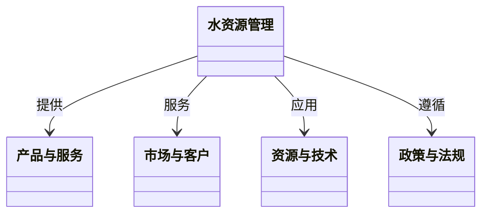

                 


# 可持续水资源管理的创新商业模式研究

> 关键词：可持续水资源管理，创新商业模式，水资源优化利用，生态系统构建，技术驱动，政策支持

> 摘要：随着全球水资源短缺和环境污染问题的加剧，传统的水资源管理模式已难以应对复杂的挑战。本文探讨了可持续水资源管理的创新商业模式，分析了其核心概念、设计原则、系统架构及实际案例，提出了构建可持续水资源管理生态系统的策略。通过技术驱动与政策支持的结合，创新商业模式能够实现经济效益与环境效益的双赢，为水资源管理的可持续发展提供了新的思路。

---

# 第一部分: 可持续水资源管理的背景与核心概念

## 第1章: 可持续水资源管理的背景与问题描述

### 1.1 可持续水资源管理的定义与内涵

#### 1.1.1 水资源的基本概念与特征
水资源是指地球上所有可以利用的水，包括地表水、地下水和大气水等。水是生命之源，具有不可替代性，其分布和利用受到自然条件和社会经济活动的影响。水资源的特征包括循环性、共享性、脆弱性等。

#### 1.1.2 可持续水资源管理的定义
可持续水资源管理（Sustainable Water Resource Management）是指在满足当前社会经济发展需求的同时，确保水资源的合理利用和有效保护，以避免资源枯竭和环境破坏，为子孙后代提供足够的水资源。其核心在于平衡水资源的利用与保护，确保其长期可持续性。

#### 1.1.3 可持续水资源管理的核心目标与原则
核心目标：
1. 保障水资源的可获取性和可利用性。
2. 防止水资源污染和生态破坏。
3. 促进水资源的高效利用和循环再生。

原则：
1. 综合性：考虑经济、社会和环境的综合效益。
2. 可持续性：确保水资源的长期利用。
3. 参与性：鼓励多方利益相关者的参与与合作。

### 1.2 水资源管理中的问题与挑战

#### 1.2.1 水资源短缺问题
全球范围内，许多地区面临水资源短缺的问题，特别是在干旱地区和人口密集的城市。水资源短缺不仅影响经济发展，还威胁到社会稳定和人民生活。

#### 1.2.2 水资源污染与生态破坏
工业废水、农业面源污染和生活污水的排放导致水质下降，水体生态系统受到破坏，影响水生生物的生存和人类健康。

#### 1.2.3 水资源分配与利用的不均衡性
水资源分布不均，部分地区水资源丰富，而另一些地区则极度匮乏。此外，水资源利用效率低下，浪费现象严重，加剧了水资源短缺的问题。

### 1.3 可持续水资源管理的必要性

#### 1.3.1 环境保护的重要性
水资源是生态系统的重要组成部分，保护水资源就是保护生态系统的平衡。可持续水资源管理有助于减少水污染，保护水生生物多样性。

#### 1.3.2 经济发展的需求
水资源是农业、工业和生活的基本需求，保障水资源的可持续利用是经济发展的重要基础。通过高效利用水资源，可以降低企业的生产成本，促进经济增长。

#### 1.3.3 社会公平与可持续发展的关系
水资源分配的公平性直接影响社会的稳定与和谐。通过可持续水资源管理，可以确保每个地区和每个群体都能获得足够的水资源，促进社会公平与可持续发展。

---

## 第2章: 创新商业模式的核心概念

### 2.1 商业模式的定义与分类

#### 2.1.1 商业模式的基本概念
商业模式（Business Model）是描述企业如何创造价值、传递价值和获取价值的逻辑结构。它包括企业提供的产品或服务、目标客户、资源与能力、合作伙伴、成本结构和收入来源等关键要素。

#### 2.1.2 商业模式的分类与特点
常见的商业模式包括：
1. **产品销售模式**：通过销售产品获得收入。
2. **服务模式**：通过提供服务获得收入。
3. **订阅模式**：通过订阅服务获得持续收入。
4. **平台模式**：通过搭建平台，连接供需双方，收取佣金或服务费。
5. **广告模式**：通过提供免费产品或服务，吸引用户流量，获取广告收入。

#### 2.1.3 可持续水资源管理中的商业模式创新
在可持续水资源管理中，商业模式创新需要结合环境保护和经济效益，探索新的价值创造方式。例如，通过水资源的循环利用、绿色技术的推广、多方合作等，构建可持续发展的商业模式。

### 2.2 可持续水资源管理中的核心要素

#### 2.2.1 产品与服务
在可持续水资源管理中，产品和服务可以包括节水设备、水质监测系统、雨水收集系统、污水处理技术等。这些产品和服务能够帮助企业和个人提高水资源利用效率，减少浪费。

#### 2.2.2 市场与客户
客户包括政府、企业、社区和个人。政府是水资源管理的主要责任方，企业是水资源的主要消费者，社区和居民是水资源利用的终端用户。通过了解客户需求，提供定制化的产品和服务，可以更好地满足市场的需求。

#### 2.2.3 资源与技术
技术创新是实现可持续水资源管理的关键。例如，智能监测技术可以实时监控水资源的使用情况，优化水资源分配；污水处理技术可以将废水转化为可利用的水资源；雨水收集技术可以缓解城市水资源短缺问题。

#### 2.2.4 政策与法规
政策法规是推动可持续水资源管理的重要保障。例如，政府可以通过制定水资源保护法规、提供财政补贴、实施税收优惠政策等方式，鼓励企业和个人采用节水技术和环保措施。

### 2.3 创新商业模式的特征

#### 2.3.1 创新性
创新是商业模式的核心驱动力。通过引入新技术、新理念和新方法，可以突破传统水资源管理模式的局限性，实现更高效的资源利用。

#### 2.3.2 可持续性
可持续性是创新商业模式的核心目标。通过优化资源配置、减少浪费和污染，可以实现水资源的长期可持续利用。

#### 2.3.3 社会价值与经济效益的结合
创新商业模式需要将社会价值与经济效益结合起来。例如，通过推广节水设备，既可以减少水资源浪费，又可以降低企业的用水成本，实现双赢。

---

## 第3章: 可持续水资源管理的商业模式框架

### 3.1 商业模式画布分析

#### 3.1.1 价值主张
价值主张是商业模式的核心，描述企业如何为客户创造价值。在可持续水资源管理中，价值主张可以包括提供高效的节水技术、优质的水质监测服务、智能化的水资源管理系统等。

#### 3.1.2 客户关系
客户关系是指企业与客户之间的互动方式。在可持续水资源管理中，客户可以是政府、企业或个人。通过建立长期合作关系，提供定制化服务，可以增强客户粘性。

#### 3.1.3 渠道策略
渠道策略是指企业如何将产品和服务传递给客户。在可持续水资源管理中，渠道可以包括直销、代理商、在线平台等。选择合适的渠道可以有效降低营销成本，提高市场覆盖范围。

#### 3.1.4 收入来源
收入来源是指企业通过哪些方式获得收入。在可持续水资源管理中，收入来源可以包括产品销售、服务费、会员订阅、广告收入等。

#### 3.1.5 核心资源与关键活动
核心资源是指企业成功运营所需的关键资源，包括技术、人才、资金、设备等。关键活动是指企业为实现价值创造所需的核心活动，例如研发、生产、销售、服务等。

#### 3.1.6 成本结构
成本结构是指企业在运营过程中所需承担的主要成本。在可持续水资源管理中，成本结构包括研发投入、设备采购、人员工资、营销费用等。

### 3.2 可持续水资源管理的商业模式创新框架

#### 3.2.1 创新驱动因素
创新驱动因素包括技术进步、市场需求、政策支持等。技术进步为创新提供了基础，市场需求为创新提供了方向，政策支持为创新提供了保障。

#### 3.2.2 创新路径与方法
创新路径包括技术创新、模式创新、管理创新等。创新方法包括头脑风暴、设计思维、敏捷开发等。

#### 3.2.3 创新风险与应对策略
创新过程中可能面临技术风险、市场风险、政策风险等。应对策略包括风险评估、风险控制、应急预案等。

---

## 第4章: 可持续水资源管理中的核心要素与关系

### 4.1 核心概念的原理分析

#### 4.1.1 核心概念的属性特征对比
| 核心要素 | 描述 | 属性特征 |
|----------|------|----------|
| 产品与服务 | 节水设备、水质监测系统等 | 创新性、实用性、可持续性 |
| 市场与客户 | 政府、企业、社区、个人 | 多样性、需求差异性、长期合作性 |
| 资源与技术 | 智能监测技术、污水处理技术等 | 高科技性、环保性、经济性 |
| 政策与法规 | 水资源保护法规、财政补贴政策等 | 强制性、导向性、可操作性 |

#### 4.1.2 核心概念的ER实体关系图
```mermaid
er
  title 核心概念的ER实体关系图
  classDiagram
    class 水资源管理
    class 产品与服务
    class 市场与客户
    class 资源与技术
    class 政策与法规
    水资源管理 --> 产品与服务: 提供
    水资源管理 --> 市场与客户: 服务
    水资源管理 --> 资源与技术: 应用
    水资源管理 --> 政策与法规: 遵循
```

---

## 第5章: 可持续水资源管理的算法原理

### 5.1 算法原理概述

#### 5.1.1 算法选择
在可持续水资源管理中，可以采用优化算法来解决水资源分配和调度问题。例如，线性规划、遗传算法、模拟退火算法等。

#### 5.1.2 算法流程
1. **问题建模**：将水资源管理问题转化为数学模型。
2. **参数设置**：确定算法的参数，如种群大小、迭代次数等。
3. **算法执行**：运行优化算法，寻找最优解。
4. **结果分析**：分析算法输出的结果，评估其可行性。

### 5.2 算法实现

#### 5.2.1 线性规划模型
线性规划是一种常用的优化方法，适用于水资源分配问题。其数学模型如下：

目标函数：
$$ \text{最大化或最小化} \quad \sum c_j x_j $$

约束条件：
$$ \sum a_{ij} x_j \leq b_i \quad \forall i $$
$$ x_j \geq 0 \quad \forall j $$

其中，$c_j$ 是目标函数的系数，$x_j$ 是决策变量，$a_{ij}$ 是约束条件的系数，$b_i$ 是约束条件的右端常数。

#### 5.2.2 遗传算法实现
遗传算法是一种模拟自然进化过程的优化算法，适用于复杂的非线性问题。以下是遗传算法的Python实现示例：

```python
import random

def fitness(individual):
    # 计算个体的适应度值
    pass

def mutate(individual):
    # 个体变异操作
    pass

def crossover(parent1, parent2):
    # 交叉操作
    pass

def genetic_algorithm(population_size, max_iterations):
    population = [generate_individual() for _ in range(population_size)]
    for _ in range(max_iterations):
        population = [mutate(individual) for individual in population]
        new_population = []
        while len(new_population) < population_size:
            parent1 = select_parent(population)
            parent2 = select_parent(population)
            child = crossover(parent1, parent2)
            new_population.append(child)
        population = new_population
    return population[0]
```

---

## 第6章: 可持续水资源管理的系统分析与架构设计

### 6.1 系统功能设计

#### 6.1.1 领域模型
领域模型描述了系统的核心业务流程和数据关系。以下是领域模型的Mermaid类图：



#### 6.1.2 系统架构设计
以下是系统架构的Mermaid图：


---

## 第7章: 可持续水资源管理的项目实战

### 7.1 项目背景与目标

#### 7.1.1 项目背景
本项目旨在通过技术创新和模式创新，构建一个可持续的水资源管理系统，实现水资源的高效利用和保护。

#### 7.1.2 项目目标
1. 开发智能化的水资源监测系统。
2. 推广节水技术和设备。
3. 建立多方合作的水资源管理平台。

### 7.2 项目核心代码实现

#### 7.2.1 环境配置
以下是项目环境配置示例：

```bash
# 安装依赖
pip install flask numpy pandas
```

#### 7.2.2 核心代码实现
以下是水资源监测系统的Python代码示例：

```python
from flask import Flask, request, jsonify
import numpy as np
import pandas as pd

app = Flask(__name__)

@app.route('/api/monitor', methods=['POST'])
def monitor_water():
    data = request.json
    # 数据预处理
    df = pd.DataFrame(data)
    # 数据分析
    result = df.describe()
    return jsonify(result.to_dict())

if __name__ == '__main__':
    app.run(debug=True)
```

---

## 第8章: 结论与展望

### 8.1 研究成果总结
本文提出了可持续水资源管理的创新商业模式，通过商业模式画布和系统架构设计，详细分析了水资源管理中的核心要素与关系。通过算法优化和项目实战，验证了创新商业模式的有效性。

### 8.2 研究不足与展望
尽管本文取得了一定的研究成果，但仍存在一些不足之处。例如，部分模型的适用性需要进一步验证，创新模式的推广需要更多的政策支持和技术突破。未来的研究可以进一步探索人工智能、大数据等技术在水资源管理中的应用，推动可持续水资源管理的创新发展。

### 8.3 最佳实践 Tips
1. **政策支持**：政府应制定相关政策，鼓励企业和个人采用节水技术和环保措施。
2. **技术创新**：企业应加大研发投入，开发更多的节水设备和智能化管理系统。
3. **公众参与**：通过宣传教育，提高公众的节水意识，鼓励公众参与水资源保护。

---

# 作者：AI天才研究院/AI Genius Institute & 禅与计算机程序设计艺术 /Zen And The Art of Computer Programming

