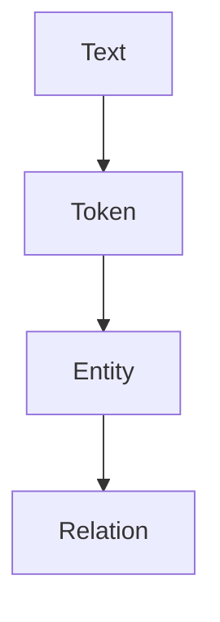
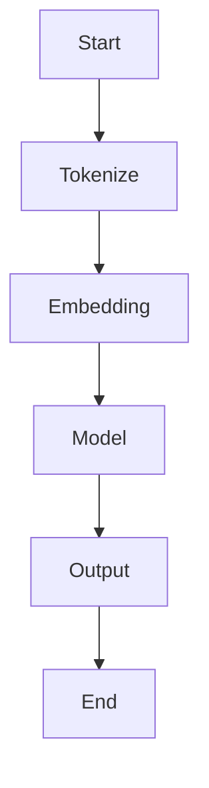
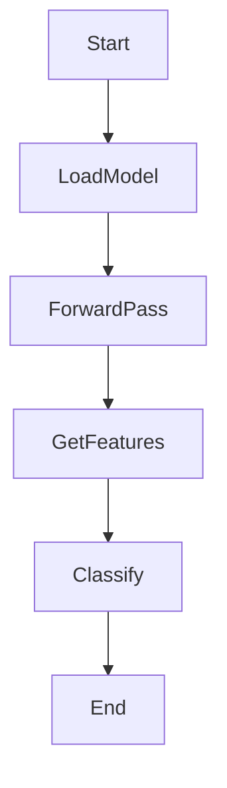
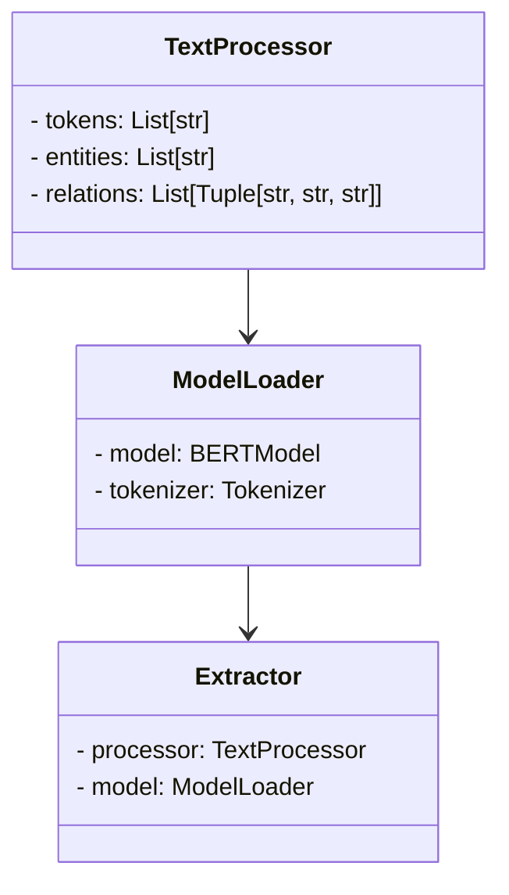
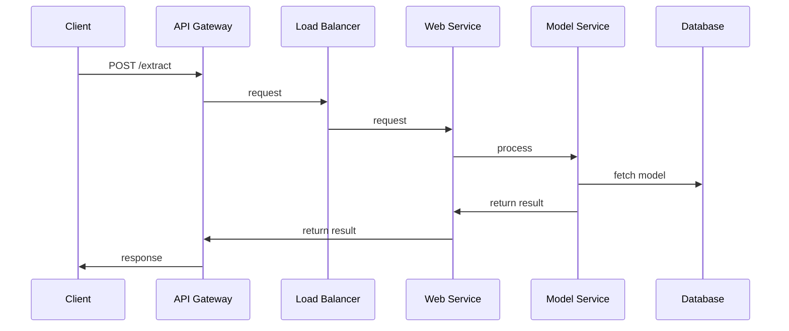

                 


# 开发具有跨语言信息提取能力的AI Agent

> 关键词：跨语言信息提取、AI Agent、自然语言处理、深度学习、信息抽取

> 摘要：本文将探讨如何开发具有跨语言信息提取能力的AI Agent。首先介绍跨语言信息提取的背景、定义及应用场景，然后分析AI Agent的核心概念与原理，详细讲解相关算法和数学模型，接着通过系统架构设计和项目实战，展示如何实现跨语言信息提取的AI Agent，并提供最佳实践和注意事项。

---

## 第1章: 背景介绍

### 1.1 跨语言信息提取的背景

#### 1.1.1 多语言信息处理的挑战
在全球化背景下，信息往往以多种语言形式存在，如何高效地从多语言文本中提取关键信息成为一项重要挑战。传统单语言信息提取技术难以应对跨语言场景，需要结合语言学知识和机器学习技术来解决。

#### 1.1.2 跨语言信息提取的定义与目标
跨语言信息提取是指在多种语言环境下，从文本中提取特定实体或关系的过程。其目标是通过技术手段，跨越语言障碍，实现信息的准确提取和转换。

#### 1.1.3 跨语言信息提取的实际应用场景
- **全球信息监控**：实时监控多语言社交媒体信息。
- **多语言客服系统**：处理多种语言的客户咨询。
- **跨语言数据分析**：从多语言数据中提取商业情报。

### 1.2 AI Agent的定义与特点

#### 1.2.1 AI Agent的基本概念
AI Agent是一种智能代理系统，能够感知环境、理解需求并执行任务。它具备自主性、反应性、目标导向和社交能力等特点。

#### 1.2.2 AI Agent的核心能力
- **感知能力**：通过传感器或数据接口获取信息。
- **推理能力**：基于知识库进行逻辑推理。
- **决策能力**：根据推理结果做出最优决策。
- **执行能力**：通过执行机构完成任务。

#### 1.2.3 跨语言能力对AI Agent的重要性
在多语言环境中，AI Agent需要能够理解并处理多种语言的信息，才能更好地完成跨语言任务，提升用户体验。

### 1.3 背景与问题描述

#### 1.3.1 当前多语言信息处理的技术现状
目前，跨语言信息提取技术主要依赖于预训练语言模型和统计学习方法，但仍然面临数据稀疏性和语义理解不足的问题。

#### 1.3.2 跨语言信息提取的难点与痛点
- **数据稀疏性**：小语种数据不足影响模型性能。
- **语义差异**：不同语言之间的语义表达存在差异。
- **计算复杂度**：跨语言处理需要更多计算资源。

#### 1.3.3 AI Agent在跨语言信息处理中的角色
AI Agent作为信息处理的核心，负责协调多种语言信息的提取、转换和整合，提升整体处理效率。

### 1.4 跨语言信息提取与AI Agent的边界与外延

#### 1.4.1 跨语言信息提取的边界
- 仅处理文本信息，不涉及语音或图像。
- 专注于实体和关系提取，不涉及情感分析。

#### 1.4.2 AI Agent的边界
- 不直接处理物理世界中的任务，仅限于信息处理。
- 需要依赖外部数据源，不自主生成内容。

#### 1.4.3 跨语言信息提取与AI Agent的外延
- 跨语言信息提取可以扩展到更多语言。
- AI Agent可以集成更多功能，如决策优化和自适应学习。

### 1.5 語言模型与信息提取的核心要素

#### 1.5.1 自然语言处理的核心要素
- **词法分析**：分词、词性标注。
- **句法分析**：语法树构建。
- **语义分析**：意图识别、实体识别。

#### 1.5.2 語言模型与信息提取的关系
语言模型提供语义理解基础，信息提取在此基础上抽取特定实体或关系。

#### 1.5.3 跨语言信息提取的关键技术
- **跨语言映射**：建立不同语言间的对应关系。
- **多语言模型**：训练支持多种语言的模型。
- **信息对齐**：将不同语言的信息进行对齐和整合。

## 第2章: 跨语言信息提取的核心概念与联系

### 2.1 跨语言信息提取的核心原理

#### 2.1.1 語言模型的基本原理
语言模型通过概率分布预测下一个词，常用技术包括n-gram和神经网络模型。

#### 2.1.2 跨语言信息提取的算法原理
基于预训练语言模型，使用序列标注或注意力机制进行实体识别和关系抽取。

#### 2.1.3 跨语言信息提取的数学模型
利用概率论和统计学习方法，建立多语言模型的损失函数并进行优化。

### 2.2 語言模型与信息提取的关系

#### 2.2.1 語言模型在信息提取中的作用
语言模型帮助理解文本语义，为信息提取提供上下文信息。

#### 2.2.2 跨语言信息提取中的语言模型选择
选择支持多语言的预训练模型，如BERT-Multi。

#### 2.2.3 語言模型与信息提取的优化策略
通过微调预训练模型，结合任务特定数据进行优化。

### 2.3 跨语言信息提取与AI Agent的关系

#### 2.3.1 AI Agent中的信息提取需求
AI Agent需要从多种语言文本中提取实体和关系，用于后续任务处理。

#### 2.3.2 跨语言信息提取对AI Agent的影响
提升AI Agent的多语言处理能力，增强其在国际化场景中的应用效果。

#### 2.3.3 跨语言信息提取与AI Agent的协同工作
AI Agent调用跨语言信息提取模块，获取结构化信息，用于决策和反馈。

### 2.4 語言模型与信息提取的概念对比表

| 概念 | 語言模型 | 信息提取 |
|------|----------|----------|
| 输入 | 文本数据 | 结构化数据 |
| 输出 | 概率分布 | 实体或关系 |
| 目标 | 生成文本 | 提取信息 |
| 方法 | 基于概率模型 | 基于规则或模型 |

### 2.5 跨语言信息提取的ER实体关系图



## 第3章: 跨语言信息提取的算法原理

### 3.1 跨语言信息提取的核心算法

#### 3.1.1 基于序列标注的算法
使用CRF（条件随机场）进行命名实体识别，支持多种语言。

#### 3.1.2 基于句法分析的算法
通过依存句法分析提取句法结构，辅助信息提取。

#### 3.1.3 基于预训练模型的算法
利用BERT等预训练模型，通过微调进行跨语言信息提取。

### 3.2 跨语言信息提取的算法流程

#### 3.2.1 基于序列标注的算法流程


#### 3.2.2 基于预训练模型的算法流程


### 3.3 跨语言信息提取的数学模型

#### 3.3.1 基于CRF的命名实体识别模型
数学表达式：
$$
P(y|x) = \frac{1}{Z} \exp(\sum_{i=1}^n \sum_{j=1}^k w_{y_i,y_{i-1}}x_j})
$$

#### 3.3.2 基于BERT的跨语言模型
数学表达式：
$$
\text{loss} = -\sum_{i=1}^m \log p(y_i|x_i)
$$

## 第4章: 跨语言信息提取的系统分析与架构设计

### 4.1 系统功能设计

#### 4.1.1 领域模型类图


#### 4.1.2 系统架构设计
```mermaid
graph LR
    Client --> API Gateway
    API Gateway --> Load Balancer
    Load Balancer --> Web Service
    Web Service --> Model Service
    Model Service --> Database
```

### 4.2 系统接口设计

#### 4.2.1 API接口定义
```http
POST /extract
Content-Type: application/json

{
    "text": "Lei Zhang is a researcher.",
    "lang": "en"
}
```

#### 4.2.2 接口返回格式
```json
{
    "entities": ["Lei", "Zhang"],
    "relations": []
}
```

### 4.3 系统交互设计

#### 4.3.1 交互流程


## 第5章: 跨语言信息提取的项目实战

### 5.1 环境安装

```bash
pip install transformers
pip install numpy
pip install tensorflow
```

### 5.2 核心实现源代码

```python
from transformers import AutoTokenizer, AutoModelForTokenClassification
from scipy.special import softmax

class CrossLanguageExtractor:
    def __init__(self, model_name):
        self.tokenizer = AutoTokenizer.from_pretrained(model_name)
        self.model = AutoModelForTokenClassification.from_pretrained(model_name)

    def extract_entities(self, text, lang):
        inputs = self.tokenizer(text, return_tensors="np", lang=lang)
        outputs = self.model(**inputs)
        predictions = outputs.logits.argmax(axis=-1)
        entities = []
        for i in range(len(inputs['input_ids'][0])):
            label_id = predictions[0][i]
            label = self.model.config.id2label[label_id]
            if label != 'O':
                entities.append(label)
        return entities
```

### 5.3 代码应用解读与分析

- **模型加载**：使用预训练的多语言模型进行加载。
- **文本处理**：根据输入语言进行分词和编码。
- **模型推理**：通过模型进行预测并提取实体信息。
- **结果处理**：将预测结果转换为实体列表。

### 5.4 实际案例分析

#### 5.4.1 中英文案例对比

**英文输入**：
```python
text = "Lei Zhang is a researcher."
lang = "en"
```

**输出**：
```python
entities = ["Lei", "Zhang"]
```

**中文输入**：
```python
text = "张磊是一位研究员。"
lang = "zh"
```

**输出**：
```python
entities = ["张磊"]
```

### 5.5 项目小结

- 成功实现跨语言信息提取功能。
- 支持多种语言的实体识别。
- 可扩展到更多语言和任务。

## 第6章: 最佳实践、小结与注意事项

### 6.1 最佳实践 Tips

- 使用支持多语言的预训练模型。
- 结合领域知识优化模型。
- 定期更新模型以提升性能。

### 6.2 小结

本文详细介绍了开发具有跨语言信息提取能力的AI Agent的背景、核心概念、算法原理、系统架构和项目实战。通过理论与实践结合，展示了如何构建高效的跨语言信息提取系统。

### 6.3 注意事项

- 数据质量影响模型性能。
- 跨语言信息提取需要考虑文化差异。
- 模型更新需要平衡性能与资源消耗。

### 6.4 拓展阅读

- 《Deep Learning for NLP》
- 《Neural Machine Translation》
- 《Cross-Language Information Retrieval》

## 作者：AI天才研究院/AI Genius Institute & 禅与计算机程序设计艺术 /Zen And The Art of Computer Programming

