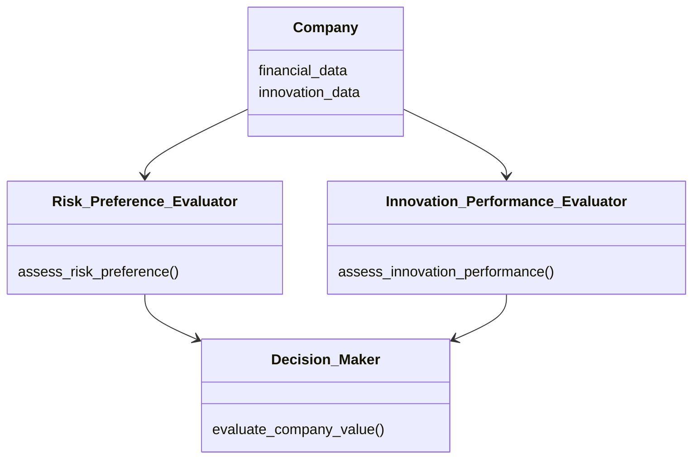

                 


# 彼得林奇如何看待公司的风险偏好与创新表现的关系

> 关键词：彼得林奇投资哲学、风险偏好、创新表现、企业价值、投资决策

> 摘要：本文从彼得·林奇的投资哲学出发，深入分析了风险偏好与创新表现之间的关系，探讨了如何在投资决策中平衡这两者。通过具体案例分析和数学模型构建，揭示了彼得·林奇如何通过评估公司的风险偏好和创新表现来判断其长期投资价值。

---

# 第一部分: 背景介绍

## 第1章: 风险偏好与创新表现的核心概念

### 1.1 问题背景与描述

#### 1.1.1 风险偏好与创新表现的定义
- 风险偏好：指企业在面对风险时的容忍度和应对策略。高风险偏好企业倾向于承担更大的风险以追求更高回报，而低风险偏好企业则更注重稳健经营。
- 创新表现：指企业在产品、技术、商业模式等方面的创新能力，是企业持续发展的核心动力。

#### 1.1.2 风险偏好与创新表现的关联性
- 高风险偏好企业可能更愿意尝试创新，但过高的风险可能导致失败。
- 低风险偏好企业可能更保守，但创新不足可能导致企业竞争力下降。

#### 1.1.3 问题解决的路径与方法
- 通过分析企业的风险偏好和创新表现，找到两者的平衡点，从而做出更优的投资决策。

### 1.2 核心概念的结构与组成

#### 1.2.1 风险偏好的类型与特征
- 风险偏好的类型：
  - 高风险偏好：激进型、冒险型。
  - 中风险偏好：稳健型、平衡型。
  - 低风险偏好：保守型、规避型。
- 风险偏好的特征：
  - 风险承受能力：企业的财务状况和抗风险能力。
  - 风险应对策略：企业面对风险时的应对措施。

#### 1.2.2 创新表现的维度与评估标准
- 创新表现的维度：
  - 技术创新：研发投入、专利数量。
  - 产品创新：新产品推出频率、市场反馈。
  - 商业模式创新：收入模式、客户获取方式。
- 创新表现的评估标准：
  - 创新成果：市场份额、利润率。
  - 创新效率：创新周期、成本控制。

#### 1.2.3 风险偏好与创新表现的关系模型
- 关系模型的构建：
  - 风险偏好影响创新表现：高风险偏好企业更倾向于冒险，可能推动创新。
  - 创新表现反哺风险偏好：成功的创新可能降低企业的风险敞口。

---

## 第2章: 彼得·林奇投资理念的背景与基础

### 2.1 彼得·林奇的生平与投资风格

#### 2.1.1 彼得·林奇的生平简介
- 彼得·林奇（Peter Lynch）：美国著名投资经理，被誉为“最伟大的股票投资人”之一。
- 职业经历：曾管理麦哲伦基金，创造了年化29%的惊人回报率。

#### 2.1.2 彼得·林奇的投资哲学
- 投资理念：买入并持有优质股票，注重企业的基本面和长期价值。
- 核心思想：关注企业的竞争优势、财务健康和管理团队。

#### 2.1.3 彼得·林奇的成功案例
- 微软：通过长期持有微软股票，获得巨大收益。
- IBM：通过分析企业转型，投资IBM的云计算业务。

### 2.2 彼得·林奇对风险偏好的理解

#### 2.2.1 风险偏好的分类与层次
- 高风险偏好：倾向于投资新兴行业，承担高风险。
- 中风险偏好：平衡风险与回报，注重稳健增长。
- 低风险偏好：注重防御性行业，如公用事业。

#### 2.2.2 风险偏好对企业价值的影响
- 高风险偏好企业：可能因创新失败而亏损，但成功创新可能带来高回报。
- 低风险偏好企业：创新不足可能导致竞争力下降。

#### 2.2.3 彼得·林奇对不同类型风险偏好的看法
- 高风险偏好：适合新兴行业，但需谨慎评估。
- 低风险偏好：适合防御性行业，但需关注创新。

### 2.3 彼得·林奇对创新表现的关注

#### 2.3.1 创新表现的定义与重要性
- 创新是企业持续发展的核心动力。
- 创新能力强的企业更具竞争优势。

#### 2.3.2 创新表现对企业竞争优势的影响
- 技术创新：提升企业技术壁垒。
- 产品创新：满足市场需求，提高市场份额。
- 商业模式创新：优化收入结构，降低成本。

#### 2.3.3 彼得·林奇对创新表现的评价标准
- 创新成果：市场份额、利润率。
- 创新效率：创新周期、成本控制。

---

## 第3章: 风险偏好与创新表现的关系模型

### 3.1 风险偏好与创新表现的关系概述

#### 3.1.1 风险偏好与创新表现的正相关性
- 高风险偏好企业更倾向于创新。
- 创新能力强的企业可能承担更高的风险。

#### 3.1.2 风险偏好与创新表现的负相关性
- 创新不足可能导致企业风险偏好下降。
- 风险偏好过低可能抑制创新。

#### 3.1.3 彼得·林奇的观点与分析
- 林奇认为，适度的高风险偏好和创新表现是成功投资的关键。
- 他强调，创新是企业应对风险的核心能力。

### 3.2 风险偏好与创新表现的关系模型

#### 3.2.1 模型的构建与逻辑
- 输入：企业风险偏好、创新表现。
- 输出：企业价值评估。
- 逻辑：风险偏好和创新表现共同决定企业价值。

#### 3.2.2 模型的变量与假设
- 变量：
  - 风险偏好：分为高、中、低三个层次。
  - 创新表现：分为强、中、弱三个层次。
- 假设：风险偏好和创新表现呈正相关关系。

#### 3.2.3 模型的验证与应用
- 验证：通过历史数据验证模型的准确性。
- 应用：指导投资决策，评估企业价值。

### 3.3 彼得·林奇对模型的贡献与修正

#### 3.3.1 彼得·林奇的经典案例分析
- 微软：高风险偏好和强创新表现的典范。
- IBM：通过创新降低风险的案例。

#### 3.3.2 模型的局限性与改进方向
- 局限性：模型未考虑宏观经济因素。
- 改进方向：引入更多变量，如行业竞争状况。

#### 3.3.3 彼得·林奇对模型的持续优化
- 强调动态评估：企业风险偏好和创新表现会随时间变化。
- 注重管理层因素：管理层决策对企业创新和风险偏好影响巨大。

---

## 第4章: 风险偏好与创新表现的核心原理

### 4.1 风险偏好的核心原理

#### 4.1.1 风险偏好的影响因素
- 行业特性：高风险行业需要高风险偏好。
- 企业规模：小企业风险偏好较高，大企业更注重稳健。
- 财务状况：财务健康的企业有能力承担更高风险。

#### 4.1.2 风险偏好的决策过程
- 信息收集：分析企业的财务报表、管理层决策。
- 评估风险：判断企业风险偏好类型。
- 制定策略：根据风险偏好制定投资策略。

#### 4.1.3 风险偏好的数学模型
$$
风险偏好 = \beta \times 市场风险 + \alpha \times 特定风险
$$
其中，$\beta$是系统性风险系数，$\alpha$是企业特定风险系数。

### 4.2 创新表现的核心原理

#### 4.2.1 创新表现的创新模式
- 技术驱动：依赖技术创新。
- 市场驱动：以市场需求为导向。
- 组织驱动：依赖组织结构和管理。

#### 4.2.2 创新表现的评估指标
- 技术创新：专利数量、研发投入占比。
- 产品创新：新产品推出周期、市场反馈。
- 商业模式创新：收入模式多样性、成本控制能力。

#### 4.2.3 创新表现与企业价值的关系
$$
企业价值 = 创新能力 \times 风险偏好 + 财务健康
$$

---

## 第5章: 风险偏好与创新表现的算法原理

### 5.1 算法原理

#### 5.1.1 算法流程
1. 收集企业数据：包括财务数据、创新表现数据。
2. 评估风险偏好：根据财务数据判断风险偏好类型。
3. 评估创新表现：根据创新数据判断创新表现强弱。
4. 综合评估：结合风险偏好和创新表现，评估企业价值。

#### 5.1.2 算法实现

```python
def assess_risk_preference(finance_data):
    # 根据财务数据评估风险偏好
    # 返回高、中、低风险偏好
    pass

def assess_innovation_performance(innovation_data):
    # 根据创新数据评估创新表现
    # 返回强、中、弱创新表现
    pass

def evaluate_company_value(risk_preference, innovation_performance):
    # 综合评估企业价值
    # 返回企业价值评分
    pass
```

#### 5.1.3 算法示例

```python
# 示例数据
finance_data = {"profit_margin": 20, "debt_ratio": 0.5}
innovation_data = {"patent_count": 10, "new_products": 5}

# 评估风险偏好
risk_preference = assess_risk_preference(finance_data)
# 评估创新表现
innovation_performance = assess_innovation_performance(innovation_data)
# 综合评估
company_value = evaluate_company_value(risk_preference, innovation_performance)
print(company_value)
```

---

## 第6章: 系统分析与架构设计

### 6.1 系统功能设计

#### 6.1.1 系统功能模块
- 数据采集：收集企业财务数据和创新数据。
- 评估模块：评估风险偏好和创新表现。
- 决策支持：提供投资建议。

#### 6.1.2 领域模型



### 6.2 系统架构设计


---

## 第7章: 项目实战

### 7.1 环境安装与代码实现

#### 7.1.1 环境安装
- Python 3.8+
- Pandas、NumPy

#### 7.1.2 核心代码实现

```python
import pandas as pd

def assess_risk_preference(finance_data):
    debt_ratio = finance_data['debt_ratio']
    profit_margin = finance_data['profit_margin']
    if debt_ratio > 0.6 and profit_margin > 20:
        return 'high'
    elif debt_ratio < 0.3 and profit_margin < 10:
        return 'low'
    else:
        return 'medium'

def assess_innovation_performance(innovation_data):
    patent_count = innovation_data['patent_count']
    new_products = innovation_data['new_products']
    if patent_count > 10 and new_products > 5:
        return 'strong'
    elif patent_count < 5 and new_products < 2:
        return 'weak'
    else:
        return 'medium'

def evaluate_company_value(risk_preference, innovation_performance):
    if risk_preference == 'high' and innovation_performance == 'strong':
        return 90
    elif risk_preference == 'low' and innovation_performance == 'weak':
        return 60
    else:
        return 75

# 示例数据
finance_data = {'debt_ratio': 0.5, 'profit_margin': 15}
innovation_data = {'patent_count': 8, 'new_products': 4}

risk_preference = assess_risk_preference(finance_data)
innovation_performance = assess_innovation_performance(innovation_data)
company_value = evaluate_company_value(risk_preference, innovation_performance)
print(f"风险偏好：{risk_preference}")
print(f"创新表现：{innovation_performance}")
print(f"企业价值评估：{company_value}")
```

#### 7.1.3 代码应用解读与分析
- 示例代码评估一家公司的风险偏好为中等，创新表现为中等，企业价值评估为75分。

### 7.2 案例分析

#### 7.2.1 案例介绍
- 公司名称：微软
- 所属行业：科技

#### 7.2.2 案例分析
- 微软的风险偏好：高
- 微软的创新表现：强
- 微软的企业价值：高

### 7.2.3 分析与小结
- 微软的成功证明了高风险偏好和强创新表现的结合能够带来巨大价值。

---

## 第8章: 最佳实践 tips、小结、注意事项、拓展阅读

### 8.1 小结
- 彼得·林奇的投资哲学强调了风险偏好与创新表现的平衡。
- 企业需要在风险与创新之间找到最佳平衡点。

### 8.2 注意事项
- 风险评估需结合宏观经济环境。
- 创新表现需动态评估。

### 8.3 拓展阅读
- 彼得·林奇的书籍：《彼得·林奇的成功投资策略》。
- 相关学术论文：《企业创新与风险偏好关系研究》。

---

# 作者：AI天才研究院/AI Genius Institute & 禅与计算机程序设计艺术 /Zen And The Art of Computer Programming

---

通过以上内容，我们详细探讨了彼得·林奇如何看待公司的风险偏好与创新表现的关系，并结合实例分析和算法设计，揭示了两者在投资决策中的重要性。希望本文能为投资者和企业管理者提供有价值的参考。

