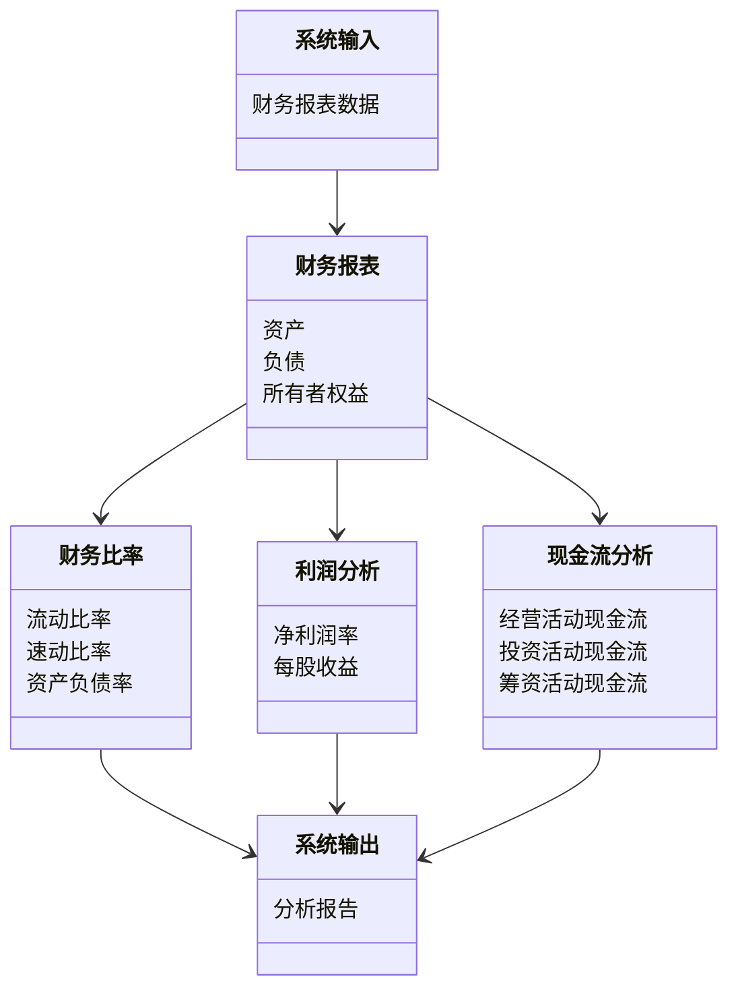

                 


# 彼得·林奇对公司财务报表质量的评估

> 关键词：财务报表，彼得·林奇，投资分析，财务健康评估，企业价值评估

> 摘要：本文详细探讨了彼得·林奇如何通过分析公司财务报表的质量来评估企业价值和投资潜力。文章从财务报表的基本概念入手，逐步分析了财务比率、利润能力和现金流量等核心指标，结合实际案例，展示了如何运用这些方法进行投资决策。文章还总结了彼得·林奇的投资理念，并提供了实用的建议和注意事项。

---

## 第一部分: 财务报表质量评估的背景与核心概念

### 第1章: 财务报表质量评估的背景与重要性

#### 1.1 财务报表质量评估的定义与核心要素

##### 1.1.1 财务报表的基本概念与组成部分
财务报表是企业在一定会计期间内财务状况和经营成果的总结，主要包括资产负债表、利润表和现金流量表。这些报表为企业管理者和投资者提供了重要的财务信息，帮助他们评估企业的财务健康状况和经营效率。

- **资产负债表**：反映企业在某一特定日期的资产、负债和所有者权益的状况。
- **利润表**：展示企业在一定会计期间内的收入、费用和利润情况。
- **现金流量表**：记录企业在一定会计期间内现金流入和流出的情况。

##### 1.1.2 财务报表质量评估的核心要素
财务报表质量评估的核心要素包括数据的真实性、准确性和完整性。彼得·林奇强调，高质量的财务报表能够真实反映企业的财务状况，从而帮助投资者做出明智的投资决策。

- **数据真实性**：财务报表中的数据是否真实反映了企业的实际财务状况。
- **数据准确性**：财务数据是否准确无误，无重大错误或遗漏。
- **数据完整性**：财务报表是否包含所有必要的信息，无重要信息的缺失。

##### 1.1.3 彼得·林奇的财务报表分析方法概述
彼得·林奇以其独特的投资理念和对财务报表的深入分析而闻名。他认为，财务报表是评估企业价值的关键工具，通过对财务报表的详细分析，可以发现企业的潜在问题和投资机会。

---

#### 1.2 财务报表质量评估的背景与重要性

##### 1.2.1 现代企业财务管理的挑战
在现代商业环境中，企业面临复杂的财务管理和投资决策挑战。财务报表质量评估不仅是企业内部管理的重要工具，也是投资者评估企业价值的关键依据。

- **复杂性**：现代企业经营涉及多个业务领域和复杂的财务结构，增加了财务报表分析的难度。
- **透明度**：高质量的财务报表能够提高企业的透明度，增强投资者对企业的信任。
- **风险管理**：通过财务报表分析，可以识别和评估企业的财务风险，从而制定有效的风险管理策略。

##### 1.2.2 财务报表在投资决策中的作用
财务报表在投资决策中扮演着至关重要的角色。投资者通过分析财务报表，可以评估企业的盈利能力、财务健康状况和成长潜力，从而做出明智的投资决策。

- **盈利能力**：通过利润表分析企业的盈利能力和成长潜力。
- **财务健康状况**：通过资产负债表评估企业的资产结构和债务负担。
- **现金流状况**：通过现金流量表分析企业的现金流健康状况，判断企业的短期偿债能力和财务稳定性。

##### 1.2.3 彼得·林奇的投资理念与财务报表分析
彼得·林奇强调，投资决策的核心在于对企业财务状况的深入分析。他认为，高质量的财务报表能够真实反映企业的财务状况，从而为投资者提供可靠的决策依据。

- **长期投资**：彼得·林奇倡导长期投资，通过持续关注企业的财务报表变化，评估企业的长期发展潜力。
- **基本面分析**：他强调基本面分析的重要性，认为财务报表是评估企业基本面的核心工具。
- **风险管理**：通过财务报表分析，识别企业的潜在财务风险，从而做出有效的风险管理决策。

---

### 第2章: 财务报表分析的核心概念与联系

#### 2.1 财务报表分析的核心概念

##### 2.1.1 资产负债表
资产负债表是财务报表的重要组成部分，反映了企业在某一特定日期的资产、负债和所有者权益的状况。通过分析资产负债表，可以评估企业的资产结构、债务负担和财务健康状况。

- **资产**：包括流动资产（如现金、应收账款、存货）和非流动资产（如固定资产、长期投资）。
- **负债**：包括流动负债（如应付账款、短期借款）和非流动负债（如长期借款、债券）。
- **所有者权益**：包括实收资本、盈余公积和未分配利润等。

##### 2.1.2 利润表
利润表反映了企业在一定会计期间内的收入、费用和利润情况。通过分析利润表，可以评估企业的盈利能力、成本控制能力和经营效率。

- **收入**：包括营业收入和其他收入。
- **费用**：包括销售费用、管理费用、研发费用等。
- **利润**：包括净利润、息税前利润（EBIT）等。

##### 2.1.3 现金流量表
现金流量表记录了企业在一定会计期间内现金流入和流出的情况，反映了企业的现金流健康状况和短期偿债能力。

- **经营活动现金流**：来自企业日常经营活动的现金流入和流出。
- **投资活动现金流**：来自企业投资活动的现金流入和流出。
- **筹资活动现金流**：来自企业筹资活动的现金流入和流出。

#### 2.2 核心概念的联系与对比

##### 2.2.1 财务报表三表的内在联系
财务报表三表（资产负债表、利润表、现金流量表）之间存在密切的联系。通过分析三表的内在联系，可以全面评估企业的财务状况和经营成果。

- **资产与收入的匹配**：资产的增长是否与收入的增长相匹配。
- **负债与现金流的匹配**：负债的增加是否与现金流的增加相匹配。
- **利润与现金流的匹配**：利润的增长是否与现金流的增长相匹配。

##### 2.2.2 财务报表与企业经营状况的关系
财务报表是企业经营状况的直接反映。通过分析财务报表，可以评估企业的盈利能力、财务健康状况和成长潜力。

- **盈利能力**：通过利润表分析企业的盈利能力和成长潜力。
- **财务健康状况**：通过资产负债表评估企业的资产结构和债务负担。
- **现金流状况**：通过现金流量表分析企业的现金流健康状况，判断企业的短期偿债能力和财务稳定性。

##### 2.2.3 彼得·林奇的财务报表分析框架
彼得·林奇提出了独特的财务报表分析框架，强调对财务报表的全面分析和深入理解。

- **全面分析**：分析财务报表的各个部分，识别企业的潜在问题和投资机会。
- **深入理解**：理解财务报表背后的企业经营状况和财务健康状况。
- **长期关注**：持续关注企业的财务报表变化，评估企业的长期发展潜力。

#### 2.3 财务报表分析的ER实体关系图

```mermaid
entity 财务报表 {
    资产
    负债
    所有者权益
}

entity 资产 {
    流动资产
    非流动资产
}

entity 负债 {
    流动负债
    非流动负债
}

entity 所有者权益 {
    实收资本
    盈余公积
    未分配利润
}
```

---

## 第二部分: 财务报表质量评估的算法原理与数学模型

### 第3章: 财务比率分析的核心公式

#### 3.1 财务比率分析的核心公式

##### 3.1.1 流动比率（Current Ratio）
流动比率是衡量企业短期偿债能力的重要指标，公式为：

$$ \text{流动比率} = \frac{\text{流动资产}}{\text{流动负债}} $$

- **流动资产**：包括现金、应收账款、存货等。
- **流动负债**：包括应付账款、短期借款等。

##### 3.1.2 速动比率（Quick Ratio）
速动比率是流动比率的进一步优化，用于衡量企业更严格的短期偿债能力，公式为：

$$ \text{速动比率} = \frac{\text{速动资产}}{\text{流动负债}} $$

- **速动资产**：流动资产减去存货。

##### 3.1.3 资产负债率（Debt-to-Asset Ratio）
资产负债率是衡量企业债务负担的重要指标，公式为：

$$ \text{资产负债率} = \frac{\text{总负债}}{\text{总资产}} $$

- **总负债**：包括流动负债和非流动负债。
- **总资产**：包括流动资产和非流动资产。

#### 3.2 利润与收益分析的数学模型

##### 3.2.1 净利润率（Net Profit Margin）
净利润率是衡量企业盈利能力的重要指标，公式为：

$$ \text{净利润率} = \frac{\text{净利润}}{\text{营业收入}} $$

- **净利润**：企业的净利润。
- **营业收入**：企业的营业收入。

##### 3.2.2 每股收益（Earnings Per Share, EPS）
每股收益是衡量企业每股股票盈利能力的重要指标，公式为：

$$ \text{EPS} = \frac{\text{净利润}}{\text{普通股股数}} $$

- **净利润**：企业的净利润。
- **普通股股数**：企业的普通股股数。

#### 3.3 现金流量分析的数学公式

##### 3.3.1 现金流量净额
现金流量净额是衡量企业现金流健康状况的重要指标，公式为：

$$ \text{现金流量净额} = \text{经营活动现金流} + \text{投资活动现金流} + \text{筹资活动现金流} $$

- **经营活动现金流**：企业日常经营活动产生的现金流。
- **投资活动现金流**：企业投资活动产生的现金流。
- **筹资活动现金流**：企业筹资活动产生的现金流。

---

## 第三部分: 系统分析与架构设计

### 第4章: 系统分析与架构设计方案

#### 4.1 问题场景介绍
在实际投资决策中，投资者需要对多个企业的财务报表进行分析，评估企业的财务状况和投资潜力。为了提高分析效率和准确性，可以构建一个财务分析系统，利用计算机程序自动分析财务报表，辅助投资者做出决策。

#### 4.2 项目介绍
财务分析系统是一个基于计算机程序的工具，用于自动分析企业的财务报表，评估企业的财务状况和投资潜力。系统通过读取企业的财务报表数据，计算各种财务比率和指标，生成分析报告，帮助投资者做出明智的投资决策。

#### 4.3 系统功能设计

##### 4.3.1 领域模型 mermaid 类图


#### 4.4 系统架构设计

##### 4.4.1 系统架构 mermaid 架构图


#### 4.5 系统接口设计
系统接口设计包括输入接口和输出接口。输入接口用于读取企业的财务报表数据，输出接口用于生成分析报告。

- **输入接口**：接收企业的财务报表数据，包括资产负债表、利润表和现金流量表。
- **输出接口**：生成分析报告，包括财务比率分析、利润分析和现金流分析。

#### 4.6 系统交互 mermaid 序列图
```mermaid
sequenceDiagram
    用户 --> 系统输入: 提交财务报表数据
    系统输入 --> 财务报表分析模块: 分析财务报表数据
    财务报表分析模块 --> 财务比率分析模块: 计算财务比率
    财务比率分析模块 --> 利润分析模块: 计算利润指标
    利润分析模块 --> 现金流分析模块: 计算现金流指标
    现金流分析模块 --> 系统输出: 生成分析报告
    用户 <-- 系统输出: 提供分析报告
```

---

## 第四部分: 项目实战

### 第5章: 项目实战

#### 5.1 环境安装
为了进行财务报表分析，需要安装以下工具和环境：

- **Python**：用于编写和运行程序。
- **Pandas**：用于数据处理和分析。
- **Matplotlib**：用于数据可视化。

安装命令：

```bash
pip install pandas matplotlib
```

#### 5.2 系统核心实现源代码

##### 5.2.1 财务比率分析代码
```python
import pandas as pd

# 读取财务报表数据
df = pd.read_csv('financial_statement.csv')

# 计算流动比率
current_ratio = df['流动资产'].sum() / df['流动负债'].sum()
print(f"流动比率: {current_ratio}")

# 计算速动比率
quick_ratio = (df['流动资产'].sum() - df['存货'].sum()) / df['流动负债'].sum()
print(f"速动比率: {quick_ratio}")

# 计算资产负债率
debt_to_asset_ratio = df['总负债'].sum() / df['总资产'].sum()
print(f"资产负债率: {debt_to_asset_ratio}")
```

##### 5.2.2 利润分析代码
```python
import pandas as pd

# 读取财务报表数据
df = pd.read_csv('financial_statement.csv')

# 计算净利润率
net_profit_margin = df['净利润'].sum() / df['营业收入'].sum()
print(f"净利润率: {net_profit_margin}")

# 计算每股收益
eps = df['净利润'].sum() / df['普通股股数'].sum()
print(f"每股收益: {eps}")
```

##### 5.2.3 现金流分析代码
```python
import pandas as pd

# 读取财务报表数据
df = pd.read_csv('financial_statement.csv')

# 计算现金流量净额
cash_flow_net = df['经营活动现金流'].sum() + df['投资活动现金流'].sum() + df['筹资活动现金流'].sum()
print(f"现金流量净额: {cash_flow_net}")
```

#### 5.3 代码应用解读与分析
通过上述代码，可以自动计算企业的财务比率、利润指标和现金流指标，生成分析报告。投资者可以根据分析报告，评估企业的财务状况和投资潜力。

#### 5.4 实际案例分析
以某公司为例，分析其财务报表数据，计算财务比率、利润指标和现金流指标，生成分析报告。

#### 5.5 项目小结
通过项目实战，可以掌握财务报表分析的基本方法和技巧，能够利用计算机程序自动分析财务报表，辅助投资者做出明智的投资决策。

---

## 第五部分: 总结与展望

### 第6章: 总结与展望

#### 6.1 最佳实践 tips
- **持续学习**：不断学习财务报表分析的新方法和新工具。
- **实际操作**：通过实际案例分析，提高财务报表分析的实战能力。
- **风险管理**：关注企业的财务风险，制定有效的风险管理策略。

#### 6.2 小结
本文详细探讨了彼得·林奇如何通过分析公司财务报表的质量来评估企业价值和投资潜力。文章从财务报表的基本概念入手，逐步分析了财务比率、利润能力和现金流量等核心指标，结合实际案例，展示了如何运用这些方法进行投资决策。

#### 6.3 注意事项
- **数据准确性**：确保财务报表数据的准确性和完整性。
- **方法适用性**：根据企业的实际情况选择合适的财务分析方法。
- **风险意识**：关注企业的财务风险，制定有效的风险管理策略。

#### 6.4 拓展阅读
- 《彼得·林奇的成功投资》
- 《财务报表分析与投资决策》
- 《投资学基础》

---

## 作者：AI天才研究院/AI Genius Institute & 禅与计算机程序设计艺术 /Zen And The Art of Computer Programming

