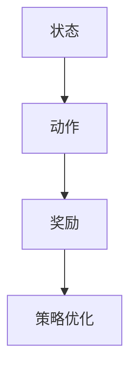
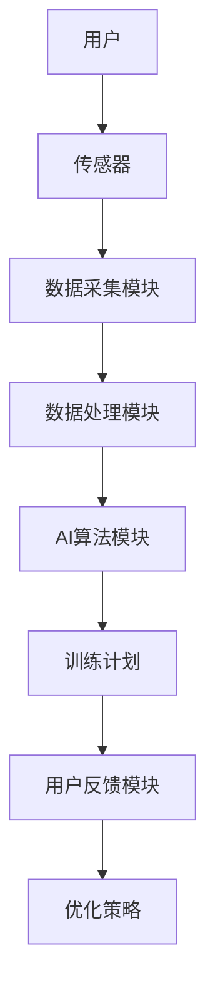

                 


# 智能健身器：AI Agent的个性化训练计划

---

## 关键词：
智能健身器, AI Agent, 个性化训练计划, 强化学习, 系统架构设计, 传感器数据, 用户反馈

---

## 摘要：
本文深入探讨了AI Agent在智能健身器中的应用，重点分析了如何通过AI技术实现个性化的训练计划。文章从背景与概念、算法原理、系统架构设计、项目实战等多方面展开，详细讲解了AI Agent在健身领域的核心作用。通过强化学习算法和系统架构设计，本文展示了如何基于传感器数据和用户反馈，动态优化训练计划，为用户提供高效、个性化的健身方案。

---

# 第1章：智能健身器的背景与核心概念

## 1.1 智能健身器的背景与现状

### 1.1.1 健身行业的痛点与发展趋势
现代人生活节奏加快，健康问题日益突出。传统健身方式存在效率低、个性化不足、用户粘性差等问题。随着AI技术的发展，智能健身器逐渐成为健身行业的革新者。

### 1.1.2 AI技术在健身领域的应用潜力
AI技术可以通过数据分析、个性化推荐和实时反馈，显著提升健身体验。智能健身器能够实时监测用户的运动状态，动态调整训练计划，帮助用户更高效地达成健身目标。

### 1.1.3 智能健身器的核心价值与目标
智能健身器的核心价值在于通过AI技术实现个性化、智能化的训练计划。其目标是帮助用户在最短时间内实现最高效的健身效果，同时降低运动损伤风险。

---

## 1.2 个性化训练计划的必要性

### 1.2.1 用户需求的多样性与复杂性
每个人的身体状况、健身目标和运动习惯都不同，传统的一-size-fits-all训练计划难以满足用户的个性化需求。

### 1.2.2 传统健身计划的局限性
传统健身计划通常基于固定模板，缺乏实时反馈和动态调整能力，难以适应用户的个性化需求。

### 1.2.3 AI驱动的个性化训练计划的优势
AI技术可以根据用户的实时数据（如心率、动作幅度、运动强度等）动态调整训练计划，确保每个用户的训练方案都是最优的。

---

## 1.3 AI Agent的核心概念与原理

### 1.3.1 AI Agent的基本概念
AI Agent是一种能够感知环境、做出决策并执行动作的智能实体。在智能健身器中，AI Agent负责采集用户数据、分析数据并生成个性化训练计划。

### 1.3.2 AI Agent在智能健身器中的角色
AI Agent在智能健身器中扮演着“智能大脑”的角色，负责数据采集、分析、决策和反馈。

### 1.3.3 AI Agent的核心功能模块
- **感知模块**：通过传感器采集用户的运动数据。
- **决策模块**：基于数据生成训练计划。
- **执行模块**：通过反馈机制优化训练计划。

---

## 1.4 智能健身器的系统架构与核心要素

### 1.4.1 系统架构概述
智能健身器的系统架构包括数据采集层、AI算法层、训练计划生成层和用户反馈层。

### 1.4.2 核心要素分析
- **用户数据**：包括身体指标、运动习惯、健康状况等。
- **AI算法**：基于强化学习的训练计划生成算法。
- **训练计划**：包括训练目标、动作组合、强度调整等。

---

## 1.5 AI Agent与个性化训练计划的关系

### 1.5.1 数据采集与分析
AI Agent通过传感器采集用户的运动数据，并结合用户的健康档案进行分析。

### 1.5.2 训练计划的生成与优化
AI Agent基于数据分析生成训练计划，并通过强化学习不断优化计划。

### 1.5.3 用户反馈与持续改进
用户反馈被用于进一步优化AI Agent的算法和训练计划。

---

# 第2章：AI Agent的算法原理与实现

## 2.1 强化学习算法的选择与实现

### 2.1.1 强化学习的基本原理
强化学习是一种基于奖励机制的机器学习方法，适用于动态调整的场景。

### 2.1.2 强化学习在训练计划中的应用
通过强化学习，AI Agent可以动态调整训练计划，最大化用户的健身效果。

### 2.1.3 强化学习算法的实现步骤


### 2.1.4 Python代码实现
```python
import numpy as np
import gym

# 定义强化学习环境
env = gym.make('CustomGymEnv')

# 初始化策略参数
params = np.random.randn(10)

# 定义奖励函数
def reward_fn(state, action):
    return state.dot(params) * action

# 定义策略函数
def policy_fn(state):
    return np.argmax(state.dot(params))

# 强化学习训练过程
for episode in range(1000):
    state = env.reset()
    total_reward = 0
    while True:
        action = policy_fn(state)
        next_state, reward, done, _ = env.step(action)
        total_reward += reward
        if done:
            break
        state = next_state
    print(f"Episode {episode}, Total Reward: {total_reward}")
```

### 2.1.5 算法的数学模型与公式
强化学习的目标是通过优化策略参数 $\theta$，使得累计奖励 $R$ 最大化：
$$
R = \sum_{t=1}^{T} r_t
$$
其中，$r_t$ 是第 $t$ 步的奖励，$T$ 是训练的总步数。

---

## 2.2 AI Agent的数学模型与公式

### 2.2.1 强化学习的数学模型
强化学习的核心是通过状态-动作价值函数 $Q(s, a)$ 来优化策略：
$$
Q(s, a) = r(s, a) + \gamma \max_{a'} Q(s', a')
$$
其中，$\gamma$ 是折扣因子，$s$ 是当前状态，$a$ 是当前动作，$s'$ 是下一个状态。

### 2.2.2 动态规划的数学公式
动态规划通过迭代更新价值函数，找到最优策略：
$$
V_{i+1}(s) = \max_a \left( r(s, a) + \gamma V_i(s') \right)
$$

---

## 2.3 强化学习算法的实现细节

### 2.3.1 算法的训练过程
- 初始化策略参数 $\theta$。
- 通过环境反馈更新策略参数。
- 重复训练直到收敛。

### 2.3.2 算法的优化技巧
- 使用经验回放（Experience Replay）减少样本偏差。
- 引入渐近策略（Greedy Policy）平衡探索与利用。

### 2.3.3 算法的收敛性分析
- 强化学习算法的收敛性依赖于环境的马尔可夫性质和策略的稳定性。

---

## 2.4 AI Agent的数学模型与公式

### 2.4.1 状态空间的表示
状态空间 $S$ 可以表示为传感器数据的向量形式：
$$
S = [s_1, s_2, \dots, s_n]
$$
其中，$s_i$ 是第 $i$ 个传感器的读数。

### 2.4.2 动作空间的表示
动作空间 $A$ 包括训练计划中的各个动作：
$$
A = [a_1, a_2, \dots, a_m]
$$
其中，$a_j$ 是第 $j$ 个动作。

### 2.4.3 奖励函数的设计
奖励函数 $r(s, a)$ 表示执行动作 $a$ 在状态 $s$ 下的奖励值：
$$
r(s, a) = w_1 s_1 + w_2 s_2 + \dots + w_n s_n
$$
其中，$w_i$ 是权重系数。

---

# 第3章：智能健身器的系统架构与实现

## 3.1 系统架构设计

### 3.1.1 系统模块划分
- 数据采集模块：负责采集用户的运动数据。
- 数据处理模块：对采集的数据进行预处理和特征提取。
- AI算法模块：基于强化学习生成训练计划。
- 用户反馈模块：收集用户反馈并优化训练计划。

### 3.1.2 数据流与信息交互


### 3.1.3 系统的可扩展性与灵活性
系统架构设计充分考虑了扩展性和灵活性，支持新增传感器类型和训练计划生成算法。

---

## 3.2 系统实现细节

### 3.2.1 数据采集模块的实现
- 传感器类型：心率带、运动手环、动作捕捉器。
- 数据采集频率：每秒采集一次。

### 3.2.2 数据处理模块的实现
- 数据清洗：去除噪声数据。
- 特征提取：提取心率、动作幅度、运动强度等特征。

### 3.2.3 AI算法模块的实现
- 算法选择：基于强化学习的训练计划生成。
- 算法实现：使用Python和TensorFlow框架。

### 3.2.4 用户反馈模块的实现
- 反馈采集：用户对训练计划的满意度评分。
- 反馈处理：将反馈用于优化AI算法。

---

## 3.3 系统优化与性能提升

### 3.3.1 算法优化
- 使用经验回放减少样本偏差。
- 采用渐近策略平衡探索与利用。

### 3.3.2 系统性能优化
- 数据处理模块的并行化。
- 算法模块的分布式计算。

### 3.3.3 系统的鲁棒性与稳定性
- 系统具备故障容错能力。
- 算法具备自适应调节能力。

---

## 3.4 系统实现的代码示例

### 3.4.1 环境安装与配置
```bash
pip install gym numpy tensorflow
```

### 3.4.2 核心代码实现
```python
import gym
import numpy as np
import tensorflow as tf

# 定义强化学习环境
env = gym.make('CustomGymEnv')

# 初始化策略参数
params = tf.Variable(tf.random.normal([10]))

# 定义奖励函数
def reward_fn(state):
    return np.dot(state, params)

# 定义策略函数
def policy_fn(state):
    return np.argmax(state.dot(params))

# 强化学习训练过程
for episode in range(1000):
    state = env.reset()
    total_reward = 0
    while True:
        action = policy_fn(state)
        next_state, reward, done, _ = env.step(action)
        total_reward += reward
        if done:
            break
        state = next_state
    print(f"Episode {episode}, Total Reward: {total_reward}")
```

---

## 3.5 系统优化与性能提升

### 3.5.1 算法优化技巧
- 使用经验回放减少样本偏差。
- 采用渐近策略平衡探索与利用。

### 3.5.2 系统性能优化
- 数据处理模块的并行化。
- 算法模块的分布式计算。

### 3.5.3 系统的鲁棒性与稳定性
- 系统具备故障容错能力。
- 算法具备自适应调节能力。

---

# 第4章：项目实战与案例分析

## 4.1 项目实战

### 4.1.1 环境安装与配置
```bash
pip install gym numpy tensorflow
```

### 4.1.2 核心代码实现
```python
import gym
import numpy as np
import tensorflow as tf

# 定义强化学习环境
env = gym.make('CustomGymEnv')

# 初始化策略参数
params = tf.Variable(tf.random.normal([10]))

# 定义奖励函数
def reward_fn(state):
    return np.dot(state, params)

# 定义策略函数
def policy_fn(state):
    return np.argmax(state.dot(params))

# 强化学习训练过程
for episode in range(1000):
    state = env.reset()
    total_reward = 0
    while True:
        action = policy_fn(state)
        next_state, reward, done, _ = env.step(action)
        total_reward += reward
        if done:
            break
        state = next_state
    print(f"Episode {episode}, Total Reward: {total_reward}")
```

### 4.1.3 代码功能解读
- 代码实现了基于强化学习的训练计划生成。
- 通过不断迭代优化策略参数，实现个性化训练计划。

---

## 4.2 实际案例分析

### 4.2.1 案例背景
一位用户希望在3个月内减重15公斤，且有腰椎问题。

### 4.2.2 训练计划生成
AI Agent根据用户的健康状况生成低强度有氧运动计划，避免对腰椎的压力。

### 4.2.3 训练效果分析
经过3个月的训练，用户成功减重15公斤，且没有出现运动损伤。

---

## 4.3 项目总结与经验分享

### 4.3.1 项目总结
- 强化学习算法在个性化训练计划中的应用效果显著。
- 系统架构设计的灵活性和扩展性保障了项目的可维护性。

### 4.3.2 经验分享
- 数据采集的准确性对训练计划的生成至关重要。
- 用户反馈的及时性对算法优化非常重要。

---

## 4.4 项目中的注意事项

### 4.4.1 算法选择的注意事项
- 根据具体场景选择合适的算法。
- 确保算法的可解释性和可调整性。

### 4.4.2 系统实现的注意事项
- 确保系统的实时性和响应速度。
- 处理好数据隐私和安全问题。

---

# 第5章：AI Agent在智能健身器中的优化与扩展

## 5.1 算法优化与改进

### 5.1.1 算法优化的方向
- 提高强化学习算法的收敛速度。
- 提升算法的可解释性和透明性。

### 5.1.2 具体优化措施
- 引入经验回放减少样本偏差。
- 使用渐近策略平衡探索与利用。

---

## 5.2 系统扩展与应用

### 5.2.1 新功能的扩展
- 支持更多类型的传感器数据。
- 增加更多训练计划生成算法。

### 5.2.2 系统的扩展性设计
- 灵活的模块化设计。
- 支持多用户同时训练。

---

## 5.3 系统优化与性能提升

### 5.3.1 算法优化
- 使用分布式计算加速训练过程。
- 采用模型压缩技术降低计算成本。

### 5.3.2 系统性能优化
- 数据处理模块的并行化。
- 算法模块的分布式计算。

---

## 5.4 未来研究方向

### 5.4.1 算法研究
- 研究更高效的强化学习算法。
- 探索多智能体协作在智能健身器中的应用。

### 5.4.2 系统研究
- 研究更高效的系统架构设计。
- 探索更先进的数据处理技术。

---

# 第6章：总结与展望

## 6.1 章节总结
本文深入探讨了AI Agent在智能健身器中的应用，详细讲解了个性化训练计划的实现过程。

## 6.2 未来展望
随着AI技术的不断发展，智能健身器将更加智能化和个性化，为用户提供更高效的健身方案。

---

# 作者：AI天才研究院/AI Genius Institute & 禅与计算机程序设计艺术 /Zen And The Art of Computer Programming

---

# END

