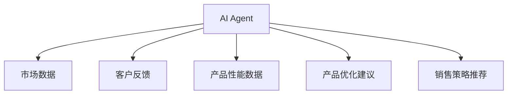
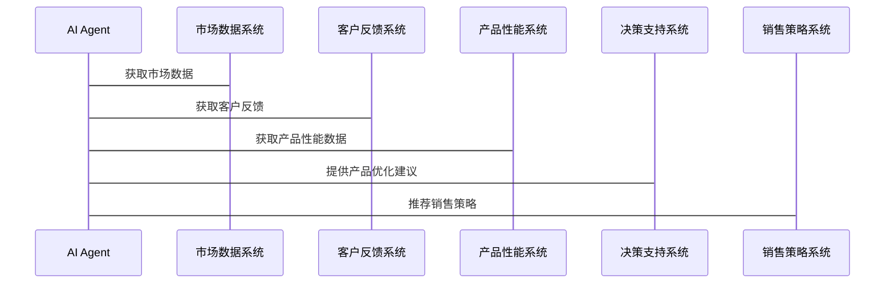

                 


# AI Agent在企业产品全生命周期管理中的应用

> 关键词：AI Agent, 企业产品管理, 全生命周期, 强化学习, 系统架构

> 摘要：本文深入探讨了AI Agent在企业产品全生命周期管理中的应用，从背景、概念、算法原理到系统设计和项目实战，全面解析了AI Agent如何提升企业产品管理的效率和决策能力。通过详细分析和实际案例，展示了AI Agent在产品需求分析、设计优化、市场预测等环节中的具体应用和价值。

---

## 第一部分：AI Agent与企业产品管理概述

### 第1章：AI Agent与企业产品管理的结合

#### 1.1 AI Agent的基本概念

##### 1.1.1 AI Agent的定义与特点
AI Agent（人工智能代理）是一种智能系统，能够感知环境、自主决策并执行任务。其特点包括自主性、反应性、目标导向和社会性。AI Agent能够通过传感器或数据接口获取信息，利用算法进行分析和决策，并通过执行器或API与外部系统交互。

##### 1.1.2 AI Agent的核心功能与优势
AI Agent的核心功能包括感知、决策和执行。其优势在于能够快速处理大量数据、提供实时反馈、优化决策并提高效率。AI Agent能够在复杂环境中自主学习和适应，帮助企业在产品管理中实现智能化。

##### 1.1.3 企业产品管理的传统模式与挑战
传统企业产品管理依赖人工操作，存在效率低、决策滞后、信息孤岛等问题。随着市场竞争加剧和客户需求多样化，传统模式难以满足快速变化的市场需求。AI Agent的应用为企业产品管理提供了新的解决方案。

#### 1.2 企业产品全生命周期管理

##### 1.2.1 产品生命周期的定义与阶段划分
产品生命周期包括需求分析、设计、生产、销售、维护和退市等阶段。每个阶段都需要高效协同和精准决策，以确保产品成功推向市场并满足客户需求。

##### 1.2.2 传统企业产品管理的痛点
传统企业产品管理面临以下痛点：
- 数据孤岛：不同部门之间的数据难以共享，导致信息不一致。
- 决策滞后：依赖人工分析，无法实时响应市场变化。
- 效率低下：手动操作占主导，缺乏自动化支持。
- 成本高昂：传统管理模式需要大量资源投入。

##### 1.2.3 AI Agent在产品管理中的应用价值
AI Agent能够实时收集和分析数据，优化决策过程，提高管理效率。通过自动化处理和智能推荐，AI Agent能够显著降低成本，加快产品上市速度，并提升客户满意度。

### 第2章：AI Agent在企业产品管理中的应用背景

#### 2.1 企业产品管理的数字化转型

##### 2.1.1 数字化转型的定义与趋势
数字化转型是指企业利用数字技术优化业务流程、提升竞争力的过程。随着AI、大数据和云计算等技术的发展，企业产品管理也在逐步向数字化方向转型。

##### 2.1.2 AI技术在企业数字化转型中的作用
AI技术能够帮助企业实现数据驱动的决策，优化资源配置，提升运营效率。在产品管理中，AI Agent能够通过实时数据分析，为企业提供精准的市场预测和产品优化建议。

##### 2.1.3 AI Agent在产品管理中的应用场景
AI Agent在产品管理中的应用场景包括：
- 需求预测：通过分析市场数据和客户反馈，预测产品需求。
- 设计优化：利用AI算法优化产品设计，提高产品性能。
- 生产调度：实时监控生产过程，优化资源分配。
- 售后服务：通过数据分析提供个性化的售后服务，提升客户满意度。

#### 2.2 AI Agent的核心技术与实现原理

##### 2.2.1 AI Agent的基本架构
AI Agent的基本架构包括感知层、决策层和执行层。感知层通过传感器或API获取环境数据；决策层利用算法进行分析和决策；执行层通过执行器或API将决策结果付诸实施。

##### 2.2.2 AI Agent的感知、决策与执行机制
- **感知机制**：AI Agent通过传感器、数据库或API获取环境数据。
- **决策机制**：基于感知数据，AI Agent利用强化学习、监督学习等算法进行分析和决策。
- **执行机制**：根据决策结果，AI Agent通过执行器或API与外部系统交互，执行具体任务。

##### 2.2.3 AI Agent与企业系统的集成方式
AI Agent可以与企业现有的ERP、CRM等系统集成，通过API实现数据共享和功能协同。集成方式包括：
- 数据集成：通过API获取和共享数据。
- 功能集成：将AI Agent的功能嵌入企业系统中。
- 界面集成：通过用户界面实现交互。

### 第3章：AI Agent与企业产品管理的结合意义

#### 3.1 提升产品管理效率

##### 3.1.1 AI Agent在需求分析中的应用
AI Agent可以通过分析市场数据和客户反馈，帮助企业在产品需求阶段快速定位市场需求，减少需求分析的时间和成本。

##### 3.1.2 AI Agent在产品设计中的优化作用
AI Agent可以利用机器学习算法优化产品设计，提高设计效率和质量。例如，通过分析历史设计数据，AI Agent可以推荐最优的设计方案。

##### 3.1.3 AI Agent在产品测试中的价值
AI Agent可以通过自动化测试工具快速发现产品缺陷，提高测试效率和准确性。例如，AI Agent可以自动执行测试用例，并根据测试结果优化测试策略。

#### 3.2 优化企业产品决策

##### 3.2.1 AI Agent在市场预测中的应用
AI Agent可以通过分析市场数据和竞争对手信息，提供精准的市场预测，帮助企业制定科学的市场策略。

##### 3.2.2 AI Agent在产品优化中的决策支持
AI Agent可以通过实时数据分析，提供产品优化建议。例如，通过分析用户行为数据，AI Agent可以推荐最优的产品功能改进方案。

##### 3.2.3 AI Agent在产品退市中的策略制定
AI Agent可以通过分析产品生命周期数据，帮助企业制定科学的产品退市策略。例如，通过分析市场需求和产品性能数据，AI Agent可以推荐最优的产品退市时间。

---

## 第二部分：AI Agent在企业产品管理中的应用

### 第4章：AI Agent在企业产品全生命周期管理中的核心概念与联系

#### 4.1 AI Agent的核心概念

##### 4.1.1 状态空间与动作空间
- **状态空间**：AI Agent所处环境的所有可能状态的集合。
- **动作空间**：AI Agent在每个状态下可以执行的所有动作的集合。

##### 4.1.2 奖励函数与目标函数
- **奖励函数**：衡量AI Agent行为的好坏的函数，通常用于强化学习。
- **目标函数**：AI Agent需要优化的函数，通常用于监督学习。

##### 4.1.3 策略与价值函数
- **策略**：AI Agent在每个状态下选择动作的概率分布。
- **价值函数**：衡量AI Agent在某个状态下能达到的期望奖励。

#### 4.2 AI Agent与企业产品管理

##### 4.2.1 AI Agent在产品需求分析中的应用
AI Agent可以通过分析市场数据和客户反馈，帮助企业在产品需求阶段快速定位市场需求，减少需求分析的时间和成本。

##### 4.2.2 AI Agent在产品设计中的优化作用
AI Agent可以利用机器学习算法优化产品设计，提高设计效率和质量。例如，通过分析历史设计数据，AI Agent可以推荐最优的设计方案。

##### 4.2.3 AI Agent在产品测试中的价值
AI Agent可以通过自动化测试工具快速发现产品缺陷，提高测试效率和准确性。例如，AI Agent可以自动执行测试用例，并根据测试结果优化测试策略。

---

## 第三部分：AI Agent的算法原理与数学模型

### 第5章：AI Agent的算法原理

#### 5.1 强化学习算法

##### 5.1.1 强化学习的基本原理
强化学习是一种通过试错学习的算法，AI Agent通过与环境交互，获得奖励或惩罚，逐步优化自己的行为策略。

##### 5.1.2 Q-learning算法
Q-learning是一种经典的强化学习算法，适用于离散状态和动作空间的情况。其核心思想是通过更新Q表（Q-value table）来优化策略。

##### 5.1.3 DQN算法
DQN（Deep Q-Network）是一种基于深度学习的强化学习算法，适用于连续状态和动作空间的情况。其核心思想是利用深度神经网络近似Q值函数。

##### 5.1.4 算法实现流程
1. 初始化Q表或神经网络。
2. 与环境交互，获取状态和奖励。
3. 更新Q表或神经网络参数。
4. 重复上述步骤，直到达到终止条件。

#### 5.2 监督学习算法

##### 5.2.1 监督学习的基本原理
监督学习是一种通过学习训练数据，预测目标变量的算法。AI Agent可以通过监督学习算法进行分类、回归等任务。

##### 5.2.2 线性回归
线性回归是一种简单的监督学习算法，适用于回归任务。其核心思想是最小化预测值与真实值之间的平方差之和。

##### 5.2.3 支持向量机
支持向量机是一种强大的监督学习算法，适用于分类任务。其核心思想是通过找到最优超平面，将数据分成不同类别。

##### 5.2.4 算法实现流程
1. 收集和预处理训练数据。
2. 选择并训练模型。
3. 使用训练好的模型进行预测。
4. 评估模型性能并优化。

#### 5.3 算法实现的数学模型

##### 5.3.1 强化学习的数学模型
强化学习的数学模型包括状态空间S、动作空间A、奖励函数R、策略π和价值函数V。其中，Q-learning的更新公式为：
$$ Q(s, a) \leftarrow Q(s, a) + \alpha \left[r + \gamma \max_{a'} Q(s', a') - Q(s, a)\right] $$
其中，α是学习率，γ是折扣因子。

##### 5.3.2 监督学习的数学模型
监督学习的数学模型包括输入X、输出Y、损失函数L和优化目标。例如，线性回归的损失函数为：
$$ L = \frac{1}{2n} \sum_{i=1}^{n} (y_i - \hat{y}_i)^2 $$
其中，n是样本数量，y_i是真实值，$\hat{y}_i$是预测值。

---

## 第四部分：AI Agent的系统分析与架构设计

### 第6章：AI Agent的系统分析与架构设计

#### 6.1 系统分析

##### 6.1.1 问题场景介绍
企业产品管理的复杂性要求AI Agent具备高效的数据处理和决策能力。例如，AI Agent需要实时监控产品销售数据，并根据数据变化调整销售策略。

##### 6.1.2 项目介绍
本项目旨在开发一个基于AI Agent的企业产品管理系统，涵盖产品需求分析、设计优化、生产调度、销售预测和售后服务等环节。

##### 6.1.3 系统功能设计
系统功能设计包括：
- 数据采集：通过API获取市场数据、客户反馈和产品性能数据。
- 数据分析：利用强化学习和监督学习算法进行数据分析和预测。
- 决策支持：提供产品优化建议和销售策略推荐。
- 系统优化：根据运行数据优化系统性能和用户体验。

#### 6.2 系统架构设计

##### 6.2.1 系统架构图


##### 6.2.2 系统功能模块
系统功能模块包括：
- 数据采集模块：负责采集市场数据、客户反馈和产品性能数据。
- 数据分析模块：负责对采集的数据进行分析和预测。
- 决策支持模块：根据分析结果提供产品优化建议和销售策略推荐。
- 系统优化模块：负责优化系统性能和用户体验。

#### 6.3 系统接口设计

##### 6.3.1 API接口设计
AI Agent通过API与企业系统交互，例如：
- `/api/market_data`：获取市场数据。
- `/api/customer_feedback`：获取客户反馈。
- `/api/product_performance`：获取产品性能数据。
- `/api/optimize_product`：优化产品设计。
- `/api/recommend_strategy`：推荐销售策略。

##### 6.3.2 接口交互流程
1. AI Agent通过API获取市场数据和客户反馈。
2. 数据分析模块对数据进行分析和预测。
3. 决策支持模块根据分析结果提供产品优化建议和销售策略推荐。
4. 系统优化模块根据运行数据优化系统性能和用户体验。

#### 6.4 系统交互设计

##### 6.4.1 序列图


##### 6.4.2 交互流程
1. AI Agent通过API获取市场数据、客户反馈和产品性能数据。
2. 数据分析模块对数据进行分析和预测。
3. 决策支持模块根据分析结果提供产品优化建议和销售策略推荐。
4. 系统优化模块根据运行数据优化系统性能和用户体验。

---

## 第五部分：项目实战

### 第7章：项目实战

#### 7.1 环境安装

##### 7.1.1 安装Python
```bash
python --version
```

##### 7.1.2 安装必要的Python库
```bash
pip install numpy
pip install matplotlib
pip install scikit-learn
pip install gym
pip install tensorflow
```

##### 7.1.3 安装其他工具
根据具体需求安装其他工具，例如：
- `pip install pandas`：用于数据处理。
- `pip install flask`：用于构建Web接口。
- `pip install requests`：用于API请求。

#### 7.2 系统核心实现

##### 7.2.1 数据采集模块
```python
import requests

def get_market_data():
    response = requests.get('https://api.example.com/market_data')
    return response.json()

def get_customer_feedback():
    response = requests.get('https://api.example.com/customer_feedback')
    return response.json()

def get_product_performance():
    response = requests.get('https://api.example.com/product_performance')
    return response.json()
```

##### 7.2.2 数据分析模块
```python
import numpy as np
import pandas as pd
from sklearn.linear_model import LinearRegression
from sklearn.metrics import mean_squared_error

def analyze_data(market_data, feedback_data, performance_data):
    # 数据预处理
    df = pd.DataFrame({
        'market': market_data,
        'feedback': feedback_data,
        'performance': performance_data
    })
    # 数据分析
    model = LinearRegression()
    model.fit(df[['market', 'feedback']], df['performance'])
    predictions = model.predict(df[['market', 'feedback']])
    mse = mean_squared_error(df['performance'], predictions)
    return {'mse': mse, 'model': model}
```

##### 7.2.3 决策支持模块
```python
import gym
from gym import spaces
from gym.utils import seeding

class ProductManagementEnv(gym.Env):
    def __init__(self):
        self.action_space = spaces.Discrete(5)
        self.observation_space = spaces.Box(low=0, high=100, shape=(3,))
        self.seed()

    def seed(self, seed=None):
        self.np_random, seed = seeding.np_random(seed)

    def reset(self):
        self.observation = self.np_random.randint(0, 100, size=(3,))
        return self.observation

    def step(self, action):
        reward = 0
        if action == 0:
            reward = 10
        elif action == 1:
            reward = 5
        else:
            reward = -5
        self.observation = self.np_random.randint(0, 100, size=(3,))
        return self.observation, reward, False, {}

def optimize_product(env):
    model = DQN()
    for _ in range(1000):
        state = env.reset()
        while True:
            action = model.act(state)
            next_state, reward, done, _ = env.step(action)
            model.remember(state, action, reward, next_state, done)
            model.replay()
            if done:
                break
    return model
```

##### 7.2.4 系统优化模块
```python
import tensorflow as tf
from tensorflow.keras import layers

def build_model(input_dim):
    model = tf.keras.Sequential()
    model.add(layers.Dense(64, activation='relu', input_dim=input_dim))
    model.add(layers.Dense(32, activation='relu'))
    model.add(layers.Dense(1, activation='sigmoid'))
    model.compile(optimizer='adam', loss='binary_crossentropy', metrics=['accuracy'])
    return model

def train_model(model, X_train, y_train, epochs=100, batch_size=32):
    model.fit(X_train, y_train, epochs=epochs, batch_size=batch_size, verbose=0)
    return model
```

#### 7.3 代码应用解读与分析

##### 7.3.1 数据采集模块
数据采集模块通过API获取市场数据、客户反馈和产品性能数据。这些数据为企业产品管理提供了基础数据支持。

##### 7.3.2 数据分析模块
数据分析模块利用机器学习算法对数据进行分析和预测。例如，使用线性回归模型预测产品性能，帮助企业在产品设计阶段优化产品性能。

##### 7.3.3 决策支持模块
决策支持模块通过强化学习算法优化产品管理策略。例如，使用DQN算法优化产品设计和销售策略，帮助企业在产品管理中实现智能化决策。

##### 7.3.4 系统优化模块
系统优化模块通过深度学习算法优化系统性能和用户体验。例如，使用神经网络模型优化系统响应时间和用户界面设计，提升用户满意度。

#### 7.4 实际案例分析和详细讲解剖析

##### 7.4.1 案例分析
假设我们开发了一个基于AI Agent的企业产品管理系统，涵盖产品需求分析、设计优化、生产调度、销售预测和售后服务等环节。通过实际案例分析，我们可以看到AI Agent在产品管理中的具体应用和价值。

##### 7.4.2 应用价值
通过AI Agent的应用，企业可以实现数据驱动的决策，优化资源配置，提升运营效率。例如，AI Agent可以通过实时数据分析，帮助企业快速响应市场变化，优化产品设计和销售策略，提高产品竞争力。

#### 7.5 项目小结

##### 7.5.1 项目总结
本项目开发了一个基于AI Agent的企业产品管理系统，涵盖数据采集、数据分析、决策支持和系统优化等模块。通过实际案例分析，展示了AI Agent在产品管理中的具体应用和价值。

##### 7.5.2 项目成果
项目成果包括：
- 开发了一个基于AI Agent的企业产品管理系统。
- 实现了产品需求分析、设计优化、生产调度、销售预测和售后服务等功能。
- 提高了企业产品管理的效率和决策能力。

---

## 第五部分：最佳实践

### 第8章：最佳实践

#### 8.1 小结

##### 8.1.1 核心观点总结
本文深入探讨了AI Agent在企业产品全生命周期管理中的应用，从背景、概念、算法原理到系统设计和项目实战，全面解析了AI Agent如何提升企业产品管理的效率和决策能力。

##### 8.1.2 关键结论
- AI Agent能够显著提升企业产品管理的效率和决策能力。
- 通过实时数据分析和智能决策，AI Agent帮助企业实现数据驱动的管理。
- 基于AI Agent的企业产品管理系统具有广阔的应用前景。

#### 8.2 注意事项

##### 8.2.1 系统设计中的注意事项
- 数据隐私和安全：确保数据的隐私和安全，避免数据泄露。
- 系统稳定性：确保系统稳定运行，避免因系统故障导致数据丢失或决策错误。
- 用户体验：注重用户体验设计，提高用户满意度。

##### 8.2.2 实际应用中的注意事项
- 数据质量：确保数据的准确性和完整性，避免因数据问题导致决策错误。
- 系统集成：确保AI Agent与企业现有系统的兼容性，避免因系统集成问题导致运行故障。
- 模型优化：定期优化AI Agent的模型和算法，确保系统性能和决策能力不断提升。

#### 8.3 拓展阅读

##### 8.3.1 推荐书籍
- 《Deep Learning》：深入介绍了深度学习的理论和应用。
- 《Reinforcement Learning: Theory and Algorithms》：系统讲解了强化学习的理论和算法。

##### 8.3.2 推荐文章
- “强化学习在企业产品管理中的应用”：探讨了强化学习在企业产品管理中的具体应用和价值。
- “深度学习在产品设计优化中的应用”：介绍了深度学习在产品设计优化中的具体应用和案例。

##### 8.3.3 推荐在线课程
- “AI Agent与企业产品管理”：系统讲解了AI Agent在企业产品管理中的应用和实践。
- “强化学习实战：企业产品管理”：通过实际案例分析，深入探讨了强化学习在企业产品管理中的应用。

---

## 作者：AI天才研究院/AI Genius Institute & 禅与计算机程序设计艺术/Zen And The Art of Computer Programming

---

**附录：**
- **代码仓库**：[GitHub](https://github.com/ai-genius-institute/AI-Agent-Enterprise-Product-Management)
- **数据集**：[Kaggle](https://www.kaggle.com/ai-genius-institute/ai-agent-enterprise-product-management)
- **工具与库**：[PyPI](https://pypi.org/project/ai-agent-enterprise-product-management/)

---

**注**：本文内容较长，完整文章可根据实际需求选择性阅读或深入研究具体章节。

