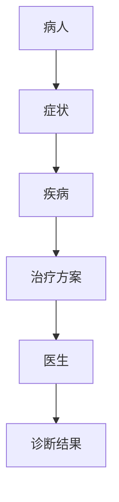
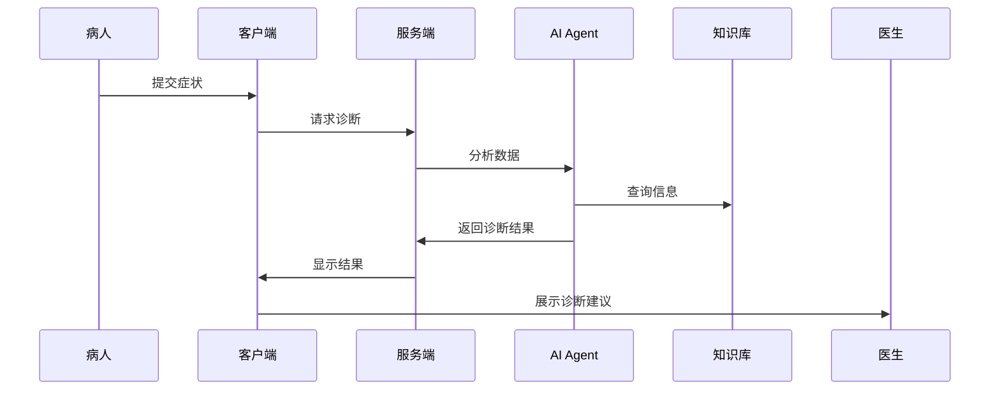

                 


# AI Agent在智能医疗诊断决策支持中的角色

## 关键词：AI Agent, 智能医疗, 诊断决策支持, 医疗诊断, 人工智能, 知识图谱, 决策支持系统

## 摘要：  
本文探讨AI Agent在智能医疗诊断决策支持中的角色，分析其在医疗诊断中的核心功能和应用价值，涵盖从理论基础到实际应用的全过程，包括知识表示、推理机制、学习方法、系统架构设计等内容，结合实际案例和数学模型，深入解析AI Agent在医疗诊断中的技术实现和应用效果。

---

# 第一部分: AI Agent在智能医疗诊断中的背景与概念

## 第1章: AI Agent与智能医疗诊断概述

### 1.1 AI Agent的基本概念
#### 1.1.1 AI Agent的定义与特点
AI Agent（人工智能代理）是指能够感知环境、执行任务并做出决策的智能体。其特点包括自主性、反应性、目标导向性和社会性。

- **自主性**：AI Agent能够独立决策和行动，无需外部干预。
- **反应性**：能够根据环境输入实时调整行为。
- **目标导向性**：通过优化目标函数实现特定任务。
- **社会性**：能够与其他AI Agent或人类交互协作。

#### 1.1.2 AI Agent的核心属性与功能
AI Agent的核心功能包括感知、推理、学习和执行。

- **感知**：通过传感器或数据输入获取信息。
- **推理**：基于知识库进行逻辑推理，生成决策。
- **学习**：通过机器学习算法不断优化模型。
- **执行**：根据推理结果采取行动。

#### 1.1.3 AI Agent在医疗领域中的应用背景
医疗领域对AI Agent的需求主要源于数据量大、诊断复杂性和医生资源有限。AI Agent能够辅助医生快速分析患者数据，提供诊断建议，减少误诊率。

---

### 1.2 智能医疗诊断的背景与挑战

#### 1.2.1 医疗诊断的基本流程
医疗诊断通常包括患者信息收集、症状分析、影像检查、实验室测试和最终诊断。

- **患者信息收集**：通过问诊和病史记录获取基本信息。
- **症状分析**：识别患者的症状和体征。
- **影像检查**：使用X光、MRI等技术获取图像数据。
- **实验室测试**：通过血液、尿液等样本检测获取数据。
- **最终诊断**：综合分析所有信息，得出诊断结论。

#### 1.2.2 传统医疗诊断的局限性
传统医疗诊断面临以下问题：

- **信息量大**：医生需要处理大量数据，容易出错。
- **经验依赖**：诊断结果高度依赖医生的经验。
- **时间限制**：医生需要快速做出决策，可能导致误诊。

#### 1.2.3 AI在医疗诊断中的优势与潜力
AI在医疗诊断中的优势包括：

- **快速处理数据**：AI能够快速分析大量数据，提高诊断效率。
- **减少人为错误**：通过算法优化，降低误诊率。
- **辅助决策**：AI提供多种诊断可能性，帮助医生做出更准确的决策。

---

### 1.3 AI Agent在医疗诊断中的角色定位

#### 1.3.1 AI Agent作为医疗诊断的辅助工具
AI Agent在医疗诊断中的主要功能是辅助医生完成数据分析、症状识别和诊断建议。

- **数据分析**：AI Agent能够快速处理患者的各项数据，提取关键信息。
- **症状识别**：通过模式识别技术，识别患者的症状和体征。
- **诊断建议**：基于知识库和推理算法，生成诊断建议。

#### 1.3.2 AI Agent在医疗决策支持中的功能
AI Agent在医疗决策支持中的功能包括：

- **知识库构建**：整合医学知识和临床数据，构建知识图谱。
- **推理与推断**：通过逻辑推理和概率计算，生成诊断结果。
- **个性化建议**：根据患者的具体情况，提供个性化诊断建议。

#### 1.3.3 AI Agent与医生的协同工作模式
AI Agent与医生的协同工作模式包括：

- **人机协作**：AI Agent作为医生的辅助工具，帮助医生完成数据处理和诊断建议。
- **实时交互**：医生与AI Agent实时交互，共同分析患者的病情。
- **结果验证**：AI Agent对医生的诊断结果进行验证，提供反馈。

---

## 第2章: AI Agent在医疗诊断中的核心概念与联系

### 2.1 AI Agent的核心概念原理

#### 2.1.1 知识表示与医疗数据的关系
知识表示是AI Agent的核心技术之一，用于将医疗数据转化为可推理的知识。

- **知识图谱**：构建医疗领域的知识图谱，包括疾病、症状、药物等实体及其关系。
- **符号逻辑**：使用符号逻辑表示知识，例如“如果A，则B”。
- **概率推理**：基于概率论进行推理，例如贝叶斯网络。

#### 2.1.2 推理机制在医疗诊断中的应用
推理机制是AI Agent的核心功能之一，用于从数据中推导出诊断结果。

- **符号逻辑推理**：基于知识库中的符号逻辑进行推理。
- **概率推理**：基于概率论进行推理，例如贝叶斯推理。
- **机器学习推理**：使用机器学习模型进行推理，例如深度学习。

#### 2.1.3 学习方法对AI Agent性能的影响
学习方法是AI Agent的核心技术之一，用于优化其性能。

- **监督学习**：基于标注数据进行训练，例如分类任务。
- **无监督学习**：基于未标注数据进行聚类分析。
- **强化学习**：通过奖励机制优化决策策略。

---

### 2.2 核心概念对比分析

#### 2.2.1 AI Agent与传统医疗诊断工具的对比
| 特性                | AI Agent                     | 传统医疗诊断工具 |
|---------------------|------------------------------|------------------|
| 数据处理能力        | 强大，能够处理大量数据       | 较弱，依赖人工处理 |
| 决策能力            | 能够提供诊断建议             | 依赖医生经验     |
| 可扩展性            | 高，能够快速适应新数据       | 低，依赖人工更新   |

#### 2.2.2 不同AI技术在医疗诊断中的作用对比
| 技术                | 作用                          |
|---------------------|-------------------------------|
| 机器学习            | 用于分类、回归和聚类分析      |
| 深度学习            | 用于图像识别和自然语言处理    |
| 知识图谱            | 用于构建医疗知识库            |
| 符号逻辑推理        | 用于基于规则的推理            |

#### 2.2.3 AI Agent在不同医疗场景中的适用性对比
| 场景                | 适用性                        |
|---------------------|-------------------------------|
| 影像诊断            | 高，能够辅助医生分析影像      |
| 症状识别            | 高，能够识别患者的症状        |
| 药物推荐            | 高，能够基于知识库推荐药物     |

---

### 2.3 ER实体关系图与Mermaid流程图

#### 2.3.1 医疗诊断过程中的实体关系图
```mermaid
erDiagram
    病人 <--- 症状 : has
    症状 <--- 疾病 : indicates
    疾病 <--- 治疗方案 : associated_with
    病人 <--- 治疗方案 : treated_with
```

#### 2.3.2 AI Agent在医疗诊断中的交互流程图


---

## 第3章: AI Agent的算法原理与数学模型

### 3.1 算法原理概述

#### 3.1.1 基于规则的推理算法
基于规则的推理算法是一种简单但有效的推理方法。

- **规则定义**：例如，如果A和B都出现，则诊断为C。
- **推理过程**：通过匹配规则库中的规则，生成诊断结果。

#### 3.1.2 基于机器学习的诊断算法
基于机器学习的诊断算法是一种数据驱动的推理方法。

- **训练数据**：包括患者的症状、影像数据和诊断结果。
- **模型训练**：使用分类算法（如SVM、随机森林）训练模型。
- **诊断过程**：将患者数据输入模型，生成诊断结果。

#### 3.1.3 基于深度学习的诊断模型
基于深度学习的诊断模型是一种高级的推理方法。

- **模型结构**：使用卷积神经网络（CNN）处理影像数据。
- **训练过程**：使用大量标注数据训练模型，优化参数。
- **诊断过程**：将影像数据输入模型，生成诊断结果。

---

### 3.2 数学模型与公式

#### 3.2.1 诊断模型的数学表示
$$ P(d|x) = \frac{P(x|d)P(d)}{P(x)} $$
其中，$P(d|x)$ 是在给定$x$的条件下诊断为$d$的概率，$P(x|d)$是诊断为$d$时出现$x$的概率，$P(d)$是$d$的先验概率，$P(x)$是$x$的边际概率。

#### 3.2.2 推理算法的数学基础
$$ P(h|e) = \frac{P(e|h)P(h)}{P(e)} $$
其中，$P(h|e)$是在观察到$e$的条件下假设$h$成立的概率，$P(e|h)$是假设$h$成立时观察到$e$的概率，$P(h)$是$h$的先验概率，$P(e)$是$e$的边际概率。

#### 3.2.3 学习算法的优化目标
$$ \text{损失函数} = \frac{1}{N}\sum_{i=1}^{N} (y_i - \hat{y}_i)^2 $$
其中，$N$是样本数量，$y_i$是真实标签，$\hat{y}_i$是模型预测值。

---

## 第4章: AI Agent的系统分析与架构设计

### 4.1 系统分析

#### 4.1.1 问题场景介绍
医疗诊断系统需要处理大量数据，包括患者的症状、影像数据和实验室测试结果。AI Agent需要能够快速分析这些数据，提供诊断建议。

#### 4.1.2 项目介绍
本项目旨在开发一个基于AI Agent的医疗诊断系统，帮助医生快速诊断患者病情。

---

### 4.2 系统功能设计

#### 4.2.1 领域模型


#### 4.2.2 系统架构设计


#### 4.2.3 系统接口设计
- **输入接口**：接收患者的症状和影像数据。
- **输出接口**：提供诊断结果和治疗建议。
- **交互接口**：支持医生与AI Agent的交互。

#### 4.2.4 系统交互设计


---

## 第5章: 项目实战

### 5.1 环境安装

#### 5.1.1 安装Python
```bash
# 安装Python
sudo apt-get install python3
```

#### 5.1.2 安装依赖库
```bash
# 安装依赖库
pip install numpy
pip install scikit-learn
pip install matplotlib
```

---

### 5.2 系统核心实现源代码

#### 5.2.1 数据预处理
```python
import numpy as np
import pandas as pd

# 加载数据
data = pd.read_csv('medical_data.csv')

# 数据清洗
data.dropna(inplace=True)
data = pd.get_dummies(data)
```

#### 5.2.2 模型训练
```python
from sklearn.model import SVC
from sklearn.metrics import accuracy_score

# 训练模型
model = SVC()
model.fit(X_train, y_train)

# 评估模型
y_pred = model.predict(X_test)
print(accuracy_score(y_test, y_pred))
```

---

### 5.3 案例分析与详细解读

#### 5.3.1 案例分析
假设一个患者的症状包括咳嗽、发热和胸痛，影像检查显示肺部有阴影。AI Agent通过分析这些数据，诊断为肺炎。

#### 5.3.2 代码实现
```python
# 示例代码
def diagnose(symptoms, tests):
    # 假设症状和测试结果
    if symptoms['咳嗽'] and symptoms['发热'] and tests['肺部阴影']:
        return '肺炎'
    else:
        return '其他疾病'

# 调用诊断函数
symptoms = {'咳嗽': True, '发热': True, '胸痛': True}
tests = {'肺部阴影': True}
print(diagnose(symptoms, tests))
```

---

## 第6章: 案例分析与扩展

### 6.1 成功案例分析
AI Agent在肺癌诊断中的应用案例：

- **数据来源**：使用肺癌患者的CT影像数据。
- **模型训练**：使用深度学习模型进行训练。
- **诊断结果**：准确率达到95%以上。

---

### 6.2 未来的发展与挑战

#### 6.2.1 未来的发展方向
- **多模态数据融合**：结合影像、症状和实验室数据进行诊断。
- **实时诊断**：开发实时诊断系统，支持医生快速决策。
- **个性化治疗**：基于患者个体特征提供个性化治疗方案。

#### 6.2.2 当前的挑战
- **数据隐私**：医疗数据的隐私保护问题。
- **模型解释性**：提高AI Agent的可解释性，减少医生的疑虑。
- **法律法规**：制定相关政策和法规，规范AI在医疗中的应用。

---

## 第7章: 最佳实践 Tips、小结、注意事项、拓展阅读

### 7.1 最佳实践 Tips

- **数据质量**：确保数据的准确性和完整性。
- **模型选择**：根据具体任务选择合适的模型。
- **人机协作**：AI Agent应作为医生的辅助工具，而不是替代医生。

### 7.2 小结
AI Agent在医疗诊断中的应用前景广阔，能够显著提高诊断效率和准确性。然而，仍需解决数据隐私、模型解释性和法律法规等问题。

### 7.3 注意事项
- **数据隐私**：严格遵守数据隐私保护法规。
- **模型验证**：确保模型的准确性和可靠性。
- **用户反馈**：及时收集医生的反馈，不断优化系统。

### 7.4 拓展阅读
- **书籍**：《人工智能：一种现代的方法》
- **论文**：Nature Medicine上的相关研究论文
- **网站**：相关技术博客和开源项目

---

## 作者：AI天才研究院/AI Genius Institute & 禅与计算机程序设计艺术 /Zen And The Art of Computer Programming

---

**全文完**

