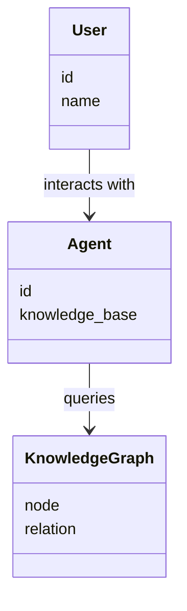
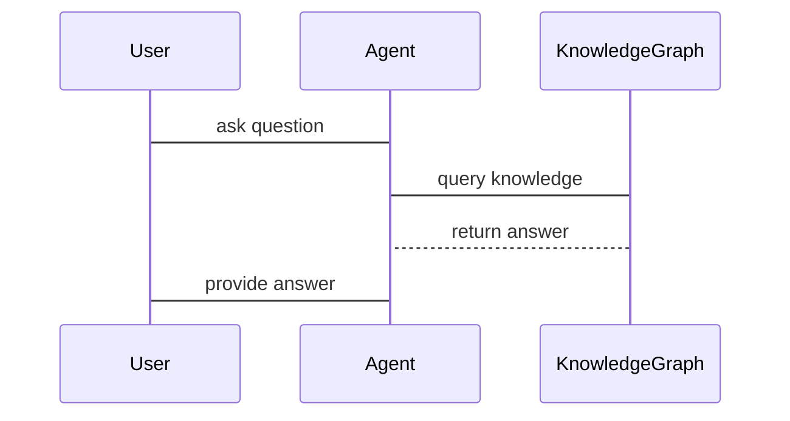

                 


# AI Agent在虚拟教师中的知识图谱应用

> 关键词：AI Agent，知识图谱，虚拟教师，教育技术，智能问答，个性化学习

> 摘要：本文探讨了AI Agent在虚拟教师中的知识图谱应用，详细分析了知识图谱的构建、AI Agent的设计与实现，以及基于知识图谱的推理算法在教育中的实际应用。通过系统架构设计和项目实战，展示了如何利用知识图谱提升虚拟教师的智能化水平。

---

## 第1章: AI Agent与知识图谱概述

### 1.1 AI Agent的基本概念

#### 1.1.1 什么是AI Agent
AI Agent（人工智能代理）是指能够感知环境、自主决策并执行任务的智能实体。它能够通过传感器获取信息，利用推理能力解决问题，并通过执行器与环境交互。

#### 1.1.2 AI Agent的核心特征
- **自主性**：能够在没有外部干预的情况下运行。
- **反应性**：能够实时感知环境并做出反应。
- **目标导向**：基于目标驱动行为。
- **学习能力**：能够通过经验改进性能。

#### 1.1.3 AI Agent的分类与应用场景
- **简单反射型Agent**：基于规则的反应式系统，适用于简单的任务。
- **基于模型的反射型Agent**：利用内部模型进行推理和决策，适用于复杂任务。
- **目标驱动型Agent**：基于目标进行规划和行动，适用于需要长期目标的任务。
- **学习型Agent**：能够通过机器学习技术不断优化性能，适用于数据驱动的任务。

### 1.2 知识图谱的基本概念

#### 1.2.1 知识图谱的定义
知识图谱是一种以图结构形式表示知识的语义网络，由节点（实体）和边（关系）组成，广泛应用于搜索、推荐和问答系统中。

#### 1.2.2 知识图谱的构建过程
- **数据收集**：从多种数据源（如文本、数据库、知识库）收集数据。
- **知识抽取**：通过自然语言处理技术从文本中提取实体、关系和属性。
- **知识融合**：将来自不同数据源的知识进行整合，消除冗余和矛盾。
- **知识建模**：将知识以图结构的形式建模，形成知识图谱。

#### 1.2.3 知识图谱的表示方法
- **符号逻辑表示**：使用谓词逻辑表示知识。
- **语义网络表示**：通过节点和边表示实体及其关系。
- **图结构表示**：使用图数据库（如Neo4j）存储知识图谱。

### 1.3 AI Agent与知识图谱的关系

#### 1.3.1 知识图谱作为AI Agent的知识库
知识图谱为AI Agent提供了丰富的知识库，使其能够理解上下文、推理问题并生成答案。

#### 1.3.2 AI Agent在知识图谱中的应用
- **知识问答**：基于知识图谱实现智能问答。
- **推理与推断**：利用知识图谱进行推理和推断。
- **知识抽取与建模**：AI Agent参与知识图谱的构建和优化。

#### 1.3.3 两者的结合与未来发展
通过结合AI Agent和知识图谱，可以实现更智能、更个性化的服务，推动教育技术的发展。

---

## 第2章: 知识图谱的构建与管理

### 2.1 知识图谱的构建过程

#### 2.1.1 数据收集与预处理
- **数据源**：可以从文本、结构化数据和知识库中收集数据。
- **数据清洗**：去除噪声数据，确保数据质量。

#### 2.1.2 知识抽取与表示
- **实体识别**：识别文本中的实体（如人名、地名）。
- **关系抽取**：识别实体之间的关系（如“属于”、“位于”）。
- **属性抽取**：识别实体的属性（如“颜色”、“形状”）。

#### 2.1.3 知识融合与推理
- **知识融合**：将不同数据源的知识整合到一个知识图谱中。
- **知识推理**：利用推理算法（如前向推理、反向推理）扩展知识图谱。

### 2.2 知识图谱的存储与管理

#### 2.2.1 数据库的选择与设计
- **图数据库**：如Neo4j，适合存储和查询图结构数据。
- **关系型数据库**：如MySQL，适合存储结构化数据。

#### 2.2.2 知识图谱的存储结构
- **节点**：代表实体或概念。
- **边**：代表实体之间的关系。

#### 2.2.3 知识图谱的更新与维护
- **数据更新**：定期更新知识图谱以反映最新信息。
- **错误修正**：修复知识图谱中的错误或不一致。

### 2.3 知识图谱的可视化

#### 2.3.1 知识图谱的可视化工具
- **Graphviz**：用于生成图结构的可视化图表。
- **Neo4j Browser**：内置的知识图谱可视化工具。

#### 2.3.2 知识图谱的可视化方法
- **节点布局**：合理布局节点，避免重叠。
- **边的表示**：使用不同的颜色或粗细表示不同的关系类型。

#### 2.3.3 知识图谱的交互式探索
- **交互式查询**：用户可以通过输入查询条件，动态生成可视化结果。
- **过滤与筛选**：用户可以通过设置过滤条件，查看特定范围内的知识图谱。

---

## 第3章: AI Agent的知识表示与推理

### 3.1 知识表示方法

#### 3.1.1 符号逻辑表示
- **谓词逻辑**：例如，`teacher(张三)` 表示“张三是老师”。

#### 3.1.2 语义网络表示
- **节点和边**：例如，节点“老师”和“学生”之间有一条边“教”。

#### 3.1.3 图结构表示
- **图数据库**：例如，使用Neo4j存储知识图谱。

### 3.2 知识推理算法

#### 3.2.1 前向推理
- **定义**：基于已知的事实，推导出新的结论。
- **例子**：已知“所有老师都教书”，“张三是老师”，可以推导出“张三教书”。

#### 3.2.2 后向推理
- **定义**：从目标出发，寻找支持该目标的事实。
- **例子**：要证明“张三教书”，可以寻找“张三是老师”和“所有老师都教书”的事实。

#### 3.2.3 类比推理
- **定义**：通过比较不同事物的相似性，推导出新的结论。
- **例子**：已知“鸟会飞”，“蝙蝠会飞”，可以推导出“蝙蝠像鸟一样会飞”。

### 3.3 知识图谱中的推理应用

#### 3.3.1 实体识别与链接
- **定义**：识别文本中的实体，并将其链接到知识图谱中的节点。

#### 3.3.2 关系推理
- **定义**：推断实体之间的关系。
- **例子**：已知“张三是老师”，可以推断“张三属于教师群体”。

#### 3.3.3 上下文推理
- **定义**：根据上下文信息，推断隐含的知识。
- **例子**：在“张三在课堂上教数学”，可以推断“张三是数学老师”。

---

## 第4章: AI Agent在教育中的应用

### 4.1 虚拟教师的基本功能

#### 4.1.1 知识问答
- **功能**：回答学生的问题，提供学习指导。
- **例子**：学生问“什么是人工智能”，虚拟教师可以引用知识图谱中的定义进行回答。

#### 4.1.2 学习指导
- **功能**：根据学生的学习情况，提供个性化的学习建议。
- **例子**：学生在数学考试中表现不佳，虚拟教师可以根据知识图谱推荐相关的学习资源。

#### 4.1.3 个性化推荐
- **功能**：根据学生的兴趣和学习进度，推荐适合的学习材料。
- **例子**：学生对编程感兴趣，虚拟教师可以推荐相关的书籍和在线课程。

### 4.2 知识图谱在教育中的作用

#### 4.2.1 知识组织与管理
- **功能**：将分散的知识点组织成一个系统化的知识图谱。
- **例子**：将数学、物理、化学等学科的知识点整合成一个统一的知识图谱。

#### 4.2.2 学生能力评估
- **功能**：通过分析学生的学习行为和成绩，评估其能力水平。
- **例子**：通过知识图谱分析学生的错题记录，找出其薄弱环节。

#### 4.2.3 教学内容优化
- **功能**：根据学生的学习情况，优化教学内容和教学策略。
- **例子**：根据学生的学习进度，动态调整教学计划。

### 4.3 AI Agent与虚拟教师的结合

#### 4.3.1 虚拟教师的智能化升级
- **功能**：通过AI Agent实现虚拟教师的智能化，使其能够自主学习和优化。
- **例子**：虚拟教师可以根据学生的学习反馈，自动调整教学策略。

#### 4.3.2 知识图谱驱动的智能问答
- **功能**：基于知识图谱实现智能问答，提高回答的准确性和相关性。
- **例子**：学生问“如何学习编程”，虚拟教师可以引用知识图谱中的学习资源进行回答。

#### 4.3.3 个性化学习路径规划
- **功能**：根据学生的学习目标和能力水平，规划个性化的学习路径。
- **例子**：学生希望成为数据科学家，虚拟教师可以根据知识图谱推荐相关的课程和学习资源。

---

## 第5章: 系统架构与实现

### 5.1 系统整体架构

#### 5.1.1 系统功能模块划分
- **知识图谱构建模块**：负责知识图谱的构建和管理。
- **AI Agent模块**：负责与用户的交互和推理。
- **用户界面模块**：负责与用户的交互界面设计。

#### 5.1.2 系统组件交互关系
- **知识图谱构建模块**与**AI Agent模块**之间通过REST API进行交互。
- **AI Agent模块**与**用户界面模块**之间通过WebSocket进行实时通信。

### 5.2 系统架构设计

#### 5.2.1 项目介绍
- **项目名称**：AI虚拟教师系统
- **项目目标**：利用知识图谱和AI Agent技术，实现智能化的虚拟教师。

#### 5.2.2 系统功能设计
- **领域模型**：使用Mermaid类图表示系统中的实体和关系。



- **系统架构设计**：使用Mermaid架构图表示系统架构。

```mermaid
client
    ----
    |    |
    app -- rest API -- knowledge_graph
    |    |
    agent
```

- **系统接口设计**：
  - **REST API**：用于知识图谱的查询和更新。
  - **WebSocket**：用于实时通信。

- **系统交互设计**：使用Mermaid序列图表示用户与系统的交互流程。



### 5.3 项目实战

#### 5.3.1 环境安装
- **Python**：安装Python 3.x
- **Neo4j**：安装图数据库Neo4j
- **Flask**：安装Flask框架用于API开发
- **语言模型**：使用预训练的中文语言模型（如GPT-2）

#### 5.3.2 系统核心实现

##### 知识图谱构建
```python
from neo4j import GraphDatabase
from neo4j.exceptions importNeo4jError

class KnowledgeGraph:
    def __init__(self, uri, user, password):
        self.driver = GraphDatabase.driver(uri, user, password)
    
    def create_node(self, label, properties):
        with self.driver.session() as session:
            session.write_transaction(
                lambda tx: tx.create_node(label, properties)
            )
    
    def create_relation(self, start_node, relation, end_node):
        with self.driver.session() as session:
            session.write_transaction(
                lambda tx: tx.create_relation(start_node, relation, end_node)
            )
```

##### AI Agent实现
```python
from flask import Flask, request, jsonify

app = Flask(__name__)

@app.route('/ask', methods=['POST'])
def ask_question():
    question = request.json['question']
    # TODO: 使用知识图谱回答问题
    return jsonify({'answer': '待实现'})
```

##### 语言模型集成
```python
import torch
from model import GPT2Model

def generate_response(prompt):
    model = GPT2Model()
    response = model.generate(prompt)
    return response
```

#### 5.3.3 代码应用解读与分析
- **知识图谱构建**：通过PythonNeo4j库与Neo4j数据库交互，实现知识图谱的构建和管理。
- **AI Agent实现**：基于Flask框架开发API，实现与用户的交互。
- **语言模型集成**：集成预训练的语言模型，提升回答的自然性和准确性。

#### 5.3.4 实际案例分析
- **案例背景**：一名学生在学习数学时遇到了困难，希望虚拟教师能够提供帮助。
- **案例分析**：
  - **问题识别**：学生的问题是“如何解二次方程”。
  - **知识图谱查询**：虚拟教师通过知识图谱找到相关的知识点。
  - **回答生成**：虚拟教师结合知识图谱和语言模型生成详细的解答步骤。

#### 5.3.5 项目小结
- **项目目标**：实现一个智能化的虚拟教师系统。
- **项目成果**：完成了知识图谱的构建、AI Agent的实现以及语言模型的集成。
- **项目意义**：展示了知识图谱和AI Agent技术在教育中的潜力和应用价值。

---

## 第6章: 扩展与展望

### 6.1 研究热点与挑战

#### 6.1.1 知识图谱的动态更新
- **挑战**：如何实时更新知识图谱以反映最新的知识和信息。
- **解决方案**：采用分布式系统和流处理技术，实现知识图谱的实时更新。

#### 6.1.2 多模态知识图谱
- **挑战**：如何将文本、图像、音频等多种模态的数据整合到知识图谱中。
- **解决方案**：开发多模态的数据处理和融合技术。

#### 6.1.3 知识图谱的安全与隐私保护
- **挑战**：如何保护知识图谱中的敏感信息，防止数据泄露。
- **解决方案**：采用数据脱敏、访问控制等技术，确保知识图谱的安全性。

### 6.2 未来发展方向

#### 6.2.1 知识图谱的深度学习
- **方向**：利用深度学习技术，提高知识图谱的推理能力和自适应能力。
- **技术**：结合图神经网络（Graph Neural Network）和大语言模型（Large Language Model）进行知识推理。

#### 6.2.2 智能教育系统的个性化优化
- **方向**：通过个性化的学习路径规划和资源推荐，提升学习效果。
- **技术**：结合知识图谱和强化学习（Reinforcement Learning），实现动态调整的学习策略。

#### 6.2.3 跨领域知识图谱的融合与应用
- **方向**：将知识图谱应用于更多领域，如医疗、金融、法律等。
- **技术**：开发跨领域的知识图谱构建和融合方法，实现知识的共享与复用。

---

## 作者

作者：AI天才研究院/AI Genius Institute & 禅与计算机程序设计艺术 /Zen And The Art of Computer Programming

---

通过以上目录和正文内容，您可以根据实际需求进一步补充和完善每个章节的具体内容，确保文章的深度和广度。

