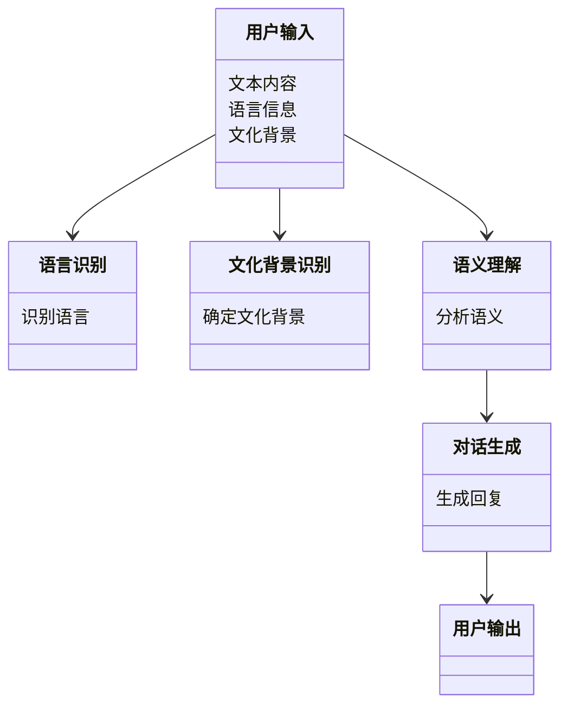

                 


# AI Agent的对话系统在跨文化交流中的应用

## 关键词：AI Agent, 对话系统, 跨文化交流, 自然语言处理, 多语言模型, 迁移学习

## 摘要：  
随着全球化的发展，跨文化交流变得越来越频繁。AI Agent的对话系统在跨文化交流中的应用，能够有效地解决不同文化背景下语言和语义的差异问题。本文从AI Agent和对话系统的背景出发，深入分析了跨文化交流中的语义和语用挑战，探讨了多语言模型和文化适配策略的设计方法，并通过具体的算法实现和项目实战，展示了如何构建高效的跨文化对话系统。文章最后总结了当前技术的局限性，并展望了未来的发展方向。

---

# 第1章: AI Agent与对话系统概述

## 1.1 AI Agent的基本概念  
AI Agent（人工智能代理）是一种能够感知环境、自主决策并执行任务的智能实体。在对话系统中，AI Agent通过自然语言处理（NLP）技术与用户进行交互，理解用户的需求并生成合适的回应。  

### 1.1.1 AI Agent的定义与特点  
AI Agent具有以下特点：  
1. **自主性**：能够独立感知环境并做出决策。  
2. **反应性**：能够实时响应用户的输入。  
3. **学习能力**：通过机器学习算法不断优化自身的对话能力。  
4. **可扩展性**：能够适应不同的应用场景和文化背景。  

### 1.1.2 对话系统的定义与分类  
对话系统是一种人机交互系统，通过自然语言处理技术实现与用户的对话。根据应用场景，对话系统可以分为以下几类：  
1. **任务导向型对话系统**：专注于完成特定任务，如预约、查询等。  
2. **开放领域对话系统**：能够与用户进行广泛话题的自由对话。  
3. **多语言对话系统**：支持多种语言的对话交互。  

### 1.1.3 跨文化交流中的对话系统需求  
在跨文化交流中，对话系统需要满足以下需求：  
1. **多语言支持**：能够理解并生成多种语言的对话内容。  
2. **文化适配**：能够根据不同的文化背景调整对话策略。  
3. **语义理解**：能够准确理解跨文化语境下的语义差异。  

---

## 1.2 跨文化对话的挑战  
跨文化交流中的对话系统面临以下挑战：  

### 1.2.1 文化差异对对话系统的影响  
不同文化背景下，语言的表达方式和语义含义存在显著差异。例如，某些文化更倾向于间接表达，而另一些文化则更直接。这种差异可能导致对话系统在理解和生成对话内容时出现误差。  

### 1.2.2 跨文化沟通中的语义分析难点  
跨文化语义分析的难点包括：  
1. **文化背景依赖**：某些词语或表达方式的含义可能因文化而异。  
2. **隐含意义的理解**：跨文化对话中，用户的真实意图可能隐藏在表面的语句背后。  
3. **语境的复杂性**：跨文化对话中，语境可能涉及多个文化背景和语言体系。  

### 1.2.3 跨文化对话系统的核心目标  
跨文化对话系统的核心目标是：  
1. **准确理解用户意图**：通过多语言和文化适配技术，准确解析用户的对话内容。  
2. **生成恰当的回应**：根据用户的语言和文化背景，生成符合语境的对话回复。  
3. **提升用户体验**：通过智能化的对话策略，为用户提供高效、自然的交互体验。  

---

## 1.3 对話系统在跨文化中的应用前景  
跨文化对话系统的应用前景广阔：  

### 1.3.1 跨文化对话系统的应用场景  
1. **全球客户服务**：企业通过跨文化对话系统为全球用户提供支持。  
2. **多语言内容生成**：利用对话系统生成多种语言的内容，如新闻、广告等。  
3. **教育领域**：帮助学习者在跨文化背景下进行语言学习和交流。  

### 1.3.2 跨文化对话系统的潜在价值  
1. **提升效率**：通过智能化的对话系统，减少跨文化沟通中的误解和误差。  
2. **降低成本**：自动化处理跨语言和跨文化对话，降低人工成本。  
3. **促进全球化**：支持更高效的跨国合作和信息交流。  

### 1.3.3 当前技术的局限性与未来发展方向  
当前，跨文化对话系统主要面临以下技术挑战：  
1. **多语言模型的泛化能力**：如何在多种语言和文化背景下保持模型的性能一致性。  
2. **文化适配的动态调整**：如何实时根据用户的文化背景调整对话策略。  
3. **语义理解的深度**：如何更准确地理解跨文化语境下的隐含意图。  

未来，随着NLP和机器学习技术的不断发展，跨文化对话系统将更加智能化和个性化。

---

## 1.4 本章小结  
本章介绍了AI Agent和对话系统的基本概念，分析了跨文化交流中的对话系统的挑战和需求，并探讨了其应用前景和未来发展方向。接下来的章节将深入探讨对话系统的技术基础和算法实现。

---

# 第2章: 对話系统的技术基础  

## 2.1 自然语言处理（NLP）基础  

### 2.1.1 NLP的核心任务与技术  
NLP的核心任务包括：  
1. **文本分割**：将连续文本分割为单词或短语。  
2. **词性标注**：给每个单词标注其词性（名词、动词等）。  
3. **句法分析**：分析句子的语法结构。  
4. **语义理解**：理解文本的语义含义。  

### 2.1.2 语言模型与对话生成  
语言模型是对话生成的基础。常见的语言模型包括：  
1. **n-gram模型**：基于概率的简单语言模型。  
2. **循环神经网络（RNN）**：适合处理序列数据的模型。  
3. **Transformer模型**：基于注意力机制的深度学习模型。  

对话生成基于语言模型，通过条件生成的方式，根据上下文生成合适的回复。  

### 2.1.3 对話系统的评价指标  
对话系统的评价指标包括：  
1. **BLEU**：基于精确匹配的评价指标。  
2. **ROUGE**：基于召回率的评价指标。  
3. **人类评价（Human Evaluation）**：通过人工评估对话的自然度和相关性。  

---

## 2.2 机器学习与深度学习  

### 2.2.1 机器学习的基本原理  
机器学习是一种通过数据训练模型的技术，分为监督学习、无监督学习和半监督学习。  

### 2.2.2 深度学习在NLP中的应用  
深度学习在NLP中的应用包括：  
1. **词嵌入**：通过Word2Vec等模型将单词映射为向量。  
2. **序列模型**：通过RNN和LSTM处理序列数据。  
3. **注意力机制**：通过Transformer模型实现全局注意力。  

### 2.2.3 Transformer模型与BERT的简介  
Transformer模型是一种基于注意力机制的深度学习模型，广泛应用于NLP任务。BERT（Bidirectional Encoder Representations from Transformers）是一种预训练的语言模型，能够同时理解文本的上下文信息。  

---

## 2.3 对話系统的算法原理  

### 2.3.1 基于规则的对话系统  
基于规则的对话系统通过预定义的规则生成回复。优点是简单易懂，但灵活性较差。  

### 2.3.2 基于统计的对话系统  
基于统计的对话系统通过训练数据生成回复，具有较强的泛化能力，但依赖于高质量的训练数据。  

### 2.3.3 基于深度学习的对话系统  
基于深度学习的对话系统通过端到端的模型生成回复，能够处理复杂的语义关系，但需要大量的训练数据和计算资源。  

---

## 2.4 本章小结  
本章介绍了对话系统的技术基础，包括NLP的核心任务、语言模型与对话生成，以及机器学习与深度学习在NLP中的应用。接下来的章节将探讨跨文化对话系统的挑战与解决方案。

---

# 第3章: 跨文化对话系统的挑战与解决方案  

## 3.1 跨文化对话中的语义分析  

### 3.1.1 文化差异对语义的影响  
文化差异可能导致同一词语在不同文化中有不同的含义。例如，中文中的“yes”可能表示同意，而英文中的“yes”可能表示肯定。  

### 3.1.2 跨文化语境下的语义解析  
跨文化语义解析需要考虑以下因素：  
1. **语言的多义性**：同一词语在不同文化中有不同的含义。  
2. **语境的复杂性**：对话中的上下文可能涉及多个文化背景。  
3. **文化背景的差异**：不同文化中的表达方式和习惯不同。  

### 3.1.3 語言与文化的关系模型  
语言与文化的关系模型包括：  
1. **语言决定论**：认为语言决定思维和文化。  
2. **文化决定论**：认为文化决定语言的使用方式。  
3. **语言与文化相互作用论**：语言和文化相互影响，共同塑造人类的思维和行为。  

---

## 3.2 跨文化对话中的语用分析  

### 3.2.1 语用学的基本概念  
语用学研究语言的实际使用方式，包括对话中的语境、意图和语气。  

### 3.2.2 跨文化对话中的语用推理  
跨文化对话中的语用推理需要考虑以下因素：  
1. **文化背景**：不同文化中的语用规则不同。  
2. **对话参与者的角色**：不同角色的对话策略不同。  
3. **对话的上下文**：对话的场景和目的影响语用推理。  

### 3.2.3 語用分析的算法实现  
语用分析的算法实现包括：  
1. **意图识别**：通过NLP技术识别对话中的用户意图。  
2. **情感分析**：分析对话中的情感倾向。  
3. **语境建模**：根据对话上下文生成合适的回复。  

---

## 3.3 跨文化对话系统的解决方案  

### 3.3.1 多语言模型的构建  
多语言模型的构建包括：  
1. **多语言数据收集**：收集多种语言的对话数据。  
2. **多语言模型训练**：使用多语言数据训练语言模型。  
3. **文化适配优化**：根据不同文化背景优化模型性能。  

### 3.3.2 文化适配的对话策略  
文化适配的对话策略包括：  
1. **文化背景识别**：通过用户信息识别文化背景。  
2. **文化适配生成**：根据文化背景生成合适的对话内容。  
3. **动态调整策略**：根据对话实时反馈调整策略。  

### 3.3.3 跨文化对话数据的处理与训练  
跨文化对话数据的处理与训练包括：  
1. **数据清洗**：去除噪声数据，确保数据质量。  
2. **数据标注**：标注文化背景和语义信息。  
3. **数据增强**：通过数据增强技术提升模型的泛化能力。  

---

## 3.4 本章小结  
本章分析了跨文化对话中的语义和语用挑战，并提出了多语言模型和文化适配策略的解决方案。接下来的章节将详细介绍跨文化对话系统的算法与模型。

---

# 第4章: 跨文化对话系统的算法与模型  

## 4.1 多语言NLP模型  

### 4.1.1 多语言模型的原理  
多语言模型通过共享多语言的语义信息，实现跨语言的语义理解。  

### 4.1.2 多语言模型的训练方法  
多语言模型的训练方法包括：  
1. **联合训练**：同时训练多种语言的模型参数。  
2. **多任务学习**：在多种任务上联合训练模型。  
3. **迁移学习**：将一种语言的模型迁移到其他语言。  

### 4.1.3 多语言模型在对话系统中的应用  
多语言模型在对话系统中的应用包括：  
1. **多语言对话生成**：生成多种语言的对话回复。  
2. **跨语言意图识别**：识别跨语言对话中的用户意图。  
3. **文化适配优化**：通过多语言模型优化对话系统的文化适配能力。  

---

## 4.2 跨文化对话的迁移学习  

### 4.2.1 迁移学习的基本原理  
迁移学习是一种通过将一个领域的知识迁移到另一个领域的技术。  

### 4.2.2 跨文化对话中的迁移策略  
跨文化对话中的迁移策略包括：  
1. **源域到目标域的迁移**：将一种文化背景的知识迁移到另一种文化背景。  
2. **领域适配**：通过迁移学习适配不同的对话领域。  
3. **模型适配**：通过迁移学习优化模型的性能。  

### 4.2.3 迁移学习在对话系统中的实现  
迁移学习在对话系统中的实现包括：  
1. **特征提取**：提取对话中的文化特征。  
2. **模型调整**：根据目标文化调整模型参数。  
3. **任务适配**：将源任务的模型适配到目标任务。  

---

## 4.3 跨文化对话的对抗训练  

### 4.3.1 对抗训练的基本原理  
对抗训练是一种通过对抗网络生成和判别器的对抗来提升模型性能的技术。  

### 4.3.2 跨文化对话中的对抗训练方法  
跨文化对话中的对抗训练方法包括：  
1. **跨语言对抗训练**：通过对抗网络生成跨语言的对话内容。  
2. **文化风格对抗训练**：通过对抗网络生成不同文化风格的对话内容。  
3. **语义对抗训练**：通过对抗网络生成不同语义的对话内容。  

### 4.3.3 对抗训练在对话系统中的效果提升  
对抗训练在对话系统中的效果提升包括：  
1. **语义多样性**：生成更多样化的对话内容。  
2. **文化适应性**：提升模型在不同文化背景下的适应能力。  
3. **对话质量**：提升对话的自然度和相关性。  

---

## 4.4 本章小结  
本章详细介绍了跨文化对话系统的算法与模型，包括多语言NLP模型、迁移学习和对抗训练的实现方法。接下来的章节将探讨跨文化对话系统的架构设计和项目实战。

---

# 第5章: 跨文化对话系统的架构设计  

## 5.1 背景介绍  
跨文化对话系统的架构设计需要考虑多语言支持、文化适配和语义理解等多个方面。

### 5.1.1 问题背景  
跨文化对话系统需要同时支持多种语言和文化背景，因此需要设计高效的架构来处理复杂的对话场景。

### 5.1.2 问题描述  
跨文化对话系统的架构设计需要解决以下问题：  
1. **多语言支持**：如何高效处理多种语言的对话请求。  
2. **文化适配**：如何根据用户的文化背景调整对话策略。  
3. **语义理解**：如何准确理解跨文化语境下的语义信息。  

---

## 5.2 系统功能设计  

### 5.2.1 领域模型  
领域模型是系统功能设计的核心，包括以下模块：  
1. **用户输入处理**：接收用户的对话请求。  
2. **语言识别**：识别用户输入的语言。  
3. **文化背景识别**：识别用户的文化背景。  
4. **语义理解**：理解用户输入的语义信息。  
5. **对话生成**：生成符合用户需求的对话回复。  

### 5.2.2 领域模型的Mermaid类图  


---

## 5.3 系统架构设计  

### 5.3.1 系统架构的Mermaid架构图  


### 5.3.2 系统架构的实现  
系统架构的实现包括：  
1. **前端交互界面**：接收用户输入并展示对话结果。  
2. **后端处理模块**：包括语言识别、文化背景识别和语义理解模块。  
3. **对话生成模块**：根据语义理解结果生成对话回复。  
4. **数据库支持**：存储多语言和文化背景的相关数据。  

---

## 5.4 系统接口设计  

### 5.4.1 系统接口的定义  
系统接口的定义包括：  
1. **用户输入接口**：接收用户的对话请求。  
2. **语言识别接口**：返回用户输入的语言。  
3. **文化背景识别接口**：返回用户的文化背景。  
4. **语义理解接口**：返回用户输入的语义信息。  
5. **对话生成接口**：返回对话回复。  

### 5.4.2 系统接口的实现  
系统接口的实现可以通过RESTful API或消息队列等方式完成。  

---

## 5.5 系统交互的Mermaid序列图  

```mermaid
sequenceDiagram
    用户 -->+> 系统: 发送对话请求
    系统 -> 语言识别模块: 识别语言
    系统 -> 文化背景识别模块: 确定文化背景
    系统 -> 语义理解模块: 分析语义
    语义理解模块 -> 对话生成模块: 生成回复
    系统 --> 用户: 返回对话回复
```

---

## 5.6 本章小结  
本章详细设计了跨文化对话系统的架构，包括功能模块、系统架构和接口设计。接下来的章节将通过项目实战展示系统的实现过程。

---

# 第6章: 跨文化对话系统的项目实战  

## 6.1 项目介绍  

### 6.1.1 项目背景  
本项目旨在开发一个支持多语言和文化适配的对话系统，用于跨文化交流。  

### 6.1.2 项目目标  
项目目标包括：  
1. 实现多语言对话功能。  
2. 提供文化适配的对话策略。  
3. 提升对话系统的语义理解能力。  

---

## 6.2 项目环境安装  

### 6.2.1 环境要求  
1. **Python 3.8以上版本**  
2. **TensorFlow或PyTorch框架**  
3. **Hugging Face Transformers库**  

### 6.2.2 安装依赖  
```bash
pip install tensorflow transformers
```

---

## 6.3 系统核心实现  

### 6.3.1 多语言模型的加载与训练  
```python
from transformers import AutoTokenizer, AutoModelForMaskedLM

tokenizer = AutoTokenizer.from_pretrained("bert-base-multilingual-cased")
model = AutoModelForMaskedLM.from_pretrained("bert-base-multilingual-cased")
```

### 6.3.2 文化适配策略的实现  
```python
def cultural_adaptation(user_input, cultural_background):
    # 根据文化背景调整对话策略
    pass
```

### 6.3.3 对话生成的实现  
```python
def generate_response(user_input, model, tokenizer):
    # 使用模型生成对话回复
    pass
```

---

## 6.4 代码应用解读与分析  

### 6.4.1 多语言模型的加载与训练  
上述代码加载了一个多语言BERT模型，并使用其进行掩码语言模型的训练。  

### 6.4.2 文化适配策略的实现  
文化适配策略的实现需要根据用户的文化背景调整对话生成的参数，例如调整回复的语气和表达方式。  

### 6.4.3 对话生成的实现  
对话生成的实现基于预训练的多语言模型，通过微调或生成式方法生成符合用户需求的对话回复。  

---

## 6.5 实际案例分析  

### 6.5.1 案例背景  
假设用户来自不同的文化背景，使用不同的语言与系统进行对话。  

### 6.5.2 系统响应  
系统根据用户的语言和文化背景生成合适的回复。  

### 6.5.3 案例分析  
通过具体案例分析，展示系统在跨文化对话中的实际应用效果。  

---

## 6.6 项目小结  
本章通过项目实战展示了跨文化对话系统的实现过程，包括环境安装、核心代码实现和案例分析。接下来的章节将总结全文并展望未来发展方向。

---

# 第7章: 总结与展望  

## 7.1 全文总结  
本文详细探讨了AI Agent的对话系统在跨文化交流中的应用，分析了跨文化对话中的语义和语用挑战，并提出了多语言模型和文化适配策略的解决方案。通过项目实战展示了系统的实现过程，为跨文化对话系统的开发提供了理论和实践指导。

## 7.2 未来展望  
未来，随着NLP和机器学习技术的不断发展，跨文化对话系统将更加智能化和个性化。主要的发展方向包括：  
1. **多模态对话**：结合视觉、听觉等多种模态信息，提升对话系统的交互能力。  
2. **动态文化适配**：实时根据用户的文化背景动态调整对话策略。  
3. **深度语义理解**：通过更复杂的模型提升对话系统的语义理解能力。  

## 7.3 最佳实践Tips  
1. **数据多样性**：确保训练数据涵盖多种语言和文化背景。  
2. **文化敏感性**：在设计对话系统时，充分考虑不同文化背景的特点。  
3. **用户反馈**：通过用户反馈不断优化对话系统的性能。  

## 7.4 本章小结  
本文总结了AI Agent对话系统在跨文化交流中的应用，并展望了未来的发展方向。  

---

# 作者：AI天才研究院/AI Genius Institute & 禅与计算机程序设计艺术 /Zen And The Art of Computer Programming

