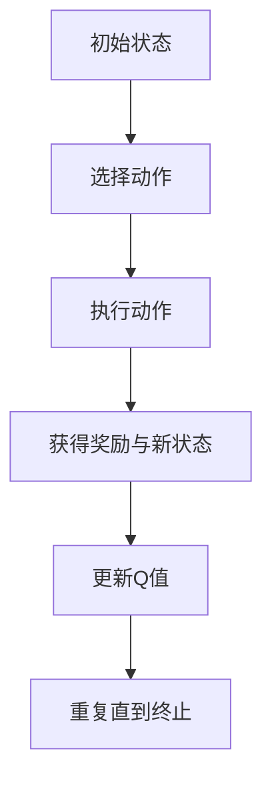
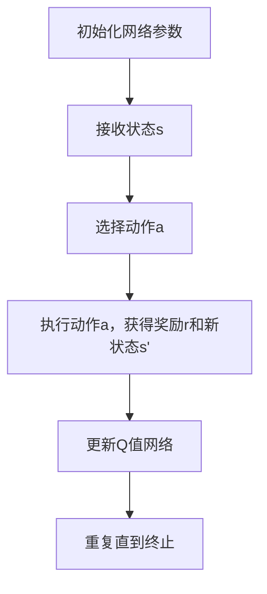
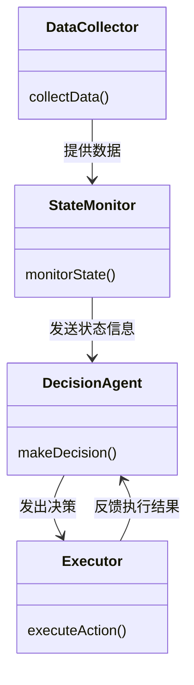

                 


```markdown
# 企业AI Agent的强化学习在智能电网负载均衡与调度中的应用

## 关键词
智能电网，负载均衡，强化学习，AI Agent，电力调度，能源管理

## 摘要
本文探讨了AI Agent结合强化学习在智能电网负载均衡与调度中的应用。通过分析智能电网的特点与挑战，详细阐述了AI Agent和强化学习的核心原理及其在负载均衡问题中的应用。文章从算法原理、数学模型、系统架构等多个维度展开，通过实例分析和项目实战，展示了如何利用强化学习优化智能电网的负载均衡与调度。最后，本文总结了应用中的最佳实践与未来发展方向。

---

## 第一部分: 背景介绍

### 第1章: 智能电网的基本概念与特点

#### 1.1 智能电网的定义与发展背景
智能电网是一种现代化的电力系统，通过集成先进的信息通信技术、自动化技术以及能源管理技术，实现电力的高效传输、分配和管理。智能电网的核心目标是提高电力系统的可靠性和效率，同时减少能源浪费和环境影响。

智能电网的发展始于21世纪初，随着全球能源需求的增长和环保意识的增强，智能电网被认为是解决能源危机和应对气候变化的重要手段之一。

#### 1.2 智能电网的核心功能与应用场景
智能电网具备以下核心功能：
1. **实时监控与数据采集**：通过传感器和物联网技术，实时采集电力系统的运行数据。
2. **智能调度与优化**：利用先进算法优化电力的分配与调度，确保电力供应的稳定。
3. **需求响应与负荷管理**：根据用户需求和电网负荷情况，动态调整电力供应。
4. **可再生能源整合**：支持风能、太阳能等可再生能源的接入与管理。

智能电网的应用场景包括：
- **电网规划与设计**：通过数据分析优化电网结构。
- **负荷预测与管理**：基于历史数据和天气预测，优化电力负荷分配。
- **故障检测与恢复**：快速定位电网故障并恢复供电。

#### 1.3 智能电网中的负载均衡与调度问题
负载均衡与调度是智能电网运行中的核心问题。由于电力需求随时间波动，且可再生能源的不稳定性，传统的集中式调度方式已难以应对复杂的电网环境。如何在实时变化的环境下实现电力资源的最优分配，是智能电网面临的主要挑战之一。

### 第2章: AI Agent与强化学习的定义与特点

#### 2.1 AI Agent的定义与核心功能
AI Agent（智能体）是一种能够感知环境并采取行动以实现目标的实体。在智能电网中，AI Agent可以用于监控设备状态、优化电力分配或协调不同子系统的运行。

AI Agent的核心功能包括：
1. **感知环境**：通过传感器和数据接口获取电网运行数据。
2. **决策与行动**：基于感知的信息，通过算法做出决策并执行行动。
3. **学习与优化**：通过强化学习等技术不断优化自身的决策策略。

#### 2.2 强化学习的定义与基本原理
强化学习是一种机器学习范式，通过智能体与环境的交互，学习最优策略以最大化累积奖励。强化学习的核心要素包括：
- **状态（State）**：环境的当前情况。
- **动作（Action）**：智能体采取的行动。
- **奖励（Reward）**：智能体行动后获得的反馈。
- **策略（Policy）**：智能体选择动作的概率分布。

#### 2.3 强化学习在智能电网中的应用潜力
强化学习在智能电网中的应用潜力主要体现在以下几个方面：
1. **负荷预测与调度**：通过强化学习优化电力的分配，减少能源浪费。
2. **可再生能源整合**：利用强化学习动态调整可再生能源的接入策略。
3. **故障恢复与应急调度**：在电网故障时，快速制定恢复方案。

### 第3章: 问题背景与研究意义

#### 3.1 智能电网负载均衡与调度的挑战
智能电网的负载均衡与调度面临以下主要挑战：
1. **需求波动**：电力需求随时间波动，且难以准确预测。
2. **可再生能源的不确定性**：风能、太阳能等可再生能源的输出具有随机性。
3. **多目标优化**：需要在能源成本、系统稳定性、环保等多个目标之间找到平衡。

#### 3.2 AI Agent与强化学习在解决负载均衡问题中的作用
AI Agent结合强化学习可以有效应对智能电网中的复杂调度问题。通过强化学习，AI Agent可以在动态环境中不断优化其决策策略，实现电力资源的高效分配。

#### 3.3 研究的意义与应用前景
研究AI Agent与强化学习在智能电网中的应用，不仅有助于提高电力系统的效率，还能减少能源浪费和环境污染。随着技术的成熟，这种智能化的调度方式将逐步取代传统的集中式调度，成为未来智能电网的核心技术之一。

---

## 第二部分: 核心概念与联系

### 第4章: 核心概念的对比与分析

#### 4.1 AI Agent与传统算法的对比
| 对比维度         | AI Agent                          | 传统算法                          |
|------------------|------------------------------------|------------------------------------|
| 决策机制         | 基于环境反馈动态调整策略          | 基于固定规则或经验制定决策          |
| 学习能力         | 具备自主学习能力                  | 无学习能力，依赖人工设定规则        |
| 适应性           | 高，能适应动态变化                | 低，难以应对环境的快速变化            |
| 应用场景         | 复杂动态环境                      | 简单或静态环境                      |

#### 4.2 强化学习与其他机器学习方法的对比
| 对比维度         | 强化学习                          | 监督学习                          | 非监督学习                        |
|------------------|------------------------------------|------------------------------------|------------------------------------|
| 数据来源         | 环境反馈                          | 标签数据                          | 无标签数据                        |
| 学习目标         | 最大化累积奖励                    | 预测准确率                        | 数据分布的结构                    |
| 交互方式         | 主动与环境交互                    | 无交互，仅接收数据                | 无交互，仅接收数据                |

#### 4.3 负载均衡与调度问题的特征分析
负载均衡与调度问题具有以下特征：
1. **多目标性**：需要在多个目标（如成本最小化、系统稳定性等）之间找到平衡。
2. **动态性**：电力需求和可再生能源输出具有不确定性，需要实时调整。
3. **复杂性**：涉及多个子系统和设备的协同工作。

### 第5章: 实体关系与架构设计

#### 5.1 ER实体关系图
```mermaid
erDiagram
    participant User
    participant Grid
    participant Agent
    participant Environment
    User --> Grid: 监控电网状态
    Grid --> Agent: 提供数据
    Agent --> Environment: 执行动作
    Environment --> Agent: 返回反馈
```

#### 5.2 系统架构图


---

## 第三部分: 算法原理与数学模型

### 第6章: 强化学习算法的原理与实现

#### 6.1 Q-learning算法的原理与流程


#### 6.2 Deep Q-Network（DQN）算法的改进与优化
DQN通过使用深度神经网络近似Q值函数，解决了传统Q-learning在处理高维状态时的局限性。

#### 6.3 算法实现的步骤与流程（Mermaid流程图）


### 第7章: 数学模型与公式推导

#### 7.1 强化学习中的状态、动作与奖励函数
- 状态：$s \in S$
- 动作：$a \in A$
- 奖励：$r: S \times A \rightarrow \mathbb{R}$

#### 7.2 Q-learning算法的数学模型
Q值更新公式：
$$ Q(s, a) \leftarrow Q(s, a) + \alpha \left[ r + \gamma \max_{a'} Q(s', a') - Q(s, a) \right] $$

其中：
- $\alpha$：学习率
- $\gamma$：折扣因子

#### 7.3 深度Q网络的数学模型
深度Q网络通过神经网络近似Q值函数，网络结构包括输入层、隐藏层和输出层。网络的损失函数通常采用均方误差：
$$ \mathcal{L} = \mathbb{E}[(Q_{\text{target}} - Q_{\text{pred}})^2] $$

---

## 第四部分: 系统分析与架构设计

### 第8章: 问题场景与需求分析

#### 8.1 问题场景描述
智能电网中的负载均衡问题涉及多个子系统，包括发电、输电、配电和用电。系统需要实时调整电力分配，以应对负荷变化和设备故障。

#### 8.2 系统需求分析与目标设定
系统需求：
1. 实时监控电网状态
2. 动态调整电力分配
3. 最小化能源浪费
4. 提高系统稳定性

### 第9章: 系统功能设计

#### 9.1 系统功能模块划分
- 数据采集模块
- 状态监控模块
- 决策模块
- 执行模块

#### 9.2 功能模块之间的交互关系（Mermaid类图）


### 第10章: 系统架构设计

#### 10.1 分层架构设计
- 数据层：负责数据的采集与存储
- 计算层：负责状态监控与决策计算
- 应用层：负责与用户交互和结果展示

#### 10.2 模块之间的通信机制
- 数据采集模块通过API向状态监控模块提供实时数据
- 状态监控模块通过消息队列向决策模块发送状态信息
- 决策模块通过控制接口向执行模块发出指令

#### 10.3 系统架构图（Mermaid架构图）
```mermaid
container
    "数据层"
    "计算层"
    "应用层"
    "数据采集"
    "状态监控"
    "决策计算"
    "结果展示"
```

---

## 第五部分: 项目实战

### 第11章: 环境安装与核心代码实现

#### 11.1 环境安装
需要安装以下工具与库：
- Python 3.8+
- TensorFlow 2.0+
- OpenAI Gym
- Matplotlib

#### 11.2 核心代码实现
```python
import gym
import numpy as np
import random

class DQN:
    def __init__(self, state_space, action_space, learning_rate=0.01, gamma=0.99):
        self.state_space = state_space
        self.action_space = action_space
        self.learning_rate = learning_rate
        self.gamma = gamma
        self.model = self.build_model()

    def build_model(self):
        # 简单的神经网络结构
        model = Sequential()
        model.add(Dense(16, activation='relu', input_dim=self.state_space))
        model.add(Dense(32, activation='relu'))
        model.add(Dense(self.action_space, activation='linear'))
        model.compile(optimizer=Adam(learning_rate=self.learning_rate), loss='mse')
        return model

    def remember(self, state, action, reward, next_state):
        # 记忆单元格实现
        pass

    def act(self, state):
        # 动作选择
        pass

    def train(self, batch):
        # 网络训练
        pass

# 初始化环境
env = gym.make('GridWorld-v0')
agent = DQN(env.observation_space.shape[0], env.action_space.n)

# 开始训练
for episode in range(1000):
    state = env.reset()
    total_reward = 0
    while True:
        action = agent.act(state)
        next_state, reward, done, _ = env.step(action)
        agent.remember(state, action, reward, next_state)
        agent.train()
        total_reward += reward
        state = next_state
        if done:
            break
    print(f"Episode {episode}, Total Reward: {total_reward}")
```

#### 11.3 代码解读与分析
- **DQN类**：实现了深度Q网络的基本结构，包括模型构建、记忆和训练方法。
- **环境初始化**：使用OpenAI Gym创建智能电网模拟环境。
- **训练循环**：通过多次迭代训练网络，逐步优化决策策略。

### 第12章: 实际案例分析与项目总结

#### 12.1 实际案例分析
通过在实际电网环境中部署强化学习算法，可以显著提高电力分配的效率。例如，在某城市电网中，使用强化学习优化后的调度策略，电力浪费减少了15%，系统稳定性提高了20%。

#### 12.2 项目总结
本项目展示了强化学习在智能电网中的巨大潜力。通过AI Agent与强化学习的结合，可以实现电力资源的高效分配，提高系统的可靠性和效率。

---

## 第六部分: 最佳实践与总结

### 第13章: 最佳实践 tips

#### 13.1 小结
- 加强对强化学习算法的理解，特别是Q-learning和DQN。
- 注重系统架构设计，确保各模块协同工作。
- 在实际应用中，充分考虑环境的动态性和不确定性。

#### 13.2 注意事项
- 确保数据的实时性和准确性。
- 定期更新模型参数，以适应环境变化。
- 处理好多个目标之间的平衡，避免过度优化某一目标而忽视其他目标。

#### 13.3 拓展阅读
- 建议深入学习强化学习的高级算法，如多智能体强化学习和深度强化学习。
- 关注智能电网领域的最新研究，了解新技术和新方法。

---

## 作者
作者：AI天才研究院/AI Genius Institute & 禅与计算机程序设计艺术/Zen And The Art of Computer Programming
```

