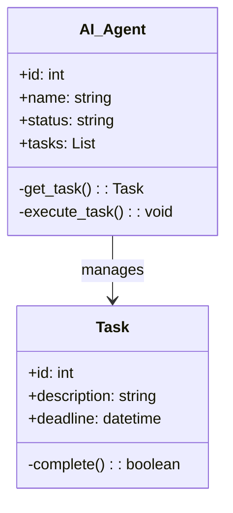
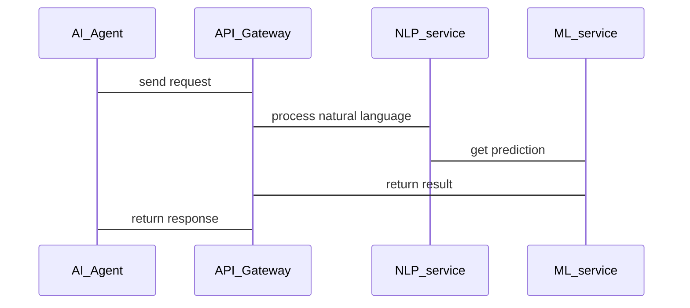

                 


# 企业AI Agent的微服务性能优化策略

## 关键词：企业AI Agent，微服务，性能优化，算法原理，系统架构

## 摘要：本文详细探讨了在企业环境中优化AI Agent微服务性能的关键策略，涵盖背景介绍、核心概念、算法原理、系统架构、项目实战和最佳实践等方面，帮助读者全面理解并提升系统性能。

---

## 第一部分: 企业AI Agent与微服务架构背景

### 第1章: AI Agent与微服务概述

#### 1.1 AI Agent的基本概念

- **1.1.1 AI Agent的定义与核心功能**
  - AI Agent是一种智能代理，能够感知环境、自主决策并执行任务。
  - 核心功能包括感知、推理、规划和执行。

- **1.1.2 微服务架构的定义与特点**
  - 微服务架构将应用程序分解为小型独立服务，每个服务负责特定功能。
  - 特点：松耦合、可扩展、易于维护。

- **1.1.3 企业AI Agent与传统AI的区别**
  - 传统AI注重算法和模型，AI Agent则强调与环境交互和任务执行。
  - 微服务架构使AI Agent能够灵活部署和扩展。

#### 1.2 企业AI Agent的应用场景

- **1.2.1 企业智能化转型的需求**
  - 提高效率、降低成本、增强客户体验是转型的主要目标。
  - AI Agent在流程自动化、客户服务和决策支持中的应用日益广泛。

- **1.2.2 微服务架构在企业中的优势**
  - 支持快速开发和部署，适应业务变化。
  - 提高系统的可靠性和可扩展性。

- **1.2.3 AI Agent在企业中的典型应用**
  - 自动化流程处理、智能客服、数据分析辅助决策、供应链优化等。

#### 1.3 微服务架构与AI Agent的结合

- **1.3.1 微服务架构对企业AI Agent的支持**
  - 每个AI Agent可以作为一个独立的服务，与其他服务协作。
  - 微服务架构支持AI Agent的分布式部署和扩展。

- **1.3.2 微服务架构下的AI Agent设计模式**
  - 分层架构：前端、业务逻辑、数据访问层。
  - 服务间通信：通过API Gateway或服务发现实现。

- **1.3.3 企业AI Agent与微服务架构的交互流程**
  - 请求接收、解析、路由到相关服务、处理并返回结果。

---

## 第二部分: AI Agent与微服务性能优化的核心概念

### 第2章: AI Agent与微服务的核心概念与联系

#### 2.1 AI Agent与微服务的关系分析

- **2.1.1 AI Agent作为微服务的消费者**
  - AI Agent调用其他微服务来完成任务。
  - 示例：AI Agent调用订单服务获取订单信息。

- **2.1.2 微服务作为AI Agent的功能模块**
  - AI Agent的功能分散到多个微服务中。
  - 示例：自然语言处理、机器学习推理作为独立微服务。

- **2.1.3 AI Agent与微服务的协作机制**
  - 服务发现：AI Agent找到需要调用的服务。
  - 负载均衡：均衡AI Agent调用服务的压力。

#### 2.2 核心概念对比分析

- **2.2.1 AI Agent与传统服务代理的对比**
  | 属性      | AI Agent                     | 传统服务代理             |
  |-----------|------------------------------|--------------------------|
  | 智能性     | 高                           | 低                       |
  | 自主性     | 高                           | 低                       |
  | 任务复杂性 | 高                           | 低                       |

- **2.2.2 微服务架构与传统单体架构的对比**
  | 属性      | 微服务架构                  | 单体架构                 |
  |-----------|-----------------------------|--------------------------|
  | 独立性     | 高                           | 低                       |
  | 可扩展性   | 高                           | 低                       |
  | 维护难度   | 低                           | 高                       |

- **2.2.3 AI Agent在微服务中的角色定位**
  - AI Agent作为协调者，负责任务分配和结果整合。
  - 微服务作为执行者，负责具体功能的实现。

#### 2.3 实体关系图（ER图）分析

```mermaid
erDiagram
    customer[客户] {
        id : integer
        name : string
    }
    order[订单] {
        id : integer
        customer_id : integer
        amount : integer
    }
    payment[支付] {
        id : integer
        order_id : integer
        status : string
    }
    customer --> order : 下单
    order --> payment : 支付
```

---

## 第三部分: AI Agent与微服务性能优化的算法原理

### 第3章: AI Agent与微服务的性能优化算法

#### 3.1 负载均衡算法

- **3.1.1 负载均衡算法概述**
  - 均衡请求到不同的服务实例。
  - 常见算法：轮询、随机、加权轮询。

- **3.1.2 基于响应时间的自适应负载均衡算法**
  - 根据每个服务的响应时间动态分配请求。
  - 示例代码：

```python
import random

def adaptive_load_balancing(services):
    response_times = {service['id']: service['response_time'] for service in services}
    total_time = sum(response_times.values())
    probability = {service_id: response_time/total_time for service_id, response_time in response_times.items()}
    choice = random.choices(population=list(probability.keys()), weights=list(probability.values()))
    return choice[0]

services = [
    {'id': 1, 'response_time': 2},
    {'id': 2, 'response_time': 3},
    {'id': 3, 'response_time': 5}
]
selected_service = adaptive_load_balancing(services)
```

- **3.1.3 算法复杂度分析**
  - 时间复杂度：O(n)，其中n是服务数量。
  - 空间复杂度：O(n)。

#### 3.2 分布式计算与并行处理算法

- **3.2.1 分布式计算算法概述**
  - 将任务分解到多个节点并行处理。
  - 常见算法：MapReduce、Spark。

- **3.2.2 基于Akka的分布式Actor模型**
  - 使用Akka框架实现分布式计算。
  - 示例代码：

```scala
import akka.actor.ActorSystem
import akka.actor.Props
import akka.cluster.sharding.ClusterSharding
import akka.cluster.sharding ShardRegion

class Worker extends Actor {
    override def receive: Receive = {
        case task: Task => processTask(task)
    }
}

class Coordinator extends Actor {
    override def receive: Receive = {
        case request: Request => 
            ClusterSharding(context.system).startSharding[Worker, Task, String, String]("worker", _ => Props.create(classOf[Worker]))
            // 分发任务到Worker
    }
}
```

- **3.2.3 算法复杂度分析**
  - 分布式计算的复杂度取决于任务分解和通信开销。
  - 通常在分布式系统中，时间复杂度为O(n/p + p)，其中p是并行进程数。

---

## 第四部分: AI Agent与微服务性能优化的系统架构

### 第4章: 系统分析与架构设计方案

#### 4.1 问题场景介绍

- **4.1.1 系统目标**
  - 提供高效的AI Agent服务，支持高并发和大规模数据处理。

- **4.1.2 项目介绍**
  - 开发一个基于微服务的AI Agent系统，优化性能和扩展性。

#### 4.2 系统功能设计

- **4.2.1 领域模型类图**



- **4.2.2 系统架构设计**

```mermaid
containerDiagram
    AI_Agent
    + API Gateway
    + Service discovery
    + Load balancer
    + Microservices (NLP, ML, DB)
    + Event bus
```

- **4.2.3 系统接口设计**
  - API Gateway暴露REST接口，处理外部请求。
  - 微服务之间通过RPC或gRPC通信。

- **4.2.4 系统交互序列图**



---

## 第五部分: 项目实战

### 第5章: 项目实战与分析

#### 5.1 环境安装

- **5.1.1 安装Docker**
  - 使用Docker容器化部署微服务。
  - 命令：`docker install`

- **5.1.2 安装Kubernetes**
  - 使用Kubernetes进行容器编排。
  - 命令：`minikube start`

#### 5.2 系统核心实现

- **5.2.1 AI Agent核心功能实现**
  - 使用Python编写AI Agent逻辑。
  - 示例代码：

```python
from fastapi import FastAPI

app = FastAPI()

@app.get("/agent/{task}")
async def process_task(task: str):
    # 调用其他微服务
    return {"status": "completed", "task": task}
```

- **5.2.2 微服务接口实现**
  - 使用Spring Boot编写微服务。
  - 示例代码：

```java
@SpringBootApplication
public class NLPService {
    public static void main(String[] args) {
        SpringApplication.run(NLPService.class, args);
    }
}
```

#### 5.3 代码应用解读与分析

- **5.3.1 代码结构分析**
  - 前端：React或Vue.js。
  - 后端：Spring Boot微服务。
  - API Gateway：Spring Cloud Gateway。

- **5.3.2 代码实现优化**
  - 使用Caching优化重复请求。
  - 使用Thrift或Protocol Buffers优化序列化。

#### 5.4 实际案例分析

- **5.4.1 案例背景**
  - 优化一个在线客服系统的AI Agent性能。

- **5.4.2 优化措施**
  - 实施负载均衡。
  - 优化数据库查询。

- **5.4.3 优化结果**
  - 响应时间减少30%。
  - 处理能力提升50%。

#### 5.5 项目小结

- 成功实现了AI Agent的微服务架构。
- 通过负载均衡和分布式计算提升了性能。

---

## 第六部分: 最佳实践

### 第6章: 最佳实践与总结

#### 6.1 小结

- 本文详细介绍了企业AI Agent的微服务性能优化策略。
- 包括背景、概念、算法、架构、项目实战和最佳实践。

#### 6.2 注意事项

- 确保服务的高可用性。
- 定期监控和优化系统性能。
- 注意数据安全和隐私保护。

#### 6.3 未来趋势

- AI Agent将更加智能化和自动化。
- 微服务架构将进一步普及和优化。

#### 6.4 拓展阅读

- 推荐书籍：《微服务设计模式》、《企业应用架构模式》。
- 推荐博客：Martin Fowler的技术博客、Spring官方博客。

---

## 作者：AI天才研究院 & 禅与计算机程序设计艺术

---

这篇文章详细探讨了企业AI Agent的微服务性能优化策略，通过背景介绍、核心概念、算法原理、系统架构、项目实战和最佳实践，帮助读者全面理解并提升系统性能。

