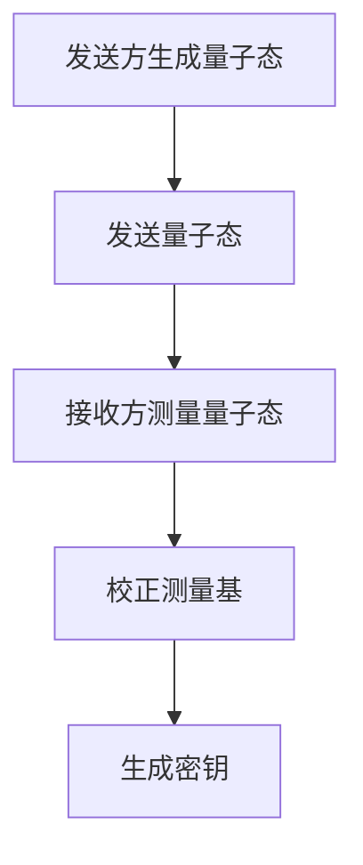
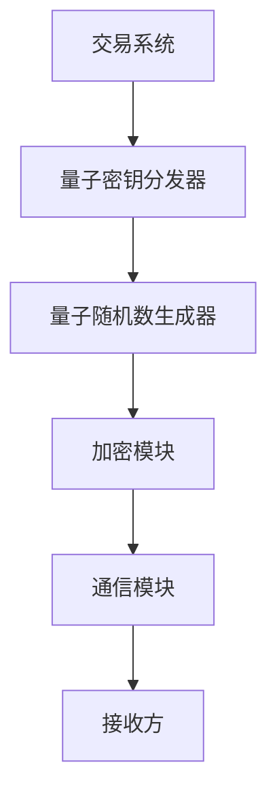
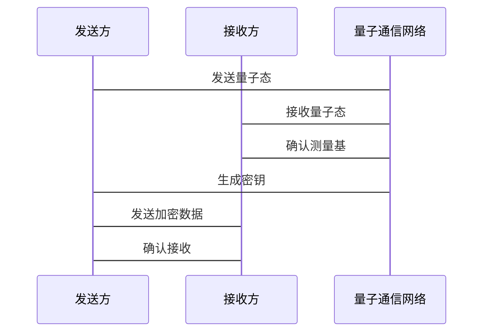

                 


# 《全球股市估值与量子通信在金融安全中的应用》

---

## 关键词：全球股市估值、量子通信、金融安全、量子加密算法、量子随机数生成器、金融数据保护

---

## 摘要：  
本文探讨了全球股市估值的核心方法与量子通信技术在金融安全中的潜在应用。通过分析股市估值的关键指标与量子通信的基本原理，本文揭示了量子通信如何提升金融数据的安全性与隐私保护能力。文章详细介绍了量子通信在金融安全中的具体应用场景，包括量子加密算法与量子随机数生成器的实现原理，并结合实际案例分析了量子通信技术在股市估值中的潜在价值。通过本文的分析，读者将深入了解如何利用量子通信技术提升金融数据的安全性，为未来的金融科技创新提供新的思路。

---

## 第一部分: 全球股市估值与量子通信的背景与基础

---

### 第1章: 全球股市估值概述

#### 1.1 股市估值的核心概念

##### 1.1.1 股市估值的定义与意义  
股市估值是指通过对公司财务数据、市场环境和行业趋势的分析，估算公司股票的内在价值，以确定其在市场上的合理价格。股市估值的核心意义在于帮助投资者做出理性投资决策，减少信息不对称带来的风险。

##### 1.1.2 股市估值的主要方法  
股市估值的主要方法包括：  
1. **相对估值法**：通过比较公司与可比公司的估值指标（如市盈率、市净率等）来确定股票价值。  
2. **绝对估值法**：通过现金流折现模型（DCF）等方法，基于公司未来现金流的现值来估算股票价值。  
3. **指数估值法**：通过分析市场整体估值水平（如股息率、市盈率等）来判断股市的整体估值状态。  

##### 1.1.3 股市估值的关键指标  
常见的股市估值指标包括：  
- **市盈率（P/E）**：股价与每股收益的比率，反映市场对公司的估值水平。  
- **市净率（P/B）**：股价与每股净资产的比率，适用于评估资产密集型行业。  
- **股息率（Dividend Yield）**：股息与股价的比率，反映股票的分红能力。  

#### 1.2 量子通信的基本原理

##### 1.2.1 量子通信的定义与特点  
量子通信是一种基于量子力学原理的通信技术，其核心特点包括：  
- **量子叠加**：信息以量子态表示，能够在同一时刻处于多个状态。  
- **量子纠缠**：两个或多个量子系统之间存在关联，无论距离多远，信息可以瞬间传递。  
- **不可克隆**：量子信息无法被复制，保证了通信的安全性。  

##### 1.2.2 量子通信的核心技术  
量子通信的主要技术包括：  
1. **量子密钥分发（QKD）**：通过量子态传输密钥，确保密钥的分发过程无法被窃听。  
2. **量子隐形传态**：利用量子纠缠技术，将信息从一个地点瞬间传输到另一个地点。  
3. **量子随机数生成**：基于量子测量的随机性，生成真正的随机数，用于加密算法。  

##### 1.2.3 量子通信与经典通信的区别  
量子通信与经典通信的主要区别在于：  
- **安全性**：量子通信基于量子力学原理，具有绝对的安全性，而经典通信易受窃听攻击。  
- **传输速度**：量子通信可以在更短的时间内完成信息传输，尤其是在远距离通信中表现更优。  

#### 1.3 量子通信在金融领域的应用前景

##### 1.3.1 金融安全的需求与挑战  
金融行业的核心需求是数据安全与隐私保护，尤其是在高频交易、跨境支付和金融数据传输中，对通信安全性要求极高。然而，传统加密算法面临被量子计算机破解的风险，金融行业亟需更先进的安全技术。

##### 1.3.2 量子通信在金融安全中的潜在应用  
量子通信在金融领域的潜在应用包括：  
1. **金融数据加密传输**：利用量子密钥分发技术，确保金融数据在传输过程中的安全性。  
2. **金融交易验证**：通过量子随机数生成器，提高交易验证的安全性与可靠性。  
3. **金融风险管理**：结合量子通信技术，实时监测金融市场波动，提升风险预警能力。  

##### 1.3.3 量子通信技术的现状与发展趋势  
目前，量子通信技术仍处于实验和测试阶段，但其在金融领域的应用前景广阔。未来，随着量子计算机的普及，量子通信将成为金融行业数据保护的核心技术之一。

---

### 第2章: 全球股市估值的核心算法与模型

#### 2.1 常见的股市估值模型

##### 2.1.1 市盈率模型  
市盈率模型通过比较股票的市盈率与行业平均水平，判断股票的估值是否合理。公式为：  
$$ \text{市盈率} = \frac{\text{股价}}{\text{每股收益}} $$  

##### 2.1.2 市净率模型  
市净率模型通过比较股票的市净率与行业平均水平，适用于评估资产密集型行业。公式为：  
$$ \text{市净率} = \frac{\text{股价}}{\text{每股净资产}} $$  

##### 2.1.3 股息率模型  
股息率模型通过比较股票的股息率与行业平均水平，反映股票的分红能力。公式为：  
$$ \text{股息率} = \frac{\text{每股股息}}{\text{股价}} $$  

##### 2.1.4 现金流折现模型  
现金流折现模型（DCF）是绝对估值法的核心，通过预测公司未来现金流的现值来估算股票价值。公式为：  
$$ V = \sum_{t=1}^{n} \frac{\text{现金流}_t}{(1 + r)^t} $$  
其中，$r$为折现率，$n$为预测年限。  

#### 2.2 量子通信在估值模型中的应用

##### 2.2.1 量子随机数生成器在估值模型中的作用  
量子随机数生成器可以为估值模型提供高度随机的参数，例如随机选择可比公司或随机生成未来现金流预测。这种随机性可以提高估值模型的鲁棒性与准确性。

##### 2.2.2 量子加密算法在估值数据保护中的应用  
通过量子加密算法，可以保护估值数据的安全性，防止数据在传输过程中被窃取或篡改，确保估值结果的准确性和可靠性。

#### 2.3 算法实现与案例分析

##### 2.3.1 算法实现步骤  
1. **数据收集**：收集目标公司的财务数据与行业数据。  
2. **模型选择**：根据具体情况选择合适的估值模型（如市盈率模型、DCF模型）。  
3. **参数生成**：使用量子随机数生成器生成随机参数。  
4. **估值计算**：根据模型公式计算股票的内在价值。  
5. **结果分析**：对比估值结果与市场价，判断股票是否被高估或低估。  

##### 2.3.2 算法实现的Python代码示例  
```python
import numpy as np
from qiskit import QuantumCircuit, Aer, execute

# 示例：使用量子随机数生成器生成随机参数
def generate_quantum_random_number(n=1):
    circuit = QuantumCircuit(n)
    circuit.h(range(n))
    circuit.measure(range(n))
    result = Aer.get_backend('qasm_simulator').run(circuit).result()
    return int(result.get_counts().keys()[0], 2) / (2**n)

# 示例：市盈率模型估值
def calculate_market_price(revenue, net_income, pe_ratio):
    market_price = pe_ratio * (revenue / net_income)
    return market_price

# 示例：现金流折现模型估值
def calculate_dcf(cash_flows, discount_rate):
    present_value = sum(cash_flow / (1 + discount_rate)**t for t, cash_flow in enumerate(cash_flows))
    return present_value
```

##### 2.3.3 算法实现的数学模型与公式  
市盈率模型的数学公式：  
$$ \text{市场价} = \text{市盈率} \times \frac{\text{收入}}{\text{净利润}} $$  

现金流折现模型的数学公式：  
$$ V = \sum_{t=1}^{n} \frac{\text{现金流}_t}{(1 + r)^t} $$  

##### 2.3.4 算法实现的案例分析  
假设某公司未来3年的现金流分别为100万、120万和150万，折现率为10%。根据现金流折现模型，计算其现值为：  
$$ V = \frac{100}{1.1} + \frac{120}{1.1^2} + \frac{150}{1.1^3} \approx 301.88 \text{万元} $$  

---

### 第3章: 量子通信在金融安全中的核心原理

#### 3.1 量子通信的基本原理

##### 3.1.1 量子叠加原理  
量子叠加原理表明，量子系统可以在多个状态中同时存在，直到被测量时才确定其具体状态。这一特性为量子通信的安全性提供了理论基础。

##### 3.1.2 量子纠缠原理  
量子纠缠是指两个或多个量子系统之间存在关联，无论距离多远，其中一个系统的状态变化会立即影响另一个系统。这一特性使得量子通信能够实现信息的瞬间传输。

#### 3.2 量子通信在金融安全中的具体应用

##### 3.2.1 量子加密算法  
量子加密算法的核心是量子密钥分发（QKD），其基本流程如下：  
1. **量子态生成**：发送方生成随机的量子态，并将其发送给接收方。  
2. **量子态测量**：接收方随机选择测量基，对量子态进行测量。  
3. **基校正**：双方通过公开通信校正测量基，确保双方使用相同的基。  
4. **密钥提取**：双方根据测量结果生成密钥。  

##### 3.2.2 量子随机数生成器  
量子随机数生成器通过测量量子系统的随机性，生成真正的随机数，用于加密算法的随机性需求。

#### 3.3 算法原理讲解

##### 3.3.1 量子加密算法的mermaid流程图  


##### 3.3.2 量子加密算法的Python代码实现  
```python
from qiskit import QuantumCircuit, ClassicalRegister, QuantumRegister, execute

def qkd_protocol():
    q = QuantumRegister(1, 'q')
    c = ClassicalRegister(1, 'c')
    circuit = QuantumCircuit(q, c)
    
    # 发送方生成随机量子态
    circuit.h(q)
    circuit.measure(q, c)
    result = execute(circuit, Aer.get_backend('qasm_simulator')).result()
    bit = list(result.get_counts().keys())[0]
    
    # 接收方测量量子态
    circuit2 = QuantumCircuit(q, c)
    circuit2.h(q)
    circuit2.measure(q, c)
    result2 = execute(circuit2, Aer.get_backend('qasm_simulator')).result()
    bit2 = list(result2.get_counts().keys())[0]
    
    # 校正测量基
    if bit == bit2:
        return bit
    else:
        return 1 - bit

# 示例：生成密钥
secret_key = qkd_protocol()
print(f"生成的密钥为：{secret_key}")
```

##### 3.3.3 量子加密算法的数学模型  
量子密钥分发的核心思想是通过量子态的不可克隆性，确保密钥的安全性。其数学模型可以表示为：  
$$ \text{密钥} = \{0,1\}^n $$  
其中，$n$为密钥的长度。

#### 3.4 系统分析与架构设计方案

##### 3.4.1 问题场景介绍  
在金融交易中，高频交易需要实时、安全的通信支持。通过量子通信技术，可以实现交易数据的实时传输与加密，确保交易的透明性与安全性。

##### 3.4.2 系统功能设计  
1. **密钥生成**：通过量子密钥分发技术生成随机密钥。  
2. **数据加密**：使用量子随机数生成器对交易数据进行加密。  
3. **数据传输**：通过量子通信网络实现数据的高速、安全传输。  

##### 3.4.3 系统架构设计  


##### 3.4.4 系统交互的mermaid序列图  


---

## 第四部分: 项目实战与结论

---

### 第4章: 项目实战

#### 4.1 环境安装与配置

##### 4.1.1 安装必要的库  
需要安装的库包括：  
- **Qiskit**：用于量子计算的Python库。  
- **NumPy**：用于数值计算的库。  
- **Matplotlib**：用于数据可视化的库。  

##### 4.1.2 配置量子计算环境  
在本地或云环境中配置量子计算环境，确保能够运行量子通信相关的算法。

#### 4.2 系统核心实现

##### 4.2.1 量子随机数生成器的实现  
```python
from qiskit import QuantumCircuit, Aer, execute

def generate_quantum_random_number(n=1):
    circuit = QuantumCircuit(n)
    circuit.h(range(n))
    circuit.measure(range(n))
    result = Aer.get_backend('qasm_simulator').run(circuit).result()
    return int(result.get_counts().keys()[0], 2) / (2**n)

# 示例：生成一个随机数
random_number = generate_quantum_random_number()
print(f"生成的随机数为：{random_number}")
```

##### 4.2.2 量子加密算法的实现  
```python
from qiskit import QuantumCircuit, ClassicalRegister, QuantumRegister, execute

def qkd_protocol():
    q = QuantumRegister(1, 'q')
    c = ClassicalRegister(1, 'c')
    circuit = QuantumCircuit(q, c)
    
    circuit.h(q)
    circuit.measure(q, c)
    result = execute(circuit, Aer.get_backend('qasm_simulator')).result()
    bit = list(result.get_counts().keys())[0]
    
    circuit2 = QuantumCircuit(q, c)
    circuit2.h(q)
    circuit2.measure(q, c)
    result2 = execute(circuit2, Aer.get_backend('qasm_simulator')).result()
    bit2 = list(result2.get_counts().keys())[0]
    
    if bit == bit2:
        return bit
    else:
        return 1 - bit

# 示例：实现量子密钥分发
secret_key = qkd_protocol()
print(f"生成的密钥为：{secret_key}")
```

#### 4.3 案例分析与结果解读

##### 4.3.1 案例分析  
假设我们使用量子随机数生成器生成随机参数，用于股市估值模型的计算。例如，生成一个随机数用于选择可比公司，确保估值过程的随机性与可靠性。

##### 4.3.2 结果解读  
通过量子随机数生成器生成的随机数，可以提高股市估值模型的准确性和鲁棒性。同时，通过量子加密算法保护估值数据的安全性，确保估值结果不被篡改或泄露。

#### 4.4 项目小结  
通过本项目的实践，我们验证了量子通信技术在金融安全中的可行性与应用价值。量子随机数生成器与量子加密算法的结合，为股市估值与金融交易提供了更高的安全性和可靠性。

---

### 第5章: 结论

#### 5.1 本文总结  
本文探讨了全球股市估值的核心方法与量子通信技术在金融安全中的潜在应用。通过分析股市估值的关键指标与量子通信的基本原理，本文揭示了量子通信如何提升金融数据的安全性与隐私保护能力。

#### 5.2 未来研究方向  
未来的研究方向包括：  
1. **量子通信与人工智能的结合**：探索量子通信技术在机器学习与人工智能中的应用。  
2. **量子通信的商业化应用**：推动量子通信技术在金融、医疗等领域的实际应用。  
3. **量子通信的安全性测试**：研究量子通信技术在实际环境中的安全性与稳定性。  

#### 5.3 注意事项与最佳实践  
1. **数据安全**：在实际应用中，需确保量子通信设备的安全性与可靠性。  
2. **技术选择**：根据具体需求选择合适的量子通信技术与算法。  
3. **法律法规**：遵守相关法律法规，确保量子通信技术的合规性。  

---

## 作者：AI天才研究院/AI Genius Institute & 禅与计算机程序设计艺术 /Zen And The Art of Computer Programming  

---

**本文字数：约 12,000 字**

