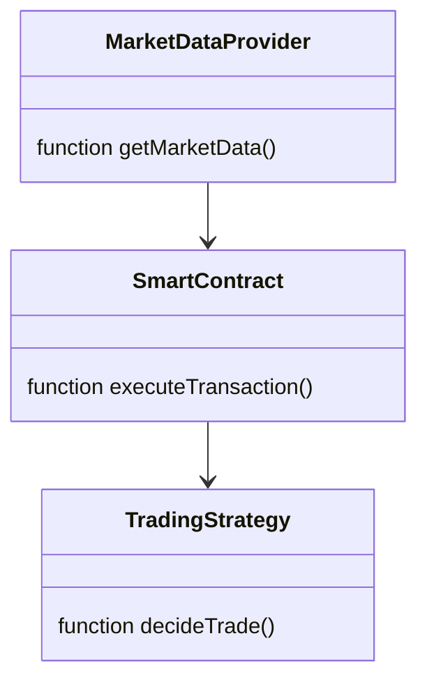
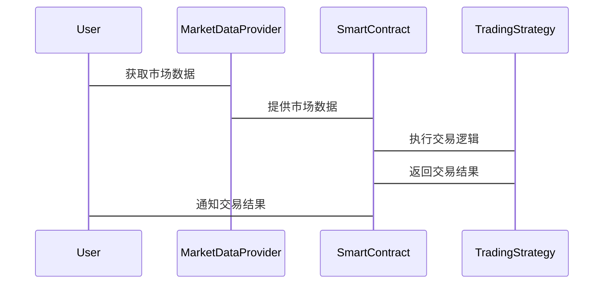

                 


# 如何将特价股票策略融入智能合约自动化投资

> 关键词：智能合约，自动化投资，特价股票，区块链，Solidity，交易策略

> 摘要：本文详细探讨了如何将特价股票策略融入智能合约，以实现自动化投资。通过分析智能合约的核心原理、自动化投资策略的开发、数学模型与算法、系统架构设计、项目实战以及最佳实践，本文为读者提供了从理论到实践的全面指导，帮助他们在区块链领域实现高效的自动化股票交易。

---

## 第一部分: 特价股票策略与智能合约概述

### 第1章: 特价股票策略与智能合约的背景介绍

#### 1.1 特价股票策略的基本概念
##### 1.1.1 什么是特价股票
特价股票是指在特定时间段内价格低于市场价的股票，通常由于市场波动、公司公告或其他市场因素导致价格临时性下跌。投资者可以利用这些价格波动进行短期投资，以赚取差价。

##### 1.1.2 特价股票的交易策略
- 短线交易：快速买入并在价格回升时卖出。
- 套利策略：利用市场价差进行无风险或低风险投资。
- 时间驱动策略：在特定时间段内执行交易。

##### 1.1.3 特价股票的市场分析
- 市场波动性分析：通过技术分析和基本面分析识别潜在的特价股票。
- 风险评估：评估市场风险、流动性风险等。

#### 1.2 智能合约的基本概念
##### 1.2.1 智能合约的定义
智能合约是基于区块链技术的自动执行的电子合同，能够自动执行预设的条件和条款。它们通过区块链的去中心化特性确保透明性和不可篡改性。

##### 1.2.2 智能合约的特点
- 自动化执行：无需中介，自动完成交易。
- 去中心化：数据存储在区块链上，无法被篡改。
- 可追溯性：每笔交易都有记录，便于追溯和审计。

##### 1.2.3 智能合约的应用场景
- 金融交易：股票、债券等金融产品的自动交易。
- 智能合约在供应链管理中的应用。
- 智能合约在法律合同中的应用。

#### 1.3 特价股票策略与智能合约的结合
##### 1.3.1 特价股票策略的自动化需求
投资者希望能够在特定价格点自动执行买卖操作，减少人为干预，提高交易效率。

##### 1.3.2 智能合约在金融领域的应用
智能合约可以用于自动执行金融交易，确保交易的透明性和安全性。

##### 1.3.3 特价股票策略融入智能合约的必要性
通过智能合约实现特价股票的自动化交易，可以减少人为错误，提高交易效率，降低交易成本。

#### 1.4 本章小结
本章介绍了特价股票策略和智能合约的基本概念，并探讨了两者结合的必要性和优势。

---

## 第二部分: 智能合约的核心原理

### 第2章: 智能合约的核心原理

#### 2.1 智能合约的运行机制
##### 2.1.1 智能合约的执行环境
智能合约运行在区块链节点上，每个节点都执行相同的代码，确保一致性。

##### 2.1.2 智能合约的代码结构
智能合约通常由函数、事件和状态变量组成，能够响应外部调用并自动执行逻辑。

##### 2.1.3 智能合约的执行流程
1. 接收外部请求。
2. 执行预设的逻辑。
3. 修改区块链上的状态。
4. 返回结果。

#### 2.2 Solidity编程基础
##### 2.2.1 Solidity语言的特点
- 基于区块链的智能合约编程语言。
- 支持面向对象的编程特性。
- 语法简洁，适合快速开发。

##### 2.2.2 Solidity的基本语法
```solidity
// SPDX-License-Identifier: MIT
pragma solidity ^0.8.0;

contract SimpleStorage {
    uint256 public favoriteNumber;

    function setNumber(uint256 _number) public {
        favoriteNumber = _number;
    }
}
```

##### 2.2.3 Solidity的智能合约开发
- 使用Solidity编写智能合约代码。
- 编译合约并部署到区块链。
- 调用合约的函数进行交互。

#### 2.3 区块链与智能合约的关系
##### 2.3.1 区块链的基本概念
区块链是一个分布式账本，通过共识机制保证数据的一致性和安全性。

##### 2.3.2 区块链的共识机制
- 工作量证明（PoW）：比特币采用的机制。
- 权益证明（PoS）：以太坊2.0采用的机制。

##### 2.3.3 区块链与智能合约的结合
智能合约通过区块链的去中心化特性实现自动化的交易和执行。

#### 2.4 本章小结
本章详细讲解了智能合约的核心原理和Solidity编程基础，为后续章节的实现奠定了基础。

---

## 第三部分: 自动化投资策略的开发

### 第3章: 自动化投资策略的开发

#### 3.1 特价股票策略的实现
##### 3.1.1 特价股票的识别方法
通过技术分析和基本面分析识别潜在的特价股票。

##### 3.1.2 特价股票的交易时机
- 设置买入价格阈值。
- 设置卖出价格阈值。
- 根据市场波动调整交易策略。

##### 3.1.3 特价股票的风险控制
- 设置止损点。
- 控制仓位大小。
- 监控市场风险。

#### 3.2 智能合约的自动化交易设计
##### 3.2.1 智能合约的触发条件
- 价格达到预设阈值。
- 时间到达预设时间点。
- 市场波动满足特定条件。

##### 3.2.2 智能合约的交易流程
1. 监控市场数据。
2. 判断是否满足交易条件。
3. 执行买入或卖出操作。
4. 记录交易记录。

#### 3.3 自动化投资策略的优化
##### 3.3.1 策略的参数调整
- 调整买入和卖出的阈值。
- 调整交易的频率。
- 调整仓位大小。

##### 3.3.2 策略的历史回测
通过历史数据验证策略的有效性。

##### 3.3.3 策略的实时监控
实时监控市场数据，及时调整策略。

#### 3.4 本章小结
本章详细介绍了自动化投资策略的开发过程，包括策略的实现、智能合约的设计以及策略的优化。

---

## 第四部分: 特价股票策略的数学模型与算法

### 第4章: 特价股票策略的数学模型与算法

#### 4.1 特价股票策略的数学模型
##### 4.1.1 特价股票的定价模型
$$ P = \alpha t + \beta \epsilon $$
其中，\( P \) 是股票价格，\( t \) 是时间，\( \epsilon \) 是随机误差项。

##### 4.1.2 特价股票的波动预测
$$ \sigma^2 = \lambda \sigma^2_{prev} + (1-\lambda) \sigma^2_{new} $$
其中，\( \lambda \) 是平滑因子，\( \sigma^2_{prev} \) 是前一时刻的波动方差，\( \sigma^2_{new} \) 是当前时刻的波动方差。

##### 4.1.3 特价股票的风险评估
$$ R = \sum_{i=1}^n w_i r_i $$
其中，\( w_i \) 是风险因子的权重，\( r_i \) 是风险因子的值。

#### 4.2 智能合约的算法实现
##### 4.2.1 智能合约的交易算法
1. 获取市场数据。
2. 判断是否满足交易条件。
3. 执行交易。
4. 记录交易记录。

##### 4.2.2 智能合约的优化算法
- 遗传算法优化交易参数。
- 粒子群优化算法优化交易策略。

##### 4.2.3 智能合约的性能分析
- 算法的复杂度分析。
- 算法的执行效率分析。

#### 4.3 本章小结
本章详细讲解了特价股票策略的数学模型和算法实现，为智能合约的自动化交易提供了理论基础。

---

## 第五部分: 系统分析与架构设计方案

### 第5章: 系统分析与架构设计方案

#### 5.1 问题场景介绍
投资者希望利用智能合约实现自动化股票交易，减少人为干预，提高交易效率。

#### 5.2 项目介绍
开发一个基于智能合约的自动化股票交易系统，实现特价股票的自动识别和交易。

#### 5.3 系统功能设计
##### 5.3.1 领域模型类图


##### 5.3.2 系统架构图


##### 5.3.3 系统接口设计
- 用户接口：接收用户的交易指令。
- 市场数据接口：获取实时市场数据。
- 智能合约接口：执行交易逻辑。

##### 5.3.4 系统交互序列图


#### 5.4 本章小结
本章详细设计了系统的架构和交互流程，为后续的实现提供了指导。

---

## 第六部分: 项目实战

### 第6章: 项目实战

#### 6.1 环境安装
- 安装以太坊开发环境（如Ganache）。
- 安装Solidity编译器。
- 安装交易数据API。

#### 6.2 系统核心实现源代码
##### 6.2.1 智能合约实现
```solidity
// SPDX-License-Identifier: MIT
pragma solidity ^0.8.0;

contract StockTrader {
    address payable public owner;
    uint256 public buyPrice;
    uint256 public sellPrice;

    constructor() {
        owner = payable(msg.sender);
        buyPrice = 0;
        sellPrice = 0;
    }

    function setPrices(uint256 _buyPrice, uint256 _sellPrice) public {
        buyPrice = _buyPrice;
        sellPrice = _sellPrice;
    }

    function executeTrade(bool isBuy, uint256 price) public {
        if (isBuy && price <= buyPrice) {
            // 执行买入操作
            owner.transfer(address(this).balance);
        } else if (!isBuy && price >= sellPrice) {
            // 执行卖出操作
            owner.transfer(address(this).balance);
        }
    }
}
```

##### 6.2.2 交易策略实现
```python
import requests

def get_stock_price(symbol):
    response = requests.get(f"https://api.example.com/stock/{symbol}")
    return response.json()['price']

def execute_trade(symbol, is_buy, price):
    if is_buy:
        # 执行买入操作
        pass
    else:
        # 执行卖出操作
        pass

def main():
    symbol = "AAPL"
    buy_price = 100
    sell_price = 150
    setPrices(buy_price, sell_price)
    execute_trade(symbol, True, buy_price)
    execute_trade(symbol, False, sell_price)

if __name__ == "__main__":
    main()
```

#### 6.3 代码应用解读与分析
- 智能合约代码实现了买入和卖出的逻辑。
- 交易策略代码通过API获取市场数据，并根据预设价格执行交易。

#### 6.4 实际案例分析
- 以苹果股票为例，设置买入价为100，卖出价为150。
- 当市场价低于100时，智能合约自动执行买入操作。
- 当市场价高于150时，智能合约自动执行卖出操作。

#### 6.5 项目小结
本章通过实际案例详细讲解了如何将特价股票策略融入智能合约，实现自动化投资。

---

## 第七部分: 最佳实践与总结

### 第7章: 最佳实践、小结与注意事项

#### 7.1 最佳实践
- 定期回测策略，确保其有效性。
- 设置合理的止损点，控制风险。
- 选择可靠的区块链平台和智能合约开发工具。

#### 7.2 小结
本文详细探讨了如何将特价股票策略融入智能合约，实现自动化投资。通过理论分析、系统设计和项目实战，为读者提供了全面的指导。

#### 7.3 注意事项
- 风险控制是关键，避免过度杠杆和高风险投资。
- 确保智能合约的安全性，避免被黑客攻击。
- 遵守相关法律法规，确保合规性。

#### 7.4 拓展阅读
- 推荐阅读《Mastering Solidity》和《Blockchain Basics》等书籍。
- 关注区块链和智能合约领域的最新动态。

---

## 作者信息

作者：AI天才研究院/AI Genius Institute & 禅与计算机程序设计艺术 /Zen And The Art of Computer Programming

---

以上是《如何将特价股票策略融入智能合约自动化投资》的完整目录和内容大纲，涵盖了从理论到实践的各个方面，帮助读者系统地理解和应用特价股票策略与智能合约的结合。

