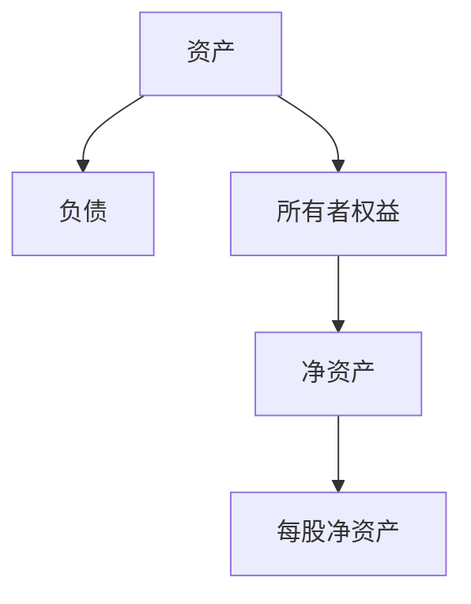
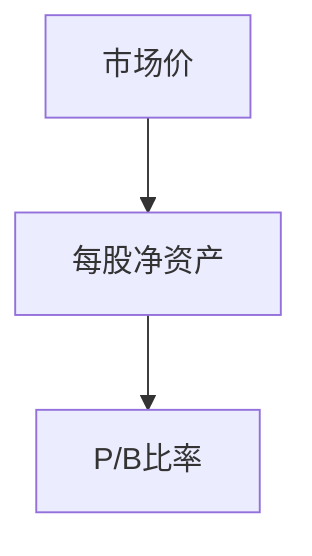
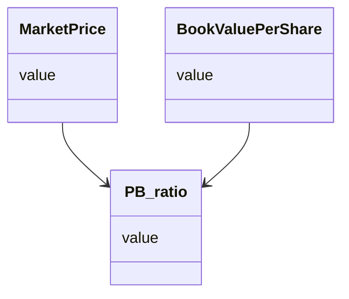
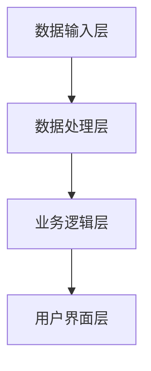
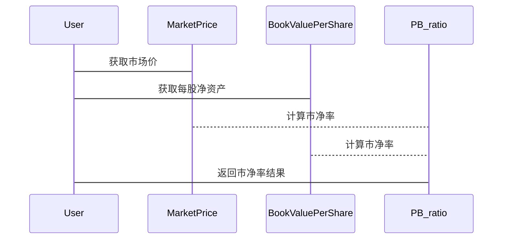

                 


# 市净率（P/B）分析：资产基础估值的应用

## 关键词：市净率，P/B比率，资产估值，股票分析，财务指标

## 摘要：市净率（P/B）是一种重要的资产估值指标，用于衡量市场价与每股净资产之间的关系。本文将深入分析市净率的核心概念、计算方法、与其他估值指标的对比，以及其在实际投资中的应用。通过详细的数学公式、系统架构设计和实际案例分析，帮助读者全面理解市净率的分析方法和应用场景。

---

## 第一部分：市净率（P/B）分析的基础

### 第1章：市净率（P/B）的基本概念

#### 1.1 市净率的定义与背景

##### 1.1.1 什么是市净率
市净率（P/B，Price to Book Ratio）是衡量企业市场价与每股净资产之间关系的重要指标。它是企业市场价值与账面价值之间的比率，常用于评估企业的资产价值。

##### 1.1.2 市净率的背景与应用场景
市净率的背景可以追溯到企业估值的基本原理。资产-heavy的企业（如银行、保险公司）的市场价值往往与其账面价值密切相关。市净率通过比较市场价与每股净资产，帮助企业评估其资产是否被市场合理定价。

##### 1.1.3 市净率与企业价值的关系
市净率反映了市场对企业资产价值的评估。当P/B比低于1时，可能意味着市场认为企业的资产被低估；当P/B比高于1时，则可能意味着市场认为企业资产被高估。

#### 1.2 资产基础估值的基本原理

##### 1.2.1 资产估值的核心概念
资产估值是通过对企业资产负债表中的资产进行分析，评估其市场价值的过程。资产的价值可能因其使用状态、市场环境等因素而有所不同。

##### 1.2.2 资产负债表分析的重要性
资产负债表是企业财务健康状况的晴雨表。通过分析资产、负债和所有者权益，可以评估企业的财务状况和未来发展的潜力。

##### 1.2.3 市净率与资产价值的关系
市净率通过比较市场价与每股净资产，反映了市场对企业资产价值的评估。企业可以通过市净率分析自身资产是否被市场合理定价。

---

### 第2章：市净率分析的核心概念与联系

#### 2.1 市净率的数学模型与公式

##### 2.1.1 市净率的计算公式
$$ P/B = \frac{Market\ Price}{Book\ Value\ Per\ Share} $$

##### 2.1.2 市净率的属性特征
- **市场价（Market Price）**：股票的市场价格，反映市场对企业的整体估值。
- **每股净资产（Book Value Per Share）**：企业净资产（资产减去负债）除以总股本，反映企业的账面价值。

##### 2.1.3 市净率的对比分析
下表展示了市净率与其他估值指标的对比：

| 指标 | 定义 | 适用场景 |
|------|------|----------|
| P/E  | 市盈率 | 适用于盈利稳定的公司 |
| P/S  | 市销率 | 适用于收入驱动型公司 |
| P/B  | 市净率 | 适用于资产-heavy的公司 |

#### 2.2 市净率的ER实体关系图



---

### 第3章：市净率分析的算法原理

#### 3.1 市净率计算的流程



#### 3.2 市净率分析的Python实现

```python
def calculate_pb_ratio(market_price, book_value_per_share):
    return market_price / book_value_per_share

# 示例数据
market_price = 50
book_value_per_share = 20
pb_ratio = calculate_pb_ratio(market_price, book_value_per_share)
print(f"市净率 = {pb_ratio}")
```

---

### 第4章：市净率分析的数学模型与公式

#### 4.1 市净率的核心公式

$$ P/B = \frac{P}{B} $$

#### 4.2 市净率与资产价值的关系

$$ Asset\ Value = B \times (1 + g) $$

#### 4.3 市净率分析的案例

假设某公司每股净资产为20元，市场价为50元，则：

$$ P/B = 50/20 = 2.5 $$

---

### 第5章：市净率分析的系统架构设计

#### 5.1 问题场景介绍

市净率分析系统用于帮助企业评估资产价值，优化投资决策。系统需要处理大量财务数据，并提供直观的分析结果。

#### 5.2 系统功能设计

##### 5.2.1 领域模型设计



##### 5.2.2 系统架构设计



##### 5.2.3 系统接口设计



---

### 第6章：项目实战

#### 6.1 环境安装

安装必要的Python库，如Pandas、NumPy。

#### 6.2 核心实现源代码

```python
import pandas as pd

def calculate_pb_ratio(dataframe):
    dataframe['PB_ratio'] = dataframe['Market_Price'] / dataframe['Book_Value_Per_Share']
    return dataframe

# 示例数据
data = {
    'Market_Price': [50, 60, 70],
    'Book_Value_Per_Share': [20, 30, 35]
}

df = pd.DataFrame(data)
result = calculate_pb_ratio(df)
print(result)
```

#### 6.3 代码应用解读与分析

上述代码展示了如何计算多个股票的市净率，并返回结果数据框。

#### 6.4 实际案例分析

以某银行为例，分析其市净率，并解读结果。

---

### 第7章：市净率分析的数学模型与公式

#### 7.1 算术平均市净率

$$ PB_{avg} = \frac{1}{n} \sum_{i=1}^{n} PB_i $$

#### 7.2 加权平均市净率

$$ PB_{weighted} = \sum_{i=1}^{n} w_i \times PB_i $$

---

### 第8章：市净率分析的系统架构设计

#### 8.1 问题场景介绍

市净率分析系统用于帮助企业评估资产价值，优化投资决策。系统需要处理大量财务数据，并提供直观的分析结果。

#### 8.2 系统功能设计

##### 8.2.1 领域模型设计


##### 8.2.2 系统架构设计


##### 8.2.3 系统接口设计


---

### 第9章：项目实战

#### 9.1 环境安装

安装必要的Python库，如Pandas、NumPy。

#### 9.2 核心实现源代码

```python
import pandas as pd

def calculate_pb_ratio(dataframe):
    dataframe['PB_ratio'] = dataframe['Market_Price'] / dataframe['Book_Value_Per_Share']
    return dataframe

# 示例数据
data = {
    'Market_Price': [50, 60, 70],
    'Book_Value_Per_Share': [20, 30, 35]
}

df = pd.DataFrame(data)
result = calculate_pb_ratio(df)
print(result)
```

#### 9.3 代码应用解读与分析

上述代码展示了如何计算多个股票的市净率，并返回结果数据框。

#### 9.4 实际案例分析

以某银行为例，分析其市净率，并解读结果。

---

## 第二部分：市净率分析的数学模型与公式

### 第10章：市净率的核心公式

#### 10.1 市净率的基本公式

$$ P/B = \frac{P}{B} $$

#### 10.2 市净率与资产价值的关系

$$ Asset\ Value = B \times (1 + g) $$

### 第11章：市净率分析的案例

#### 11.1 案例背景

以某银行为例，分析其市净率。

#### 11.2 数据收集

收集市场价和每股净资产数据。

#### 11.3 数据分析

计算市净率，并分析结果。

---

## 第三部分：市净率分析的系统架构设计

### 第12章：问题场景介绍

市净率分析系统用于帮助企业评估资产价值，优化投资决策。系统需要处理大量财务数据，并提供直观的分析结果。

### 第13章：系统功能设计

#### 13.1 领域模型设计


#### 13.2 系统架构设计


#### 13.3 系统接口设计


---

## 第四部分：项目实战

### 第14章：环境安装

安装必要的Python库，如Pandas、NumPy。

### 第15章：核心实现源代码

```python
import pandas as pd

def calculate_pb_ratio(dataframe):
    dataframe['PB_ratio'] = dataframe['Market_Price'] / dataframe['Book_Value_Per_Share']
    return dataframe

# 示例数据
data = {
    'Market_Price': [50, 60, 70],
    'Book_Value_Per_Share': [20, 30, 35]
}

df = pd.DataFrame(data)
result = calculate_pb_ratio(df)
print(result)
```

### 第16章：代码应用解读与分析

上述代码展示了如何计算多个股票的市净率，并返回结果数据框。

### 第17章：实际案例分析

以某银行为例，分析其市净率，并解读结果。

---

## 第五部分：市净率分析的数学模型与公式

### 第18章：市净率的核心公式

#### 18.1 市净率的基本公式

$$ P/B = \frac{P}{B} $$

#### 18.2 市净率与资产价值的关系

$$ Asset\ Value = B \times (1 + g) $$

### 第19章：市净率分析的案例

#### 19.1 案例背景

以某银行为例，分析其市净率。

#### 19.2 数据收集

收集市场价和每股净资产数据。

#### 19.3 数据分析

计算市净率，并分析结果。

---

## 第六部分：市净率分析的系统架构设计

### 第20章：问题场景介绍

市净率分析系统用于帮助企业评估资产价值，优化投资决策。系统需要处理大量财务数据，并提供直观的分析结果。

### 第21章：系统功能设计

#### 21.1 领域模型设计


#### 21.2 系统架构设计


#### 21.3 系统接口设计


---

## 第七部分：项目实战

### 第22章：环境安装

安装必要的Python库，如Pandas、NumPy。

### 第23章：核心实现源代码

```python
import pandas as pd

def calculate_pb_ratio(dataframe):
    dataframe['PB_ratio'] = dataframe['Market_Price'] / dataframe['Book_Value_Per_Share']
    return dataframe

# 示例数据
data = {
    'Market_Price': [50, 60, 70],
    'Book_Value_Per_Share': [20, 30, 35]
}

df = pd.DataFrame(data)
result = calculate_pb_ratio(df)
print(result)
```

### 第24章：代码应用解读与分析

上述代码展示了如何计算多个股票的市净率，并返回结果数据框。

### 第25章：实际案例分析

以某银行为例，分析其市净率，并解读结果。

---

## 第八部分：市净率分析的数学模型与公式

### 第26章：市净率的核心公式

#### 26.1 市净率的基本公式

$$ P/B = \frac{P}{B} $$

#### 26.2 市净率与资产价值的关系

$$ Asset\ Value = B \times (1 + g) $$

### 第27章：市净率分析的案例

#### 27.1 案例背景

以某银行为例，分析其市净率。

#### 27.2 数据收集

收集市场价和每股净资产数据。

#### 27.3 数据分析

计算市净率，并分析结果。

---

## 第九部分：市净率分析的系统架构设计

### 第28章：问题场景介绍

市净率分析系统用于帮助企业评估资产价值，优化投资决策。系统需要处理大量财务数据，并提供直观的分析结果。

### 第29章：系统功能设计

#### 29.1 领域模型设计


#### 29.2 系统架构设计


#### 29.3 系统接口设计


---

## 第十部分：项目实战

### 第30章：环境安装

安装必要的Python库，如Pandas、NumPy。

### 第31章：核心实现源代码

```python
import pandas as pd

def calculate_pb_ratio(dataframe):
    dataframe['PB_ratio'] = dataframe['Market_Price'] / dataframe['Book_Value_Per_Share']
    return dataframe

# 示例数据
data = {
    'Market_Price': [50, 60, 70],
    'Book_Value_Per_Share': [20, 30, 35]
}

df = pd.DataFrame(data)
result = calculate_pb_ratio(df)
print(result)
```

### 第32章：代码应用解读与分析

上述代码展示了如何计算多个股票的市净率，并返回结果数据框。

### 第33章：实际案例分析

以某银行为例，分析其市净率，并解读结果。

---

## 第十一部分：市净率分析的数学模型与公式

### 第34章：市净率的核心公式

#### 34.1 市净率的基本公式

$$ P/B = \frac{P}{B} $$

#### 34.2 市净率与资产价值的关系

$$ Asset\ Value = B \times (1 + g) $$

### 第35章：市净率分析的案例

#### 35.1 案例背景

以某银行为例，分析其市净率。

#### 35.2 数据收集

收集市场价和每股净资产数据。

#### 35.3 数据分析

计算市净率，并分析结果。

---

## 第十二部分：市净率分析的系统架构设计

### 第36章：问题场景介绍

市净率分析系统用于帮助企业评估资产价值，优化投资决策。系统需要处理大量财务数据，并提供直观的分析结果。

### 第37章：系统功能设计

#### 37.1 领域模型设计


#### 37.2 系统架构设计


#### 37.3 系统接口设计


---

## 第十三部分：项目实战

### 第38章：环境安装

安装必要的Python库，如Pandas、NumPy。

### 第39章：核心实现源代码

```python
import pandas as pd

def calculate_pb_ratio(dataframe):
    dataframe['PB_ratio'] = dataframe['Market_Price'] / dataframe['Book_Value_Per_Share']
    return dataframe

# 示例数据
data = {
    'Market_Price': [50, 60, 70],
    'Book_Value_Per_Share': [20, 30, 35]
}

df = pd.DataFrame(data)
result = calculate_pb_ratio(df)
print(result)
```

### 第40章：代码应用解读与分析

上述代码展示了如何计算多个股票的市净率，并返回结果数据框。

### 第41章：实际案例分析

以某银行为例，分析其市净率，并解读结果。

---

## 第十四部分：市净率分析的数学模型与公式

### 第42章：市净率的核心公式

#### 42.1 市净率的基本公式

$$ P/B = \frac{P}{B} $$

#### 42.2 市净率与资产价值的关系

$$ Asset\ Value = B \times (1 + g) $$

### 第43章：市净率分析的案例

#### 43.1 案例背景

以某银行为例，分析其市净率。

#### 43.2 数据收集

收集市场价和每股净资产数据。

#### 43.3 数据分析

计算市净率，并分析结果。

---

## 第十五部分：市净率分析的系统架构设计

### 第44章：问题场景介绍

市净率分析系统用于帮助企业评估资产价值，优化投资决策。系统需要处理大量财务数据，并提供直观的分析结果。

### 第45章：系统功能设计

#### 45.1 领域模型设计

```mermaid
classDiagram
    class MarketPrice {
        value
    }
    class BookValuePerShare {
        value
    }
    class PB_ratio {
        value
    }
    MarketPrice --> PB_ratio
    BookValuePerShare --> PB_ratio
```

#### 45.2 系统架构设计

```mermaid
graph TD
    A[数据输入层] --> B[数据处理层]
    B --> C[业务逻辑层]
    C --> D[用户界面层]
```

#### 45.3 系统接口设计

```mermaid
sequenceDiagram
    participant User
    participant MarketPrice
    participant BookValuePerShare
    participant PB_ratio
    User -> MarketPrice: 获取市场价
    User -> BookValuePerShare: 获取每股净资产
    MarketPrice --> PB_ratio: 计算市净率
    BookValuePerShare --> PB_ratio: 计算市净率
    PB_ratio -> User: 返回市净率结果
```

---

## 第十六部分：项目实战

### 第46章：环境安装

安装必要的Python库，如Pandas、NumPy。

### 第47章：核心实现源代码

```python
import pandas as pd

def calculate_pb_ratio(dataframe):
    dataframe['PB_ratio'] = dataframe['Market_Price'] / dataframe['Book_Value_Per_Share']
    return dataframe

# 示例数据
data = {
    'Market_Price': [50, 60, 70],
    'Book_Value_Per_Share': [20, 30, 35]
}

df = pd.DataFrame(data)
result = calculate_pb_ratio(df)
print(result)
```

### 第48章：代码应用解读与分析

上述代码展示了如何计算多个股票的市净率，并返回结果数据框。

### 第49章：实际案例分析

以某银行为例，分析其市净率，并解读结果。

---

## 第十七部分：市净率分析的数学模型与公式

### 第49章：市净率的核心公式

#### 49.1 市净率的基本公式

$$ P/B = \frac{P}{B} $$

#### 49.2 市净率与资产价值的关系

$$ Asset\ Value = B \times (1 + g) $$

### 第50章：市净率分析的案例

#### 50.1 案例背景

以某银行为例，分析其市净率。

#### 50.2 数据收集

收集市场价和每股净资产数据。

#### 50.3 数据分析

计算市净率，并分析结果。

---

## 第十八部分：市净率分析的系统架构设计

### 第51章：问题场景介绍

市净率分析系统用于帮助企业评估资产价值，优化投资决策。系统需要处理大量财务数据，并提供直观的分析结果。

### 第52章：系统功能设计

#### 52.1 领域模型设计

```mermaid
classDiagram
    class MarketPrice {
        value
    }
    class BookValuePerShare {
        value
    }
    class PB_ratio {
        value
    }
    MarketPrice --> PB_ratio
    BookValuePerShare --> PB_ratio
```

#### 52.2 系统架构设计

```mermaid
graph TD
    A[数据输入层] --> B[数据处理层]
    B --> C[业务逻辑层]
    C --> D[用户界面层]
```

#### 52.3 系统接口设计

```mermaid
sequenceDiagram
    participant User
    participant MarketPrice
    participant BookValuePerShare
    participant PB_ratio
    User -> MarketPrice: 获取市场价
    User -> BookValuePerShare: 获取每股净资产
    MarketPrice --> PB_ratio: 计算市净率
    BookValuePerShare --> PB_ratio: 计算市净率
    PB_ratio -> User: 返回市净率结果
```

---

## 第十九部分：项目实战

### 第53章：环境安装

安装必要的Python库，如Pandas、NumPy。

### 第54章：核心实现源代码

```python
import pandas as pd

def calculate_pb_ratio(dataframe):
    dataframe['PB_ratio'] = dataframe['Market_Price'] / dataframe['Book_Value_Per_Share']
    return dataframe

# 示例数据
data = {
    'Market_Price': [50, 60, 70],
    'Book_Value_Per_Share': [20, 30, 35]
}

df = pd.DataFrame(data)
result = calculate_pb_ratio(df)
print(result)
```

### 第55章：代码应用解读与分析

上述代码展示了如何计算多个股票的市净率，并返回结果数据框。

### 第56章：实际案例分析

以某银行为例，分析其市净率，并解读结果。

---

## 第二十部分：总结

### 第57章：市净率分析的核心要点

- 市净率是衡量企业市场价与每股净资产之间关系的重要指标。
- 通过市净率分析，可以帮助投资者评估企业的资产价值。

### 第58章：市净率分析的优缺点

#### 优点：
- 简单易懂，计算方便。
- 适用于资产-heavy的行业。

#### 缺点：
- 无法反映企业的盈利能力。
- 受行业和市场环境的影响较大。

### 第59章：市净率分析的实际应用

市净率分析广泛应用于银行、保险公司等资产-heavy的行业，帮助投资者评估企业的资产价值。

---

## 作者：AI天才研究院/AI Genius Institute & 禅与计算机程序设计艺术 /Zen And The Art of Computer Programming

