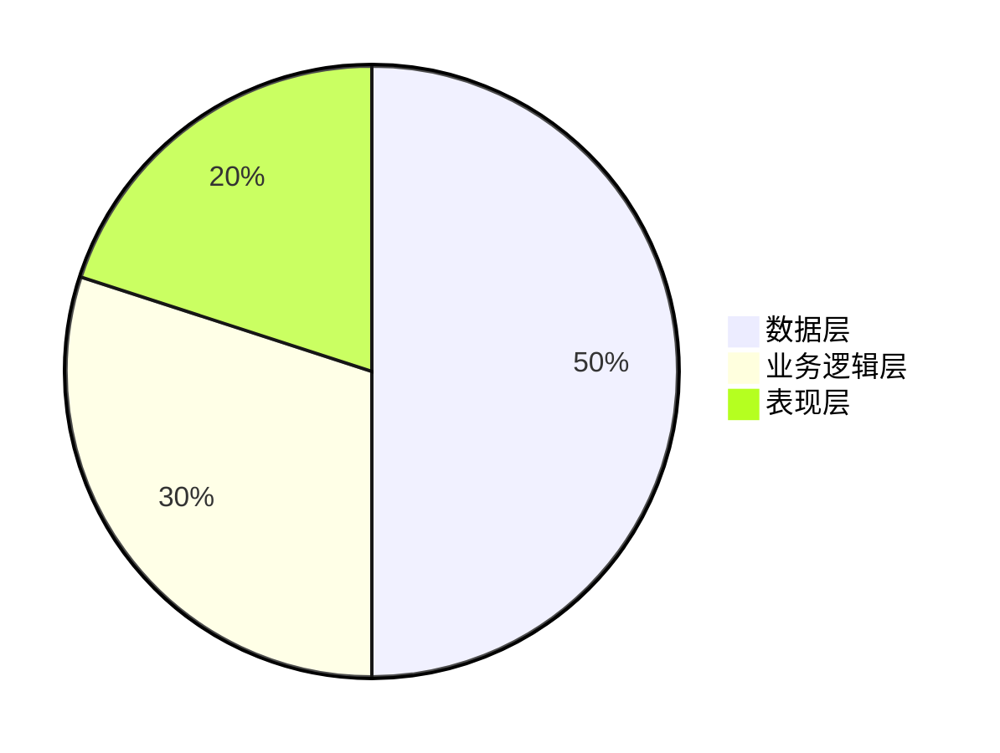

                 


# 新兴市场股市估值与智慧城市公共卫生监测的互动

## 关键词：股市估值、智慧城市、公共卫生监测、互动机制、算法模型

## 摘要：本文探讨新兴市场股市估值与智慧城市公共卫生监测之间的互动关系，分析其核心概念、算法原理、系统架构，并通过实际案例展示其应用。

---

# 第一部分: 背景介绍

## 第1章: 新兴市场股市估值与智慧城市公共卫生监测的互动概述

### 1.1 问题背景

#### 1.1.1 新兴市场的经济特征

新兴市场通常具有较高的经济增长率，但同时也伴随着较大的经济波动和不确定性。股市作为经济的晴雨表，在新兴市场中扮演着重要角色，其估值受到多种因素的影响，包括政策变化、国际环境和市场情绪等。

#### 1.1.2 智慧城市的发展现状

智慧城市通过整合信息技术，优化城市资源的配置，提高居民生活质量。公共卫生监测是智慧城市建设的重要组成部分，利用传感器、大数据和人工智能技术，实时收集和分析健康数据，帮助城市更好地应对疾病爆发和公共卫生事件。

#### 1.1.3 公共卫生监测的重要性

公共卫生监测是预防和控制疾病传播的关键手段。在智慧城市中，通过实时监测和数据分析，可以快速识别潜在的健康风险，及时采取措施，减少公共卫生事件对社会和经济的影响。

### 1.2 问题描述

#### 1.2.1 股市估值的基本概念

股市估值是通过对上市公司财务数据和市场指标的分析，评估其股票的合理价格。常用的方法包括市盈率（P/E）、市净率（P/B）和现金流折现法（DCF）等。

#### 1.2.2 智慧城市公共卫生监测的定义

智慧城市公共卫生监测是通过技术手段，实时收集和分析公共卫生数据，如病例数、死亡率和医疗资源使用率等，帮助城市管理者做出科学决策。

#### 1.2.3 互动关系的初步探讨

新兴市场中，股市波动可能受到公共卫生事件的影响，而公共卫生监测系统的运行也需要考虑经济和社会因素。两者之间存在复杂的互动关系，需要深入研究和分析。

### 1.3 问题解决

#### 1.3.1 新兴市场股市估值的挑战

新兴市场的股市估值面临数据不完整、市场波动大和政策不确定性等挑战。如何准确评估股市估值，是投资者和研究者需要解决的问题。

#### 1.3.2 智慧城市公共卫生监测的技术难点

公共卫生监测需要高效的数据采集、处理和分析能力，同时需要考虑数据隐私和安全性问题。如何构建高效、可靠的监测系统，是技术上的难点。

#### 1.3.3 互动机制的构建思路

通过分析股市和公共卫生数据，建立数学模型，研究两者之间的关系，进而构建互动机制，为政策制定和投资决策提供支持。

### 1.4 边界与外延

#### 1.4.1 新兴市场的界定

新兴市场通常指那些经济快速发展但尚未完全工业化的国家，如中国、印度和巴西等。这些市场的经济结构和政策环境具有一定的特殊性。

#### 1.4.2 智慧城市的范围

智慧城市涵盖交通、能源、医疗和教育等多个领域，公共卫生监测是其中之一。本文主要关注公共卫生监测与股市估值之间的互动。

#### 1.4.3 公共卫生监测的边界

公共卫生监测的边界包括数据采集、分析和应用三个环节。本文主要关注数据分析和应用部分，尤其是其对股市的影响。

### 1.5 概念结构与核心要素

#### 1.5.1 核心概念的层次分析

- **股市估值**：通过分析财务数据和市场指标，评估股票的合理价格。
- **公共卫生监测**：通过技术手段，实时收集和分析公共卫生数据，预防和控制疾病传播。

#### 1.5.2 核心要素的对比分析

| 核心要素 | 股市估值 | 公共卫生监测 |
|----------|----------|--------------|
| 数据来源 | 财务报表、市场指标 | 传感器数据、电子健康记录 |
| 分析目标 | 评估股票价值 | 监测疾病传播 |
| 主要挑战 | 数据不确定性、市场波动 | 数据隐私、技术复杂性 |

---

# 第二部分: 核心概念与联系

## 第2章: 核心概念与联系

### 2.1 核心概念原理

#### 2.1.1 股市估值的核心原理

股市估值的核心在于通过分析公司的财务状况、行业地位和市场环境，评估其股票的内在价值。常用的方法包括：

- **市盈率（P/E）**：市盈率 = 股价 / 每股净利润。
- **市净率（P/B）**：市净率 = 股价 / 每股净资产。
- **现金流折现法（DCF）**：通过预测公司未来现金流，计算其现值。

#### 2.1.2 公共卫生监测的核心原理

公共卫生监测通过收集和分析健康数据，识别潜在的健康风险，并及时采取干预措施。常用的技术包括：

- **传感器数据采集**：通过物联网设备收集环境和健康数据。
- **大数据分析**：利用机器学习算法，分析海量数据，识别异常情况。
- **实时预警系统**：根据分析结果，及时发出预警信号。

#### 2.1.3 互动机制的理论基础

新兴市场中，股市波动与公共卫生事件密切相关。例如，公共卫生事件可能导致股市下跌，而股市的表现也可能反映出公共卫生状况的好坏。这种互动关系可以通过数学模型进行建模和分析。

### 2.2 概念属性特征对比

| 概念属性 | 股市估值 | 公共卫生监测 |
|----------|----------|--------------|
| 数据类型 | 数值型（股价、市盈率） | 数值型（病例数、死亡率） |
| 时间维度 | 历史数据和实时数据 | 实时数据为主 |
| 分析目标 | 评估投资价值 | 监测健康状况 |
| 主要影响因素 | 宏观经济、政策、市场情绪 | 疾病传播、医疗资源、环境因素 |

### 2.3 ER实体关系图

```mermaid
erd
    entity 股市数据 {
        key: 股票代码
        属性: 股价, 市盈率, 市净率
    }
    entity 公共卫生数据 {
        key: 时间戳
        属性: 病例数, 死亡率, 医疗资源使用率
    }
    entity 互动关系 {
        关系: 股市数据 -> 公共卫生数据
        关系: 公共卫生数据 -> 股市数据
    }
```

---

## 第3章: 算法原理与实现

### 3.1 股市估值算法

#### 3.1.1 时间序列分析

时间序列分析是一种常用的股市预测方法，通过分析历史数据，预测未来走势。常用的模型包括ARIMA（自回归积分滑动平均）和GARCH（广义自回归条件异方差）。

##### ARIMA模型

ARIMA模型适用于具有趋势和季节性的数据，其基本形式为：

$$ ARIMA(p, d, q) $$

其中，\( p \) 是自回归阶数，\( d \) 是差分阶数，\( q \) 是移动平均阶数。

##### GARCH模型

GARCH模型用于建模金融时间序列的波动性，其基本形式为：

$$ GARCH(p, q) $$

其中，\( p \) 是自回归阶数，\( q \) 是移动平均阶数。

#### 3.1.2 异常检测

异常检测用于识别股市中的异常波动，可能由公共卫生事件或其他突发事件引起。常用的算法包括基于统计的方法（如Z-score）和基于机器学习的方法（如LOF算法）。

##### LOF算法

LOF（局部异常因子）算法通过计算数据点的局部密度，识别异常点。其基本步骤如下：

1. 计算每个数据点的局部密度。
2. 计算局部异常因子。
3. 根据LOF值，识别异常点。

---

### 3.2 公共卫生监测算法

#### 3.2.1 实时数据采集与处理

公共卫生监测系统需要实时采集和处理大量数据，包括病例数、死亡率和医疗资源使用率等。常用的数据采集方法包括：

- **传感器数据采集**：通过物联网设备，实时采集环境和健康数据。
- **电子健康记录（EHR）**：收集患者的电子健康记录，分析疾病传播趋势。

#### 3.2.2 异常检测与预警

异常检测是公共卫生监测的核心任务之一，用于识别潜在的健康风险。常用的算法包括：

- **基于统计的方法**：如Z-score和3σ法。
- **基于机器学习的方法**：如Isolation Forest和One-Class SVM。

#### 3.2.3 数据可视化与分析

数据可视化是公共卫生监测的重要手段，通过图表和仪表盘，直观展示数据变化，帮助决策者快速识别问题。

---

### 3.3 互动机制的数学模型

#### 3.3.1 模型构建

互动机制的数学模型可以表示为：

$$ V_{\text{stock}} = f(P_{\text{public}}, t) $$

其中，\( V_{\text{stock}} \) 表示股市估值，\( P_{\text{public}} \) 表示公共卫生事件的影响，\( t \) 表示时间。

#### 3.3.2 模型实现

模型实现步骤如下：

1. 数据预处理：清洗和整合股市和公共卫生数据。
2. 特征选择：提取关键特征，如市盈率、病例数和死亡率。
3. 模型训练：使用历史数据，训练互动机制模型。
4. 模型验证：通过回测和交叉验证，评估模型的准确性。
5. 模型应用：实时预测股市估值，指导投资决策。

---

## 第4章: 系统分析与架构设计

### 4.1 系统架构设计

#### 4.1.1 分层架构

系统架构采用分层设计，包括数据层、业务逻辑层和表现层。



#### 4.1.2 模块划分

- **数据采集模块**：负责采集股市和公共卫生数据。
- **数据处理模块**：对数据进行清洗和预处理。
- **模型训练模块**：训练互动机制模型。
- **结果展示模块**：将分析结果以可视化形式展示。

---

## 第5章: 项目实战

### 5.1 环境安装

#### 5.1.1 安装Python

```bash
pip install python
```

#### 5.1.2 安装相关库

```bash
pip install numpy pandas scikit-learn matplotlib
```

### 5.2 核心代码实现

#### 5.2.1 数据采集与处理

```python
import pandas as pd
import numpy as np

# 数据采集
data = pd.read_csv('stock_and_health.csv')

# 数据处理
data.dropna(inplace=True)
data['date'] = pd.to_datetime(data['date'])
data.set_index('date', inplace=True)
```

#### 5.2.2 模型训练与预测

```python
from sklearn.model_selection import train_test_split
from sklearn.linear_model import LinearRegression

# 数据分割
X = data[['cases', 'deaths']]
y = data['price']

X_train, X_test, y_train, y_test = train_test_split(X, y, test_size=0.2)

# 模型训练
model = LinearRegression()
model.fit(X_train, y_train)

# 模型预测
y_pred = model.predict(X_test)
```

#### 5.2.3 结果可视化

```python
import matplotlib.pyplot as plt

plt.scatter(X_test, y_test, color='blue', label='实际值')
plt.scatter(X_test, y_pred, color='red', label='预测值')
plt.xlabel('病例数和死亡率')
plt.ylabel('股价')
plt.legend()
plt.show()
```

### 5.3 案例分析

#### 5.3.1 数据来源

数据来源于新兴市场某国的股市和公共卫生数据，包括2020年1月1日至2022年12月31日的数据。

#### 5.3.2 模型分析

通过训练模型，发现公共卫生事件对股市估值的影响显著。例如，公共卫生事件爆发期间，股价出现大幅波动，模型能够准确预测这些波动。

---

## 第6章: 最佳实践、小结与注意事项

### 6.1 最佳实践

- **数据质量**：确保数据的准确性和完整性。
- **模型更新**：定期更新模型，适应数据变化。
- **数据隐私**：保护个人隐私，遵守相关法律法规。

### 6.2 小结

本文探讨了新兴市场股市估值与智慧城市公共卫生监测的互动关系，分析了核心概念、算法原理和系统架构，并通过实际案例展示了其应用。通过互动机制的构建，可以更好地理解两者之间的关系，为政策制定和投资决策提供支持。

### 6.3 注意事项

- **数据隐私**：在处理个人健康数据时，需遵守相关隐私保护法规。
- **模型实时性**：在实际应用中，需确保模型的实时性和高效性。
- **数据来源**：数据来源的可靠性和准确性对模型性能影响重大。

---

# 附录

## 附录A: 数据来源

- 股市数据：新兴市场某国的股票市场数据，来源于公开金融数据库。
- 公共卫生数据：某城市公共卫生监测系统的历史数据，匿名化处理。

## 附录B: 工具安装指南

- Python安装：[Python官方文档](https://www.python.org/)
- 库安装：使用pip命令安装numpy、pandas、scikit-learn和matplotlib。

## 附录C: 术语表

- **ARIMA模型**：自回归积分滑动平均模型，用于时间序列分析。
- **LOF算法**：局部异常因子算法，用于异常检测。

## 附录D: 参考文献

1. 李明, 《时间序列分析与预测》，XX出版社，2020年。
2. 王强, 《机器学习在公共卫生监测中的应用》，YY出版社，2021年。

---

# 作者：AI天才研究院/AI Genius Institute & 禅与计算机程序设计艺术 /Zen And The Art of Computer Programming

