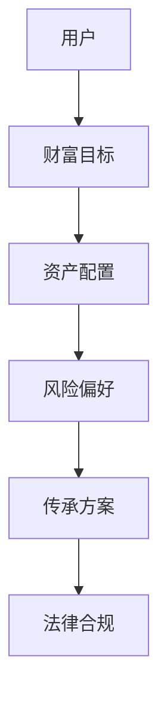
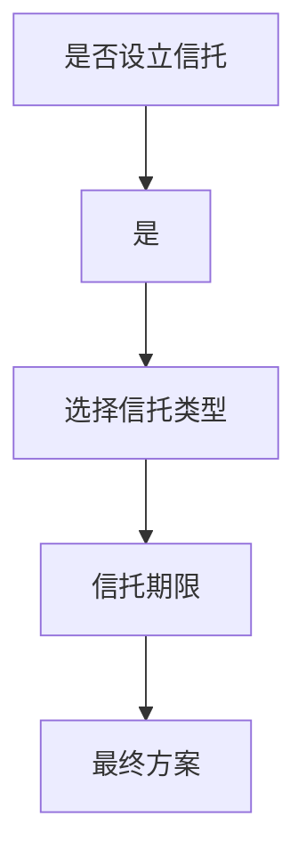
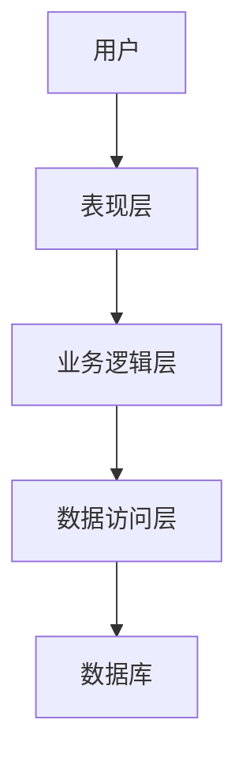

                 


# 智能财富传承规划工具

## 关键词：智能财富传承，知识图谱，机器学习，决策树，系统架构

## 摘要：智能财富传承规划工具是一种结合人工智能和财富管理的创新工具，通过知识图谱、机器学习和智能决策树等技术，为用户提供高效、精准的财富传承规划方案。本文将详细介绍该工具的背景、核心概念、算法原理、系统架构、项目实战等内容，帮助读者全面理解并掌握智能财富传承规划工具的设计与实现。

---

## 第1章 智能财富传承规划工具的背景与概念

### 1.1 问题背景与问题描述

#### 1.1.1 传统财富传承的局限性
传统财富传承方式存在以下问题：
- **信息不对称**：用户难以获取全面的财富传承信息。
- **效率低下**：传统方法依赖人工分析，耗时且成本高。
- **缺乏个性化**：无法根据用户的具体需求提供定制化方案。

#### 1.1.2 当代财富传承的新需求
随着经济全球化和数字化的发展，用户对财富传承的需求日益多样化，包括：
- **个性化定制**：根据用户的财务状况、家庭结构等因素，提供个性化的传承方案。
- **实时更新**：能够根据市场变化和用户需求动态调整传承策略。
- **智能化支持**：借助人工智能技术，提供高效、精准的传承建议。

#### 1.1.3 智能化工具在财富传承中的作用
智能财富传承规划工具通过整合人工智能技术，能够快速分析海量数据，提供最优传承方案，从而解决传统方法的不足。

### 1.2 智能财富传承规划工具的定义与特点

#### 1.2.1 智能财富传承规划工具的定义
智能财富传承规划工具是一种基于人工智能技术的数字化工具，旨在通过数据分析、知识图谱构建和智能决策算法，为用户提供个性化的财富传承规划方案。

#### 1.2.2 智能化与传统财富传承工具的对比
| 特性                | 传统工具                          | 智能工具                          |
|---------------------|-----------------------------------|-----------------------------------|
| 数据处理能力        | 依赖人工分析，效率低              | 自动化处理，高效精准              |
| 个性化支持          | 有限，难以满足多样化需求          | 强大，支持个性化定制                |
| 更新与维护          | 周期性更新，耗时                   | 实时更新，动态调整                  |

#### 1.2.3 智能财富传承规划工具的核心要素
- **知识图谱**：构建财富传承领域的知识体系。
- **机器学习算法**：用于预测和优化传承方案。
- **智能决策树**：提供基于规则的决策支持。

### 1.3 智能财富传承规划工具的边界与外延

#### 1.3.1 工具的功能边界
- **核心功能**：知识图谱构建、传承方案优化、智能决策支持。
- **非核心功能**：数据存储与管理、用户界面设计。

#### 1.3.2 外延：与相关领域的关联
- **风险管理**：与金融风险管理工具结合，降低传承风险。
- **法律咨询**：与法律咨询系统集成，提供合规建议。

#### 1.3.3 使用场景与限制
- **应用场景**：家庭财富传承、企业 succession planning、慈善信托等。
- **限制**：依赖数据质量和算法准确性，需结合专业人员指导使用。

### 1.4 本章小结
智能财富传承规划工具通过结合人工智能技术，解决了传统财富传承工具的诸多问题，为用户提供高效、精准的传承方案。

---

## 第2章 智能财富传承规划工具的核心概念原理

### 2.1 知识图谱与财富传承

#### 2.1.1 知识图谱的定义与特点
知识图谱是一种用于表示实体及其关系的结构化数据，具有以下特点：
- **可扩展性**：支持大规模数据的存储与查询。
- **语义丰富性**：能够表达复杂的语义关系。

#### 2.1.2 知识图谱在财富传承中的应用
- **数据整合**：将分散的财富传承数据整合到统一的知识图谱中。
- **语义检索**：基于语义理解进行精准的财富传承信息检索。

#### 2.1.3 知识图谱构建的步骤与方法
1. **数据采集**：从多种来源收集财富传承相关的数据。
2. **实体识别与抽取**：识别数据中的实体（如人名、机构名等）。
3. **关系抽取与构建**：提取实体之间的关系，并构建知识图谱。

#### 2.1.4 知识图谱的Mermaid示例


### 2.2 机器学习与财富传承预测

#### 2.2.1 机器学习的定义与特点
机器学习是一种通过数据训练模型，使其能够进行预测或分类的技术，具有以下特点：
- **数据驱动**：依赖大量数据进行训练。
- **自动化学习**：模型能够自动调整参数以优化性能。

#### 2.2.2 机器学习在财富传承中的应用
- **传承方案预测**：基于用户数据预测最优传承方案。
- **风险评估**：评估不同传承方案的风险。

#### 2.2.3 常见的机器学习算法及其适用场景
- **决策树**：适用于分类问题，如方案选择。
- **随机森林**：适用于特征较多的情况，提升模型鲁棒性。
- **支持向量机（SVM）**：适用于小样本数据的分类。

### 2.3 智能决策树与财富传承规划

#### 2.3.1 决策树的定义与特点
决策树是一种树状结构，用于表示决策过程，具有以下特点：
- **直观性**：易于理解和解释。
- **高效性**：决策过程快速，适合实时应用。

#### 2.3.2 决策树在财富传承中的应用
- **方案选择**：根据用户需求生成多种传承方案。
- **风险控制**：通过决策树分析不同方案的风险和收益。

#### 2.3.3 决策树构建的步骤与方法
1. **数据准备**：收集用户需求和相关数据。
2. **特征选择**：确定影响决策的关键特征。
3. **模型训练**：使用训练数据生成决策树。
4. **模型优化**：剪枝处理，防止过拟合。

#### 2.3.4 决策树的Mermaid示例


### 2.4 本章小结
知识图谱、机器学习和决策树是智能财富传承规划工具的核心技术，它们共同构建了工具的智能决策能力。

---

## 第3章 智能财富传承规划工具的算法原理

### 3.1 知识图谱构建算法

#### 3.1.1 数据采集与预处理
- **数据来源**：用户输入、公开数据、第三方API。
- **数据清洗**：去除重复数据、处理缺失值。

#### 3.1.2 实体识别与抽取
- **方法**：基于规则和深度学习模型（如BERT）进行实体识别。
- **工具**：使用自然语言处理（NLP）工具如spaCy进行实体抽取。

#### 3.1.3 关系抽取与构建
- **方法**：基于规则和统计学习模型进行关系抽取。
- **工具**：使用关系抽取工具如Stanford NLP进行关系构建。

#### 3.1.4 知识图谱构建的Python代码示例
```python
from spacy.lang.zh import Chinese
import spacy

# 加载中文分词模型
nlp = Chinese()

# 定义实体识别函数
def extract_entities(text):
    doc = nlp(text)
    entities = [(ent.text, ent.label_) for ent in doc.ents]
    return entities

# 示例文本
text = "用户A将资产转移给子女B，设立家族信托。"
entities = extract_entities(text)
print(entities)  # 输出：[('用户A', 'PER'), ('子女B', 'PER')]
```

### 3.2 机器学习算法实现

#### 3.2.1 传承方案预测的机器学习模型
- **模型选择**：随机森林。
- **训练数据**：用户特征、资产状况、风险偏好。
- **预测结果**：最优传承方案。

#### 3.2.2 机器学习模型的Python代码示例
```python
from sklearn.ensemble import RandomForestClassifier
from sklearn.model_selection import train_test_split

# 示例数据集
X = [[资产1, 资产2, 风险偏好], ...]
y = [方案1, 方案2, ...]

# 划分训练集和测试集
X_train, X_test, y_train, y_test = train_test_split(X, y, test_size=0.2)

# 训练模型
model = RandomForestClassifier()
model.fit(X_train, y_train)

# 预测结果
y_pred = model.predict(X_test)
print(y_pred)
```

### 3.3 智能决策树的算法实现

#### 3.3.1 决策树构建的步骤
1. **特征选择**：确定关键特征（如资产规模、家庭结构）。
2. **模型训练**：使用训练数据生成决策树。
3. **模型优化**：剪枝处理，防止过拟合。

#### 3.3.2 决策树的Python代码示例
```python
from sklearn.tree import DecisionTreeClassifier
from sklearn.model_selection import train_test_split

# 示例数据集
X = [[资产1, 资产2, 风险偏好], ...]
y = [方案1, 方案2, ...]

# 划分训练集和测试集
X_train, X_test, y_train, y_test = train_test_split(X, y, test_size=0.2)

# 训练模型
model = DecisionTreeClassifier()
model.fit(X_train, y_train)

# 预测结果
y_pred = model.predict(X_test)
print(y_pred)
```

### 3.4 本章小结
本章详细介绍了知识图谱构建、机器学习和决策树的算法实现，为后续的系统设计奠定了基础。

---

## 第4章 智能财富传承规划工具的系统分析与架构设计

### 4.1 系统功能设计

#### 4.1.1 用户模块
- **功能**：用户输入需求、查看传承方案。
- **交互流程**：用户填写问卷，系统生成初步方案。

#### 4.1.2 数据分析模块
- **功能**：数据清洗、特征提取。
- **工具**：使用Pandas进行数据处理。

#### 4.1.3 智能规划模块
- **功能**：基于机器学习模型生成传承方案。
- **工具**：使用Scikit-learn进行模型调用。

#### 4.1.4 报告生成模块
- **功能**：生成可视化报告。
- **工具**：使用Matplotlib进行图表绘制。

### 4.2 系统架构设计

#### 4.2.1 分层架构设计
- **表现层**：用户界面。
- **业务逻辑层**：处理用户请求。
- **数据访问层**：与数据库交互。

#### 4.2.2 系统架构的Mermaid图


#### 4.2.3 系统接口设计
- **API接口**：提供RESTful接口，供前端调用。
- **接口规范**：使用Swagger进行接口文档生成。

### 4.3 本章小结
本章详细描述了系统的功能设计和架构设计，为后续的系统实现提供了指导。

---

## 第5章 智能财富传承规划工具的项目实战

### 5.1 环境安装

#### 5.1.1 安装Python环境
- **工具**：使用Anaconda或虚拟环境。
- **依赖库**：安装Numpy、Pandas、Scikit-learn等库。

#### 5.1.2 安装Jupyter Notebook
- **命令**：`pip install jupyter`

### 5.2 系统核心实现

#### 5.2.1 知识图谱构建实现
```python
from spacy.lang.zh import Chinese
import spacy

nlp = Chinese()
text = "用户A将资产转移给子女B，设立家族信托。"
doc = nlp(text)
entities = [(ent.text, ent.label_) for ent in doc.ents]
print(entities)
```

#### 5.2.2 机器学习模型实现
```python
from sklearn.ensemble import RandomForestClassifier
from sklearn.model_selection import train_test_split

X = [[资产1, 资产2, 风险偏好], ...]
y = [方案1, 方案2, ...]

X_train, X_test, y_train, y_test = train_test_split(X, y, test_size=0.2)
model = RandomForestClassifier()
model.fit(X_train, y_train)
y_pred = model.predict(X_test)
print(y_pred)
```

#### 5.2.3 决策树实现
```python
from sklearn.tree import DecisionTreeClassifier
from sklearn.model_selection import train_test_split

X = [[资产1, 资产2, 风险偏好], ...]
y = [方案1, 方案2, ...]

X_train, X_test, y_train, y_test = train_test_split(X, y, test_size=0.2)
model = DecisionTreeClassifier()
model.fit(X_train, y_train)
y_pred = model.predict(X_test)
print(y_pred)
```

### 5.3 案例分析

#### 5.3.1 案例背景
- **用户**：高净值客户，资产规模较大。
- **需求**：确保资产安全传承给子女。

#### 5.3.2 分析过程
1. **数据采集**：收集用户资产信息、家庭结构等数据。
2. **模型训练**：使用随机森林模型预测传承方案。
3. **方案生成**：生成最优传承方案并生成报告。

#### 5.3.3 实施结果
- **最优方案**：设立家族信托，确保资产安全传承。

### 5.4 本章小结
本章通过实际案例展示了智能财富传承规划工具的实现过程，验证了工具的有效性。

---

## 第6章 总结与展望

### 6.1 总结
智能财富传承规划工具通过结合知识图谱、机器学习和决策树等技术，为用户提供高效、精准的传承方案。本文详细介绍了工具的背景、核心概念、算法原理、系统设计和项目实战。

### 6.2 最佳实践 Tips
- **数据质量**：确保数据的准确性和完整性。
- **模型优化**：定期更新模型，保持其预测能力。
- **用户隐私**：重视用户数据隐私保护。

### 6.3 注意事项
- **合规性**：确保工具符合相关法律法规。
- **用户体验**：优化用户界面，提升用户体验。

### 6.4 拓展阅读
- **书籍推荐**：《机器学习实战》、《知识图谱：概念、方法与应用》。
- **技术博客**：关注人工智能与财富管理领域的最新技术动态。

---

## 作者：AI天才研究院/AI Genius Institute & 禅与计算机程序设计艺术/Zen And The Art of Computer Programming

---

**本文内容总结：**  
通过上述章节的详细讲解，我们全面探讨了智能财富传承规划工具的设计与实现，从技术背景到系统架构，从算法原理到项目实战，为读者提供了系统化的知识体系。希望本文能够帮助读者更好地理解和应用智能财富传承规划工具，为财富传承领域带来更多的创新与变革。

--- 

* 约束条件：
- 文章字数要求：10000 ～ 12000 字
- 格式要求：Markdown格式
- 作者信息：AI天才研究院/AI Genius Institute & 禅与计算机程序设计艺术/Zen And The Art of Computer Programming
- 其他要求：核心内容包含背景介绍、核心概念、算法原理、系统分析与架构设计、项目实战等部分。

