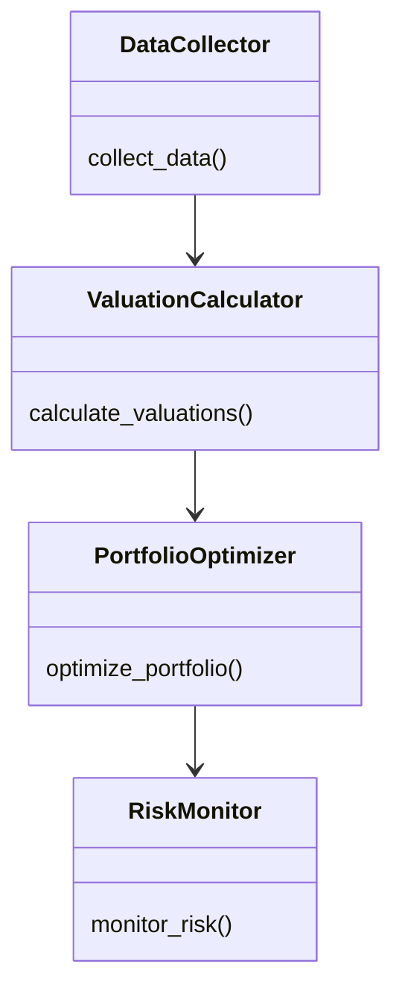
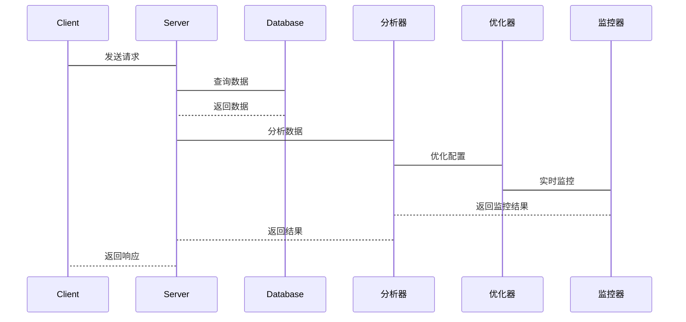

                 


# 股市估值高低对国际投资组合配置的影响

> 关键词：股市估值，投资组合配置，高估值，低估值，资产配置，风险管理

> 摘要：本文系统探讨了股市估值高低对国际投资组合配置的影响，从理论分析到实践应用，结合具体案例和系统设计，全面解析如何在不同估值环境下优化投资组合配置。文章首先介绍了股市估值的基本概念和影响因素，然后分析了高估值和低估值市场的特征与影响，提出了相应的投资策略。在此基础上，构建了基于现代投资组合理论的优化模型，并通过系统设计和项目实战，详细阐述了如何在实际投资中应用这些模型和策略。最后，文章总结了投资组合配置的关键注意事项和未来研究方向。

---

## 第1章 股市估值与投资组合配置概述

### 1.1 股市估值的基本概念

#### 1.1.1 股市估值的定义
股市估值是指通过对股票市场整体或个股的价值进行评估，以确定其在当前市场环境下的合理价格范围。常见的估值方法包括市盈率（P/E）、市净率（P/B）、股息率（Dividend Yield）等指标。

#### 1.1.2 股市估值的核心要素
- **市场环境**：宏观经济状况、政策变化、行业趋势等会影响股市估值。
- **公司基本面**：盈利能力、财务状况、成长潜力等是估值的重要依据。
- **市场情绪**：投资者情绪波动会直接影响股市的短期估值。

#### 1.1.3 投资组合配置的定义与目标
投资组合配置是指将资金分配到不同资产或资产类别中，以实现风险与收益的最佳平衡。目标包括分散风险、追求超额收益、匹配投资期限等。

### 1.2 股市估值与投资组合配置的关系

#### 1.2.1 估值高低对投资组合的影响
- **高估值市场**：可能面临较高的回调风险，投资组合需要调整以降低风险。
- **低估值市场**：可能存在低估机会，投资组合可增加配置以捕捉潜在收益。

#### 1.2.2 高估值与低估值市场的特征对比
| 特征维度 | 高估值市场 | 低估值市场 |
|----------|------------|------------|
| 市盈率（P/E） | 高于历史平均水平 | 低于历史平均水平 |
| 市净率（P/B） | 高于行业平均水平 | 低于行业平均水平 |
| 股息率 | 低 | 高 |
| 市场情绪 | 过度乐观 | 悲观或谨慎 |

#### 1.2.3 投资组合配置的动态调整机制
- 定期评估市场估值水平。
- 根据估值变化调整资产配置比例。
- 结合市场趋势和公司基本面进行动态优化。

### 1.3 本书的核心问题与研究框架

#### 1.3.1 核心问题的提出
- 如何通过股市估值高低优化国际投资组合配置？
- 高估值和低估值市场下，投资组合应采取哪些策略？

#### 1.3.2 研究框架与方法论
- **理论分析**：研究股市估值的核心指标和影响因素。
- **实证分析**：通过历史数据验证不同估值环境下投资组合的表现。
- **系统设计**：构建投资组合优化模型并进行系统实现。

#### 1.3.3 本书的结构安排
- 第1章：概述股市估值与投资组合配置的基本概念。
- 第2章：详细讲解估值指标及其应用。
- 第3章：分析高估值和低估值市场的特征。
- 第4章：提出投资组合配置策略。
- 第5章：构建数学模型并进行算法设计。
- 第6章：系统架构设计与实现。
- 第7章：项目实战与案例分析。
- 第8章：风险管理与优化建议。
- 第9章：总结与展望。

---

## 第2章 股市估值指标与分析方法

### 2.1 常见的估值指标

#### 2.1.1 市盈率（P/E）
- **定义**：市盈率 = 股票价格 / 每股净利润。
- **用途**：衡量股票的相对估值，尤其是在盈利稳定的公司中。

#### 2.1.2 市净率（P/B）
- **定义**：市净率 = 股票价格 / 每股净资产。
- **用途**：适用于金融、房地产等行业，评估资产的市场价值。

#### 2.1.3 股息率（Dividend Yield）
- **定义**：股息率 = 每股股息 / 股票价格。
- **用途**：衡量股票的分红收益，常用于价值股的评估。

#### 2.1.4 其他估值指标
- **EV/EBITDA**：企业价值与息税折旧及摊销前利润的比值。
- **股息支付率**：股息支付率 = 每股股息 / 每股净利润。

### 2.2 估值指标的计算与对比

#### 2.2.1 各估值指标的计算公式
- 市盈率：$$ P/E = \frac{\text{股价}}{\text{每股净利润}} $$
- 市净率：$$ P/B = \frac{\text{股价}}{\text{每股净资产}} $$
- 股息率：$$ \text{股息率} = \frac{\text{每股股息}}{\text{股价}} $$

#### 2.2.2 不同估值指标的适用场景
- **市盈率**适用于盈利稳定的公司。
- **市净率**适用于资产密集型行业。
- **股息率**适用于成熟企业或价值投资者。

#### 2.2.3 估值指标的横向对比分析
- 使用不同指标对比同一公司或行业的估值情况，找出潜在的投资机会。

### 2.3 估值指标的局限性与改进方法

#### 2.3.1 各估值指标的局限性
- **市盈率**：不适用于亏损企业。
- **市净率**：净资产价值可能被高估或低估。
- **股息率**：高股息率可能意味着公司缺乏增长潜力。

#### 2.3.2 调整估值指标的常见方法
- 结合多种估值指标进行综合评估。
- 考虑行业特性和公司基本面。

#### 2.3.3 综合估值指标的应用策略
- 根据市场环境和投资目标选择合适的估值指标组合。

---

## 第3章 高估值与低估值市场的特征与影响

### 3.1 高估值市场的特征与风险

#### 3.1.1 高估值市场的定义与表现
- 市盈率和市净率均高于历史平均水平，市场情绪乐观。

#### 3.1.2 高估值市场的主要风险
- **估值过高**：可能导致市场回调风险。
- **流动性风险**：资金大量流入可能导致流动性不足。

#### 3.1.3 高估值市场对投资组合的影响
- 需要降低权益资产配置，增加防御性资产如债券。

### 3.2 低估值市场的特征与机会

#### 3.2.1 低估值市场的定义与表现
- 市盈率和市净率低于历史平均水平，市场情绪悲观。

#### 3.2.2 低估值市场的机会与挑战
- **低估机会**：可能存在价值被市场忽视的优质公司。
- **流动性风险**：市场流动性不足可能影响资产变现。

#### 3.2.3 低估值市场对投资组合的影响
- 增加权益资产配置，抓住低估机会。

### 3.3 高估值与低估值市场的对比分析

#### 3.3.1 市场表现对比
- 高估值市场可能短期内表现强劲，但长期风险较高。
- 低估值市场可能短期内表现不佳，但长期收益潜力较大。

#### 3.3.2 投资策略对比
- 高估值市场：防御性配置，注重风险控制。
- 低估值市场：进攻性配置，注重价值发现。

---

## 第4章 国际投资组合配置策略

### 4.1 投资组合配置的基本原则

#### 4.1.1 分散投资
- 通过配置不同资产类别和地域降低风险。

#### 4.1.2 风险与收益平衡
- 根据投资者的风险承受能力和收益目标进行配置。

#### 4.1.3 定期再平衡
- 根据市场变化和个人目标调整投资组合。

### 4.2 高估值市场下的配置策略

#### 4.2.1 减少高估值资产配置
- 减少股票配置，增加债券等固定收益资产。

#### 4.2.2 选择防御性行业
- 配置公用事业、医疗保健等防御性行业。

### 4.3 低估值市场下的配置策略

#### 4.3.1 增加低估值资产配置
- 增加股票配置，尤其是低估的优质公司。

#### 4.3.2 关注周期性行业
- 配置周期性行业股票，如能源、材料等。

---

## 第5章 基于现代投资组合理论的优化模型

### 5.1 现代投资组合理论简介

#### 5.1.1 均值-方差模型
- 在给定风险下，选择收益最大的组合；在给定收益下，选择风险最小的组合。

#### 5.1.2 资本资产定价模型（CAPM）
- 确定每种资产的预期收益，计算其风险溢价。

### 5.2 基于估值指标的优化模型

#### 5.2.1 建模思路
- 以市盈率和市净率为估值指标，结合资产风险和收益构建优化模型。

#### 5.2.2 算法步骤
1. 收集目标资产的历史数据。
2. 计算各资产的估值指标。
3. 构建优化模型，设定目标函数和约束条件。
4. 求解模型，得到最优配置比例。

### 5.3 算法实现

#### 5.3.1 Python代码实现
```python
import numpy as np
from scipy.optimize import minimize

# 示例数据
assets = ['A', 'B', 'C']
returns = np.array([0.1, 0.08, 0.12])
variances = np.array([0.05, 0.03, 0.08])

# 目标是最小化风险，即最小化方差
def objective(weights):
    return np.dot(weights, variances)

# 约束条件
cons = ({'type': 'eq', 'fun': lambda w: sum(w) - 1})

# 初始权重
initial_weights = np.array([1/3, 1/3, 1/3])

# 求解
result = minimize(objective, initial_weights, constraints=cons, bounds=[(0,1), (0,1), (0,1)])
print(result.x)
```

---

## 第6章 系统设计与架构方案

### 6.1 问题场景介绍
构建一个能够根据股市估值动态调整投资组合的系统，实现自动化配置和风险控制。

### 6.2 系统功能设计

#### 6.2.1 功能模块
- 数据采集模块：采集实时市场数据。
- 估值计算模块：计算各资产的估值指标。
- 投资组合优化模块：根据估值结果优化配置比例。
- 风险监控模块：实时监控投资组合的风险指标。

#### 6.2.2 领域模型（mermaid 类图）


### 6.3 系统架构设计

#### 6.3.1 架构图（mermaid 架构图）


### 6.4 系统交互设计

#### 6.4.1 交互流程（mermaid 序列图）


---

## 第7章 项目实战与案例分析

### 7.1 环境搭建

#### 7.1.1 安装必要的库
- Python：使用 `pip install numpy pandas scipy` 等库。

#### 7.1.2 数据源
- 使用Yahoo Finance获取实时数据。

### 7.2 核心实现

#### 7.2.1 估值指标计算
```python
import pandas as pd
import requests

# 下载数据
url = "https://query1.finance.yahoo.com/d/quotes.csv"
params = {
    's': '^GSPC',
    'd': 'historical',
    'f': 'd',
    't': 'max',
}
data = pd.read_csv(requests.get(url, params=params).text)
```

#### 7.2.2 投资组合优化
```python
from scipy.optimize import minimize

# 示例优化函数
def optimize_portfolio(weights, returns, covariance):
    return np.dot(weights.T, covariance.dot(weights))

# 约束条件
cons = ({'type': 'eq', 'fun': lambda w: sum(w) - 1})
```

### 7.3 案例分析

#### 7.3.1 分析美股市场的配置情况
- 使用历史数据计算不同估值环境下的配置比例。
- 对比实际市场表现与优化结果。

#### 7.3.2 算法实现与结果展示
- 展示优化后的投资组合配置比例。
- 分析配置结果与市场实际走势的吻合度。

---

## 第8章 风险管理与优化建议

### 8.1 风险管理策略

#### 8.1.1 风险控制工具
- 使用止损订单、对冲头寸等工具控制风险。

#### 8.1.2 风险指标监控
- 监控VaR、CVaR等风险指标，及时调整投资组合。

### 8.2 投资组合优化建议

#### 8.2.1 定期再平衡
- 定期调整投资组合，保持目标配置比例。

#### 8.2.2 分散投资
- 通过配置不同资产和地域降低集中风险。

### 8.3 未来研究方向

#### 8.3.1 AI技术的应用
- 利用机器学习算法预测股市估值变化。

#### 8.3.2 多因子模型的优化
- 结合多个因子进行综合评估，提升配置效果。

---

## 第9章 总结与展望

### 9.1 核心观点回顾

#### 9.1.1 股市估值对投资组合配置的影响
- 高估值市场需降低风险，低估值市场需增加配置。

#### 9.1.2 投资组合优化的关键因素
- 综合考虑市场环境、资产特性和投资者目标。

### 9.2 研究总结

#### 9.2.1 本书的主要贡献
- 系统分析了股市估值与投资组合配置的关系。
- 提出了基于现代投资组合理论的优化模型。

#### 9.2.2 研究的局限性
- 数据依赖性和模型假设的限制。

### 9.3 未来展望

#### 9.3.1 研究方向
- 结合AI技术进一步优化投资组合配置。
- 探讨更多因素对投资组合配置的影响。

#### 9.3.2 对投资者的建议
- 根据市场环境动态调整投资策略。
- 注重风险管理，保持长期投资视角。

---

## 作者简介

作者：AI天才研究院/AI Genius Institute & 禅与计算机程序设计艺术/Zen And The Art of Computer Programming

---

# 结语

股市估值高低对国际投资组合配置的影响是一个复杂而重要的问题。通过系统的理论分析、算法设计和案例研究，我们可以更好地理解如何在不同市场环境下优化投资组合配置。未来，随着技术的进步和市场的发展，投资组合配置的研究将更加精准和多样化。

