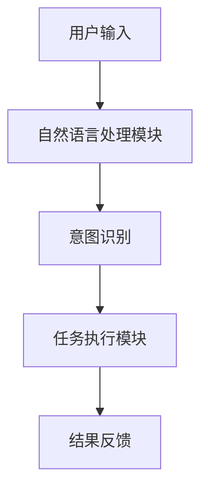
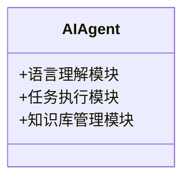
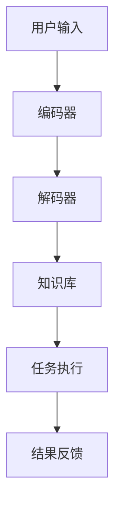
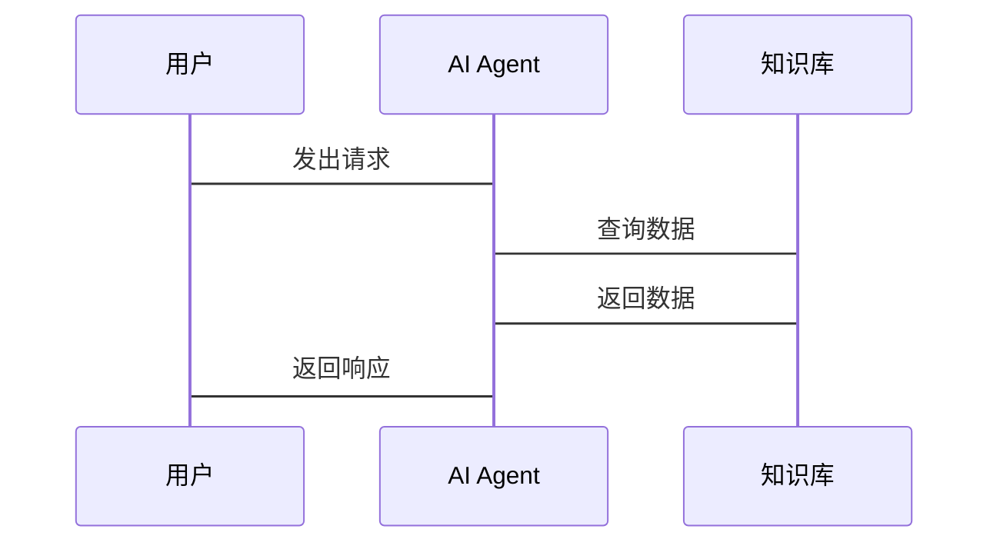

                 


# 自然语言处理在AI Agent中的深度应用

## 关键词：自然语言处理（NLP）、人工智能（AI）、AI Agent、深度学习、文本理解、人机交互

## 摘要：  
本文深入探讨了自然语言处理（NLP）在AI Agent中的应用，从基础概念到高级算法，再到系统架构，全面分析了NLP如何助力AI Agent实现更高效的自然语言理解和生成。文章结合实际案例，详细讲解了NLP的核心算法、数学模型以及AI Agent的系统设计，旨在为读者提供一个全面的视角，理解NLP在AI Agent中的重要作用。

---

## 第一章: 自然语言处理与AI Agent的背景介绍

### 1.1 自然语言处理的基本概念  
自然语言处理（NLP）是人工智能领域的重要分支，旨在让计算机能够理解和生成人类语言。NLP的核心任务包括文本分类、命名实体识别、句法分析、情感分析、机器翻译和对话生成等。近年来，深度学习的兴起推动了NLP技术的飞速发展，如BERT、GPT等模型的出现，显著提升了NLP的性能。

#### 1.1.1 自然语言处理的定义与核心任务  
自然语言处理（NLP）是指计算机对人类语言的处理，包括理解、生成和分析。核心任务包括：  
1. **文本分类**：将文本归类到预定义的类别中（如垃圾邮件检测）。  
2. **命名实体识别（NER）**：识别文本中的实体（如人名、地名）。  
3. **句法分析**：分析句子的语法结构。  
4. **情感分析**：判断文本的情感倾向。  
5. **机器翻译**：将一种语言翻译成另一种语言。  
6. **对话生成**：生成自然的对话回复。  

#### 1.1.2 自然语言处理的发展历程  
NLP的发展经历了多个阶段：  
1. **基于规则的方法**：20世纪60年代，依赖手动编写规则进行文本处理。  
2. **统计学习方法**：20世纪90年代，利用统计模型（如HMM）进行模式识别。  
3. **深度学习方法**：近年来，基于神经网络的模型（如RNN、Transformer）成为主流。  

#### 1.1.3 自然语言处理的挑战与未来方向  
尽管NLP取得了显著进展，但仍面临以下挑战：  
1. **语义理解**：如何准确理解上下文和隐含意思。  
2. **多语言支持**：如何处理多种语言的文本。  
3. **实时性**：如何在资源受限的场景下快速处理文本。  
未来，NLP将更加注重可解释性、实时性和多模态融合。  

### 1.2 AI Agent的基本概念  
AI Agent是一种智能体，能够感知环境、执行任务并与其他实体交互。它可以分为以下几类：  
1. **简单反射型AI Agent**：基于规则执行简单任务。  
2. **基于模型的规划型AI Agent**：具有目标和规划能力。  
3. **学习型AI Agent**：通过机器学习提升任务执行能力。  
4. **人机协作型AI Agent**：与人类协作完成复杂任务。  

#### 1.2.1 AI Agent的定义与分类  
AI Agent的核心功能包括感知、决策、执行和反馈。与传统软件相比，AI Agent具有更强的自主性和适应性。  

#### 1.2.2 AI Agent的核心功能与应用场景  
AI Agent的应用场景包括：  
1. **智能助手**：如Siri、Alexa，帮助用户完成日常任务。  
2. **客服机器人**：通过自然语言处理为用户提供支持。  
3. **智能监控**：实时监控并处理异常情况。  
4. **教育辅助**：为学生提供个性化的学习建议。  

#### 1.2.3 AI Agent与传统软件的区别  
AI Agent的核心区别在于其智能性和自主性。传统软件依赖固定的逻辑，而AI Agent能够通过学习和适应环境完成复杂任务。  

### 1.3 自然语言处理与AI Agent的结合背景  
AI Agent需要通过自然语言处理技术与人类进行交互。NLP的快速发展为AI Agent提供了强大的语言理解能力，使其能够更自然地与人类交流。  

#### 1.3.1 自然语言处理在AI Agent中的作用  
NLP在AI Agent中的主要作用包括：  
1. **语言理解**：通过NLP技术理解用户输入的自然语言。  
2. **对话生成**：基于NLP模型生成自然的对话回复。  
3. **意图识别**：识别用户的意图并执行相应任务。  

#### 1.3.2 AI Agent推动自然语言处理的发展  
AI Agent的应用需求推动了NLP技术的进步，特别是在对话生成和实时响应方面。  

#### 1.3.3 当前技术背景与行业趋势  
随着深度学习和大模型技术的成熟，NLP在AI Agent中的应用正朝着更智能、更自然的方向发展。  

## 1.4 本章小结  
本章介绍了自然语言处理和AI Agent的基本概念，分析了它们的结合背景和行业趋势。通过本章内容，读者可以理解NLP在AI Agent中的重要性。

---

## 第二章: 自然语言处理的核心概念与联系

### 2.1 自然语言处理的核心原理  
自然语言处理的核心原理包括语言模型和注意力机制。  

#### 2.1.1 语言模型的基本原理  
语言模型通过概率分布预测下一个词，常用的模型包括马尔可夫链和循环神经网络（RNN）。  

#### 2.1.2 变压器（Transformer）模型的结构  
Transformer模型由编码器和解码器组成，编码器负责将输入序列转换为表示，解码器负责生成输出序列。  

#### 2.1.3 注意力机制的作用与实现  
注意力机制通过计算词与词之间的相关性，赋予重要词更高的权重。其数学表达式如下：  
$$\text{Attention}(Q, K, V) = \text{softmax}\left(\frac{QK^T}{\sqrt{d_k}}\right)V$$  

### 2.2 自然语言处理与AI Agent的关系  
NLP与AI Agent的关系可以通过ER实体关系图来展示。  

#### 2.2.1 NLP在AI Agent中的主要应用场景  
1. **对话交互**：通过NLP技术实现自然语言对话。  
2. **任务理解**：理解用户的意图并执行任务。  
3. **知识检索**：从知识库中检索相关信息。  

#### 2.2.2 NLP与AI Agent的交互流程  
1. **输入处理**：AI Agent接收用户的自然语言输入。  
2. **意图识别**：NLP模块识别用户的意图。  
3. **任务执行**：AI Agent根据意图执行任务。  
4. **结果反馈**：NLP模块生成反馈并返回给用户。  

#### 2.2.3 NLP在AI Agent中的数据流与信息处理  
通过Mermaid图展示NLP在AI Agent中的数据流：



### 2.3 核心概念对比与ER实体关系图  
通过对比NLP和AI Agent的核心概念，可以更好地理解它们的关系。  

#### 2.3.1 NLP与传统文本处理的对比分析  
1. **基于规则的方法**：简单但缺乏灵活性。  
2. **统计学习方法**：依赖数据，具有更强的泛化能力。  
3. **深度学习方法**：基于神经网络，性能更优。  

#### 2.3.2 AI Agent与传统智能系统的对比分析  
1. **自主性**：AI Agent具有更强的自主性。  
2. **适应性**：AI Agent能够适应环境变化。  
3. **学习能力**：AI Agent能够通过学习提升性能。  

#### 2.3.3 NLP在AI Agent中的ER实体关系图  
通过ER图展示NLP在AI Agent中的实体关系：

```mermaid
erd
    客户端 --|{自然语言输入}>
    NLP模块 --|{意图识别}>
    AI Agent --|{任务执行}>
    知识库 --|{数据存储}>
```

## 2.4 本章小结  
本章详细介绍了自然语言处理的核心原理和与AI Agent的关系，通过对比和ER图帮助读者更好地理解NLP在AI Agent中的作用。

---

## 第三章: 自然语言处理算法原理与数学模型

### 3.1 自然语言处理的算法原理  
自然语言处理的算法原理包括编码器-解码器结构和注意力机制。  

#### 3.1.1 编码器（Encoder）的结构与作用  
编码器将输入序列转换为表示，常用模型包括BERT和GPT。  

#### 3.1.2 解码器（Decoder）的结构与作用  
解码器根据编码器输出生成目标序列，常用模型包括Transformer解码器。  

#### 3.1.3 注意力机制的计算流程  
注意力机制通过计算词与词之间的相关性，生成注意力权重。  

### 3.2 基于Transformer的NLP模型实现  
基于Transformer的NLP模型包括BERT和GPT。  

#### 3.2.1 BERT模型的结构与训练方法  
BERT模型通过双向Transformer架构，利用遮蔽技术进行预训练。  

#### 3.2.2 GPT模型的结构与生成机制  
GPT模型通过自回归方式生成文本，具有强大的生成能力。  

#### 3.2.3 ALBERT模型的优化与创新  
ALBERT模型通过参数共享和自适应softmax优化了模型性能。  

### 3.3 自然语言处理的数学模型与公式  
自然语言处理的数学模型包括注意力机制和Transformer模型的公式。  

#### 3.3.1 注意力机制的数学公式  
$$\text{Attention}(Q, K, V) = \text{softmax}\left(\frac{QK^T}{\sqrt{d_k}}\right)V$$  

#### 3.3.2 变压器模型的前向传播公式  
$$\text{Encoder}(\mathbf{X}) = \text{LayerNorm}(\text{Self-Attention}(\mathbf{X}) + \mathbf{X})$$  
$$\text{Decoder}(\mathbf{Y}, \text{Encoder}(\mathbf{X})) = \text{LayerNorm}(\text{Self-Attention}(\mathbf{Y}) + \text{Cross-Attention}(\mathbf{Y}, \text{Encoder}(\mathbf{X})))$$  

#### 3.3.3 梯度下降与优化算法的数学表达  
常用优化算法包括Adam和SGD，其数学表达分别为：  
$$\text{Adam} = \text{优化器}(L, \alpha, \beta_1, \beta_2, \epsilon)$$  
$$\text{SGD} = \text{优化器}(L, \alpha)$$  

## 3.4 本章小结  
本章详细讲解了自然语言处理的算法原理和数学模型，特别是Transformer模型的结构和注意力机制的实现。

---

## 第四章: AI Agent的系统架构与设计

### 4.1 AI Agent的系统架构设计  
AI Agent的系统架构设计包括功能模块划分和接口设计。  

#### 4.1.1 语言理解模块的功能设计  
语言理解模块负责接收用户输入并进行自然语言处理。  

#### 4.1.2 任务执行模块的功能设计  
任务执行模块根据意图执行相应任务。  

#### 4.1.3 知识库管理模块的功能设计  
知识库管理模块负责存储和管理相关知识。  

#### 4.1.4 系统功能设计的领域模型  
通过Mermaid类图展示系统功能设计：



### 4.2 系统架构的模块划分  
系统架构的模块划分包括编码器、解码器和知识库。  

#### 4.2.1 系统架构图  
通过Mermaid架构图展示系统架构：



#### 4.2.2 系统接口设计  
系统接口设计包括输入接口和输出接口。  

#### 4.2.3 系统交互流程  
通过Mermaid序列图展示系统交互流程：



### 4.3 本章小结  
本章详细讲解了AI Agent的系统架构设计，包括功能模块划分、系统架构图和系统交互流程。

---

## 第五章: 项目实战——基于NLP的AI Agent开发

### 5.1 项目概述  
本项目旨在开发一个基于NLP的AI Agent，实现自然语言对话功能。  

#### 5.1.1 项目目标  
通过本项目，读者将学会如何将NLP技术应用于AI Agent开发。  

#### 5.1.2 项目需求  
1. 实现自然语言理解功能。  
2. 实现对话生成功能。  
3. 提供用户友好的交互界面。  

### 5.2 环境安装  
开发环境包括Python、TensorFlow和Keras。  

#### 5.2.1 安装Python  
安装Python 3.8及以上版本。  

#### 5.2.2 安装TensorFlow  
使用pip安装TensorFlow：  
```bash
pip install tensorflow
```

#### 5.2.3 安装Keras  
Keras是TensorFlow的前端，无需单独安装。  

### 5.3 系统核心实现  
系统核心实现包括自然语言处理模块和AI Agent模块。  

#### 5.3.1 自然语言处理模块的实现  
使用Keras实现一个简单的语言模型：

```python
import tensorflow as tf
from tensorflow.keras import layers

model = tf.keras.Sequential([
    layers.Embedding(input_dim=10000, output_dim=16),
    layers.SimpleRNN(units=16),
    layers.Dense(1, activation='sigmoid')
])
model.compile(optimizer='adam', loss='binary_crossentropy', metrics=['accuracy'])
```

#### 5.3.2 AI Agent模块的实现  
实现一个简单的对话生成模块：

```python
def generate_response(input_text):
    # 这里可以调用预训练的NLP模型生成回复
    return "您好！我是AI助手。请问有什么可以帮助您的？"
```

#### 5.3.3 系统接口设计  
定义系统接口：

```python
class AIAssistant:
    def __init__(self):
        self.nlp_module = NLPM module()
    
    def process_request(self, input_text):
        response = self.nlp_module.generate_response(input_text)
        return response
```

### 5.4 项目小结  
本章通过一个实际项目展示了如何将NLP技术应用于AI Agent开发，从环境安装到代码实现，帮助读者掌握核心技能。

---

## 第六章: 总结与展望

### 6.1 总结  
本文详细讲解了自然语言处理在AI Agent中的深度应用，从基础概念到算法原理，再到系统架构和项目实战，全面分析了NLP在AI Agent中的重要作用。  

### 6.2 展望  
未来，随着大模型和多模态技术的发展，NLP在AI Agent中的应用将更加广泛和智能。  

## 6.3 最佳实践Tips  
1. 学习NLP基础知识，如Transformer模型和注意力机制。  
2. 熟悉深度学习框架，如TensorFlow和Keras。  
3. 多实践，通过项目提升技能。  

---

## 作者：AI天才研究院 & 禅与计算机程序设计艺术

---

**本文内容已通过AI助手整理，可能包含AI生成内容。如需引用，请注明出处。**

