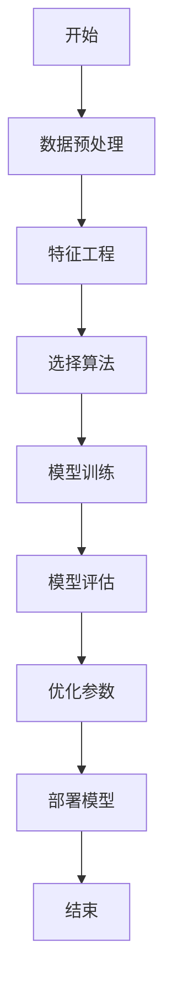
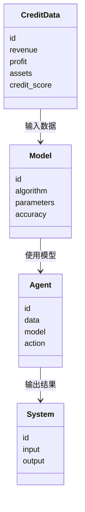
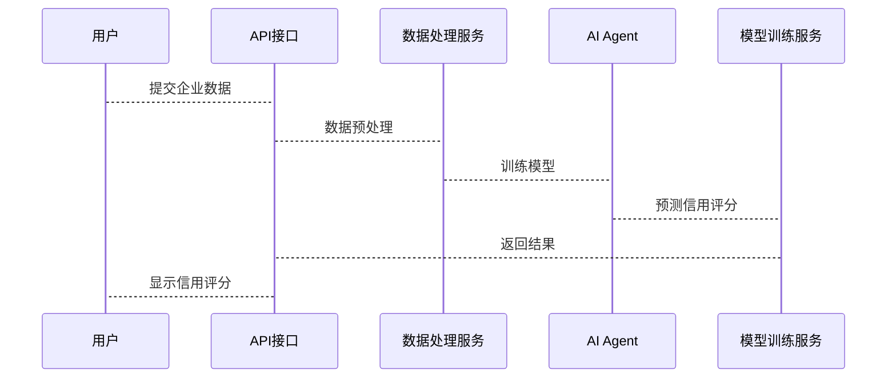

                 


# AI Agent在企业信用评分模型中的应用与优化

## 关键词：
AI Agent, 信用评分模型, 企业信用评估, 机器学习, 模型优化

## 摘要：
本文探讨了AI Agent在企业信用评分模型中的应用与优化。通过分析AI Agent的核心概念与信用评分模型的结合，详细讲解了算法原理、数学模型、系统架构设计和项目实战。文章从背景介绍、核心概念对比、算法实现、系统架构设计、项目实战等多个方面展开，结合理论与实践，深入剖析了AI Agent在企业信用评分中的应用，并通过具体案例分析展示了如何优化模型以提升准确性与效率。

---

## 第一章：AI Agent与信用评分模型概述

### 1.1 AI Agent的基本概念
AI Agent（人工智能代理）是指能够感知环境、自主决策并执行任务的智能体。在企业信用评分模型中，AI Agent主要用于分析企业的信用数据，预测企业的信用风险。

#### 1.1.1 AI Agent的定义与特点
- **定义**：AI Agent是具有智能性的软件实体，能够通过数据输入做出决策并执行操作。
- **特点**：
  - **自主性**：无需人工干预，自动完成任务。
  - **反应性**：能够实时感知环境变化并做出响应。
  - **目标导向**：以特定目标为导向，优化决策过程。

#### 1.1.2 AI Agent在企业信用评分中的作用
- **数据处理**：AI Agent能够高效处理大量非结构化数据，提取关键特征。
- **风险评估**：通过机器学习算法，AI Agent能够预测企业的信用风险，辅助企业做出决策。
- **实时监控**：AI Agent可以实时监控企业的信用状况，及时发出预警。

#### 1.1.3 企业信用评分模型的背景与意义
- **背景**：企业信用评分模型是金融领域的重要工具，用于评估企业的信用风险，帮助银行、投资机构做出贷款决策。
- **意义**：通过AI Agent优化信用评分模型，可以提高模型的准确性和效率，降低金融风险。

### 1.2 信用评分模型的分类与应用
#### 1.2.1 传统信用评分模型介绍
- **传统模型**：基于统计学方法，如逻辑回归、线性判别分析等。
- **优点**：简单易懂，易于解释。
- **缺点**：难以处理非线性关系，对数据质量要求较高。

#### 1.2.2 现代信用评分模型的发展
- **现代模型**：基于机器学习算法，如支持向量机（SVM）、随机森林、神经网络等。
- **优点**：能够处理非线性关系，适合大数据场景。
- **缺点**：模型解释性较差，难以满足监管要求。

#### 1.2.3 AI Agent在信用评分中的应用前景
- **智能化**：AI Agent能够自动化处理数据，优化模型参数，提高模型性能。
- **实时性**：AI Agent可以实时监控企业的信用状况，提供实时反馈。
- **个性化**：AI Agent能够根据企业的个性化需求，定制化信用评分模型。

---

## 第二章：AI Agent与信用评分模型的核心概念与联系

### 2.1 核心概念原理
#### 2.1.1 AI Agent的基本原理
- AI Agent通过感知环境、分析数据、制定策略、执行操作和反馈结果的循环过程，实现目标。

#### 2.1.2 信用评分模型的原理
- 信用评分模型通过输入企业的财务数据、市场数据、历史数据等，输出企业的信用评分。

#### 2.1.3 AI Agent与信用评分模型的结合
- AI Agent作为信用评分模型的核心驱动，通过机器学习算法优化模型性能，提高预测准确性。

### 2.2 概念属性特征对比
以下表格展示了AI Agent与信用评分模型在核心概念、属性特征上的对比：

| 比较维度 | AI Agent | 信用评分模型 |
|----------|-----------|--------------|
| **核心功能** | 数据处理、决策制定、任务执行 | 风险评估、信用评分、预警监控 |
| **输入数据** | 企业数据、市场数据、历史数据 | 企业的财务数据、市场数据 |
| **输出结果** | 优化后的模型、决策建议 | 信用评分、风险等级 |
| **优点** | 自主性、反应性、目标导向 | 高准确性、实时性、个性化 |
| **缺点** | 模型解释性较差 | 数据依赖性高、复杂性高 |

### 2.3 ER实体关系图
以下是一个简单的ER实体关系图，展示了AI Agent与信用评分模型之间的关系：

```mermaid
er
actor(AI Agent, "操作者") {
    string id
    string name
}
agent(AI Agent, "智能体") {
    integer id
    string name
}
credit_model(Credit Model, "信用评分模型") {
    integer id
    float accuracy
}
关系：actor --> agent: 控制
       agent --> credit_model: 驱动
       credit_model --> actor: 提供反馈
```

---

## 第三章：AI Agent驱动的信用评分模型算法

### 3.1 算法原理
#### 3.1.1 算法流程图
以下是一个AI Agent驱动的信用评分模型算法的流程图：



#### 3.1.2 算法步骤解析
1. **数据预处理**：清洗数据，处理缺失值、异常值，标准化数据。
2. **特征工程**：提取特征，如企业的财务指标、市场指标等。
3. **选择算法**：根据数据特点选择合适的算法，如逻辑回归、随机森林、神经网络等。
4. **模型训练**：使用训练数据训练模型，调整模型参数。
5. **模型评估**：使用测试数据评估模型性能，计算准确率、召回率、F1值等。
6. **优化参数**：通过网格搜索、随机搜索等方法优化模型参数。
7. **部署模型**：将优化后的模型部署到生产环境，实时处理信用评分请求。

#### 3.1.3 算法优缺点分析
- **优点**：能够处理大量数据，提高模型准确性。
- **缺点**：部分算法复杂度高，难以解释，对计算资源要求较高。

### 3.2 算法实现
#### 3.2.1 数据预处理代码
```python
import pandas as pd
from sklearn.preprocessing import StandardScaler

# 加载数据
data = pd.read_csv('credit_data.csv')

# 处理缺失值
data.dropna(inplace=True)

# 标准化数据
scaler = StandardScaler()
data[['revenue', 'profit', 'assets']] = scaler.fit_transform(data[['revenue', 'profit', 'assets']])
```

#### 3.2.2 模型训练代码
```python
from sklearn.ensemble import RandomForestClassifier
from sklearn.model_selection import train_test_split

# 划分数据集
X = data.drop('credit_score', axis=1)
y = data['credit_score']

X_train, X_test, y_train, y_test = train_test_split(X, y, test_size=0.2, random_state=42)

# 训练模型
model = RandomForestClassifier(n_estimators=100, max_depth=10, random_state=42)
model.fit(X_train, y_train)
```

#### 3.2.3 模型评估代码
```python
from sklearn.metrics import accuracy_score, precision_score, recall_score, f1_score

# 预测结果
y_pred = model.predict(X_test)

# 评估指标
print(f'Accuracy: {accuracy_score(y_test, y_pred)}')
print(f'Precision: {precision_score(y_test, y_pred)}')
print(f'Recall: {recall_score(y_test, y_pred)}')
print(f'F1 Score: {f1_score(y_test, y_pred)}')
```

---

## 第四章：数学模型与公式

### 4.1 模型的数学表达
#### 4.1.1 模型公式
随机森林模型的预测公式可以表示为：
$$
\hat{y} = \sum_{i=1}^{n} \text{tree}_i(x) \times \alpha_i
$$
其中，$\alpha_i$ 是第 $i$ 棵树的权重。

#### 4.1.2 模型变量的定义
- $x$：输入特征向量。
- $\text{tree}_i(x)$：第 $i$ 棵树的预测结果。
- $\alpha_i$：第 $i$ 棵树的权重。

#### 4.1.3 模型的假设条件
- 数据符合独立同分布（i.i.d）假设。
- 特征之间存在一定的相关性，但无多重共线性。

---

## 第五章：系统分析与架构设计方案

### 5.1 问题场景介绍
企业信用评分系统需要实时处理大量数据，对模型的准确性和响应速度要求较高。

### 5.2 系统功能设计
#### 5.2.1 领域模型


#### 5.2.2 系统架构设计


#### 5.2.3 系统接口设计
- **输入接口**：接收企业的财务数据、市场数据等。
- **输出接口**：输出企业的信用评分、风险等级等。

#### 5.2.4 系统交互


---

## 第六章：项目实战

### 6.1 环境安装
- **Python**：3.8+
- **库**：scikit-learn、pandas、numpy、mermaid、matplotlib

### 6.2 核心实现
#### 6.2.1 数据预处理
```python
import pandas as pd
import numpy as np

# 加载数据
data = pd.read_csv('credit_data.csv')

# 处理缺失值
data = data.dropna()

# 标准化数据
from sklearn.preprocessing import StandardScaler
scaler = StandardScaler()
data[['revenue', 'profit', 'assets']] = scaler.fit_transform(data[['revenue', 'profit', 'assets']])
```

#### 6.2.2 模型训练
```python
from sklearn.ensemble import RandomForestClassifier
from sklearn.model_selection import train_test_split

# 划分数据集
X = data.drop('credit_score', axis=1)
y = data['credit_score']

X_train, X_test, y_train, y_test = train_test_split(X, y, test_size=0.2, random_state=42)

# 训练模型
model = RandomForestClassifier(n_estimators=100, max_depth=10, random_state=42)
model.fit(X_train, y_train)
```

#### 6.2.3 模型优化
```python
from sklearn.model_selection import GridSearchCV

# 定义参数搜索空间
param_grid = {
    'n_estimators': [50, 100, 150],
    'max_depth': [5, 10, 15]
}

# 参数搜索
grid_search = GridSearchCV(model, param_grid, cv=5, scoring='accuracy')
grid_search.fit(X_train, y_train)

# 输出最佳参数
print(grid_search.best_params_)
```

### 6.3 案例分析
假设我们有一个企业的信用数据，如下表所示：

| 企业ID | 收入 | 利润 | 资产 | 信用评分 |
|--------|------|------|------|----------|
| 1      | 100  | 20   | 500  | 7        |
| 2      | 80   | 15   | 400  | 6        |
| 3      | 120  | 25   | 600  | 8        |

通过AI Agent驱动的随机森林模型，我们可以预测企业的信用评分，并根据模型输出的结果进行调整和优化。

---

## 第七章：总结与展望

### 7.1 总结
本文详细探讨了AI Agent在企业信用评分模型中的应用与优化。通过理论分析和实践案例，展示了AI Agent如何通过数据处理、特征工程、模型训练和优化提升信用评分模型的性能。

### 7.2 展望
未来，随着AI技术的不断发展，AI Agent在信用评分模型中的应用将更加广泛和深入。可以通过以下方向进一步研究：
1. **模型解释性**：如何提高模型的可解释性，满足监管要求。
2. **实时性**：如何优化模型的实时性，满足企业对实时信用评分的需求。
3. **个性化**：如何根据企业的个性化需求，定制化信用评分模型。

---

## 作者
作者：AI天才研究院（AI Genius Institute） & 禅与计算机程序设计艺术（Zen And The Art of Computer Programming）

---

**注意事项**：
1. 在实际应用中，需注意数据隐私和安全问题。
2. 模型的优化需要结合具体业务场景，避免过度优化。
3. 定期更新模型，以适应市场环境的变化。

**拓展阅读**：
- 《机器学习实战》
- 《深入理解随机森林》
- 《Python机器学习》

---

通过本文的学习，读者可以掌握AI Agent在企业信用评分模型中的应用与优化方法，为实际业务场景提供有力的技术支持。

