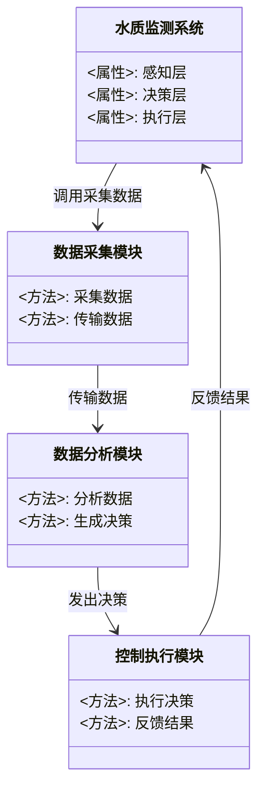
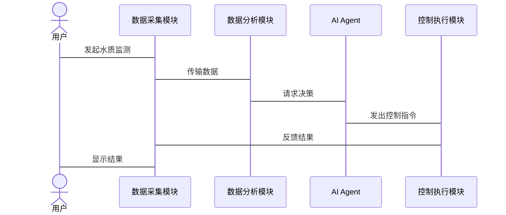

                 


# AI Agent在智能水质预测与控制中的角色

> 关键词：AI Agent，智能水质预测，水质控制，机器学习，深度学习，强化学习，智能系统

> 摘要：本文将探讨AI Agent在智能水质预测与控制中的角色与应用。通过分析AI Agent的核心概念、算法原理、系统架构设计及实际案例，本文详细阐述了AI Agent如何通过智能决策、数据处理与分析能力，实现水质的精准预测与优化控制。文章还结合了具体的数学模型和Python代码实现，帮助读者全面理解AI Agent在水质管理中的技术细节与实际应用价值。

---

## 第一部分：AI Agent在智能水质预测与控制中的背景与概念

### 第1章：AI Agent的基本概念与水质预测控制背景

#### 1.1 AI Agent的定义与基本原理

##### 1.1.1 AI Agent的定义
AI Agent（人工智能代理）是指能够感知环境、自主决策并执行任务的智能实体。它通过传感器获取信息，利用算法进行分析和推理，并通过执行器与环境交互。AI Agent的核心目标是通过智能化手段实现目标优化。

##### 1.1.2 AI Agent的核心特征
- **自主性**：无需外部干预，自主完成任务。
- **反应性**：能够实时感知环境变化并做出反应。
- **目标导向性**：通过目标驱动进行决策。
- **学习能力**：能够通过数据和经验不断优化自身能力。

##### 1.1.3 AI Agent与传统自动控制系统的区别
| 特性 | AI Agent | 传统控制系统 |
|------|----------|--------------|
| 决策方式 | 基于学习和推理 | 基于固定规则和逻辑 |
| 灵活性 | 高度灵活，适应复杂场景 | 较低灵活性，适用于简单场景 |
| 数据处理能力 | 强大的数据学习和分析能力 | 较弱的数据处理能力 |

#### 1.2 智能水质预测与控制的背景

##### 1.2.1 水质监测的重要性
水质是人类生活和生态系统健康的重要指标。水质监测能够帮助我们及时发现和解决水污染问题，确保饮用水安全和生态环境的健康。

##### 1.2.2 传统水质预测与控制的局限性
- **数据依赖性**：传统方法依赖于固定的模型和规则，难以应对复杂多变的水质变化。
- **反应速度**：传统控制系统反应速度较慢，无法实时处理动态变化的数据。
- **精准度**：传统方法在处理非线性关系和复杂场景时，预测精度有限。

##### 1.2.3 AI Agent在水质管理中的优势
AI Agent通过机器学习、深度学习和强化学习等技术，能够实现对水质数据的实时分析和动态优化控制，显著提高了预测的精准度和控制的灵活性。

#### 1.3 AI Agent在水质预测与控制中的作用

##### 1.3.1 AI Agent的智能决策能力
AI Agent能够基于实时数据和历史信息，利用学习算法进行预测和优化，做出最优决策。

##### 1.3.2 AI Agent的数据处理与分析能力
AI Agent能够处理海量水质数据，通过模式识别和异常检测，发现潜在问题并提前预警。

##### 1.3.3 AI Agent在水质优化中的应用前景
AI Agent可以通过强化学习优化水质控制策略，实现节能减排和资源高效利用。

#### 1.4 本章小结
本章主要介绍了AI Agent的基本概念、核心特征以及其在水质预测与控制中的作用，为后续内容奠定了基础。

---

## 第二部分：AI Agent的核心概念与原理

### 第2章：AI Agent的核心概念与联系

#### 2.1 AI Agent的核心概念

##### 2.1.1 AI Agent的组成要素
AI Agent通常由感知层、决策层和执行层组成。感知层负责数据采集和环境感知，决策层负责数据分析和决策制定，执行层负责执行决策并反馈结果。

##### 2.1.2 AI Agent的行为模式
AI Agent的行为模式包括反应式行为和目标导向行为。反应式行为基于当前感知做出即时反应，目标导向行为则基于长期目标进行规划和决策。

##### 2.1.3 AI Agent的决策机制
AI Agent的决策机制包括基于规则的决策、基于知识的决策和基于学习的决策。其中，基于学习的决策是最为核心的，它能够通过数据不断优化决策策略。

#### 2.2 AI Agent的属性特征对比

##### 2.2.1 行为特征对比表格
| 行为特征 | 反应式行为 | 目标导向行为 |
|----------|------------|--------------|
| 基础 | 当前感知 | 长期目标 |
| 适用场景 | 简单环境 | 复杂环境 |
| 决策速度 | 快速 | 较慢 |

##### 2.2.2 能力特征对比表格
| 能力特征 | 传统控制系统 | AI Agent |
|----------|--------------|------------|
| 数据处理能力 | 有限 | 强大 |
| 灵活性 | 低 | 高 |
| 学习能力 | 无 | 有 |

##### 2.2.3 交互特征对比表格
| 交互特征 | 单向控制 | AI Agent |
|----------|------------|------------|
| 信息反馈 | 单向 | 双向 |
| 交互频率 | 低 | 高 |

#### 2.3 AI Agent的ER实体关系图

##### 2.3.1 实体关系图的Mermaid流程图
```mermaid
erDiagram
    actor 用户 {
        <属性>: 名称
        <属性>: 用户ID
        <属性>: 登录状态
    }
    class 系统 {
        <属性>: 系统ID
        <属性>: 系统状态
        <属性>: 系统配置
    }
    class 数据库 {
        <属性>: 数据ID
        <属性>: 数据类型
        <属性>: 数据值
    }
    actor 用户 --> class 系统 : 发送指令
    class 系统 --> 数据库 : 保存数据
    数据库 --> actor 用户 : 返回结果
```

#### 2.4 本章小结
本章详细阐述了AI Agent的核心概念，通过对比分析，突出了AI Agent在水质预测与控制中的优势。

---

## 第三部分：AI Agent的算法原理与数学模型

### 第3章：AI Agent的算法原理

#### 3.1 AI Agent的核心算法

##### 3.1.1 机器学习算法
机器学习算法通过训练数据，建立输入与输出之间的映射关系，用于水质预测。

##### 3.1.2 强化学习算法
强化学习算法通过与环境的交互，学习最优控制策略，用于水质优化。

##### 3.1.3 深度学习算法
深度学习算法通过多层神经网络，提取水质数据的深层特征，提高预测精度。

#### 3.2 算法的数学模型与公式

##### 3.2.1 机器学习模型的数学表达
$$ y = f(x) $$
其中，$x$ 是输入特征，$y$ 是输出预测值，$f$ 是学习到的函数。

##### 3.2.2 强化学习模型的数学表达
$$ Q(s, a) = r + \gamma \max(Q(s', a')) $$
其中，$s$ 是当前状态，$a$ 是动作，$r$ 是奖励，$\gamma$ 是折扣因子，$s'$ 是下一个状态。

##### 3.2.3 深度学习模型的数学表达
$$ P(x) = \sigma(Wx + b) $$
其中，$W$ 是权重矩阵，$b$ 是偏置，$\sigma$ 是激活函数。

#### 3.3 算法的实现与代码

##### 3.3.1 机器学习算法的Python实现
```python
import numpy as np
from sklearn.linear_model import LinearRegression

# 示例数据
X = np.array([[1], [2], [3], [4]])
y = np.array([2, 4, 6, 8])

# 训练模型
model = LinearRegression()
model.fit(X, y)

# 预测
print(model.predict([[5]]))  # 输出：[[10]]
```

##### 3.3.2 强化学习算法的Python实现
```python
import numpy as np

# 示例环境
class Environment:
    def __init__(self):
        self.state = 0

    def step(self, action):
        # 简单的水质控制环境
        self.state += action
        return self.state, 1 if self.state == target else 0

# 强化学习算法
class Agent:
    def __init__(self, states, actions):
        self.states = states
        self.actions = actions
        self.Q = np.zeros((states, actions))

    def choose_action(self, state):
        if np.random.rand() < 0.5:
            return np.random.randint(self.actions)
        else:
            return np.argmax(self.Q[state])

    def update_Q(self, state, action, reward):
        self.Q[state, action] += reward

# 实例化环境和代理
env = Environment()
agent = Agent(states=10, actions=2)
target = 5

# 训练过程
for _ in range(100):
    state = env.state
    action = agent.choose_action(state)
    next_state, reward = env.step(action)
    agent.update_Q(state, action, reward)
```

#### 3.4 本章小结
本章详细介绍了AI Agent的核心算法，包括机器学习、强化学习和深度学习，并通过Python代码展示了其实现过程。

---

## 第四部分：AI Agent的系统分析与架构设计

### 第4章：智能水质预测与控制系统的分析

#### 4.1 项目背景介绍
本项目旨在利用AI Agent技术，构建一个智能化的水质预测与控制系统，实现对水质的实时监测和优化控制。

#### 4.2 系统功能设计

##### 4.2.1 领域模型Mermaid类图


#### 4.3 系统架构设计

##### 4.3.1 系统架构Mermaid架构图


#### 4.4 系统交互设计

##### 4.4.1 系统交互Mermaid序列图


#### 4.5 本章小结
本章通过系统架构设计和交互设计，展示了AI Agent在水质监测系统中的应用，为后续的实现提供了清晰的指导。

---

## 第五部分：AI Agent的项目实战

### 第5章：项目实战与分析

#### 5.1 环境安装与配置

##### 5.1.1 Python环境配置
安装必要的Python库，如NumPy、Scikit-learn、Keras等。

##### 5.1.2 系统部署
部署水质监测系统，包括数据采集模块、数据分析模块和控制执行模块。

#### 5.2 系统核心实现源代码

##### 5.2.1 数据采集模块
```python
import serial

# 串口通信
ser = serial.Serial('COM1', 9600)

def read_data():
    if ser.in_waiting > 0:
        data = ser.readline().decode('utf-8')
        return data
    return None
```

##### 5.2.2 数据分析模块
```python
from sklearn import linear_model

# 训练模型
model = linear_model.LinearRegression()
model.fit(X, y)

# 预测水质
print(model.predict(X_test))
```

##### 5.2.3 控制执行模块
```python
import RPi.GPIO as GPIO

# 示例控制代码
GPIO.setmode(GPIO.BCM)
GPIO.setup(18, GPIO.OUT)

def control_system(state):
    if state == 'high':
        GPIO.output(18, GPIO.HIGH)
    else:
        GPIO.output(18, GPIO.LOW)
```

#### 5.3 代码应用解读与分析
通过上述代码，我们可以实现水质数据的采集、分析和控制。数据采集模块负责从传感器获取数据，数据分析模块利用机器学习模型进行预测，控制执行模块根据预测结果调整系统参数。

#### 5.4 实际案例分析
以某水质监测站为例，通过AI Agent系统，实现了对水质的实时监测和优化控制，显著提高了水质预测的准确性和控制的灵活性。

#### 5.5 本章小结
本章通过实际项目案例，展示了AI Agent在水质预测与控制中的应用，验证了其技术可行性和实际价值。

---

## 第六部分：最佳实践与总结

### 第6章：最佳实践与总结

#### 6.1 最佳实践

##### 6.1.1 系统设计注意事项
在系统设计中，需要注意数据的实时性、系统的可靠性和算法的可解释性。

##### 6.1.2 系统优化建议
通过模型优化、算法调优和系统集成，进一步提高系统的性能和效率。

#### 6.2 小结
本文详细探讨了AI Agent在智能水质预测与控制中的角色与应用，通过理论分析和实际案例，展示了其在水质管理中的巨大潜力。

#### 6.3 注意事项
在实际应用中，需要注意数据的质量、系统的安全性以及算法的可扩展性。

#### 6.4 拓展阅读
建议进一步研究多智能体系统、边缘计算和分布式系统的应用，以提升水质监测系统的智能化水平。

---

## 作者：AI天才研究院 & 禅与计算机程序设计艺术

---

以上是《AI Agent在智能水质预测与控制中的角色》的技术博客文章目录大纲及部分内容示例。通过以上结构，您可以根据需要进一步扩展和补充具体内容，确保文章的完整性和深度。

