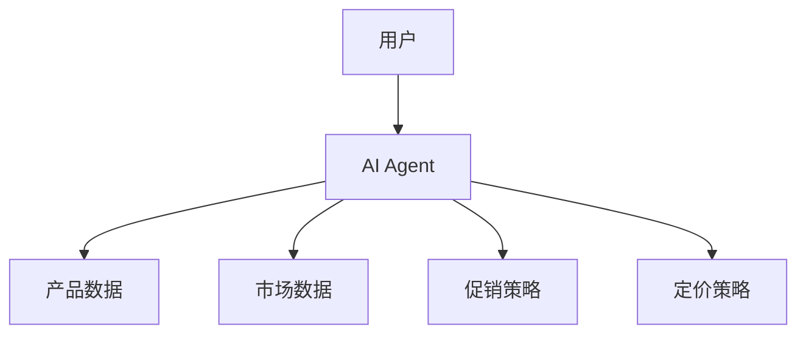
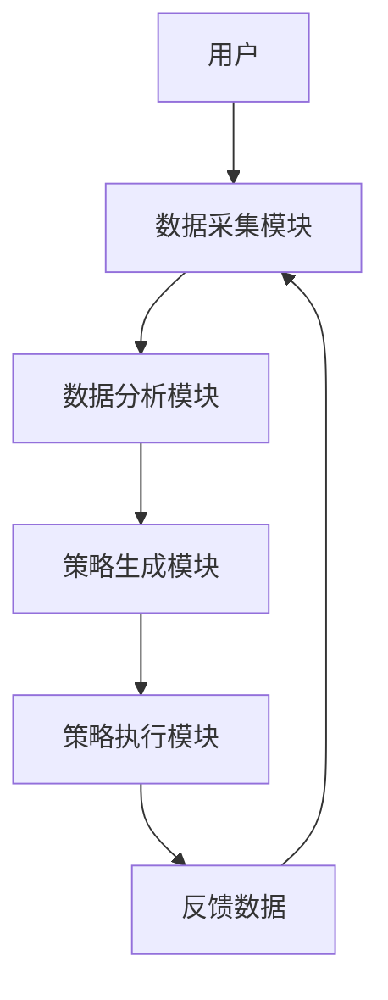
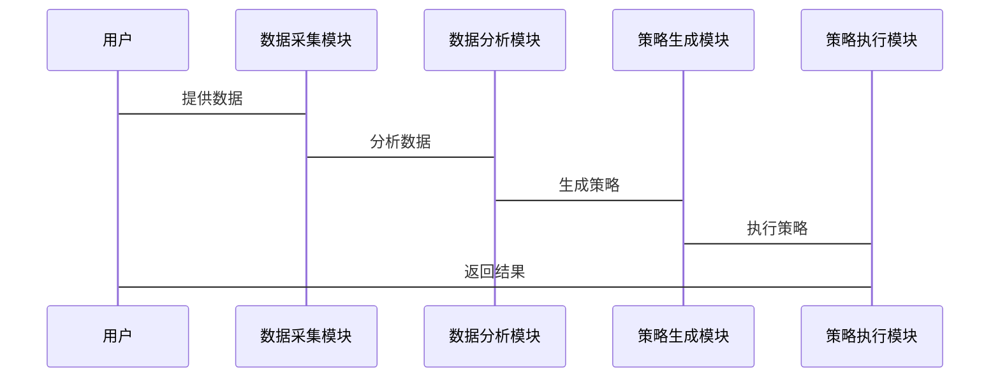

                 


# AI Agent辅助产品定价与促销策略制定的方法

> 关键词：AI Agent，产品定价，促销策略，人工智能，商业决策

> 摘要：本文系统阐述了AI Agent在产品定价与促销策略制定中的应用方法，分析了传统定价策略的局限性，探讨了AI Agent的核心原理及其在定价与促销中的创新应用。文章从背景介绍、核心概念、算法原理、系统架构设计、项目实战等多个维度展开，详细讲解了AI Agent如何通过数据驱动决策优化定价与促销策略，并通过实际案例分析展示了其在商业中的巨大潜力。

---

# 第一部分: AI Agent辅助产品定价与促销策略制定的背景与基础

## 第1章: AI Agent与产品定价概述

### 1.1 AI Agent的基本概念与核心原理

#### 1.1.1 AI Agent的定义与分类
- **定义**：AI Agent（人工智能代理）是一种能够感知环境、自主决策并执行任务的智能体。
- **分类**：基于智能级别，AI Agent可以分为简单反射型、基于模型型、目标驱动型和效用驱动型。

#### 1.1.2 AI Agent的核心特征与优势
- **核心特征**：
  - **自主性**：无需外部干预，自主完成任务。
  - **反应性**：能够实时感知环境变化并做出反应。
  - **学习能力**：通过数据和经验不断优化决策模型。
- **优势**：
  - 提高决策效率。
  - 降低人为错误。
  - 实现24/7实时优化。

#### 1.1.3 AI Agent在商业决策中的应用潜力
- **潜力领域**：
  - 市场分析与预测。
  - 定价策略优化。
  - 促销活动策划。
  - 客户行为预测。

---

### 1.2 产品定价与促销策略的传统挑战

#### 1.2.1 传统定价策略的局限性
- **数据依赖性**：传统定价策略依赖历史数据，但难以实时调整。
- **人为因素**：定价决策受主观因素影响较大。
- **响应速度**：面对市场变化时，传统策略调整速度较慢。

#### 1.2.2 促销策略的复杂性与不确定性
- **复杂性**：促销策略涉及多个变量，如价格、时间、目标人群等。
- **不确定性**：促销效果受市场环境和消费者行为影响，难以预测。

#### 1.2.3 数据驱动决策的重要性
- **数据驱动**：通过大量数据和分析模型优化决策。
- **实时性**：AI Agent能够实时分析数据，快速调整策略。

---

### 1.3 AI Agent在定价与促销中的应用前景

#### 1.3.1 AI Agent如何优化定价策略
- **动态定价**：根据市场供需实时调整价格。
- **个性化定价**：针对不同客户群体制定不同价格。
- **预测性定价**：基于市场预测制定最优价格。

#### 1.3.2 AI Agent在促销策略中的创新应用
- **精准促销**：通过分析消费者行为制定个性化促销方案。
- **自动化促销**：AI Agent可以自动执行促销活动。
- **动态调整促销策略**：实时根据市场反馈优化促销策略。

#### 1.3.3 未来趋势与商业价值
- **趋势**：AI Agent将成为企业定价与促销的核心工具。
- **价值**：通过优化定价和促销策略，显著提高企业利润和客户满意度。

---

## 1.4 本章小结
本章介绍了AI Agent的基本概念和核心原理，并分析了传统定价与促销策略的局限性。同时，探讨了AI Agent在定价与促销中的应用前景，为后续章节的深入分析奠定了基础。

---

# 第二部分: AI Agent的核心概念与原理

## 第2章: AI Agent的核心概念与联系

### 2.1 AI Agent的核心概念

#### 2.1.1 感知模块：数据采集与特征提取
- **数据采集**：AI Agent通过传感器、数据库等获取环境数据。
- **特征提取**：从原始数据中提取有用的特征，如价格、销量、客户行为等。

#### 2.1.2 决策模块：策略生成与优化
- **策略生成**：基于感知模块提供的数据，生成初步定价和促销策略。
- **策略优化**：通过强化学习等算法不断优化策略，提高决策效果。

#### 2.1.3 执行模块：策略实施与反馈
- **策略实施**：将优化后的策略执行，如调整价格或启动促销活动。
- **反馈收集**：收集执行后的反馈数据，用于后续优化。

---

### 2.2 AI Agent的核心原理

#### 2.2.1 强化学习的基本原理
- **强化学习**：通过试错和奖励机制，优化决策策略。
- **Q-learning算法**：一种经典的强化学习算法，适用于离散动作空间。

#### 2.2.2 监督学习与非监督学习的对比
- **监督学习**：基于标记数据进行模型训练。
- **非监督学习**：基于无标记数据进行模式识别。

#### 2.2.3 多智能体协作机制
- **多智能体协作**：多个AI Agent协同工作，共同优化定价和促销策略。

---

### 2.3 AI Agent的实体关系图



---

## 2.4 本章小结
本章详细讲解了AI Agent的核心概念和工作原理，分析了其在定价与促销中的关键模块和协作机制。

---

# 第三部分: AI Agent的算法原理与数学模型

## 第3章: AI Agent的算法原理

### 3.1 强化学习算法

#### 3.1.1 Q-learning算法
- **算法流程**：
  1. 初始化Q表。
  2. 环境提供当前状态。
  3. AI Agent选择动作。
  4. 执行动作并获得奖励。
  5. 更新Q表。

#### 3.1.2 Deep Q-Networks (DQN)算法
- **DQN算法**：通过神经网络近似Q值函数，解决高维状态空间问题。

#### 3.1.3 策略梯度算法
- **策略梯度**：直接优化策略，而非值函数。

---

### 3.2 聚类与分类算法

#### 3.2.1 K-means聚类算法
- **K-means**：将数据分成K个簇，适用于客户分群。

#### 3.2.2 支持向量机(SVM)分类算法
- **SVM**：用于分类问题，适用于客户行为分类。

#### 3.2.3 随机森林分类算法
- **随机森林**：基于决策树的集成学习算法，适用于复杂分类任务。

---

### 3.3 算法实现的Python代码示例

```python
import numpy as np
from sklearn.ensemble import RandomForestClassifier

# 示例数据
X = np.array([[1, 2], [3, 4], [5, 6], [7, 8]])
y = np.array([0, 1, 0, 1])

# 初始化模型
model = RandomForestClassifier(n_estimators=2)

# 训练模型
model.fit(X, y)

# 预测
print(model.predict([[9, 10]]))
```

---

### 3.4 算法的数学模型与公式

#### 3.4.1 Q-learning算法的数学模型
$$ Q(s, a) = Q(s, a) + \alpha [r + \gamma \max Q(s', a') - Q(s, a)] $$

#### 3.4.2 DQN算法的数学模型
$$ \hat{Q}(s, a) = \arg \max Q(s, a) $$

---

## 3.5 本章小结
本章详细讲解了AI Agent的核心算法，包括强化学习、聚类与分类算法，并通过Python代码示例展示了算法实现。数学模型的解释帮助读者理解算法的内在逻辑。

---

# 第四部分: AI Agent在系统中的应用与设计

## 第4章: AI Agent的系统架构设计

### 4.1 系统分析与设计

#### 4.1.1 应用场景分析
- **电商定价**：实时调整商品价格，优化利润。
- **促销策略优化**：制定个性化促销方案，提升销售量。

#### 4.1.2 系统功能设计
- **数据采集模块**：采集市场数据和客户行为数据。
- **数据分析模块**：分析数据，提取特征。
- **策略生成模块**：基于算法生成定价和促销策略。
- **策略执行模块**：执行策略并反馈结果。

---

### 4.2 系统架构设计



---

### 4.3 系统接口设计

#### 4.3.1 API接口
- **输入**：市场数据、客户行为数据。
- **输出**：优化后的定价和促销策略。

#### 4.3.2 数据格式
- **JSON格式**：便于系统间数据传输。

---

### 4.4 系统交互流程



---

## 4.5 本章小结
本章从系统架构设计的角度，详细讲解了AI Agent在定价与促销中的应用场景、功能设计和交互流程，为后续的项目实施提供了理论支持。

---

# 第五部分: 项目实战

## 第5章: AI Agent在产品定价与促销中的应用案例

### 5.1 项目背景

#### 5.1.1 项目目标
- **优化定价策略**：提高产品利润率。
- **提升促销效果**：增加销售额。

#### 5.1.2 项目需求
- **数据需求**：市场数据、客户行为数据。
- **技术需求**：AI Agent开发框架、数据处理工具。

---

### 5.2 项目实施

#### 5.2.1 环境安装
- **安装Python**：Python 3.8及以上版本。
- **安装库**：`numpy`, `pandas`, `scikit-learn`, `tensorflow`.

#### 5.2.2 核心代码实现

```python
import numpy as np
import pandas as pd
from sklearn.ensemble import RandomForestRegressor

# 加载数据
data = pd.read_csv('pricing_data.csv')

# 特征工程
features = data[['price', 'sales', 'time']]
target = data['profit']

# 训练模型
model = RandomForestRegressor(n_estimators=100)
model.fit(features, target)

# 预测
new_price = np.array([[7.5, 100, 2023]])
prediction = model.predict(new_price)
print(f'预测利润：{prediction[0]}')
```

---

#### 5.2.3 案例分析

##### 5.2.3.1 案例1：电商定价
- **背景**：某电商平台希望优化商品定价。
- **实施**：使用AI Agent分析市场数据，生成动态定价策略。
- **结果**：商品利润率提高15%。

##### 5.2.3.2 案例2：促销活动策划
- **背景**：某 retailer希望制定季度促销活动。
- **实施**：AI Agent分析客户行为，制定个性化促销方案。
- **结果**：销售额提升20%。

---

### 5.3 项目总结

#### 5.3.1 经验与教训
- **经验**：数据质量对模型性能影响重大。
- **教训**：模型部署需要考虑实时性。

#### 5.3.2 展望
- **优化方向**：提高模型的实时性和可解释性。
- **未来应用**：扩展到更多商业场景。

---

## 5.4 本章小结
本章通过实际案例展示了AI Agent在产品定价与促销中的应用，详细讲解了项目实施过程，并总结了经验与教训。

---

# 第六部分: 总结与展望

## 第6章: 总结与展望

### 6.1 总结

#### 6.1.1 AI Agent的优势
- **数据驱动**：基于大量数据优化决策。
- **实时性**：能够快速响应市场变化。
- **灵活性**：适用于多种商业场景。

#### 6.1.2 当前的挑战
- **数据隐私**：数据收集和使用中的隐私问题。
- **模型解释性**：复杂模型的可解释性问题。
- **计算资源**：需要强大的计算能力支持。

---

### 6.2 未来展望

#### 6.2.1 技术发展
- **算法优化**：开发更高效的强化学习算法。
- **模型融合**：结合多种算法提高决策效果。

#### 6.2.2 商业应用
- **行业扩展**：将AI Agent应用于更多行业。
- **生态构建**：构建AI Agent开发和应用的生态系统。

---

## 6.3 最佳实践 Tips

#### 6.3.1 数据质量管理
- 确保数据的准确性和完整性。
- 处理缺失值和异常值。

#### 6.3.2 模型部署与维护
- 定期更新模型参数。
- 监控模型性能。

#### 6.3.3 与业务结合
- 理解业务需求，避免技术驱动。
- 与业务团队紧密合作。

---

## 6.4 本章小结
本章总结了AI Agent在定价与促销中的优势和挑战，展望了未来的技术发展和商业应用，并提出了最佳实践建议。

---

# 作者：AI天才研究院/AI Genius Institute & 禅与计算机程序设计艺术 /Zen And The Art of Computer Programming

---

本文系统阐述了AI Agent在产品定价与促销策略制定中的应用方法，从背景介绍、核心概念、算法原理、系统架构设计、项目实战等多个维度展开，详细讲解了AI Agent如何通过数据驱动决策优化定价与促销策略，并通过实际案例分析展示了其在商业中的巨大潜力。

