                 


# AI辅助品牌形象设计与管理的创新方法

> 关键词：人工智能，品牌形象设计，设计管理，深度学习，生成对抗网络

> 摘要：本文探讨了人工智能技术在品牌形象设计与管理中的创新应用方法。通过分析AI在设计过程中的角色，结合实际案例，展示了如何利用AI技术提高设计效率、优化设计质量，并实现品牌形象的智能化管理。文章从背景、原理、系统设计到项目实战，全面阐述了AI辅助品牌形象设计与管理的实现路径。

---

## 第一章：AI与品牌形象设计的背景与概念

### 1.1 品牌形象设计的基本概念

品牌形象设计是将品牌的核心价值、文化内涵和市场定位转化为视觉符号的过程。它包括标志设计、字体设计、色彩搭配、广告创意等多个方面。品牌形象设计的目的是通过视觉语言传递品牌信息，增强消费者对品牌的认知和记忆。

品牌形象设计的核心要素包括：
1. **标志设计**：品牌的视觉符号，通常是简洁且具有辨识度。
2. **色彩系统**：品牌色、辅助色、点缀色等，用于统一品牌形象。
3. **字体设计**：品牌专属字体，传递品牌性格。
4. **广告创意**：通过广告设计传递品牌价值。
5. **品牌故事**：通过视觉元素传递品牌背后的故事。

### 1.2 AI技术在设计领域的应用背景

人工智能技术的快速发展为设计领域带来了新的可能性。AI技术可以通过深度学习模型生成高质量的设计作品，优化设计流程，并提高设计效率。AI在设计领域的应用背景包括：
1. **设计自动化**：AI可以自动完成部分设计任务，如标志生成、配色方案推荐等。
2. **数据驱动设计**：通过分析大量数据，AI可以帮助设计师更好地理解用户需求，优化设计方案。
3. **个性化设计**：AI可以通过用户画像生成个性化的设计方案，满足不同用户的需求。

### 1.3 本章小结

本章从品牌形象设计的基本概念出发，介绍了品牌形象设计的核心要素和设计流程。接着，分析了AI技术在设计领域的应用背景，指出了AI在设计自动化、数据驱动设计和个性化设计中的潜力。为后续章节的深入探讨奠定了基础。

---

## 第二章：AI驱动的品牌形象设计方法

### 2.1 AI在品牌形象设计中的核心应用

#### 2.1.1 基于AI的图形生成技术

AI通过生成对抗网络（GAN）等技术，可以生成高质量的图形设计。设计师可以通过输入品牌名称、行业类型等信息，生成多个候选标志设计。

**代码示例**：
```python
import tensorflow as tf
from tensorflow.keras import layers

# 定义生成器和判别器
def build_generator():
    model = tf.keras.Sequential([
        layers.Dense(256, activation='relu'),
        layers.Dense(64, activation='relu'),
        layers.Dense(32, activation='relu'),
        layers.Dense(2, activation='sigmoid')
    ])
    return model

def build_discriminator():
    model = tf.keras.Sequential([
        layers.Dense(32, activation='relu'),
        layers.Dense(16, activation='relu'),
        layers.Dense(1, activation='sigmoid')
    ])
    return model

# 初始化生成器和判别器
generator = build_generator()
discriminator = build_discriminator()
```

**图形生成流程图（Mermaid）**：
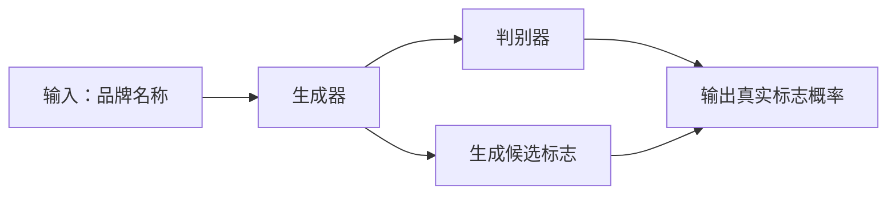

#### 2.1.2 基于AI的色彩搭配优化

AI可以通过分析大量色彩搭配案例，推荐适合品牌形象的配色方案。设计师可以根据AI的建议调整色彩搭配，优化品牌形象的视觉效果。

**色彩搭配流程图（Mermaid）**：
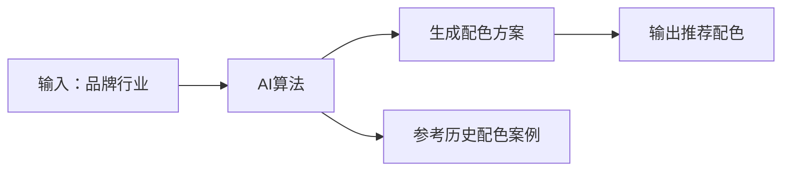

#### 2.1.3 基于AI的字体设计与排版优化

AI可以通过分析品牌名称、行业特点等信息，生成适合的品牌字体，并优化排版效果。

**字体设计流程图（Mermaid）**：
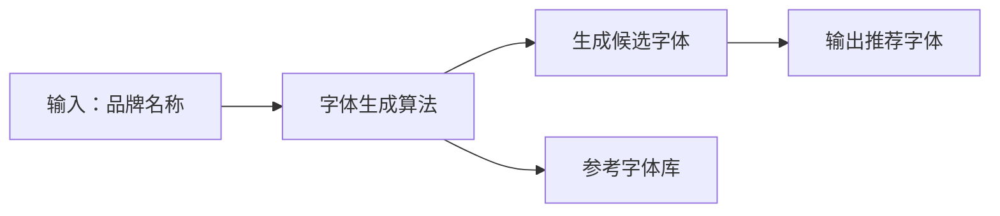

### 2.2 AI辅助设计的算法原理

#### 2.2.1 基于生成对抗网络的图像生成

生成对抗网络（GAN）由生成器和判别器组成。生成器的目标是生成逼真的图像，判别器的目标是区分生成图像和真实图像。通过不断迭代优化，生成器可以生成高质量的图像。

**生成对抗网络结构（Mermaid）**：
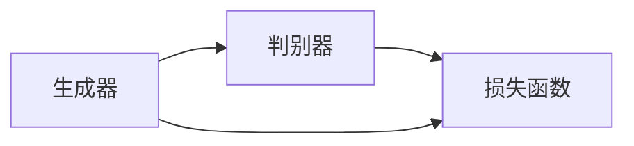

**数学公式**：
$$\text{损失函数} = \min_{G} \max_{D} \mathbb{E}_{x\sim P_{\text{真实}}}[ \log D(x)] + \mathbb{E}_{z\sim P_{z}}[\log(1 - D(G(z)))]$$

#### 2.2.2 基于深度学习的风格迁移

风格迁移算法可以通过将目标图像的风格迁移到源图像上，生成新的设计作品。

**风格迁移流程图（Mermaid）**：
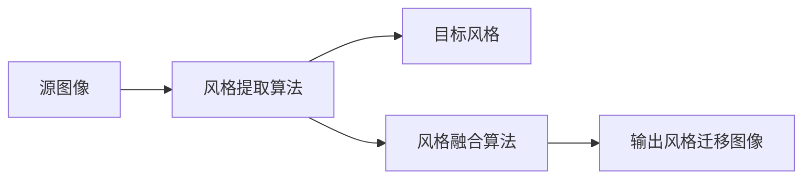

### 2.3 AI设计工具的优缺点分析

#### 2.3.1 常见AI设计工具的功能特点

目前市场上有许多AI设计工具，如Adobe Firefly、Canva AI、Figma AI等。这些工具通常具有以下功能特点：
1. **自动设计生成**：用户输入需求，AI自动生成设计。
2. **智能优化**：AI可以优化设计的色彩、排版等。
3. **实时协作**：支持多人在线协作。

#### 2.3.2 AI设计工具的局限性

AI设计工具虽然功能强大，但也存在一些局限性：
1. **创意不足**：AI生成的设计可能缺乏创意，无法完全替代人类设计师。
2. **适用范围有限**：AI设计工具在某些复杂的设计任务中表现不佳。
3. **用户门槛**：部分用户可能需要一定的学习成本才能熟练使用AI设计工具。

#### 2.3.3 人类设计师与AI工具的协作模式

人类设计师与AI工具可以形成有效的协作模式，例如：
1. **AI辅助设计**：设计师通过AI工具快速生成初步设计，再进行人工优化。
2. **数据驱动设计**：利用AI分析用户数据，辅助设计师制定更科学的设计策略。

### 2.4 本章小结

本章详细探讨了AI在品牌形象设计中的核心应用，包括图形生成、色彩搭配和字体设计。接着，分析了基于生成对抗网络的图像生成和风格迁移算法的原理。最后，总结了AI设计工具的优缺点，并提出了人类设计师与AI工具的协作模式。

---

## 第三章：数据驱动的品牌形象管理

### 3.1 数据采集与品牌分析

#### 3.1.1 品牌数据的来源与分类

品牌数据来源包括：
1. **社交媒体数据**：品牌在社交媒体上的粉丝数、互动数等。
2. **市场调研数据**：消费者调研、竞争对手分析等。
3. **销售数据**：品牌的销售额、市场份额等。

品牌数据的分类包括：
1. **结构化数据**：可以被量化和结构化的数据，如数值型数据。
2. **非结构化数据**：无法直接量化的数据，如文本、图像等。

#### 3.1.2 数据清洗与特征提取

数据清洗是去除噪声数据，提取有用特征的过程。特征提取是通过算法从数据中提取有用的特征，用于后续分析。

**数据清洗流程图（Mermaid）**：
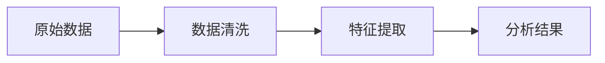

### 3.2 AI在品牌定位与策略中的应用

#### 3.2.1 基于AI的情感分析与品牌声誉管理

情感分析是通过自然语言处理技术，分析用户对品牌的评价，从而了解品牌声誉。

**情感分析流程图（Mermaid）**：
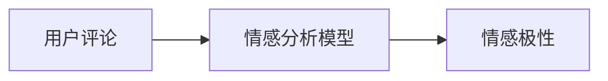

#### 3.2.2 基于AI的竞争对手分析

通过分析竞争对手的品牌策略，可以帮助品牌制定更具竞争力的市场策略。

**竞争对手分析流程图（Mermaid）**：
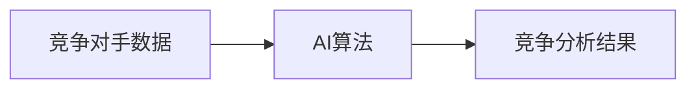

#### 3.2.3 数据驱动的品牌传播策略优化

通过分析用户行为数据，优化品牌传播策略，例如选择合适的广告投放渠道。

**品牌传播策略优化流程图（Mermaid）**：
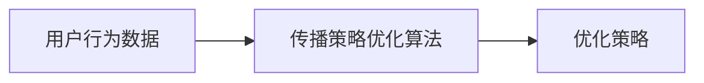

### 3.3 品牌形象的动态优化与调整

#### 3.3.1 基于实时数据的品牌形象监控

通过实时监控品牌形象的变化，及时调整品牌管理策略。

**实时数据监控流程图（Mermaid）**：
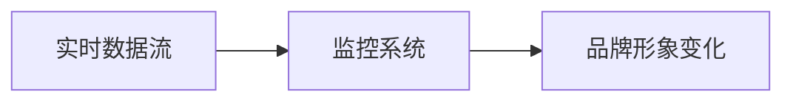

#### 3.3.2 AI驱动的品牌形象预测与预警

通过预测品牌形象的变化趋势，提前制定应对策略。

**品牌形象预测流程图（Mermaid）**：
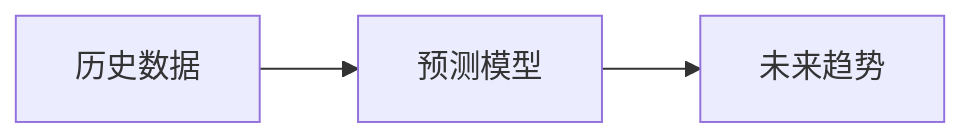

#### 3.3.3 数据反馈下的品牌策略调整

通过数据反馈，不断优化品牌策略，提升品牌形象。

**数据反馈流程图（Mermaid）**：
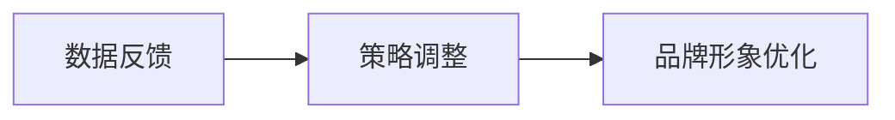

### 3.4 本章小结

本章从数据采集与品牌分析入手，探讨了AI在品牌定位与策略中的应用，包括情感分析、竞争对手分析和传播策略优化。接着，分析了基于实时数据的品牌形象监控和动态优化方法，最后总结了数据反馈下的品牌策略调整策略。

---

## 第四章：AI辅助品牌形象设计与管理的系统架构

### 4.1 系统功能模块划分

系统功能模块包括：
1. **品牌设计模块**：包括标志设计、配色方案生成、字体设计等功能。
2. **数据分析模块**：包括数据采集、特征提取、情感分析等功能。
3. **管理控制模块**：包括品牌形象监控、策略优化、数据反馈等功能。

### 4.2 系统架构设计

系统架构设计采用基于微服务的架构，各个功能模块独立运行，通过API进行交互。

**系统架构图（Mermaid）**：
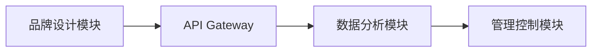

### 4.3 系统实现与代码示例

#### 4.3.1 环境搭建与依赖管理

系统需要安装以下依赖：
- Python 3.8+
- TensorFlow 2.0+
- Keras 2.4+
- Matplotlib 3.3+

#### 4.3.2 核心算法实现（如生成对抗网络）

**生成对抗网络实现代码**：
```python
import tensorflow as tf
from tensorflow.keras import layers

def build_generator():
    model = tf.keras.Sequential([
        layers.Dense(256, activation='relu'),
        layers.Dense(64, activation='relu'),
        layers.Dense(32, activation='relu'),
        layers.Dense(2, activation='sigmoid')
    ])
    return model

def build_discriminator():
    model = tf.keras.Sequential([
        layers.Dense(32, activation='relu'),
        layers.Dense(16, activation='relu'),
        layers.Dense(1, activation='sigmoid')
    ])
    return model

generator = build_generator()
discriminator = build_discriminator()

# 编译模型
generator.compile(optimizer='adam', loss='binary_crossentropy')
discriminator.compile(optimizer='adam', loss='binary_crossentropy')
```

#### 4.3.3 系统功能实现与测试

系统功能实现包括标志生成、配色方案生成、品牌传播策略优化等。测试包括单元测试、集成测试和性能测试。

### 4.4 本章小结

本章详细探讨了AI辅助品牌形象设计与管理系统的功能模块划分、系统架构设计和核心算法实现。通过具体的代码示例和流程图，展示了系统的实现过程。

---

## 第五章：项目实战

### 5.1 环境安装与配置

#### 5.1.1 安装Python与相关库

安装Python 3.8及以上版本，并安装以下库：
- `tensorflow`
- `keras`
- `matplotlib`
- `pandas`
- `numpy`

**安装命令**：
```bash
pip install tensorflow keras matplotlib pandas numpy
```

### 5.2 核心实现与代码

#### 5.2.1 基于AI的标志生成

**标志生成代码**：
```python
import tensorflow as tf
import matplotlib.pyplot as plt

def generate_logo(batch_size=8):
    # 假设生成器已经定义
    generator = build_generator()
    # 生成随机噪声
    noise = tf.random.normal([batch_size, 100])
    # 生成标志
    generated_logos = generator(noise)
    # 可视化生成结果
    plt.figure(figsize=(10, 10))
    for i in range(batch_size):
        plt.imshow(generated_logos[i].numpy())
        plt.axis('off')
        plt.show()

generate_logo(8)
```

#### 5.2.2 基于AI的配色方案推荐

**配色方案推荐代码**：
```python
import pandas as pd
import numpy as np

def recommend_color_scheme():
    # 假设有颜色数据集
    colors = pd.read_csv('color_palettes.csv')
    # 随机选择一个品牌
    brand = 'Sample Brand'
    # 生成配色方案
    selected_colors = colors[colors['industry'] == brand['industry']]
    print(selected_colors)
recommend_color_scheme()
```

#### 5.2.3 基于AI的品牌传播策略优化

**传播策略优化代码**：
```python
import pandas as pd
import numpy as np

def optimize_advertising_strategy():
    # 假设有用户行为数据
    user_data = pd.read_csv('user_behavior.csv')
    # 分析用户行为
    user_data['time'] = pd.to_datetime(user_data['time'])
    # 统计用户活跃时间
    user_data['hour'] = user_data['time'].dt.hour
    hour_counts = user_data['hour'].value_counts()
    print(hour_counts)
optimize_advertising_strategy()
```

### 5.3 案例分析与详细讲解

#### 5.3.1 案例分析

以某品牌为例，分析其品牌形象设计与管理的过程。首先，利用AI生成标志设计，然后通过情感分析优化品牌传播策略，最后通过实时监控调整品牌形象。

#### 5.3.2 实际案例解读

结合具体案例，详细讲解AI在品牌形象设计与管理中的应用过程，包括数据采集、设计生成、策略优化等步骤。

### 5.4 项目小结

本章通过实际项目案例，详细讲解了AI辅助品牌形象设计与管理的实现过程。通过具体的代码实现和案例分析，展示了AI技术在设计与管理中的实际应用。

---

## 第六章：综合分析与最佳实践

### 6.1 综合分析

#### 6.1.1 AI技术在品牌形象设计与管理中的优势

1. **提高效率**：AI可以快速生成设计方案，减少人工设计时间。
2. **优化质量**：AI可以通过算法优化设计方案，提高设计质量。
3. **数据驱动**：AI可以通过分析大量数据，辅助设计师制定更科学的设计策略。

#### 6.1.2 当前存在的问题与挑战

1. **创意不足**：AI生成的设计可能缺乏创意，无法完全替代人类设计师。
2. **数据隐私**：品牌形象管理需要处理大量用户数据，存在数据隐私问题。
3. **技术局限性**：AI技术在某些复杂设计任务中表现不佳。

### 6.2 最佳实践 tips

1. **结合人类设计师与AI工具**：充分发挥AI工具的优势，同时保留人类设计师的创意。
2. **注重数据隐私保护**：在品牌形象管理中，确保用户数据的安全和隐私。
3. **持续优化与调整**：根据市场变化和用户反馈，不断优化品牌形象设计与管理策略。

### 6.3 本章小结

本章总结了AI技术在品牌形象设计与管理中的优势与挑战，并提出了最佳实践建议。通过结合人类设计师与AI工具，可以充分发挥AI技术的潜力，推动品牌形象设计与管理的创新。

---

## 作者信息

作者：AI天才研究院/AI Genius Institute & 禅与计算机程序设计艺术/Zen And The Art of Computer Programming

---

以上是《AI辅助品牌形象设计与管理的创新方法》的完整目录和内容概览。通过一步步的分析与思考，我们详细探讨了AI技术在品牌形象设计与管理中的创新应用方法，从理论到实践，为读者提供了全面的指导和启示。

