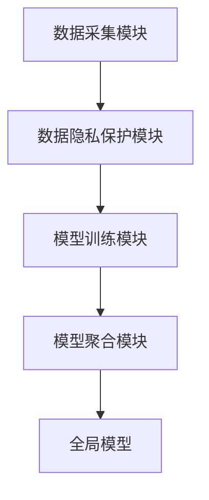
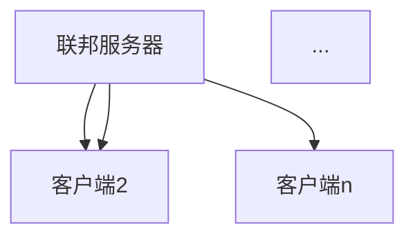
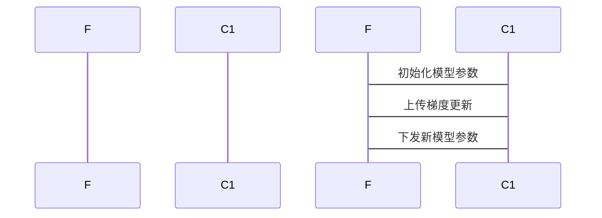
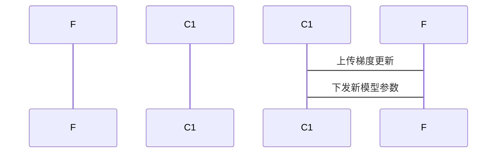

                 


# 企业AI Agent的联邦学习实践：保护数据隐私

> 关键词：企业AI Agent，联邦学习，数据隐私，分布式机器学习，多方安全计算

> 摘要：本文深入探讨了企业在利用AI Agent进行联邦学习时的核心挑战与解决方案，重点分析了如何在保护数据隐私的前提下，通过分布式机器学习和多方安全计算实现模型训练与优化。文章结合实际案例，详细讲解了联邦学习的原理、算法实现、系统架构设计及项目实战，为企业在AI Agent领域的实践提供了全面的指导。

---

# 第1章：企业AI Agent与联邦学习概述

## 1.1 联邦学习的基本概念

### 1.1.1 联邦学习的定义
联邦学习（Federated Learning）是一种分布式机器学习技术，允许多个参与方在不共享原始数据的情况下，协作训练共享的机器学习模型。其核心思想是将模型训练过程分散到数据源所在的终端设备或服务器，仅在需要时才将更新后的模型参数进行同步。

### 1.1.2 联邦学习的核心特点
- **数据本地性**：数据无需离开原始存储位置，仅传输模型更新参数。
- **隐私保护**：通过加密和隐私计算技术，确保数据在传输和计算过程中的安全性。
- **去中心化**：模型训练过程分布在整个网络中，没有单一的数据集中点。

### 1.1.3 联邦学习与传统机器学习的区别
- **数据共享方式**：传统机器学习需要集中数据，而联邦学习仅需要共享模型更新。
- **隐私保护**：联邦学习注重数据隐私保护，而传统方法通常不考虑。
- **计算复杂度**：联邦学习需要额外的通信和计算开销，但隐私风险更低。

## 1.2 企业AI Agent的定义与特点

### 1.2.1 企业AI Agent的定义
企业AI Agent是一种能够感知环境、自主决策并执行任务的智能实体。它通常用于企业内部的自动化流程优化、数据分析和决策支持。

### 1.2.2 企业AI Agent的核心功能
- **数据采集**：从企业内部系统和外部来源收集数据。
- **数据分析**：对数据进行清洗、建模和分析。
- **决策支持**：基于分析结果生成决策建议。
- **任务执行**：根据决策结果执行相关操作。

### 1.2.3 企业AI Agent与传统AI的区别
- **自主性**：企业AI Agent具备更强的自主决策能力。
- **适应性**：能够根据环境变化动态调整行为。
- **协作性**：可以与其他Agent或系统协同工作。

## 1.3 联邦学习在企业中的应用背景

### 1.3.1 数据隐私保护的重要性
随着数据隐私法规的日益严格（如GDPR），企业必须在不泄露原始数据的情况下进行模型训练。

### 1.3.2 联邦学习在企业中的应用场景
- **客户画像构建**：多个企业部门或合作伙伴共同训练客户画像模型。
- **预测模型优化**：在不同业务线之间共享模型参数，提升预测精度。
- **实时决策支持**：通过分布式计算实现低延迟的实时决策。

### 1.3.3 联邦学习的优势与挑战
- **优势**：
  - 保护数据隐私。
  - 提高模型泛化能力。
  - 降低数据传输成本。
- **挑战**：
  - 通信开销大。
  - 模型收敛速度慢。
  - 需要复杂的加密技术。

## 1.4 本章小结
本章介绍了联邦学习的基本概念、核心特点以及在企业中的应用背景，重点分析了企业AI Agent的特点和功能。通过对比传统机器学习和联邦学习，突出了联邦学习在数据隐私保护和去中心化计算方面的优势。

---

# 第2章：联邦学习的核心概念与原理

## 2.1 联邦学习的核心概念

### 2.1.1 联邦学习的参与者
- **联邦服务器（Federated Server）**：负责协调模型训练过程，管理参与方的通信。
- **联邦客户端（Federated Client）**：执行模型训练任务，上传更新参数。
- **数据提供者**：拥有原始数据的参与者，仅分享模型更新。

### 2.1.2 联邦学习的数据分布
- **横向分布**：数据按特征分布，不同参与方拥有不同的特征。
- **纵向分布**：数据按样本分布，不同参与方拥有不同的样本。

### 2.1.3 联邦学习的通信机制
- **同步更新**：所有客户端同时更新模型，并将结果同步到服务器。
- **异步更新**：客户端可以在任意时间更新模型，服务器汇总所有更新。

## 2.2 联邦学习的数学模型与公式

### 2.2.1 联邦学习的优化目标
$$ \min_{\theta} \sum_{i=1}^{n} f_i(\theta) $$

其中，$\theta$ 是模型参数，$f_i(\theta)$ 是第 $i$ 个参与方的损失函数。

### 2.2.2 联邦学习的损失函数
$$ L(\theta) = \sum_{i=1}^{n} \lambda_i f_i(\theta) $$

其中，$\lambda_i$ 是第 $i$ 个参与方的权重系数。

### 2.2.3 联邦学习的聚合算法
$$ \theta_{new} = \theta_{old} + \sum_{i=1}^{n} \frac{\partial L}{\partial \theta_i} $$

其中，$\theta_{new}$ 是更新后的模型参数，$\theta_{old}$ 是旧模型参数。

## 2.3 联邦学习的算法流程

### 2.3.1 数据预处理阶段
- 数据清洗：去除噪声和重复数据。
- 数据分割：将数据按特征或样本分布到不同参与方。

### 2.3.2 模型训练阶段
- 每个客户端使用本地数据训练模型，生成梯度更新。
- 服务器汇总所有客户端的梯度更新，更新全局模型。

### 2.3.3 模型聚合阶段
- 使用加权平均或其他聚合方法，将客户端的更新整合到全局模型中。

## 2.4 联邦学习的通信协议

### 2.4.1 安全通信机制
- 使用加密协议（如同态加密）确保通信过程中的数据安全。
- 引入认证机制，防止恶意客户端攻击。

### 2.4.2 数据隐私保护技术
- 差分隐私：通过添加噪声确保数据的隐私性。
- 同态加密：在加密状态下进行计算，确保数据不被泄露。

### 2.4.3 联邦学习的协议设计
- 定义参与方角色和职责。
- 设计数据交换格式和通信协议。
- 确定模型更新的频率和方式。

## 2.5 本章小结
本章详细介绍了联邦学习的核心概念、数学模型、算法流程和通信协议，为后续章节的系统设计和项目实践奠定了理论基础。

---

# 第3章：联邦学习的算法原理与实现

## 3.1 联邦学习的算法原理

### 3.1.1 分布式优化算法
- **梯度下降法**：每个客户端计算梯度，上传到服务器。
- **Adam优化器**：结合动量和自适应学习率的优化算法。

### 3.1.2 同步与异步更新机制
- **同步更新**：所有客户端同时更新模型，确保一致性。
- **异步更新**：客户端可以在任意时间更新模型，提高效率。

### 3.1.3 模型压缩与剪枝技术
- **模型压缩**：通过量化或其他技术减少模型参数量。
- **模型剪枝**：删除不重要的参数或神经元，降低计算复杂度。

## 3.2 联邦学习的数学模型与公式

### 3.2.1 联邦学习的优化目标
$$ \min_{\theta} \sum_{i=1}^{n} f_i(\theta) $$

### 3.2.2 联邦学习的损失函数
$$ L(\theta) = \sum_{i=1}^{n} \lambda_i f_i(\theta) $$

### 3.2.3 联邦学习的聚合算法
$$ \theta_{new} = \theta_{old} + \sum_{i=1}^{n} \frac{\partial L}{\partial \theta_i} $$

## 3.3 联邦学习的实现步骤

### 3.3.1 数据准备阶段
- 数据预处理：清洗、分割和加密。
- 确定参与方角色：联邦服务器、客户端和数据提供者。

### 3.3.2 模型初始化阶段
- 初始化模型参数。
- 确定优化算法和学习率。

### 3.3.3 模型训练阶段
- 客户端使用本地数据训练模型，生成梯度更新。
- 服务器汇总所有客户端的梯度更新，更新全局模型。

### 3.3.4 模型聚合阶段
- 使用加权平均或其他聚合方法，将客户端的更新整合到全局模型中。

## 3.4 本章小结
本章详细讲解了联邦学习的算法原理和实现步骤，重点分析了模型优化算法和通信机制。

---

# 第4章：企业AI Agent的系统分析与架构设计

## 4.1 企业AI Agent的系统架构

### 4.1.1 系统功能模块划分
- **数据采集模块**：收集企业内外部数据。
- **模型训练模块**：执行联邦学习算法。
- **模型聚合模块**：整合客户端模型更新。
- **数据隐私保护模块**：确保数据安全。

### 4.1.2 系统功能流程图


### 4.1.3 系统架构设计图


## 4.2 系统功能设计

### 4.2.1 数据采集模块
- 支持多种数据源（如数据库、API）。
- 数据清洗和预处理功能。

### 4.2.2 模型训练模块
- 支持多种机器学习算法（如逻辑回归、随机森林）。
- 实现联邦学习算法的核心逻辑。

### 4.2.3 模型聚合模块
- 使用加权平均或其他方法聚合模型更新。
- 支持多种聚合策略。

### 4.2.4 数据隐私保护模块
- 实现加密和差分隐私技术。
- 确保数据在传输和计算过程中的安全性。

## 4.3 系统接口设计

### 4.3.1 数据接口
- 数据输入接口：接收原始数据。
- 数据输出接口：输出处理后的数据。

### 4.3.2 模型接口
- 模型训练接口：启动模型训练过程。
- 模型聚合接口：整合客户端模型更新。

### 4.3.3 通信接口
- 数据传输接口：负责与客户端的通信。
- 模型更新接口：接收客户端的模型更新。

## 4.4 系统交互流程图

### 4.4.1 同步更新流程


### 4.4.2 异步更新流程


## 4.5 本章小结
本章详细分析了企业AI Agent的系统架构设计，包括功能模块划分、系统接口设计和系统交互流程。

---

# 第5章：企业AI Agent的联邦学习项目实战

## 5.1 项目背景与目标

### 5.1.1 项目背景
- 某企业需要构建客户画像模型，但数据分布在不同部门，无法集中。
- 需要保护各部门数据的隐私性。

### 5.1.2 项目目标
- 实现客户画像模型的联邦学习训练。
- 验证联邦学习在企业中的可行性。

## 5.2 项目环境与工具安装

### 5.2.1 环境要求
- 操作系统：Linux/Windows/MacOS。
- Python版本：3.6以上。
- 额外依赖：安装PyTorch、Flask、加密库。

### 5.2.2 工具安装
- 使用pip安装所需库：
  ```bash
  pip install torch flask cryptography
  ```

## 5.3 项目核心实现

### 5.3.1 数据准备
```python
# 数据准备代码
import torch
import numpy as np

# 模拟数据生成
def generate_data(n):
    x = torch.randn(n, 10)  # 特征维度为10
    y = torch.randint(0, 2, (n,))  # 二分类问题
    return x, y

# 生成数据并保存
x, y = generate_data(100)
torch.save(x, 'client1_features.pth')
torch.save(y, 'client1_labels.pth')
```

### 5.3.2 模型训练
```python
# 模型训练代码
import torch
import torch.nn as nn
import torch.optim as optim

# 定义模型
class SimpleNet(nn.Module):
    def __init__(self, input_dim, output_dim):
        super(SimpleNet, self).__init__()
        self.linear = nn.Linear(input_dim, output_dim)
    
    def forward(self, x):
        return self.linear(x)

# 初始化模型
input_dim = 10
output_dim = 2
model = SimpleNet(input_dim, output_dim)
optimizer = optim.Adam(model.parameters(), lr=0.01)

# 模型训练
def train_model(model, optimizer, x, y):
    criterion = nn.CrossEntropyLoss()
    for epoch in range(10):
        outputs = model(x)
        loss = criterion(outputs, y)
        loss.backward()
        optimizer.step()
        optimizer.zero_grad()
    return model

# 执行训练
model = train_model(model, optimizer, x, y)
```

### 5.3.3 模型聚合
```python
# 模型聚合代码
def aggregate_models(models):
    # 假设所有模型参数相同，取平均
    averaged_model = copy.deepcopy(models[0])
    for param in averaged_model.parameters():
        param.data *= 0.5
    for model in models[1:]:
        for param in model.parameters():
            param.data *= 0.5
            averaged_model.param.data += param.data
    return averaged_model

# 聚合所有客户端模型
aggregated_model = aggregate_models([model1, model2, model3])
```

### 5.3.4 数据隐私保护
```python
# 数据隐私保护代码
import cryptography
from cryptography.fernet import Fernet

# 生成加密密钥
key = Fernet.generate_key()
cipher = Fernet(key)

# 加密数据
encrypted_data = cipher.encrypt(x.numpy().tobytes())
```

## 5.4 项目实战总结

### 5.4.1 项目实现结果
- 成功训练客户画像模型。
- 验证了联邦学习在企业中的可行性。

### 5.4.2 项目实现经验
- 数据预处理和加密是关键步骤。
- 模型聚合策略影响最终模型性能。

### 5.4.3 项目注意事项
- 确保通信过程中的数据安全。
- 定期检查模型收敛情况。

## 5.5 本章小结
本章通过一个实际项目，详细讲解了企业AI Agent的联邦学习实现过程，包括环境准备、数据准备、模型训练和模型聚合等步骤。

---

# 第6章：企业AI Agent的联邦学习总结与展望

## 6.1 本项目的核心总结

### 6.1.1 联邦学习的优势
- 数据隐私保护。
- 去中心化计算。
- 提高模型泛化能力。

### 6.1.2 项目实现的关键点
- 数据隐私保护技术。
- 模型聚合策略。
- 系统架构设计。

## 6.2 未来研究方向

### 6.2.1 更高效的通信协议
- 研究更高效的加密算法。
- 优化通信协议，降低计算开销。

### 6.2.2 更先进的模型聚合方法
- 研究新的模型聚合算法。
- 提高模型收敛速度和精度。

### 6.2.3 更广泛的应用场景
- 扩展联邦学习在更多领域的应用。
- 探索新的业务模式。

## 6.3 本章小结
本章总结了企业AI Agent的联邦学习实践的核心内容，并展望了未来的研究方向，为企业在AI Agent领域的进一步探索提供了方向。

---

# 作者：AI天才研究院 & 禅与计算机程序设计艺术

---

以上是《企业AI Agent的联邦学习实践：保护数据隐私》的完整目录大纲和文章内容，希望对您有所帮助！

