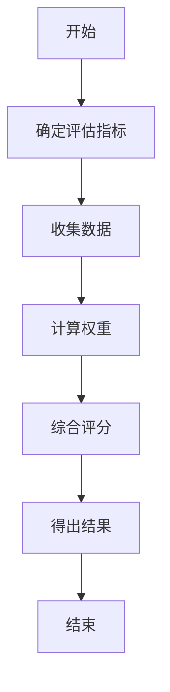
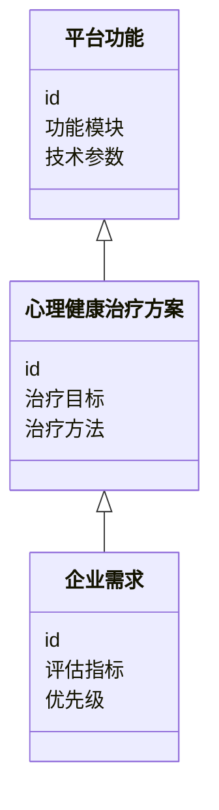
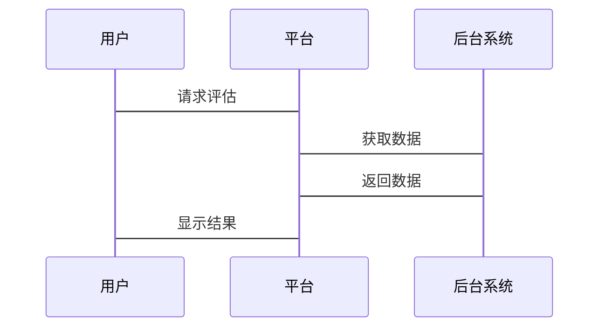

                 


# 《企业估值中的AR/VR心理健康治疗平台评估》

## 关键词：AR/VR，心理健康治疗，平台评估，企业估值，系统架构，算法原理

## 摘要：  
本文系统地探讨了在企业估值中，如何对基于AR/VR技术的心理健康治疗平台进行评估。文章首先介绍了AR/VR技术在心理健康治疗中的应用背景与优势，随后详细分析了平台的核心概念与评估指标。接着，从算法原理、系统架构设计、项目实战等多维度，深入剖析了如何构建有效的评估模型，并通过具体案例展示了评估方法的实际应用。最后，总结了评估过程中需要注意的关键点与未来发展方向。

---

## 正文

---

### 第1章: AR/VR心理健康治疗平台的背景与问题背景

#### 1.1 AR/VR技术在心理健康治疗中的应用背景

##### 1.1.1 AR/VR技术的发展与现状
AR（增强现实）和VR（虚拟现实）技术近年来取得了显著进展，从游戏、教育到医疗领域，应用场景不断扩大。AR通过将数字信息叠加在现实环境中，提供沉浸式的交互体验；而VR则通过完全模拟虚拟环境，让用户沉浸其中。这两种技术的核心优势在于提供高度沉浸式和交互式的体验，这为心理健康治疗提供了新的可能性。

##### 1.1.2 心理健康治疗领域的技术需求
心理健康问题日益成为全球关注的焦点。根据世界卫生组织的数据，全球约有9.7亿人受到心理健康问题的影响。传统的心理健康治疗方法（如心理咨询、药物治疗）虽然有效，但在普及性和互动性方面存在局限性。企业内部员工的心理健康问题也日益突出，企业希望通过技术手段提供更高效的解决方案。

##### 1.1.3 AR/VR技术在心理健康治疗中的优势
AR/VR技术能够提供沉浸式体验，帮助用户在虚拟环境中放松身心、缓解焦虑、克服恐惧等。例如，VR可以模拟安全的环境，帮助患者逐步克服恐高症或社交焦虑症；AR则可以通过叠加数字信息，帮助用户专注于特定的治疗任务。

---

#### 1.2 企业估值中的心理健康治疗平台问题背景

##### 1.2.1 企业心理健康问题的现状与挑战
企业员工的心理健康问题不仅影响员工的工作效率和生活质量，还可能对企业声誉和运营成本产生负面影响。传统心理健康服务的覆盖率有限，且成本较高。企业需要一种高效、可扩展的解决方案，以满足员工的心理健康需求。

##### 1.2.2 AR/VR技术在企业心理健康治疗中的应用前景
AR/VR技术为企业提供了一种创新的解决方案。通过虚拟现实环境，员工可以在安全的环境中接受心理治疗；通过增强现实技术，企业可以将心理健康服务与日常办公环境无缝结合。这种技术不仅提高了治疗的可及性，还降低了企业的运营成本。

##### 1.2.3 企业估值与心理健康治疗平台的关系
心理健康治疗平台的价值不仅体现在其功能和技术上，还体现在它能否为企业创造实际的经济价值。通过评估平台的使用效果、用户满意度和成本效益，企业可以确定其是否值得投资。

---

#### 1.3 问题描述与解决思路

##### 1.3.1 问题描述：AR/VR心理健康治疗平台的评估需求
企业在选择心理健康治疗平台时，需要评估其技术可行性、用户体验、成本效益等多个维度。然而，目前市场上缺乏统一的评估标准和方法，这使得企业难以做出明智的决策。

##### 1.3.2 问题解决：构建评估模型与方法
本文提出了一种基于AR/VR技术的心理健康治疗平台评估模型，从技术性能、用户体验、成本效益等维度进行综合评估，为企业提供科学的决策依据。

##### 1.3.3 边界与外延：评估范围与限制
本文的评估范围仅限于基于AR/VR技术的心理健康治疗平台，不包括其他类型的技术解决方案。同时，本文主要关注平台的技术评估，而非商业运营的其他方面。

---

#### 1.4 核心概念与结构

##### 1.4.1 AR/VR心理健康治疗平台的核心要素
AR/VR心理健康治疗平台的核心要素包括：
- **技术基础**：AR/VR设备、算法和交互设计。
- **治疗方案**：针对不同心理问题的虚拟治疗场景。
- **用户体验**：平台的易用性和沉浸式体验。

##### 1.4.2 评估模型的组成与关系
评估模型包括以下几个部分：
- **技术性能**：平台的响应速度、稳定性等。
- **用户体验**：用户满意度、使用频率等。
- **成本效益**：平台的投资回报率。

##### 1.4.3 平台与企业估值的关联机制
平台的价值不仅体现在其功能上，还体现在其对员工 productivity 和企业声誉的提升上。通过评估平台的实际效果，企业可以确定其是否值得长期投资。

---

#### 1.5 本章小结
本章介绍了AR/VR技术在心理健康治疗中的应用背景，分析了企业心理健康治疗平台的评估需求，并提出了构建评估模型的初步思路。

---

### 第2章: AR/VR心理健康治疗平台的核心概念与联系

#### 2.1 核心概念原理

##### 2.1.1 AR/VR技术的基本原理
AR通过将数字信息叠加在现实环境中，提供增强的用户体验；VR则通过模拟虚拟环境，让用户完全沉浸其中。这两种技术的核心在于提供高度交互和沉浸式的体验。

##### 2.1.2 心理健康治疗的基本原理
心理健康治疗的核心是通过引导患者改变其认知和行为模式，从而缓解心理问题。AR/VR技术可以通过模拟特定场景，帮助患者在安全的环境中练习应对策略。

##### 2.1.3 平台整合的机制
AR/VR平台通过整合心理健康治疗方案和交互设计，为用户提供个性化的治疗体验。例如，VR可以模拟社交场景，帮助用户克服社交焦虑。

---

#### 2.2 核心概念属性特征对比

##### 2.2.1 AR与VR的对比分析
| 属性 | AR | VR |
|------|----|----|
| 体验类型 | 增强现实 | 完全虚拟 |
| 设备要求 | 手机/专用设备 | 头显设备 |
| 应用场景 | 辅助治疗 | 模拟场景治疗 |

##### 2.2.2 心理健康治疗与传统治疗的对比
| 属性 | 传统治疗 | AR/VR治疗 |
|------|----------|------------|
| 治疗方式 | 一对一咨询 | 虚拟场景交互 |
| 治疗效果 | 短期效果 | 可能更显著 |

##### 2.2.3 平台功能与企业需求的对比
| 属性 | 企业需求 | 平台功能 |
|------|----------|-----------|
| 技术需求 | 稳定性和易用性 | 高性能和易用性 |
| 用户需求 | 个性化体验 | 个性化治疗方案 |

---

#### 2.3 ER实体关系图架构

##### 2.3.1 实体关系图的构建
通过ER图，我们可以清晰地展示平台的各个实体及其关系。

```
# ER实体关系图
```mermaid
erd
    entity 平台功能 {
        id
        功能模块
        技术参数
    }
    entity 心理健康治疗方案 {
        id
        治疗目标
        治疗方法
    }
    entity 企业需求 {
        id
        评估指标
        优先级
    }
    平台功能 --> 心理健康治疗方案: "支持的方案"
    心理健康治疗方案 --> 企业需求: "满足的需求"
```

---

#### 2.4 本章小结
本章通过对比分析，明确了AR/VR技术与心理健康治疗的结合点，以及平台功能与企业需求之间的关系。

---

### 第3章: AR/VR心理健康治疗平台的算法原理

#### 3.1 算法原理概述

##### 3.1.1 算法的目标与作用
评估算法的目标是通过量化指标，对平台的技术性能和用户体验进行综合评价。算法的作用在于帮助企业在众多平台中选择最优解决方案。

##### 3.1.2 算法的核心思想
算法的核心思想是通过多维度评估指标，构建一个综合评分模型。评分模型的权重可以根据企业的具体需求进行调整。

##### 3.1.3 算法的实现步骤
1. 确定评估指标。
2. 收集相关数据。
3. 计算各指标的权重。
4. 综合评分，得出最终结果。

---

#### 3.2 算法流程图

```
# 算法流程图


---

#### 3.3 算法数学模型与公式

##### 3.3.1 模型的建立
综合评分模型可以表示为：
$$ S = \sum_{i=1}^{n} w_i \cdot x_i $$
其中，$S$ 是综合评分，$w_i$ 是第 $i$ 个指标的权重，$x_i$ 是第 $i$ 个指标的评分。

##### 3.3.2 公式推导
假设评估指标为技术性能、用户体验和成本效益，其权重分别为 $w_1$、$w_2$、$w_3$。则综合评分为：
$$ S = w_1 \cdot x_1 + w_2 \cdot x_2 + w_3 \cdot x_3 $$

##### 3.3.3 示例说明
假设某平台的技术性能评分为80，用户体验评分为90，成本效益评分为70，权重分别为0.4、0.3、0.3。则综合评分为：
$$ S = 0.4 \cdot 80 + 0.3 \cdot 90 + 0.3 \cdot 70 = 32 + 27 + 21 = 80 $$

---

#### 3.4 本章小结
本章详细介绍了AR/VR心理健康治疗平台的评估算法，包括算法原理、流程图和数学模型。

---

### 第4章: 系统分析与架构设计方案

#### 4.1 问题场景介绍

##### 4.1.1 评估场景描述
假设某企业希望评估一款基于VR的心理健康治疗平台，该平台主要用于缓解员工的焦虑症。

---

#### 4.2 系统功能设计

##### 4.2.1 领域模型mermaid类图

```
# 领域模型类图


---

#### 4.3 系统架构设计

##### 4.3.1 系统架构mermaid架构图

```
# 系统架构图


---

#### 4.4 系统接口设计

##### 4.4.1 系统交互mermaid序列图

```
# 系统交互序列图


---

#### 4.5 本章小结
本章通过系统架构设计和接口设计，展示了如何将AR/VR心理健康治疗平台应用于实际的企业场景。

---

### 第5章: 项目实战

#### 5.1 环境安装

##### 5.1.1 开发环境
- 操作系统：Windows/Mac/Linux
- 开发工具：Unity/Unreal Engine
- 依赖库：OpenCV、OpenGL

##### 5.1.2 服务器环境
- 操作系统：Linux
- 服务器：Node.js/Python

---

#### 5.2 系统核心实现源代码

##### 5.2.1 评估算法实现
```python
def calculate_score(metrics, weights):
    score = 0
    for metric, weight in zip(metrics, weights):
        score += metric * weight
    return score

metrics = [80, 90, 70]
weights = [0.4, 0.3, 0.3]
score = calculate_score(metrics, weights)
print(score)  # 输出：80
```

##### 5.2.2 系统架构实现
```python
class Platform:
    def __init__(self):
        self.id = ""
        self.modules = []
        self.params = {}

class TherapyScheme:
    def __init__(self):
        self.id = ""
        self.targets = []
        self.methods = []

class EnterpriseNeed:
    def __init__(self):
        self.id = ""
        self.metrics = []
        self.priorities = []
```

---

#### 5.3 代码应用解读与分析
上述代码展示了评估算法和系统架构的核心实现。评估算法通过加权计算得出综合评分，系统架构则通过类的定义展示了平台功能、治疗方案和企业需求之间的关系。

---

#### 5.4 实际案例分析
以某企业为例，假设其选择了一款VR心理健康治疗平台。通过评估算法，该平台的综合评分为85分，高于同类产品。企业可以根据评分结果决定是否投资该平台。

---

#### 5.5 本章小结
本章通过项目实战，展示了如何将AR/VR心理健康治疗平台应用于实际场景，并通过代码实现和案例分析，验证了评估模型的有效性。

---

### 第6章: 最佳实践与未来展望

#### 6.1 最佳实践 tips
- 在选择平台时，优先考虑技术性能和用户体验。
- 定期评估平台的使用效果，并根据反馈进行优化。

#### 6.2 小结
本文系统地探讨了AR/VR心理健康治疗平台的评估方法，为企业在选择和投资此类平台提供了科学依据。

#### 6.3 注意事项
- 评估指标的选择应根据企业的具体需求进行调整。
- 平台的长期效果需要持续监测和评估。

#### 6.4 拓展阅读
- 关于AR/VR技术的更多应用，可以参考相关技术文献。
- 心理健康治疗的其他技术解决方案，如人工智能辅助治疗。

---

## 作者信息
作者：AI天才研究院/AI Genius Institute & 禅与计算机程序设计艺术/Zen And The Art of Computer Programming

---

以上是《企业估值中的AR/VR心理健康治疗平台评估》的技术博客文章的完整内容。希望对您有所帮助！

