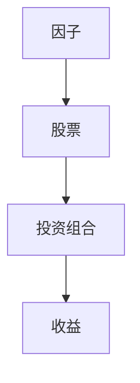
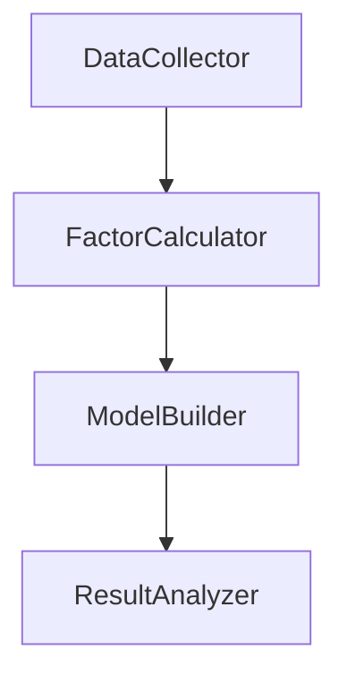
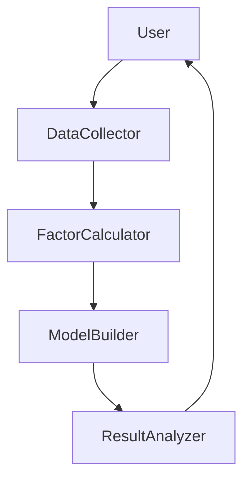

                 


# 如何构建基于特价股票的多因子投资模型

> 关键词：特价股票、多因子模型、投资策略、量化交易、股票分析、数据驱动投资

> 摘要：本文将详细介绍如何构建基于特价股票的多因子投资模型。首先，我们将介绍特价股票的定义和特点，以及多因子投资模型的背景和意义。然后，我们将深入探讨多因子模型的核心概念，包括因子的定义、分类和选择，以及因子之间的关系。接下来，我们将讲解多因子模型的算法原理，包括数学模型和公式，以及如何使用Python代码实现这些模型。最后，我们将通过一个实际案例展示如何构建和优化一个多因子投资模型，并提供一些最佳实践和注意事项。

---

# 第1章: 特价股票与多因子投资模型概述

## 1.1 特价股票的概念与特点

### 1.1.1 特价股票的定义
特价股票是指价格相对较低，具有较高投资潜力的股票。这类股票通常被市场低估，但具有较高的成长性和盈利能力。

### 1.1.2 特价股票的特点
- **低估值**：市盈率、市净率等估值指标低于行业平均水平。
- **高成长性**：营业收入和净利润增长率较高。
- **高波动性**：价格波动较大，但波动中蕴含投资机会。
- **流动性**：部分特价股票流动性较低，但流动性好的特价股票更容易被投资者发现和投资。

### 1.1.3 特价股票的投资价值
特价股票的投资价值体现在其低估值和高成长性的结合上。通过多因子投资模型，我们可以更好地捕捉这类股票的投资机会。

## 1.2 多因子投资模型的背景与意义

### 1.2.1 多因子模型的定义
多因子投资模型是一种基于多个因子（如市值、价值、动量等）的投资策略。通过综合考虑多个因子的影响，投资者可以更全面地评估股票的投资价值。

### 1.2.2 多因子模型在投资中的优势
- **分散风险**：通过综合考虑多个因子，投资者可以分散单一因子带来的风险。
- **提高收益**：多因子模型能够捕捉更多的投资机会，从而提高投资收益。
- **增强决策的科学性**：通过量化分析，投资者可以基于数据和模型做出更科学的投资决策。

### 1.2.3 特价股票与多因子模型的结合
将特价股票与多因子模型结合，可以通过多因子模型筛选出具有低估值、高成长性等特征的股票，从而实现更好的投资收益。

## 1.3 多因子投资模型的核心要素

### 1.3.1 因子的定义与分类
因子是衡量股票投资价值的关键指标。常见的因子包括：
- **市值因子**：衡量股票的市场规模。
- **价值因子**：衡量股票的低估值特征。
- **动量因子**：衡量股票价格的短期趋势。
- **质量因子**：衡量公司的财务健康状况。
- **成长因子**：衡量公司的成长潜力。

### 1.3.2 因子的属性特征对比
以下是常见因子的属性特征对比表：

| 因子类型 | 属性特征 |
|----------|-----------|
| 市值因子 | 股票的市值大小 |
| 价值因子 | 市盈率、市净率等估值指标 |
| 动量因子 | 近期价格走势 |
| 质量因子 | 财务指标，如ROE、资产负债率 |
| 成长因子 | 营收和净利润增长率 |

### 1.3.3 因子之间的关系
因子之间可能存在相关性。例如，市值因子和成长因子可能正相关，而价值因子和动量因子可能负相关。理解因子之间的关系可以帮助我们更好地构建多因子模型。

## 1.4 本章小结
本章介绍了特价股票的概念和特点，以及多因子投资模型的背景和意义。我们还讨论了多因子模型的核心要素，包括因子的定义、分类和关系。这些内容为后续构建多因子投资模型奠定了基础。

---

# 第2章: 多因子投资模型的核心概念与联系

## 2.1 多因子模型的原理

### 2.1.1 多因子模型的基本原理
多因子模型通过综合考虑多个因子的影响，对股票的投资价值进行评估。模型通常采用线性回归的方法，将因子对股票收益的贡献进行量化。

### 2.1.2 多因子模型的数学表达式
多因子模型的数学表达式如下：
$$
R_i = \beta_{i1}F_1 + \beta_{i2}F_2 + \ldots + \beta_{ik}F_k + \epsilon_i
$$
其中，$R_i$ 是股票 $i$ 的收益，$F_j$ 是第 $j$ 个因子，$\beta_{ij}$ 是股票 $i$ 对因子 $j$ 的敏感度，$\epsilon_i$ 是误差项。

### 2.1.3 多因子模型与单因子模型的区别
- **单因子模型**：仅考虑一个因子的影响，如市值因子。
- **多因子模型**：同时考虑多个因子的影响，能够更全面地评估股票的投资价值。

## 2.2 因子的属性特征对比

### 2.2.1 因子的分类与特征
以下是因子分类与特征的对比：

| 因子类型 | 特征描述 |
|----------|-----------|
| 市值因子 | 股票的市值越大，风险越高 |
| 价值因子 | 低估值股票具有更高的投资潜力 |
| 动量因子 | 近期价格上涨的股票可能继续上涨 |
| 质量因子 | 高质量股票具有更强的财务健康状况 |
| 成长因子 | 高成长性股票具有更高的收益潜力 |

### 2.2.2 因子之间的关系
因子之间可能存在正相关或负相关关系。例如，价值因子和动量因子可能负相关，而市值因子和成长因子可能正相关。

## 2.3 多因子模型的ER实体关系图



## 2.4 本章小结
本章详细讲解了多因子投资模型的原理，以及因子的分类和关系。通过ER实体关系图，我们展示了因子如何影响股票，进而影响投资组合的收益。

---

# 第3章: 多因子投资模型的算法原理

## 3.1 多因子模型的算法

### 3.1.1 多因子模型的实现步骤
1. **数据收集**：收集相关股票的历史数据，包括价格、成交量、财务指标等。
2. **因子计算**：根据数据计算各个因子的值。
3. **因子筛选**：通过统计分析筛选出具有显著影响的因子。
4. **模型构建**：使用回归分析等方法构建多因子模型。
5. **模型验证**：通过回测等方式验证模型的性能。

### 3.1.2 多因子模型的数学模型

#### 3.1.2.1 CAPM模型
CAPM（资本资产定价模型）是多因子模型的基础。其公式为：
$$
R_i = R_f + \beta_i (R_m - R_f)
$$
其中，$R_i$ 是股票 $i$ 的收益，$R_f$ 是无风险利率，$\beta_i$ 是股票 $i$ 的贝塔系数，$R_m$ 是市场收益。

#### 3.1.2.2 Fama-French三因子模型
Fama-French三因子模型扩展了CAPM模型，加入了大小和价值两个因子：
$$
R_i = R_f + \beta_i (R_m - R_f) + 0.3 \times SMB + 0.3 \times HML
$$
其中，SMB（Small Minus Big）代表小盘股相对于大盘股的收益，HML（High Minus Low）代表高估值股票相对于低估值股票的收益。

### 3.1.3 多因子模型的Python实现

#### 3.1.3.1 数据预处理
```python
import pandas as pd

# 假设我们有一个包含股票数据的DataFrame df
df = pd.read_csv('stock_data.csv')

# 计算市值因子（Market Cap）
df['Market Cap'] = df['Close'] * df['Volume']

# 计算价值因子（P/E比率）
df['PE Ratio'] = df['Close'] / df['EPS']
```

#### 3.1.3.2 构建多因子模型
```python
from sklearn.linear_model import LinearRegression

# 选择因子
X = df[['Market Cap', 'PE Ratio']]

# 目标变量
y = df['Return']

# 构建线性回归模型
model = LinearRegression()
model.fit(X, y)

# 输出系数
print(model.coef_)
```

## 3.2 多因子模型的优化与验证

### 3.2.1 模型的优化
- **因子筛选**：通过统计显著性检验筛选出具有显著影响的因子。
- **模型调整**：通过正则化方法（如Lasso回归）减少过拟合。

### 3.2.2 模型的验证
- **回测**：通过历史数据验证模型的性能。
- **风险控制**：评估模型的下行风险。

## 3.3 本章小结
本章详细讲解了多因子投资模型的算法原理，包括CAPM和Fama-French三因子模型的数学表达式，以及如何使用Python代码实现这些模型。我们还讨论了模型的优化和验证方法。

---

# 第4章: 系统架构与实现

## 4.1 系统架构设计

### 4.1.1 系统功能模块
- **数据采集模块**：从数据源获取股票数据。
- **因子计算模块**：根据数据计算各个因子的值。
- **模型构建模块**：使用回归分析等方法构建多因子模型。
- **结果分析模块**：对模型的输出结果进行分析和解读。

### 4.1.2 系统架构图



## 4.2 系统接口设计

### 4.2.1 接口设计
- **数据接口**：提供数据采集模块与数据源之间的接口。
- **模型接口**：提供模型构建模块与其他模块之间的接口。

### 4.2.2 交互流程图



## 4.3 本章小结
本章讨论了多因子投资模型的系统架构设计，包括功能模块和接口设计。我们还通过交互流程图展示了系统的整体流程。

---

# 第5章: 项目实战

## 5.1 项目背景与目标

### 5.1.1 项目背景
我们希望通过构建一个多因子投资模型，筛选出具有低估值和高成长性的特价股票，实现超额收益。

### 5.1.2 项目目标
- **数据获取**：获取相关股票的历史数据。
- **因子计算**：计算市值、价值、动量等因子。
- **模型构建**：构建多因子回归模型。
- **结果分析**：分析模型的输出结果，评估模型的性能。

## 5.2 环境安装与配置

### 5.2.1 安装依赖
```bash
pip install pandas numpy scikit-learn matplotlib
```

### 5.2.2 数据下载
```python
import pandas_datareader as pdr

# 下载数据
df = pdr.get_data_yahoo('AAPL', start='2020-01-01', end='2023-12-31')
```

## 5.3 系统核心实现

### 5.3.1 数据预处理
```python
import pandas as pd

# 计算市值因子
df['Market Cap'] = df['Close'] * df['Volume']

# 计算价值因子（P/E比率）
df['PE Ratio'] = df['Close'] / df['EPS']
```

### 5.3.2 模型构建与训练
```python
from sklearn.linear_model import LinearRegression

# 选择因子
X = df[['Market Cap', 'PE Ratio']]

# 目标变量
y = df['Return']

# 构建线性回归模型
model = LinearRegression()
model.fit(X, y)

# 输出系数
print(model.coef_)
```

### 5.3.3 模型验证与优化
```python
import numpy as np

# 预测收益
y_pred = model.predict(X)

# 计算均方误差
mse = np.mean((y_pred - y) ** 2)
print('MSE:', mse)
```

## 5.4 项目结果分析

### 5.4.1 模型性能评估
- **均方误差（MSE）**：衡量模型预测值与真实值之间的差异。
- **R²值**：衡量模型的解释能力。

### 5.4.2 案例分析
通过模型筛选出具有低估值和高成长性的股票，分析其投资价值。

## 5.5 本章小结
本章通过一个实际案例展示了如何构建一个多因子投资模型。我们详细讲解了数据获取、因子计算、模型构建和结果分析的全过程。

---

# 第6章: 进阶内容与最佳实践

## 6.1 模型的优化与扩展

### 6.1.1 因子扩展
- **引入更多因子**：如动量因子、质量因子等。
- **因子的动态调整**：根据市场变化动态调整因子权重。

### 6.1.2 模型的动态调整
- **滚动窗口法**：定期更新模型参数。
- **机器学习方法**：引入机器学习算法（如随机森林、XGBoost）进行模型优化。

## 6.2 风险管理与控制

### 6.2.1 风险管理策略
- **分散投资**：通过投资多个股票降低风险。
- **止损策略**：设定止损点，避免重大损失。

### 6.2.2 风险指标
- **最大回撤**：衡量投资组合的最大亏损。
- **VaR（在险价值）**：衡量投资组合的风险价值。

## 6.3 量化交易策略

### 6.3.1 量化交易的基本原理
- **算法交易**：通过算法自动执行交易指令。
- **高频交易**：利用高速计算机和网络进行高频交易。

### 6.3.2 多因子量化交易策略
- **多因子信号**：基于多因子模型生成交易信号。
- **信号的组合**：将多个因子信号进行组合，生成最终的交易策略。

## 6.4 本章小结
本章讨论了多因子投资模型的优化与扩展，包括因子扩展、模型动态调整、风险管理策略和量化交易策略。这些内容为读者提供了进一步优化和扩展模型的方向。

---

# 第7章: 总结与展望

## 7.1 本文总结
本文详细介绍了如何构建基于特价股票的多因子投资模型。我们从特价股票的概念和特点出发，探讨了多因子模型的核心概念和算法原理。通过实际案例展示了模型的构建和验证过程，并提出了模型的优化和扩展方向。

## 7.2 未来展望
未来的研究可以进一步探讨以下方向：
- **更多因子的引入**：如情绪因子、网络搜索热度等。
- **机器学习的应用**：利用深度学习等技术优化多因子模型。
- **实时交易策略**：结合实时数据和算法交易，实现自动化投资。

## 7.3 注意事项
- **数据质量**：确保数据的准确性和完整性。
- **模型风险**：注意模型的过拟合风险。
- **市场变化**：根据市场变化动态调整模型参数。

## 7.4 最佳实践 Tips
- **持续学习**：保持对市场变化和新技术的关注。
- **实践操作**：通过实际操作加深对模型的理解。
- **团队合作**：与团队成员合作，共同优化模型。

## 7.5 本章小结
本文总结了构建多因子投资模型的核心内容，并展望了未来的研究方向。同时，我们还提供了注意事项和最佳实践 Tips，帮助读者更好地理解和应用多因子投资模型。

---

# 作者：AI天才研究院/AI Genius Institute & 禅与计算机程序设计艺术 /Zen And The Art of Computer Programming

---

以上是《如何构建基于特价股票的多因子投资模型》的技术博客文章的完整目录和内容概述。通过逐步分析和详细讲解，本文为读者提供了一个从理论到实践的完整指南，帮助读者掌握构建多因子投资模型的方法和技巧。

