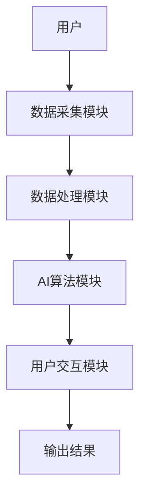

                 


# 智能园艺手套：AI Agent的植物护理指导

> 关键词：智能园艺手套，AI Agent，植物护理，物联网，机器学习，园艺科技

> 摘要：智能园艺手套是一种结合人工智能和物联网技术的园艺工具，能够通过AI Agent实时监测植物的生长状况，提供精准的护理建议。本文将详细阐述智能园艺手套的核心概念、算法原理、系统架构以及实际应用，帮助读者全面了解其工作原理和实现方法。

---

# 第1章: 智能园艺手套的背景与概念

## 1.1 园艺与科技的结合

### 1.1.1 园艺的历史与发展

园艺作为人类最早的农业活动之一，经历了数千年的演变。从最初的野生植物采集到现代的高效种植，园艺不仅满足了人们对食物的需求，也成为了美化环境的重要手段。随着科技的进步，园艺逐渐从传统的人工劳动向机械化、自动化方向发展。

### 1.1.2 科技在园艺中的应用现状

现代园艺中，科技的应用已经非常广泛。例如，温室自动化控制、智能浇水系统、无人机植保等技术都在逐步普及。然而，这些技术通常需要复杂的设备和专业的知识，普通用户难以轻松掌握。

### 1.1.3 AI技术如何改变传统园艺

人工智能的出现，为园艺带来了革命性的变化。AI技术可以通过传感器实时监测植物的生长环境，分析植物的健康状况，并提供个性化的护理建议。智能园艺手套就是这一技术的典型应用，它将AI技术与园艺工具结合，为用户提供智能化的植物护理服务。

## 1.2 智能园艺手套的定义与特点

### 1.2.1 智能园艺手套的定义

智能园艺手套是一种结合了物联网、人工智能和传感器技术的园艺工具。它通过内置的传感器实时采集植物的生长环境数据，并利用AI算法分析这些数据，为用户提供精准的植物护理建议。

### 1.2.2 智能园艺手套的核心功能

- **环境监测**：实时监测土壤湿度、温度、光照强度等环境参数。
- **病虫害识别**：通过图像识别技术，快速诊断植物的病虫害问题。
- **智能浇水**：根据植物的需水情况，自动控制浇水系统。
- **生长监测**：通过数据分析，预测植物的生长周期，并提供相应的护理建议。

### 1.2.3 智能园艺手套与传统园艺工具的区别

| **方面**       | **传统园艺工具**                     | **智能园艺手套**                     |
|----------------|-------------------------------------|-------------------------------------|
| 数据采集       | 人工记录，数据单一                  | 多传感器采集，数据全面              |
| 分析与决策     | 依赖经验，决策缓慢                  | AI算法分析，决策快速且精准          |
| 操作复杂性     | 需要专业知识，操作复杂              | 操作简单，用户友好                  |
| 反馈机制       | 无实时反馈                          | 实时反馈，用户可以及时调整护理方案 |

## 1.3 智能园艺手套的应用场景

### 1.3.1 家庭园艺中的应用

智能园艺手套可以帮助家庭用户更好地照顾家中的植物。例如，当植物出现缺水症状时，手套会通过手机APP提醒用户，并建议适量浇水。

### 1.3.2 商业园艺中的应用

在商业园艺中，智能园艺手套可以用于大规模植物种植的环境监测和病虫害预警，帮助用户降低损失，提高产量。

### 1.3.3 公共绿地维护中的应用

公共绿地的维护通常需要大量的人力和资源。智能园艺手套可以通过实时监测植物的健康状况，优化维护方案，减少资源浪费。

## 1.4 智能园艺手套的发展前景

### 1.4.1 AI技术在园艺中的潜力

AI技术可以帮助园艺从业者更高效地管理植物，优化资源利用，提高产量。未来，随着AI算法的不断进步，智能园艺手套的功能将更加智能化和多样化。

### 1.4.2 智能园艺手套的市场前景

随着人们对生活品质的追求不断提高，智能园艺手套的市场需求将逐步增加。尤其是在城市居民中，这类产品将受到广泛欢迎。

### 1.4.3 技术挑战与解决方案

尽管智能园艺手套具有广阔的前景，但其推广仍面临一些技术挑战，例如传感器的精度、AI算法的实时性等。未来，随着技术的进步，这些问题将逐步得到解决。

## 1.5 本章小结

本章介绍了智能园艺手套的背景与概念，阐述了AI技术在园艺中的应用，分析了智能园艺手套的核心功能和应用场景，并展望了其未来的发展前景。

---

# 第2章: AI Agent在植物护理中的核心作用

## 2.1 AI Agent的基本概念

### 2.1.1 AI Agent的定义

AI Agent（人工智能代理）是指能够感知环境、自主决策并执行任务的智能实体。它能够通过传感器获取环境信息，并利用预设的算法进行分析和决策。

### 2.1.2 AI Agent的核心功能

- **感知环境**：通过传感器获取环境数据。
- **分析与决策**：利用算法对数据进行分析，生成决策方案。
- **执行任务**：根据决策结果执行相应的操作。

### 2.1.3 AI Agent与传统自动化的区别

| **方面**       | **传统自动化**                     | **AI Agent**                        |
|----------------|-------------------------------------|-------------------------------------|
| 决策能力       | 预设规则，无法自主决策              | 能够自主学习和优化决策              |
| 环境适应性     | 适应性差，需要人工调整              | 能够自适应环境变化                   |
| 可扩展性       | 扩展性有限，需要重新设计             | 具有良好的扩展性，可以应用于多种场景 |

## 2.2 智能园艺手套中的AI Agent设计

### 2.2.1 数据采集与处理

智能园艺手套通过内置的传感器（如温度传感器、湿度传感器等）实时采集植物的生长环境数据。这些数据需要经过预处理（如去噪、归一化等）后，才能用于后续的分析。

### 2.2.2 AI算法的选择与实现

在智能园艺手套中，常用的AI算法包括支持向量机（SVM）、随机森林（Random Forest）和神经网络等。选择合适的算法取决于具体的应用场景和数据特性。

### 2.2.3 系统反馈与优化

AI Agent在分析数据后，会生成相应的反馈信息（如浇水建议、病虫害预警等）。这些反馈信息需要实时传递给用户，并根据用户反馈不断优化系统的决策模型。

## 2.3 AI Agent在植物护理中的具体应用

### 2.3.1 病虫害识别

通过图像识别技术，AI Agent可以快速识别植物的病虫害症状，并提供相应的防治建议。

### 2.3.2 植物生长监测

AI Agent可以通过分析植物的生长数据，预测其生长周期，并提前提醒用户进行相应的护理操作。

### 2.3.3 自动浇水与施肥

根据土壤湿度、植物生长阶段等数据，AI Agent可以自动控制浇水和施肥系统，确保植物获得最佳的生长环境。

## 2.4 本章小结

本章详细介绍了AI Agent在智能园艺手套中的核心作用，分析了其在植物护理中的具体应用，并探讨了AI Agent的设计与实现方法。

---

# 第3章: 智能园艺手套的核心技术与实现

## 3.1 数据采集技术

### 3.1.1 传感器的选择与安装

智能园艺手套通常配备多种传感器，如温度传感器、湿度传感器、光照传感器等。传感器的选择需要根据具体的监测需求进行。

### 3.1.2 数据采集的算法实现

数据采集过程中，需要对传感器信号进行处理，以消除噪声并提高数据的准确性。常用的信号处理算法包括傅里叶变换、小波变换等。

### 3.1.3 数据预处理与分析

采集到的原始数据需要经过预处理（如归一化、标准化等）后，才能用于后续的分析。数据分析的核心是利用机器学习算法对数据进行建模和预测。

## 3.2 AI算法的选择与实现

### 3.2.1 机器学习算法的选择

在智能园艺手套中，常用的机器学习算法包括支持向量机（SVM）、随机森林（Random Forest）和K-近邻算法（KNN）等。选择合适的算法需要考虑数据的特性和任务的类型。

### 3.2.2 神经网络模型的设计

对于复杂的任务（如图像识别），可以采用深度学习模型（如卷积神经网络CNN）。神经网络模型的设计需要考虑网络的层数、激活函数、损失函数等因素。

### 3.2.3 模型训练与优化

模型的训练需要大量的标注数据，并通过交叉验证等方法进行优化。训练过程中，需要监控模型的准确率、召回率等指标，并根据这些指标调整模型的参数。

## 3.3 系统架构设计

### 3.3.1 系统模块划分

智能园艺手套的系统架构通常包括以下几个模块：
- 数据采集模块
- 数据处理模块
- AI算法模块
- 用户交互模块

### 3.3.2 系统功能流程图



### 3.3.3 系统接口设计

系统接口设计需要考虑模块之间的通信方式和数据格式。常用的接口协议包括HTTP、MQTT等。

## 3.4 本章小结

本章详细介绍了智能园艺手套的核心技术，包括数据采集技术、AI算法的选择与实现，以及系统的架构设计。

---

# 第4章: 智能园艺手套的系统实现与优化

## 4.1 系统环境搭建

### 4.1.1 开发工具的选择与安装

常用的开发工具包括Python、TensorFlow、PyTorch等。需要安装相应的库和依赖项。

### 4.1.2 数据集的准备与处理

需要收集和整理相关的植物数据集，包括植物的图像、环境数据等。数据预处理是关键步骤，需要确保数据的干净和一致性。

### 4.1.3 网络环境的搭建

需要搭建一个稳定的网络环境，确保传感器和用户设备之间的通信顺畅。

## 4.2 系统核心代码实现

### 4.2.1 数据采集模块的实现

```python
import serial

# 连接Arduino
ser = serial.Serial('COM3', 9600)

def get_sensor_data():
    while True:
        data = ser.readline().decode().strip()
        if data:
            return data
```

### 4.2.2 AI算法模块的实现

```python
from sklearn.svm import SVC

# 训练模型
model = SVC()
model.fit(X_train, y_train)

# 预测
y_pred = model.predict(X_test)
```

### 4.2.3 系统交互界面的设计

```python
import tkinter as tk

# 创建GUI界面
root = tk.Tk()
root.title("智能园艺手套")

# 添加组件
label = tk.Label(root, text="植物健康状况：")
label.pack()

status = tk.Label(root, text="")
status.pack()

# 更新状态
def update_status():
    # 获取数据并更新状态
    status.config(text="健康")

button = tk.Button(root, text="刷新", command=update_status)
button.pack()

root.mainloop()
```

## 4.3 系统优化与调试

### 4.3.1 系统性能优化

通过优化算法和数据处理流程，可以提高系统的运行效率。例如，可以采用并行计算、缓存机制等技术。

### 4.3.2 系统调试

在系统调试过程中，需要重点关注传感器的准确性、算法的稳定性以及界面的响应速度。可以通过日志输出、断点调试等方法进行问题排查。

## 4.4 本章小结

本章详细介绍了智能园艺手套的系统实现与优化，包括环境搭建、核心代码实现以及系统优化与调试。

---

# 第5章: 智能园艺手套的项目实战

## 5.1 项目环境安装

### 5.1.1 安装Python和必要的库

```bash
pip install numpy
pip install scikit-learn
pip install matplotlib
pip install serial
```

### 5.1.2 安装Arduino IDE

下载并安装Arduino IDE，用于与传感器模块进行通信。

## 5.2 系统核心实现

### 5.2.1 数据采集模块

```python
import serial

# 连接Arduino
ser = serial.Serial('COM3', 9600)

def read_sensor():
    while True:
        try:
            data = ser.readline().decode().strip()
            print(f"接收到数据: {data}")
        except Exception as e:
            print(f"错误: {e}")
```

### 5.2.2 AI算法模块

```python
from sklearn import svm

# 训练SVM模型
model = svm.SVC()
model.fit(X_train, y_train)

# 预测
y_pred = model.predict(X_test)
print(f"预测结果: {y_pred}")
```

### 5.2.3 系统交互界面

```python
import tkinter as tk
from tkinter import messagebox

root = tk.Tk()
root.title("智能园艺手套")

# 添加组件
status_label = tk.Label(root, text="植物健康状况:")
status_label.pack()

status = tk.Label(root, text="")
status.pack()

# 更新状态
def update_status():
    # 模拟数据
    status.config(text="健康")

button = tk.Button(root, text="刷新", command=update_status)
button.pack()

root.mainloop()
```

## 5.3 项目测试与分析

### 5.3.1 测试数据采集模块

运行数据采集模块，确保传感器能够正常采集数据并输出。

### 5.3.2 测试AI算法模块

使用训练好的模型对测试数据进行预测，验证模型的准确率和召回率。

### 5.3.3 测试系统交互界面

通过GUI界面，测试系统的响应速度和用户交互体验。

## 5.4 项目小结

本章通过一个实际的项目案例，详细展示了智能园艺手套的实现过程，包括环境搭建、核心代码编写以及系统测试与优化。

---

# 第6章: 智能园艺手套的最佳实践

## 6.1 小结

智能园艺手套通过AI Agent技术，为植物护理提供了智能化的解决方案。其核心在于数据采集、算法实现和系统架构的设计。

## 6.2 注意事项

- 确保传感器的准确性和稳定性。
- 定期更新AI模型，以提高预测的准确性。
- 注意数据安全，防止用户信息泄露。

## 6.3 拓展阅读

- 《机器学习实战》
- 《深度学习入门：基于Python和Keras》
- 《物联网开发指南》

## 6.4 本章小结

本章总结了智能园艺手套的最佳实践，提供了使用中的注意事项，并推荐了相关的拓展阅读资料。

---

# 作者

作者：AI天才研究院/AI Genius Institute & 禅与计算机程序设计艺术 /Zen And The Art of Computer Programming

---

以上是《智能园艺手套：AI Agent的植物护理指导》的技术博客文章的完整目录和内容框架。

