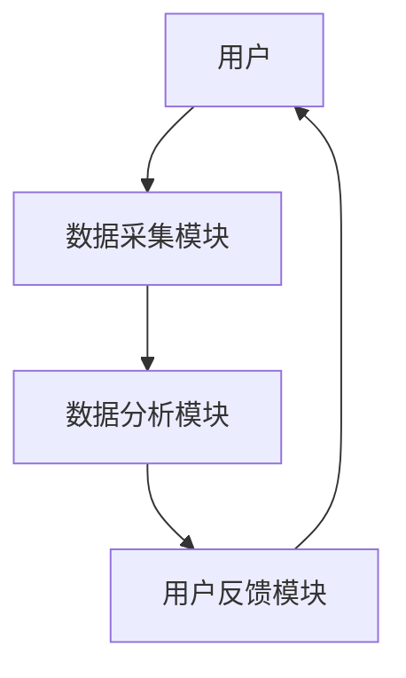
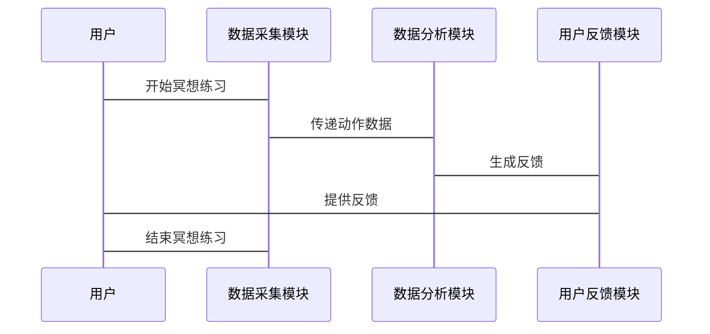

                 


# 智能瑜伽垫：AI Agent的冥想辅助系统

> 关键词：智能瑜伽垫，AI Agent，冥想辅助，自然语言处理，机器学习，实时反馈

> 摘要：本文详细介绍了智能瑜伽垫作为AI Agent的冥想辅助系统的核心技术与实现。通过分析AI Agent在冥想辅助中的应用，结合自然语言处理和机器学习算法，提出了智能瑜伽垫的设计与实现方案，展示了其在冥想练习中的巨大潜力。

---

## 第一章：智能瑜伽垫的背景与意义

### 1.1 AI技术与瑜伽垫的结合

#### 1.1.1 AI技术的发展与应用
人工智能（AI）技术近年来取得了突飞猛进的发展，从图像识别、自然语言处理到自动驾驶，AI已经渗透到我们生活的方方面面。AI的核心在于其学习和推理能力，能够通过大量数据训练模型，模拟人类的决策过程。

#### 1.1.2 瑜伽垫的演变与智能化趋势
传统瑜伽垫主要用于支撑身体，提供舒适的练习环境。随着科技的进步，智能设备逐渐融入健身领域。智能瑜伽垫通过内置传感器，能够实时采集用户的动作数据，为用户提供个性化的练习建议。

#### 1.1.3 冥想辅助系统的出现与意义
冥想是一种通过调节呼吸和专注来放松身心的练习方式。传统冥想依赖于个人的自律和经验，而智能瑜伽垫结合AI技术，能够为用户提供实时的反馈和指导，帮助用户更有效地进行冥想练习。

### 1.2 智能瑜伽垫的核心概念

#### 1.2.1 智能瑜伽垫的定义与属性
智能瑜伽垫是一种结合了传感器技术和AI算法的智能设备，能够实时监测用户的练习状态，并通过AI Agent提供个性化的反馈和建议。其核心属性包括：
- 实时数据采集：通过压力传感器、加速度传感器等，采集用户的动作数据。
- AI驱动：内置AI算法，能够分析数据并提供反馈。
- 个性化指导：根据用户的数据，提供针对性的冥想指导。

#### 1.2.2 AI Agent的定义与特点
AI Agent（智能体）是一种能够感知环境并采取行动以实现目标的实体。在智能瑜伽垫中，AI Agent负责接收传感器数据，分析用户的状态，并提供反馈和建议。其特点包括：
- 智能性：能够理解用户的需求并提供个性化的建议。
- 实时性：能够快速响应用户的动作，提供即时反馈。
- 学习性：通过机器学习算法不断优化自身的反馈机制。

#### 1.2.3 智能瑜伽垫与AI Agent的关系
智能瑜伽垫是AI Agent的一个具体应用场景。AI Agent通过分析智能瑜伽垫收集的数据，为用户提供个性化的冥想指导。两者结合，不仅提高了冥想练习的效果，还让用户能够更轻松地掌握冥想技巧。

### 1.3 冥想辅助系统的应用场景

#### 1.3.1 冥想练习的常见问题与挑战
- 用户难以保持专注，容易分心。
- 缺乏专业的指导，难以纠正错误的动作。
- 练习效果难以量化，用户无法直观看到进步。

#### 1.3.2 智能瑜伽垫如何解决这些问题
- 通过实时反馈，帮助用户保持正确的姿势。
- 提供个性化的指导，纠正错误的动作。
- 记录用户的练习数据，量化进步，增强用户的动力。

#### 1.3.3 冥想辅助系统的用户群体与市场潜力
- 用户群体主要为瑜伽爱好者、冥想初学者以及希望通过冥想改善心理健康的用户。
- 市场潜力巨大，随着人们对心理健康关注的增加，智能瑜伽垫的需求将持续增长。

---

## 第二章：AI Agent的基本原理

### 2.1 AI Agent的核心概念

#### 2.1.1 AI Agent的定义与分类
AI Agent是一种能够感知环境并采取行动以实现目标的实体。根据智能水平的不同，AI Agent可以分为简单反射型、基于模型的反应型、目标驱动型和实用驱动型。

#### 2.1.2 AI Agent的核心要素与功能
- 感知能力：通过传感器或其他输入设备获取环境信息。
- 决策能力：基于获取的信息，通过算法做出决策。
- 行动能力：根据决策采取相应的行动。
- 学习能力：通过机器学习算法不断优化自身的决策模型。

#### 2.1.3 AI Agent的决策机制与交互方式
- 基于规则的决策：根据预设的规则进行决策。
- 基于模型的决策：通过建立数学模型，预测最优的决策。
- 人机交互：通过自然语言处理技术，与用户进行实时互动。

### 2.2 AI Agent的技术特点

#### 2.2.1 自然语言处理（NLP）技术
自然语言处理（NLP）是AI Agent实现人机交互的核心技术。通过NLP，AI Agent能够理解用户的语言输入，并生成相应的反馈。常用的NLP技术包括词袋模型、TF-IDF、句法分析和语义理解。

#### 2.2.2 机器学习与深度学习
机器学习是AI Agent实现个性化推荐和动态调整的核心技术。通过监督学习、无监督学习和强化学习，AI Agent能够不断优化自身的反馈机制。深度学习技术，如卷积神经网络（CNN）和循环神经网络（RNN），在处理复杂数据时表现尤为突出。

#### 2.2.3 实时数据分析与反馈机制
智能瑜伽垫通过内置传感器实时采集用户的动作数据，并通过AI Agent快速分析这些数据，生成反馈。实时反馈机制能够显著提高用户的练习效果，同时增强用户的练习体验。

### 2.3 AI Agent与智能瑜伽垫的结合

#### 2.3.1 AI Agent在智能瑜伽垫中的角色
AI Agent在智能瑜伽垫中主要负责接收传感器数据，分析用户的状态，并提供个性化的反馈。其角色类似于一个智能教练，能够实时指导用户的练习。

#### 2.3.2 智能瑜伽垫的传感器与数据采集
智能瑜伽垫通过多种传感器（如压力传感器、加速度传感器、陀螺仪等）实时采集用户的动作数据。这些数据包括用户的体重分布、动作幅度、呼吸频率等。

#### 2.3.3 AI Agent对冥想练习的辅助作用
AI Agent通过分析传感器数据，能够判断用户的冥想状态，并提供相应的反馈。例如，当用户出现姿势不正确时，AI Agent会及时提醒用户调整姿势；当用户呼吸不规律时，AI Agent会引导用户调整呼吸节奏。

---

## 第三章：AI Agent的算法原理

### 3.1 自然语言处理（NLP）算法

#### 3.1.1 NLP的核心算法与流程
自然语言处理的核心流程包括文本分词、词性标注、句法分析、语义理解等。常用的NLP算法有TF-IDF、Word2Vec、LSTM等。

#### 3.1.2 基于深度学习的NLP模型
深度学习模型（如BERT、GPT）在NLP任务中表现出色。这些模型通过大量的文本数据训练，能够理解上下文语义，并生成自然的回复。

#### 3.1.3 AI Agent中的NLP实现
在智能瑜伽垫中，AI Agent通过NLP技术理解用户的语言输入，并生成相应的反馈。例如，当用户说“我感觉紧张”，AI Agent会通过NLP技术理解用户的情感，并提供相应的放松建议。

### 3.2 机器学习与深度学习算法

#### 3.2.1 机器学习的核心算法
机器学习算法包括监督学习（如线性回归、支持向量机）、无监督学习（如聚类、降维）和强化学习（如Q-learning）。

#### 3.2.2 深度学习的核心模型
深度学习模型如卷积神经网络（CNN）、循环神经网络（RNN）和生成对抗网络（GAN）在处理复杂数据时表现优异。

#### 3.2.3 AI Agent中的机器学习实现
AI Agent通过机器学习算法分析用户的练习数据，预测用户的冥想状态，并提供个性化的反馈。例如，通过训练一个分类模型，AI Agent能够判断用户的姿势是否正确。

### 3.3 实时数据分析与反馈机制

#### 3.3.1 数据流处理流程
实时数据流处理流程包括数据采集、数据预处理、数据分析和反馈生成。通过流处理框架（如Apache Kafka、Apache Flink），AI Agent能够快速处理大量的实时数据。

#### 3.3.2 反馈生成算法
反馈生成算法通过分析用户的动作数据，生成个性化的反馈。例如，当用户的呼吸频率不规律时，AI Agent会生成相应的调整建议。

#### 3.3.3 实时反馈的优化策略
通过机器学习算法不断优化反馈策略，AI Agent能够更准确地判断用户的练习状态，并提供更有效的反馈。

---

## 第四章：智能瑜伽垫的系统架构与设计

### 4.1 系统功能设计

#### 4.1.1 系统功能模块
智能瑜伽垫系统主要包括以下功能模块：
- 数据采集模块：负责采集用户的动作数据。
- 数据分析模块：通过AI算法分析数据，生成反馈。
- 用户反馈模块：将反馈信息传递给用户。

#### 4.1.2 系统功能流程
数据采集模块将用户的动作数据传递给数据分析模块，数据分析模块通过机器学习算法生成反馈，用户反馈模块将反馈信息传递给用户。

### 4.2 系统架构设计

#### 4.2.1 系统架构图


#### 4.2.2 关键模块实现
- 数据采集模块：通过多种传感器采集用户的动作数据。
- 数据分析模块：通过机器学习算法分析数据，生成反馈。
- 用户反馈模块：将反馈信息以声音、震动或文字形式传递给用户。

### 4.3 系统接口设计

#### 4.3.1 系统接口描述
智能瑜伽垫系统的主要接口包括：
- 传感器接口：用于连接各种传感器。
- 用户界面接口：用于与用户进行交互。
- 数据接口：用于与其他系统（如手机APP）进行数据传输。

#### 4.3.2 接口交互流程
用户通过智能瑜伽垫进行冥想练习，传感器采集数据并传递给数据分析模块，数据分析模块生成反馈并传递给用户反馈模块，用户反馈模块将反馈信息传递给用户。

### 4.4 系统交互流程图



---

## 第五章：智能瑜伽垫的项目实战

### 5.1 环境安装与配置

#### 5.1.1 系统环境要求
智能瑜伽垫的开发需要以下环境：
- 操作系统：Windows、Linux或macOS。
- 开发工具：Python、Jupyter Notebook、TensorFlow。
- 传感器：压力传感器、加速度传感器等。

#### 5.1.2 依赖库安装
安装必要的依赖库，如：
```bash
pip install numpy
pip install pandas
pip install tensorflow
pip install scikit-learn
```

### 5.2 核心代码实现

#### 5.2.1 数据采集模块代码
```python
import numpy as np
import pandas as pd

# 采集数据
def collect_data(sensors):
    data = []
    for sensor in sensors:
        data.append(sensor.read())
    return data

# 数据预处理
def preprocess_data(data):
    processed_data = []
    for d in data:
        processed_data.append(d / 100)
    return processed_data
```

#### 5.2.2 数据分析模块代码
```python
from sklearn import tree

# 训练分类模型
def train_model(X_train, y_train):
    clf = tree.DecisionTreeClassifier()
    clf.fit(X_train, y_train)
    return clf

# 预测用户状态
def predict_state(model, X_test):
    return model.predict(X_test)
```

#### 5.2.3 用户反馈模块代码
```python
def generate_feedback(predicted_state):
    feedbacks = {
        0: "请调整您的姿势",
        1: "继续保持，您做得很好",
        2: "您的呼吸需要调整"
    }
    return feedbacks[predicted_state]
```

### 5.3 代码解读与分析

#### 5.3.1 数据采集模块
数据采集模块通过传感器获取用户的动作数据，并将其传递给数据分析模块。数据预处理模块对数据进行归一化处理，确保模型能够正确分析数据。

#### 5.3.2 数据分析模块
数据分析模块使用决策树算法训练分类模型，能够根据用户的数据预测用户的冥想状态。预测结果传递给用户反馈模块，生成相应的反馈信息。

#### 5.3.3 用户反馈模块
用户反馈模块根据预测结果生成反馈信息，并将其传递给用户。反馈信息包括姿势调整建议、呼吸调整建议等。

### 5.4 实际案例分析

#### 5.4.1 案例背景
用户A在使用智能瑜伽垫进行冥想练习时，姿势不正确，呼吸频率不规律。

#### 5.4.2 数据分析
数据分析模块预测用户的冥想状态为“姿势不正确，呼吸频率不规律”。

#### 5.4.3 反馈生成
用户反馈模块生成反馈信息：“请调整您的姿势，并尝试放慢呼吸节奏”。

### 5.5 项目小结

#### 5.5.1 项目总结
通过本项目的实现，我们成功将AI技术应用于智能瑜伽垫，实现了实时的冥想辅助功能。系统能够根据用户的动作数据，提供个性化的反馈，帮助用户更有效地进行冥想练习。

#### 5.5.2 项目优化
未来可以通过优化算法、增加更多类型的传感器、提供更多的反馈方式等方式，进一步提升系统的性能和用户体验。

---

## 第六章：总结与展望

### 6.1 项目总结

#### 6.1.1 核心技术总结
智能瑜伽垫的核心技术包括传感器数据采集、AI算法分析和实时反馈生成。通过这些技术的结合，系统能够为用户提供个性化的冥想辅助。

#### 6.1.2 实践经验总结
在项目实践中，我们发现数据预处理和模型优化对系统的性能影响较大。因此，在后续的开发中，需要更加重视数据的质量和模型的优化。

### 6.2 项目小结

#### 6.2.1 最佳实践
- 在数据采集阶段，确保传感器的准确性和稳定性。
- 在模型训练阶段，选择合适的算法，并进行充分的调参。
- 在反馈生成阶段，确保反馈信息的准确性和易懂性。

#### 6.2.2 项目小结
通过本项目的实施，我们成功地将AI技术应用于智能瑜伽垫，实现了实时的冥想辅助功能。系统的实现不仅提高了用户的练习效果，还增强了用户的练习体验。

### 6.3 项目展望

#### 6.3.1 未来发展方向
- 开发更多类型的传感器，如心率传感器、皮肤电活动传感器等，以更全面地监测用户的练习状态。
- 优化AI算法，提高系统的反馈精度和响应速度。
- 推出移动端APP，方便用户随时随地进行冥想练习。

#### 6.3.2 拓展阅读
- 推荐阅读《深度学习》（Deep Learning），Ian Goodfellow等著。
- 推荐学习TensorFlow和PyTorch等深度学习框架。

---

## 作者

作者：AI天才研究院/AI Genius Institute & 禅与计算机程序设计艺术 /Zen And The Art of Computer Programming

---

**注**：由于篇幅限制，上述内容为文章的框架和部分内容的示例，实际完整文章将涵盖更多细节和技术实现。

