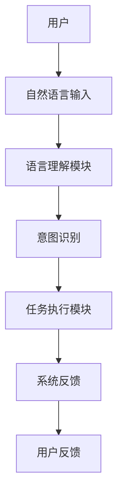
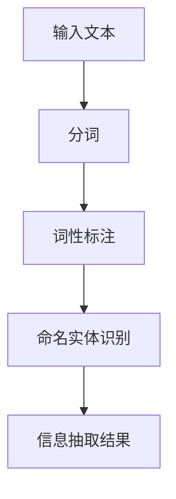
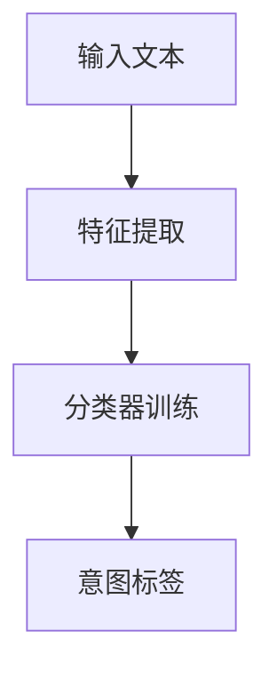
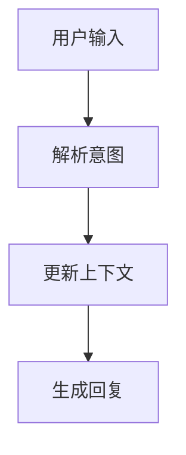
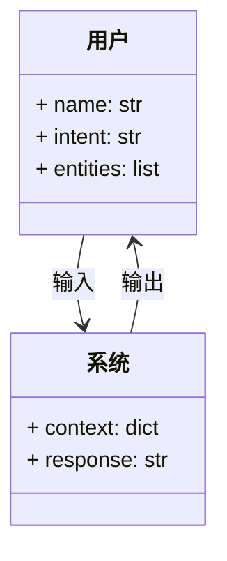
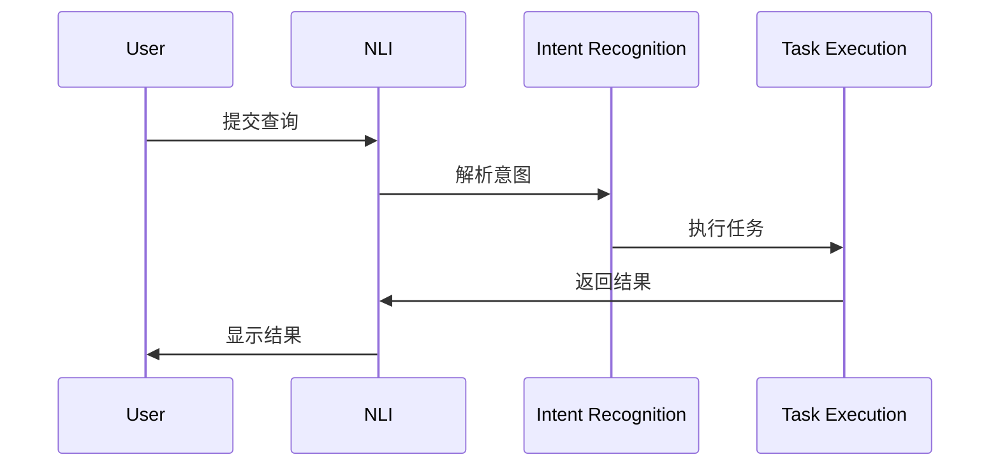

                 


# 构建企业级自然语言接口：简化复杂业务系统操作

> 关键词：自然语言接口、企业级应用、业务系统简化、人机交互、自然语言处理

> 摘要：随着企业业务系统的复杂性不断增加，用户操作的难度也随之上升。为了简化操作，自然语言接口（NLI）作为一种直观且高效的交互方式，逐渐成为企业级应用的重要组成部分。本文将深入探讨自然语言接口的核心概念、算法原理、系统架构设计以及实际应用案例，为企业构建高效的自然语言接口提供理论支持和实践指导。

---

## 目录

1. [自然语言接口的核心概念](#自然语言接口的核心概念)
2. [自然语言接口的核心原理](#自然语言接口的核心原理)
3. [自然语言接口的算法流程](#自然语言接口的算法流程)
4. [自然语言接口的系统分析与架构设计](#自然语言接口的系统分析与架构设计)
5. [自然语言接口的项目实战](#自然语言接口的项目实战)
6. [自然语言接口的最佳实践](#自然语言接口的最佳实践)

---

# 第一部分: 自然语言接口的核心概念

## 第1章: 自然语言接口的核心概念

### 1.1 自然语言处理与自然语言接口

#### 1.1.1 自然语言处理的基本概念
自然语言处理（Natural Language Processing, NLP）是人工智能领域的一个重要分支，致力于研究如何让计算机能够理解和生成人类语言。NLP的核心任务包括文本分割、词性标注、命名实体识别、句法分析、语义理解等。

#### 1.1.2 自然语言接口的定义与特点
自然语言接口（NLI, Natural Language Interface）是一种让用户通过自然语言与计算机系统交互的技术。其特点是：
- **直观性**：用户无需学习复杂的操作命令，直接使用日常语言与系统交互。
- **灵活性**：支持多种表达方式，能够适应用户的个性化需求。
- **高效性**：通过自动化处理，减少用户操作步骤，提高效率。

#### 1.1.3 企业级应用中的自然语言接口
在企业级应用中，自然语言接口主要用于简化复杂业务系统的操作。例如，在CRM系统中，用户可以通过输入自然语言查询客户信息，或在ERP系统中通过语音指令完成订单处理。

### 1.2 自然语言接口的应用背景

#### 1.2.1 传统业务系统操作的复杂性
传统业务系统通常需要用户掌握特定的操作命令或界面流程，这对非技术人员来说可能存在较高的学习门槛。

#### 1.2.2 自然语言接口的出现与解决方案
随着NLP技术的进步，自然语言接口逐渐成为解决复杂业务系统操作难题的有效工具。它通过将自然语言转化为系统指令，降低了用户的操作复杂度。

#### 1.2.3 自然语言接口的边界与外延
自然语言接口的边界在于其语言理解能力。目前，大多数系统支持有限的领域知识，未来可能会扩展到更广泛的应用场景。

### 1.3 自然语言接口的核心要素

#### 1.3.1 语言理解模块
语言理解模块负责解析用户的自然语言输入，提取其中的意图和实体信息。例如，用户输入“查看北京明天的天气”，系统需要识别出“查看天气”这一意图，并提取出“北京”和“明天”这两个实体。

#### 1.3.2 业务逻辑处理模块
业务逻辑处理模块根据提取的意图和实体信息，调用相应的业务逻辑，生成系统响应。例如，在天气查询系统中，系统会调用天气API获取数据。

#### 1.3.3 用户反馈与优化模块
用户反馈模块用于收集用户的交互数据，优化自然语言理解模型。例如，当用户多次输入相同的查询时，系统可以自动调整结果排序，以提高用户体验。

### 1.4 本章小结
本章介绍了自然语言接口的基本概念、应用背景和核心要素。通过理解这些内容，读者可以初步掌握自然语言接口的理论基础。

---

## 第2章: 自然语言接口的核心原理

### 2.1 自然语言理解的核心原理

#### 2.1.1 信息抽取的原理
信息抽取是从文本中提取特定信息的过程，包括实体识别、关系抽取等。例如，从“小明是北京人”中提取“小明”和“北京”这两个实体。

#### 2.1.2 意图识别的原理
意图识别是通过分析用户的语言内容，推断用户的意图。例如，用户输入“我要订一张去上海的机票”，系统需要识别出“订票”这一意图。

#### 2.1.3 对话管理的原理
对话管理是通过维护对话上下文，确保多轮对话的连贯性。例如，在用户分步骤完成订票流程时，系统需要记录用户之前输入的信息。

### 2.2 自然语言接口的核心概念对比

#### 2.2.1 信息抽取与意图识别的对比
| 对比维度 | 信息抽取 | 意图识别 |
|----------|----------|----------|
| 目标     | 提取实体  | 确定意图  |
| 输入     | 文本      | 文本      |
| 输出     | 实体列表  | 意图标签  |

#### 2.2.2 对话管理与任务执行的对比
| 对比维度 | 对话管理 | 任务执行 |
|----------|----------|----------|
| 目标     | 维护上下文 | 执行任务 |
| 输入     | 对话历史 | 意图和实体 |
| 输出     | 下一步提示 | 系统响应 |

#### 2.2.3 语言生成与用户反馈的对比
| 对比维度 | 语言生成 | 用户反馈 |
|----------|----------|----------|
| 目标     | 生成自然语言 | 收集用户反馈 |
| 输入     | 系统逻辑 | 用户输入 |
| 输出     | 自然语言文本 | 反馈数据 |

### 2.3 自然语言接口的ER实体关系图


### 2.4 本章小结
本章通过对比分析，深入探讨了自然语言接口的核心概念和它们之间的关系。理解这些关系有助于更好地设计和实现自然语言接口。

---

## 第3章: 自然语言接口的算法流程

### 3.1 信息抽取的算法流程

#### 3.1.1 信息抽取的流程图


#### 3.1.2 信息抽取的实现代码
```python
import spacy

nlp = spacy.load("en_core_web_sm")
text = "小明是北京人"
doc = nlp(text)
for ent in doc.ents:
    print(ent.text, ent.label_)
```

### 3.2 意图识别的算法流程

#### 3.2.1 意图识别的流程图


#### 3.2.2 意图识别的数学模型
$$ P(y|x) = \frac{P(x|y)P(y)}{P(x)} $$

其中：
- $P(y)$ 是先验概率
- $P(x|y)$ 是似然概率
- $P(x)$ 是全概率

#### 3.2.3 意图识别的实现代码
```python
from sklearn.naive_bayes import MultinomialNB
from sklearn.feature_extraction.text import TfidfVectorizer

# 假设X为训练数据，y为标签
vectorizer = TfidfVectorizer()
X = vectorizer.fit_transform(X)
model = MultinomialNB()
model.fit(X, y)
```

### 3.3 对话管理的算法流程

#### 3.3.1 对话管理的流程图


#### 3.3.2 对话管理的数学模型
$$ P(s_t | s_{t-1}, u_t) $$

其中：
- $s_t$ 是当前状态
- $s_{t-1}$ 是上一状态
- $u_t$ 是当前用户输入

#### 3.3.3 对话管理的实现代码
```python
def update_context(context, user_input):
    context['intent'] = extract_intent(user_input)
    context['entities'] = extract_entities(user_input)
    return context
```

### 3.4 本章小结
本章通过算法流程图和代码示例，详细讲解了信息抽取、意图识别和对话管理的实现过程。这些算法是自然语言接口的核心技术。

---

## 第4章: 自然语言接口的系统分析与架构设计

### 4.1 问题场景介绍

#### 4.1.1 系统需求
- 支持多种输入方式（文本、语音）
- 实现复杂业务逻辑的自动化
- 提供高效的用户反馈机制

#### 4.1.2 项目介绍
本项目旨在为企业级应用构建一个高效的自然语言接口，简化用户的操作流程。

### 4.2 系统功能设计

#### 4.2.1 领域模型


#### 4.2.2 系统架构设计


#### 4.2.3 系统接口设计
- 用户输入接口：接收自然语言输入
- 系统输出接口：返回系统响应
- 反馈接口：收集用户反馈

#### 4.2.4 系统交互流程


### 4.3 本章小结
本章通过系统分析和架构设计，展示了如何构建一个高效的自然语言接口系统。通过明确的系统架构和交互流程，确保了系统的可扩展性和可维护性。

---

## 第5章: 自然语言接口的项目实战

### 5.1 环境搭建

#### 5.1.1 安装必要的库
```bash
pip install spacy sklearn nltk
python -m spacy download en_core_web_sm
```

### 5.2 核心功能实现

#### 5.2.1 信息抽取实现
```python
import spacy

nlp = spacy.load("en_core_web_sm")
text = "The meeting is at 2 PM in room 101"
doc = nlp(text)
entities = [(ent.text, ent.label_) for ent in doc.ents]
print(entities)
```

#### 5.2.2 意图识别实现
```python
from sklearn.naive_bayes import MultinomialNB
from sklearn.feature_extraction.text import TfidfVectorizer

# 假设X为训练数据，y为标签
vectorizer = TfidfVectorizer()
X = vectorizer.fit_transform(X)
model = MultinomialNB()
model.fit(X, y)
```

#### 5.2.3 对话管理实现
```python
def update_context(context, user_input):
    context['intent'] = extract_intent(user_input)
    context['entities'] = extract_entities(user_input)
    return context
```

### 5.3 实际案例分析

#### 5.3.1 案例背景
假设我们正在构建一个客服系统的自然语言接口，用户可以通过输入自然语言查询订单状态。

#### 5.3.2 系统实现
```python
def process_query(user_input):
    intent = extract_intent(user_input)
    entities = extract_entities(user_input)
    execute_task(intent, entities)
```

#### 5.3.3 代码解读
- `extract_intent`：从用户输入中提取意图。
- `extract_entities`：从用户输入中提取实体。
- `execute_task`：根据意图和实体执行相应的任务。

### 5.4 本章小结
本章通过实际案例，详细讲解了如何将理论应用于实践。通过具体的代码实现，读者可以更好地理解自然语言接口的构建过程。

---

## 第6章: 自然语言接口的最佳实践

### 6.1 小结
自然语言接口是一种高效、直观的交互方式，能够显著简化复杂业务系统的操作。

### 6.2 注意事项
- 确保系统的语言理解能力足够强，能够覆盖大部分用户需求。
- 定期收集用户反馈，优化系统性能。
- 注意数据隐私和安全问题。

### 6.3 拓展阅读
- [《自然语言处理实战》](#)
- [《深度学习与自然语言处理》](#)
- [《自然语言接口的设计与实现》](#)

### 6.4 本章小结
本章总结了自然语言接口的最佳实践，为读者提供了实用的建议和拓展阅读的方向。

---

# 作者：AI天才研究院/AI Genius Institute & 禅与计算机程序设计艺术 /Zen And The Art of Computer Programming

---

以上是完整的技术博客文章大纲和部分内容。根据实际需求，可以进一步扩展每个章节的内容，添加更多细节和具体案例。

