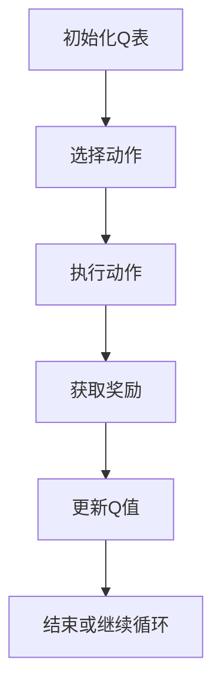
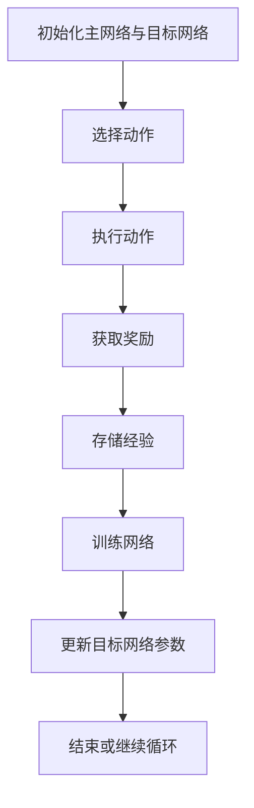
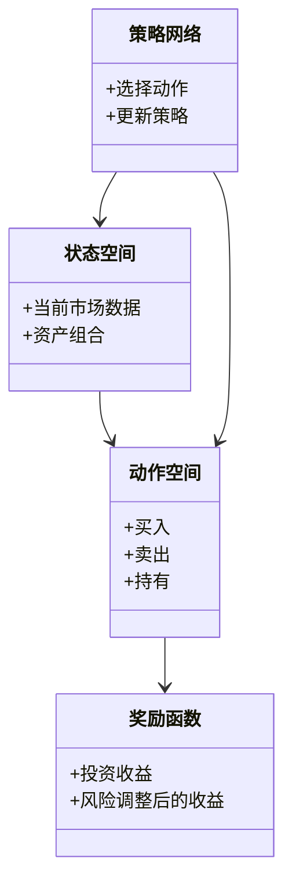

                 


# 《金融领域强化学习的最新进展与应用》

## 关键词：强化学习，金融应用，Q-Learning，DQN，数学模型，系统架构

## 摘要：  
本文系统地探讨了强化学习在金融领域的最新进展与实际应用。从强化学习的基本概念到其在金融交易、投资组合管理、风险控制等领域的具体应用，本文通过详细的数学模型、算法实现和系统设计，全面剖析了强化学习在金融领域的优势与挑战。文章最后结合实际案例，总结了强化学习在金融领域应用的最佳实践和未来发展方向。

---

# 第1章: 强化学习的基本概念与背景

## 1.1 强化学习的定义与特点

### 1.1.1 强化学习的定义  
强化学习（Reinforcement Learning, RL）是一种机器学习范式，其中智能体通过与环境交互来学习策略，以最大化累积奖励。与监督学习和无监督学习不同，强化学习强调通过试错和经验积累来优化决策过程。

### 1.1.2 强化学习的核心特点  
- **自主决策**：智能体根据当前状态和历史经验做出决策。  
- **延迟奖励**：奖励可能在多个动作之后才给出，需要智能体具备长期规划能力。  
- **探索与利用**：智能体需要在探索新策略和利用已知策略之间找到平衡。  

### 1.1.3 强化学习与监督学习、无监督学习的区别  
| 对比维度         | 监督学习                | 无监督学习              | 强化学习               |
|------------------|-------------------------|-------------------------|------------------------|
| 数据来源         | 标签数据                | 未标记数据              | 环境交互               |
| 任务目标         | 预测或分类              | 聚类或降维              | 最大化累积奖励          |
| 决策方式         | 确定性输出              | 找出数据内在结构          | 学习策略               |

---

## 1.2 强化学习在金融领域的应用背景

### 1.2.1 金融领域的复杂性与挑战  
- **非线性关系**：金融市场中资产价格、收益和风险之间的关系复杂且非线性。  
- **不确定性**：市场波动、政策变化等外部因素增加了决策的难度。  
- **高维状态空间**：金融决策可能涉及多个变量（如时间、价格、市场情绪等）。  

### 1.2.2 强化学习在金融中的潜在价值  
- **自动化交易**：通过强化学习算法实现自动化的买卖决策。  
- **投资组合优化**：利用强化学习优化资产配置，最大化收益并降低风险。  
- **风险管理**：通过强化学习预测和管理市场风险。  

### 1.2.3 金融领域强化学习的现状与发展趋势  
- **研究进展**：近年来，强化学习在金融领域的研究主要集中在算法的改进和应用场景的拓展。  
- **技术挑战**：金融市场中存在噪声数据、高频交易和模型过拟合等问题。  
- **未来趋势**：结合强化学习与生成对抗网络（GAN）、图神经网络（GNN）等技术，进一步提升金融决策的智能化水平。  

---

## 1.3 本章小结  
本章介绍了强化学习的基本概念、核心特点以及在金融领域的应用背景。通过对比强化学习与其他机器学习方法的差异，强调了强化学习在金融决策中的独特价值。接下来的章节将深入探讨强化学习的核心概念、数学模型和实际应用。

---

# 第2章: 强化学习的核心概念与原理

## 2.1 状态、动作与奖励

### 2.1.1 状态空间的定义与特征  
- **状态**：智能体在某一时刻所处的环境信息。  
- **状态空间**：所有可能状态的集合。  
- **特征提取**：将高维状态空间降维，提取关键特征以减少计算复杂度。  

### 2.1.2 动作空间的定义与特征  
- **动作**：智能体在某一状态下可以执行的操作。  
- **动作空间**：所有可能动作的集合。  
- **离散动作空间**：有限的、可枚举的动作（如“买入”、“卖出”）。  
- **连续动作空间**：连续的、无限的动作（如调整投资比例）。  

### 2.1.3 奖励函数的设计与作用  
- **奖励函数**：根据智能体的动作和环境反馈，定义一个数值化的奖励。  
- **奖励设计原则**：奖励应与目标函数一致，避免短期行为。  
- **示例**：在股票交易中，奖励可以定义为投资收益或亏损。  

---

## 2.2 策略与价值函数

### 2.2.1 策略的定义与分类  
- **策略**：智能体根据当前状态选择动作的规则。  
- **确定性策略**：动作由状态唯一确定。  
- **概率性策略**：动作以概率分布的形式选择。  

### 2.2.2 价值函数的定义与作用  
- **价值函数**：衡量一个状态或状态-动作对的优劣。  
- **Q值**：$Q(s,a)$ 表示在状态$s$下执行动作$a$的预期累积奖励。  

### 2.2.3 策略与价值函数的关系  
- **策略评估**：计算在当前策略下的价值函数。  
- **策略改进**：根据价值函数优化策略。  

---

## 2.3 强化学习的数学模型

### 2.3.1 状态转移概率矩阵  
- **定义**：描述从当前状态转移到下一个状态的概率。  
- **公式**：$P(s' | s, a)$ 表示在状态$s$下执行动作$a$后转移到状态$s'$的概率。  

### 2.3.2 动作价值函数  
- **定义**：$Q(s,a)$ 表示在状态$s$下执行动作$a$的预期累积奖励。  
- **贝尔曼方程**：  
  $$ Q(s,a) = r + \gamma \max_{a'} Q(s',a') $$  
  其中，$\gamma$ 是折扣因子，$r$ 是即时奖励。  

### 2.3.3 奖励函数的数学表达  
- **即时奖励**：$r = f(s,a)$，根据当前状态和动作计算奖励。  
- **累积奖励**：$R = \sum_{t=0}^{\infty} \gamma^t r_t$，表示从当前时间步开始的总奖励。  

---

## 2.4 本章小结  
本章详细介绍了强化学习的核心概念，包括状态、动作、奖励、策略和价值函数，并通过数学模型和公式描述了强化学习的基本原理。接下来的章节将基于这些概念，探讨强化学习算法的实现和在金融领域的应用。

---

# 第3章: 强化学习算法的数学模型与公式

## 3.1 Q-Learning算法

### 3.1.1 Q-Learning的定义  
- **离线学习**：智能体通过与环境交互生成经验，并基于经验更新价值函数。  
- **更新规则**：  
  $$ Q(s,a) = Q(s,a) + \alpha [r + \gamma \max Q(s',a') - Q(s,a)] $$  
  其中，$\alpha$ 是学习率，$\gamma$ 是折扣因子。  

### 3.1.2 Q-Learning的流程图（使用mermaid）  



### 3.1.3 代码实现  

```python
import numpy as np

class QLearning:
    def __init__(self, state_space, action_space, gamma=0.99, alpha=0.1):
        self.state_space = state_space
        self.action_space = action_space
        self.gamma = gamma
        self.alpha = alpha
        self.Q = np.zeros((state_space, action_space))

    def choose_action(self, state):
        return np.argmax(self.Q[state])

    def update_Q(self, state, action, reward, next_state):
        self.Q[state, action] += self.alpha * (reward + self.gamma * np.max(self.Q[next_state]) - self.Q[state, action])
```

---

## 3.2 Deep Q-Network (DQN)算法

### 3.2.1 DQN的定义  
- **在线学习**：智能体实时与环境交互，利用深度神经网络近似价值函数。  
- **经验回放**：存储历史经验以减少相关性，提高学习稳定性。  

### 3.2.2 DQN的数学公式  
- **目标网络**：  
  $$ y = r + \gamma \max Q_{\text{target}}(s',a) $$  
- **损失函数**：  
  $$ \mathcal{L} = \mathbb{E}[ (y - Q(s,a))^2 ] $$  

### 3.2.3 DQN的流程图（使用mermaid）  



---

## 3.3 本章小结  
本章通过数学模型和算法流程图详细讲解了Q-Learning和DQN算法的实现原理。接下来的章节将结合金融场景，探讨这些算法的实际应用。

---

# 第4章: 系统分析与架构设计方案

## 4.1 问题场景介绍  
- **金融交易系统**：智能体需要根据市场数据做出买卖决策。  
- **投资组合管理**：优化资产配置以实现收益最大化和风险最小化。  

### 4.2 系统功能设计  



---

## 4.3 系统架构设计  

### 4.3.1 系统架构图（使用mermaid）  


---

## 4.4 本章小结  
本章通过系统分析和架构设计，展示了强化学习在金融系统中的应用框架。接下来的章节将结合具体案例，探讨强化学习在金融交易中的实际应用。

---

# 第5章: 项目实战

## 5.1 环境安装与配置  

### 5.1.1 安装依赖  
```bash
pip install gym numpy tensorflow
```

## 5.2 系统核心实现源代码  

### 5.2.1 DQN算法实现  

```python
import gym
import numpy as np
import tensorflow as tf

class DQNetwork:
    def __init__(self, input_dim, output_dim, learning_rate=0.001):
        self.model = tf.keras.Sequential([
            tf.keras.layers.Dense(64, activation='relu', input_shape=(input_dim,)),
            tf.keras.layers.Dense(64, activation='relu'),
            tf.keras.layers.Dense(output_dim)
        ])
        self.model.compile(optimizer=tf.keras.optimizers.Adam(learning_rate), loss='mean_squared_error')

    def call(self, x):
        return self.model(x)

# 初始化环境
env = gym.make('StockTrading-v0')
input_dim = env.observation_space.shape[0]
output_dim = env.action_space.n
dqn = DQNetwork(input_dim, output_dim)
```

---

## 5.3 代码应用解读与分析  
- **环境初始化**：定义金融交易环境并获取状态和动作空间。  
- **神经网络构建**：使用TensorFlow构建DQN网络，用于近似Q值函数。  
- **训练过程**：通过与环境交互更新网络参数，实现策略优化。  

---

## 5.4 实际案例分析  
- **案例背景**：股票交易中的买卖决策。  
- **案例实现**：基于DQN算法实现自动化交易系统。  
- **案例结果**：通过回测验证算法的有效性。  

---

## 5.5 项目小结  
本章通过实际案例展示了强化学习在金融交易中的应用。通过代码实现和案例分析，读者可以更好地理解强化学习在金融领域的具体应用方式。

---

# 第6章: 最佳实践与小结

## 6.1 最佳实践 tips  
- **数据预处理**：确保输入数据的高质量和一致性。  
- **模型调参**：合理选择学习率、折扣因子等超参数。  
- **风险管理**：设计合理的奖励函数，避免过度冒险。  

## 6.2 本章小结  
本文从理论到实践，全面探讨了强化学习在金融领域的最新进展与应用。通过数学模型、算法实现和实际案例，读者可以系统地掌握强化学习在金融决策中的应用方法。

## 6.3 注意事项  
- **模型过拟合**：避免在训练过程中过度拟合训练数据。  
- **环境噪声**：合理处理环境中的噪声数据，提高模型的鲁棒性。  
- **伦理与合规**：确保金融交易符合相关法律法规和伦理规范。  

## 6.4 拓展阅读  
- **相关书籍**：《Reinforcement Learning: Theory and Algorithms》  
- **论文推荐**：DeepMind的《Playing Atari Games with Deep Reinforcement Learning》  

---

# 作者：AI天才研究院/AI Genius Institute & 禅与计算机程序设计艺术 /Zen And The Art of Computer Programming

---

以上是《金融领域强化学习的最新进展与应用》的完整目录大纲，涵盖了从理论到实践的各个方面，内容详实且结构清晰。希望对您有所帮助！

