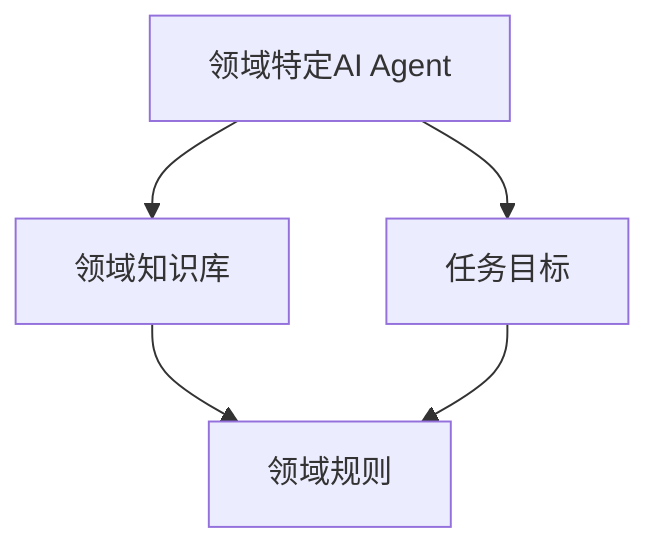
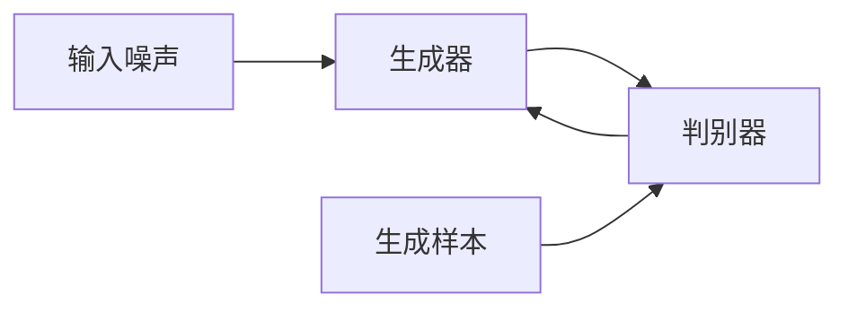
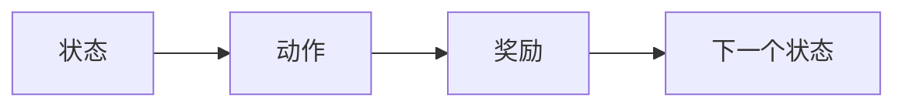
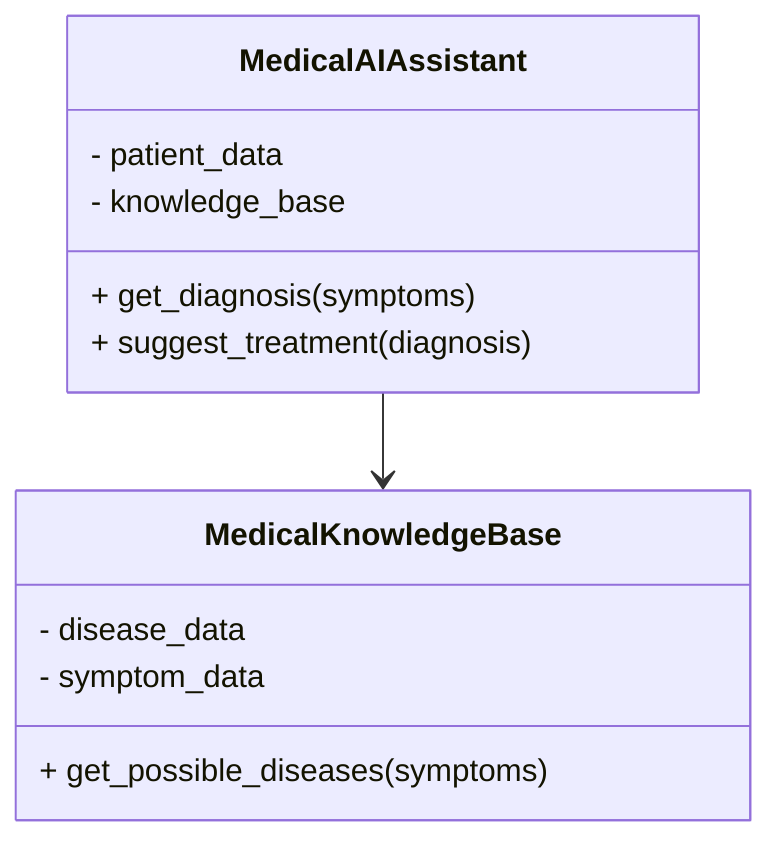
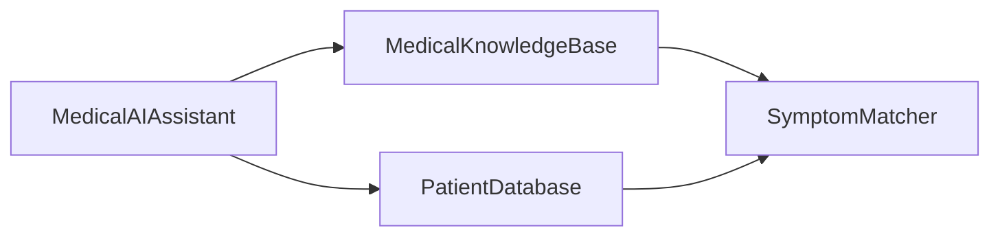
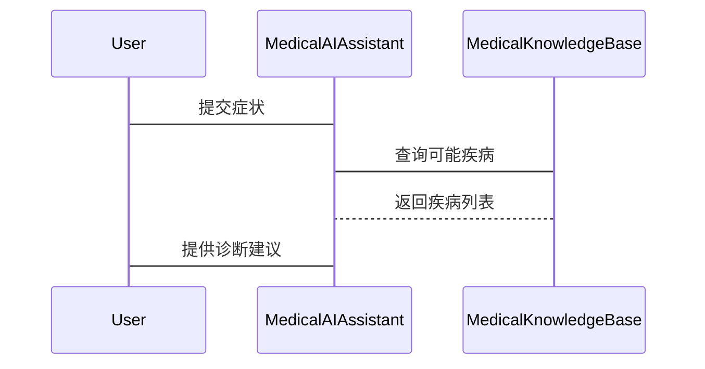

                 


# 领域特定AI Agent的开发策略

## 关键词：
领域特定AI Agent, AI Agent开发, 生成式模型, 强化学习, 系统架构设计, 项目实战

## 摘要：
本文详细探讨了领域特定AI Agent的开发策略，从背景概念、核心算法、系统架构到项目实战，全面分析了如何在特定领域中高效开发AI Agent。通过生成式模型和强化学习的原理阐述，结合系统架构设计和实际案例，为读者提供了从理论到实践的完整指南。

---

## 第一部分：领域特定AI Agent的背景与概念

### 第1章：领域特定AI Agent的背景与问题背景

#### 1.1 问题背景
随着人工智能技术的飞速发展，AI Agent（智能体）在各领域的应用日益广泛。然而，通用AI Agent在实际应用中往往难以满足特定领域的需求，例如金融交易、医疗诊断和智能制造等场景。这些场景通常涉及复杂的业务逻辑、特定的行业知识和严格的性能要求，需要AI Agent具备高度的领域适应性和定制化能力。

#### 1.2 问题描述
领域特定AI Agent的核心问题在于如何在特定领域内实现高效、准确和可扩展的智能决策和交互。具体包括以下几个方面：
1. **数据稀疏性**：特定领域可能缺乏足够的标注数据，导致模型难以泛化。
2. **领域知识依赖**：需要将领域知识融入模型，以提高决策的准确性和相关性。
3. **实时性与效率**：在某些场景下，AI Agent需要在极短时间内做出决策，这对计算效率提出了更高要求。

#### 1.3 问题解决
为了应对上述挑战，领域特定AI Agent的解决方案主要集中在以下几个方面：
1. **领域知识建模**：通过构建领域知识图谱或专家系统，将行业经验融入模型。
2. **数据增强与迁移学习**：利用数据增强技术和迁移学习，缓解数据稀疏性问题。
3. **高效的推理机制**：采用轻量级推理框架和优化算法，提升实时决策能力。

#### 1.4 边界与外延
领域特定AI Agent的边界主要体现在以下几个方面：
1. **领域限制**：AI Agent仅在特定领域内有效，超出该领域可能无法正常工作。
2. **任务限制**：专注于特定任务，如医疗诊断中的病案分析，而不是通用的自然语言处理。

#### 1.5 概念结构与核心要素
领域特定AI Agent的系统架构通常包括以下几个核心要素：
1. **感知模块**：负责接收和解析输入数据。
2. **推理模块**：基于领域知识进行推理和决策。
3. **执行模块**：将决策结果转化为具体操作。
4. **学习模块**：通过反馈机制优化模型性能。

---

## 第二部分：领域特定AI Agent的核心概念与联系

### 第2章：领域特定AI Agent的核心概念

#### 2.1 领域特定AI Agent的定义与特点
领域特定AI Agent是指在特定领域内为特定任务设计的智能体，具有以下特点：
- **领域适应性**：深度结合领域知识，提高任务相关性。
- **定制化能力**：可根据具体需求进行高度定制。
- **高效性**：针对特定任务优化，通常具备较高的运行效率。

#### 2.2 领域特定AI Agent与通用AI Agent的对比
以下是领域特定AI Agent与通用AI Agent的主要区别：

| 特性 | 领域特定AI Agent | 通用AI Agent |
|------|------------------|--------------|
| 适应性 | 高度适应特定领域 | 适用于多种领域 |
| 数据需求 | 数据量较小，依赖领域知识 | 数据量大，依赖通用数据 |
| 性能 | 高效，针对特定任务优化 | 较通用，可能在特定任务上性能不如领域特定AI Agent |

#### 2.3 领域特定AI Agent的实体关系图
以下是使用Mermaid绘制的领域特定AI Agent的实体关系图：



---

## 第三部分：领域特定AI Agent的算法原理

### 第3章：生成式模型在领域特定AI Agent中的应用

#### 3.1 生成式模型的原理
生成式模型通过学习数据的分布，生成与训练数据相似的新数据。其核心思想是通过对抗训练或变分推断，优化生成器和判别器的损失函数。

##### 生成式模型的流程图


##### 生成式模型的数学公式
- **生成样本的似然**：$$\log p(y|x)$$
- **判别器的损失函数**：$$\mathbb{E}_{x \sim p_{\text{data}}}[ \log D(x)] + \mathbb{E}_{y \sim p_{\text{gen}}}[ \log (1 - D(y))]$$

#### 3.2 生成式模型的实现
以下是使用Python实现的生成式模型代码示例：

```python
import torch
import torch.nn as nn

class Generator(nn.Module):
    def __init__(self, input_dim, hidden_dim, output_dim):
        super(Generator, self).__init__()
        self.fc1 = nn.Linear(input_dim, hidden_dim)
        self.fc2 = nn.Linear(hidden_dim, output_dim)
        self.relu = nn.ReLU()
        self.sigmoid = nn.Sigmoid()

    def forward(self, x):
        x = self.relu(self.fc1(x))
        x = self.sigmoid(self.fc2(x))
        return x

class Discriminator(nn.Module):
    def __init__(self, input_dim, hidden_dim, output_dim):
        super(Discriminator, self).__init__()
        self.fc1 = nn.Linear(input_dim, hidden_dim)
        self.fc2 = nn.Linear(hidden_dim, output_dim)
        self.relu = nn.ReLU()
        self.sigmoid = nn.Sigmoid()

    def forward(self, x):
        x = self.relu(self.fc1(x))
        x = self.sigmoid(self.fc2(x))
        return x
```

---

### 第4章：强化学习在领域特定AI Agent中的应用

#### 4.1 强化学习的原理
强化学习通过智能体与环境的交互，学习最优策略。智能体通过执行动作获得奖励，不断优化策略以最大化累积奖励。

##### 强化学习的流程图


##### 强化学习的数学公式
- **策略梯度**：$$\nabla \theta = \mathbb{E}_{s \sim \rho_{\theta}} [\nabla \log \pi_{\theta}(a|s) Q_{\theta}(s,a)]$$
- **Q-learning**：$$Q(s,a) = r + \gamma \max_{a'} Q(s',a')$$

#### 4.2 强化学习的实现
以下是使用Python实现的强化学习代码示例：

```python
import torch
import torch.nn as nn

class PolicyNetwork(nn.Module):
    def __init__(self, state_dim, action_dim, hidden_dim):
        super(PolicyNetwork, self).__init__()
        self.fc1 = nn.Linear(state_dim, hidden_dim)
        self.fc2 = nn.Linear(hidden_dim, action_dim)
        self.relu = nn.ReLU()
        self.softmax = nn.Softmax(dim=1)

    def forward(self, x):
        x = self.relu(self.fc1(x))
        x = self.softmax(self.fc2(x))
        return x

# 初始化网络
policy = PolicyNetwork(state_dim, action_dim, hidden_dim)
optimizer = torch.optim.Adam(policy.parameters(), lr=0.001)

# 训练过程
for _ in range(num_episodes):
    state = env.reset()
    while not done:
        with torch.no_grad():
            action_probs = policy.forward(state)
        action = torch.multinomial(action_probs, 1).item()
        next_state, reward, done, _ = env.step(action)
        # 更新网络
        optimizer.zero_grad()
        # 计算损失并反向传播
        # ...
```

---

## 第四部分：领域特定AI Agent的系统分析与架构设计

### 第5章：系统分析与架构设计

#### 5.1 项目场景介绍
以医疗诊断AI Agent为例，系统需要处理医生的输入，调用医疗知识库，结合患者病史，生成诊断建议。

#### 5.2 系统功能设计
以下是系统功能设计的类图：



#### 5.3 系统架构设计
以下是系统架构设计的架构图：



#### 5.4 系统接口设计
- **输入接口**：自然语言输入或结构化数据输入。
- **输出接口**：诊断结果、治疗建议或下一步操作建议。

#### 5.5 系统交互设计
以下是系统交互的序列图：



---

## 第五部分：领域特定AI Agent的项目实战

### 第6章：项目实战

#### 6.1 环境安装
需要安装以下库：
- `torch`
- `torchvision`
- `numpy`
- `scikit-learn`

#### 6.2 核心代码实现
以下是核心代码实现：

```python
import torch
import torch.nn as nn
import torch.optim as optim

class FieldSpecificAIAssistant:
    def __init__(self, domain):
        self.domain = domain
        self.model = self._build_model()

    def _build_model(self):
        # 根据领域构建模型
        pass

    def train(self, data_loader, epochs=10):
        optimizer = optim.Adam(self.model.parameters())
        loss_fn = nn.CrossEntropyLoss()
        for epoch in range(epochs):
            for batch in data_loader:
                outputs = self.model(batch)
                loss = loss_fn(outputs, batch_labels)
                optimizer.zero_grad()
                loss.backward()
                optimizer.step()

    def infer(self, input):
        with torch.no_grad():
            output = self.model(input)
            return output
```

#### 6.3 代码解读与分析
1. **模型构建**：根据具体领域构建适合的模型架构。
2. **训练过程**：使用数据加载器和优化器进行训练。
3. **推理过程**：输入特定领域数据，输出决策结果。

#### 6.4 案例分析
以医疗诊断为例，AI Agent接收患者症状，调用医疗知识库，生成诊断建议。

---

## 第六部分：总结与展望

### 第7章：总结与展望

#### 7.1 核心内容回顾
本文详细介绍了领域特定AI Agent的开发策略，包括背景、核心概念、算法原理、系统架构和项目实战。

#### 7.2 当前趋势与未来方向
1. **领域知识的深度结合**：如何更高效地将领域知识融入模型。
2. **多模态技术的应用**：结合视觉、听觉等多模态信息，提升决策能力。
3. **实时性与效率优化**：如何在边缘计算环境下实现低延迟的AI推理。

#### 7.3 最佳实践 tips
1. 在开发领域特定AI Agent时，优先考虑领域知识的建模与应用。
2. 使用轻量级框架优化推理效率。
3. 定期更新模型，确保其适应领域内的最新变化。

---

## 小结

本文通过系统的分析和详细的代码实现，全面探讨了领域特定AI Agent的开发策略。从理论到实践，为读者提供了完整的开发指南，帮助他们在特定领域中高效构建智能系统。

---

## 作者信息

作者：AI天才研究院/AI Genius Institute & 禅与计算机程序设计艺术 /Zen And The Art of Computer Programming

