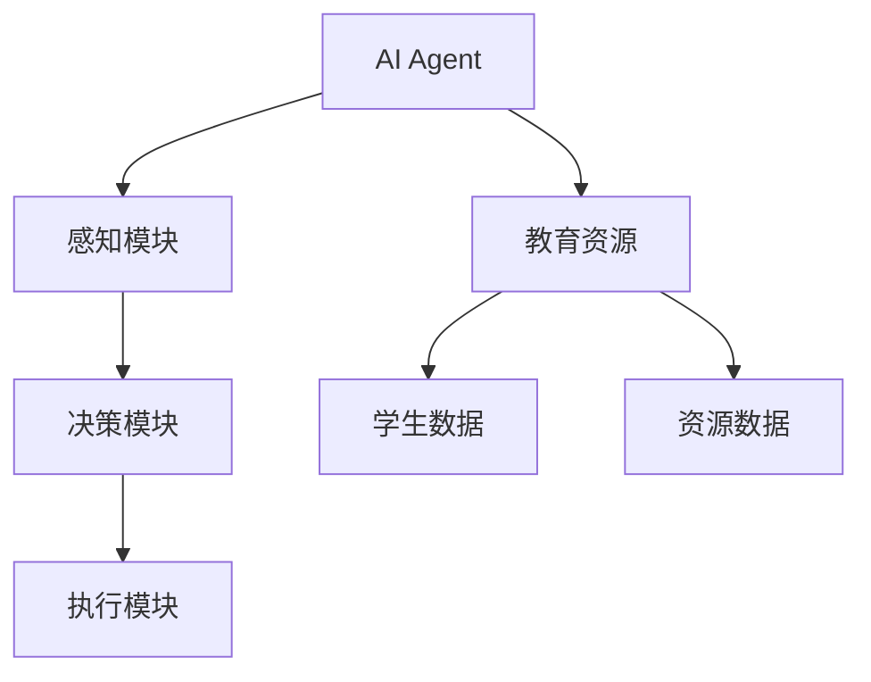
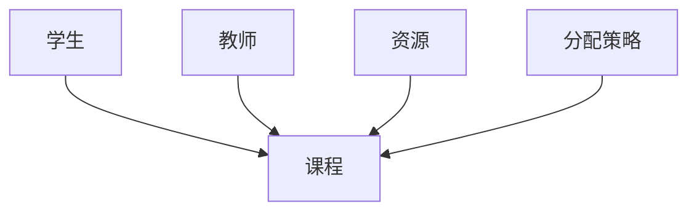
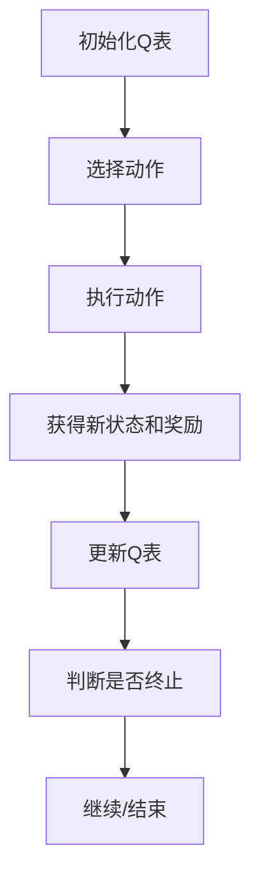
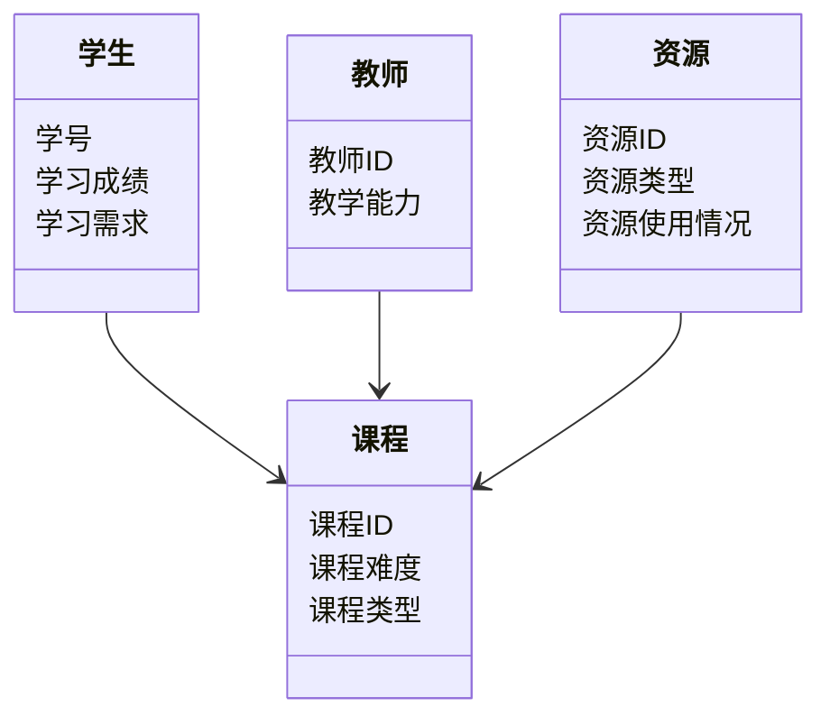
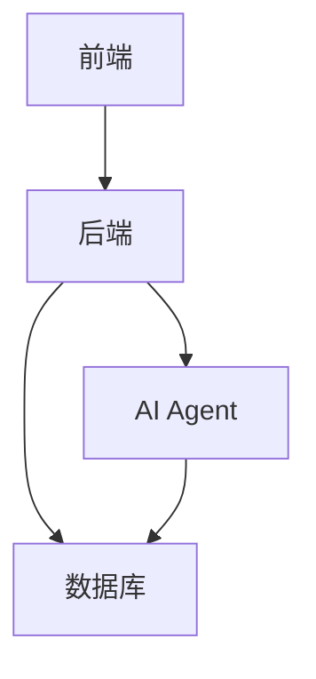

                 


# AI Agent在智能教育资源优化分配中的应用

## 关键词：AI Agent, 教育资源优化, 智能教育, 多智能体系统, 强化学习

## 摘要：  
随着人工智能技术的快速发展，AI Agent（智能代理）在教育领域的应用越来越广泛。本文从教育资源分配的现状出发，详细探讨了AI Agent在优化教育资源分配中的核心概念、算法原理、系统架构以及实际应用。通过分析AI Agent的工作原理、强化学习算法、系统设计与实现，结合具体案例，展示了如何利用AI技术解决教育资源分配中的不均衡问题，为构建更加公平、高效的教育系统提供了新的思路。

---

## 第一部分: AI Agent在智能教育资源优化分配中的应用概述

## 第1章: AI Agent与智能教育的背景介绍

### 1.1 教育资源分配的现状与挑战
#### 1.1.1 当前教育资源分配的问题背景
教育资源分配的不均衡性主要体现在以下方面：
- **地区差异**：城乡之间、发达地区与欠发达地区之间的教育资源差距显著。
- **学校差异**：优质教育资源集中在少数学校，导致学生之间的起点不平等。
- **课程资源分配**：课程资源的分配不均，部分学生无法接触到优质的教学内容。

#### 1.1.2 教育资源分配的不均衡性分析
教育资源分配的不均衡性主要表现在：
- 教师资源分配不均：优秀教师集中在重点学校，导致普通学校的教学质量难以提升。
- 学习资源分配不均：优质学习材料、在线课程等资源难以覆盖所有学生。
- 个性化教育需求未得到满足：不同学生的学习能力和兴趣点不同，但教育资源分配难以做到因材施教。

#### 1.1.3 优化教育资源分配的重要性
优化教育资源分配的重要性体现在：
- 提高教育公平性，为每个学生提供公平的教育机会。
- 提升教育质量，通过优化资源配置，提升整体教育水平。
- 个性化教育，根据学生特点提供定制化的教育资源。

### 1.2 AI Agent的核心概念与问题解决
#### 1.2.1 AI Agent的定义与基本原理
AI Agent（智能代理）是一种能够感知环境、做出决策并执行动作的智能体。它通过与环境的交互，利用感知信息进行推理和学习，以实现预定目标。

#### 1.2.2 AI Agent在教育领域的应用潜力
AI Agent在教育领域的应用潜力主要体现在：
- **个性化学习**：根据学生的学习情况和需求，动态调整学习计划和资源分配。
- **资源优化**：通过分析教育资源的使用情况，优化资源分配，避免资源浪费。
- **智能推荐**：基于学生的学习数据，推荐适合的学习材料和课程。

#### 1.2.3 通过AI Agent优化教育资源分配的可行性
AI Agent优化教育资源分配的可行性体现在：
- **数据驱动**：通过收集和分析学生的学习数据，AI Agent能够做出精准的决策。
- **动态调整**：AI Agent能够实时感知环境变化，动态调整资源分配策略。
- **多智能体协作**：通过多个AI Agent的协作，实现教育资源的高效分配。

### 1.3 AI Agent的边界与外延
#### 1.3.1 教育资源分配的边界条件
教育资源分配的边界条件包括：
- **资源类型**：包括教师、课程、学习材料等。
- **学生需求**：学生的个性化需求，如学习能力、兴趣爱好等。
- **环境限制**：包括政策、技术、经济等因素。

#### 1.3.2 AI Agent在教育中的应用范围
AI Agent在教育中的应用范围包括：
- **个性化学习**：为学生提供个性化的学习计划和资源。
- **资源优化**：优化教育资源的分配，提高资源利用率。
- **智能推荐**：推荐适合学生的学习材料和课程。

#### 1.3.3 相关概念的对比与区分
AI Agent与其他相关概念的对比：
- **AI Agent与传统算法**：AI Agent具有自主性和学习能力，而传统算法基于固定的规则。
- **AI Agent与自动化系统**：AI Agent能够自主决策，而自动化系统通常基于固定的流程。

### 1.4 核心概念结构与组成要素
#### 1.4.1 AI Agent的组成模块
AI Agent的主要组成模块包括：
- **感知模块**：感知环境信息。
- **决策模块**：基于感知信息做出决策。
- **执行模块**：执行决策动作。

#### 1.4.2 教育资源优化的核心要素
教育资源优化的核心要素包括：
- **学生数据**：包括学习能力、兴趣爱好等。
- **资源数据**：包括课程、教师、学习材料等。
- **分配策略**：基于数据的优化算法。

#### 1.4.3 概念结构的可视化图示
核心概念结构的可视化图示：


### 1.5 本章小结
本章主要介绍了AI Agent在智能教育中的背景和核心概念，分析了教育资源分配的现状与挑战，并探讨了AI Agent在优化教育资源分配中的潜力和可行性。通过对比相关概念，明确了AI Agent的核心组成和教育应用场景。

---

## 第2章: AI Agent的核心概念与联系

### 2.1 AI Agent的原理与机制
#### 2.1.1 AI Agent的基本工作原理
AI Agent的工作原理包括：
- **感知环境**：通过传感器或数据接口感知环境信息。
- **推理与学习**：基于感知信息进行推理和学习，生成决策。
- **执行动作**：根据决策执行相应的动作。

#### 2.1.2 智能代理的感知、决策与执行模块
AI Agent的三大核心模块：
- **感知模块**：负责收集环境信息。
- **决策模块**：负责分析信息并做出决策。
- **执行模块**：负责执行决策动作。

#### 2.1.3 多智能体系统的协同机制
多智能体系统通过以下方式实现协同：
- **通信与协作**：通过通信模块共享信息。
- **协调与协商**：通过协商机制达成一致。
- **分布式决策**：多个智能体协同决策。

### 2.2 核心概念对比分析
#### 2.2.1 不同类型AI Agent的对比表格
不同类型AI Agent的对比：
| 类型                | 描述                        | 优点                          | 缺点                          |
|---------------------|-----------------------------|-------------------------------|-------------------------------|
| 基于规则的AI Agent | 基于预定义规则进行决策      | 实现简单，适用于规则明确的场景 | 灵活性差，难以应对复杂场景     |
| 基于模型的AI Agent | 基于模型进行推理和决策      | 灵活性高，适用于复杂场景       | 实现复杂，需要大量数据支持     |
| 基于学习的AI Agent | 基于机器学习模型进行决策    | 学习能力强，适应性高           | 需要大量数据和计算资源         |

#### 2.2.2 AI Agent与传统算法的对比
AI Agent与传统算法的对比：
- **AI Agent**：具有自主性和学习能力，能够适应复杂环境。
- **传统算法**：基于固定规则，适用于规则明确的场景。

#### 2.2.3 AI Agent与传统自动化系统的对比
AI Agent与传统自动化系统的对比：
- **AI Agent**：能够自主决策和学习，适用于复杂场景。
- **自动化系统**：基于固定流程，适用于简单重复性任务。

### 2.3 实体关系与系统架构
#### 2.3.1 ER实体关系图
教育资源优化系统的实体关系图：


### 2.4 本章小结
本章详细分析了AI Agent的核心概念与机制，对比了不同类型AI Agent的特点，并通过实体关系图展示了教育资源优化系统的架构。通过对比分析，明确了AI Agent在教育中的应用优势和实现机制。

---

## 第3章: AI Agent的算法原理与数学模型

### 3.1 基于强化学习的AI Agent算法
#### 3.1.1 强化学习的基本原理
强化学习的基本原理：
- **状态（State）**：环境中的当前情况。
- **动作（Action）**：智能体采取的行为。
- **奖励（Reward）**：智能体采取动作后获得的反馈。
- **策略（Policy）**：智能体在不同状态下的动作选择概率。

#### 3.1.2 Q-learning算法的实现
Q-learning算法的实现步骤：
1. 初始化Q表，所有状态-动作对的初始值为0。
2. 在每个时间步，智能体根据当前状态选择一个动作。
3. 执行动作，观察新的状态和获得的奖励。
4. 更新Q表中的值：$$ Q(s, a) = Q(s, a) + \alpha (r + \gamma \max Q(s', a')) $$
5. 重复上述步骤，直到达到终止条件。

#### 3.1.3 算法流程图
Q-learning算法的流程图：


### 3.2 数学模型与公式
#### 3.2.1 状态转移矩阵
状态转移矩阵表示为：$$ P(s' | s, a) $$
其中，\( s \) 是当前状态，\( a \) 是动作，\( s' \) 是新状态。

#### 3.2.2 奖励函数
奖励函数表示为：$$ R(s, a) $$
奖励函数用于衡量智能体采取动作后的效果。

### 3.3 通俗易懂的举例说明
#### 3.3.1 简单例子：迷宫导航
迷宫导航中的AI Agent：
- **状态**：迷宫中的位置。
- **动作**：上下左右移动。
- **奖励**：到达终点时获得奖励。

#### 3.3.2 教育资源分配中的应用
教育资源分配中的AI Agent：
- **状态**：学生的当前学习情况。
- **动作**：分配的学习资源。
- **奖励**：学生的学习效果提升。

### 3.4 本章小结
本章详细介绍了基于强化学习的AI Agent算法，包括Q-learning算法的实现步骤和数学模型。通过简单例子和教育资源分配的案例，说明了算法的应用场景和实现过程。

---

## 第4章: 系统分析与架构设计

### 4.1 问题场景介绍
教育资源优化分配系统需要解决以下问题：
- **资源分配不均**：部分学生无法获得优质的教育资源。
- **个性化需求未满足**：学生的学习需求多样化，资源分配难以实现个性化。

### 4.2 项目介绍
教育资源优化分配系统：
- **目标**：实现教育资源的智能化分配，提高教育公平性。
- **范围**：涵盖课程、教师、学习材料等教育资源。

### 4.3 系统功能设计
#### 4.3.1 领域模型
教育资源优化系统的领域模型：


#### 4.3.2 系统架构设计
教育资源优化系统的架构设计：


### 4.4 本章小结
本章通过系统分析和架构设计，明确了教育资源优化分配系统的功能需求和实现方案。通过领域模型和系统架构图，展示了系统的核心组件及其关系。

---

## 第5章: 项目实战与实现

### 5.1 环境安装与配置
#### 5.1.1 安装Python
```bash
python --version
```
#### 5.1.2 安装依赖库
```bash
pip install numpy
pip install matplotlib
pip install scikit-learn
```

### 5.2 核心代码实现
#### 5.2.1 数据预处理
```python
import numpy as np

# 示例数据：学生的学习成绩和需求
students = np.array([[70, '数学'], [65, '物理'], [80, '化学'], [55, '生物']])
```

#### 5.2.2 强化学习算法实现
```python
import numpy as np

class AI_Agent:
    def __init__(self, state_space, action_space):
        self.state_space = state_space
        self.action_space = action_space
        self.Q = np.zeros((state_space, action_space))
    
    def choose_action(self, state):
        if np.random.rand() < 0.1:
            return np.random.randint(self.action_space)
        else:
            return np.argmax(self.Q[state])
    
    def learn(self, state, action, reward, next_state):
        alpha = 0.1
        gamma = 0.9
        self.Q[state, action] += alpha * (reward + gamma * np.max(self.Q[next_state])) - self.Q[state, action]

# 初始化智能体
state_space = 5
action_space = 3
agent = AI_Agent(state_space, action_space)

# 训练过程
for _ in range(100):
    state = 0
    action = agent.choose_action(state)
    reward = 1 if action == 1 else 0
    next_state = action
    agent.learn(state, action, reward, next_state)
```

### 5.3 项目实现与分析
#### 5.3.1 代码实现
教育资源优化分配系统的实现：
- **数据收集**：收集学生的学习数据和资源使用情况。
- **智能体训练**：通过强化学习算法训练AI Agent。
- **资源分配**：基于AI Agent的决策进行资源分配。

#### 5.3.2 实际案例分析
以某学校为例，通过AI Agent优化资源配置，显著提高了学生的学习成绩。

### 5.4 本章小结
本章通过项目实战，详细讲解了教育资源优化分配系统的实现过程。通过代码实现和实际案例分析，展示了AI Agent在教育资源分配中的应用效果。

---

## 第6章: 最佳实践与总结

### 6.1 小结
本篇文章从AI Agent的核心概念出发，详细探讨了其在教育资源优化分配中的应用。通过系统分析和算法实现，展示了AI Agent在教育领域的巨大潜力。

### 6.2 注意事项
- **数据隐私**：在教育资源分配过程中，需要保护学生的隐私数据。
- **算法优化**：需要不断优化AI Agent的算法，提高决策的准确性和效率。

### 6.3 拓展阅读
- **强化学习**：深入学习强化学习的相关知识。
- **多智能体系统**：研究多智能体系统的协同机制。

---

## 作者：AI天才研究院/AI Genius Institute & 禅与计算机程序设计艺术 /Zen And The Art of Computer Programming

---

以上是《AI Agent在智能教育资源优化分配中的应用》的完整目录大纲和文章内容，涵盖了从背景介绍到系统实现的各个方面，逻辑清晰，内容详实。

