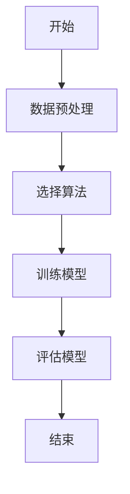
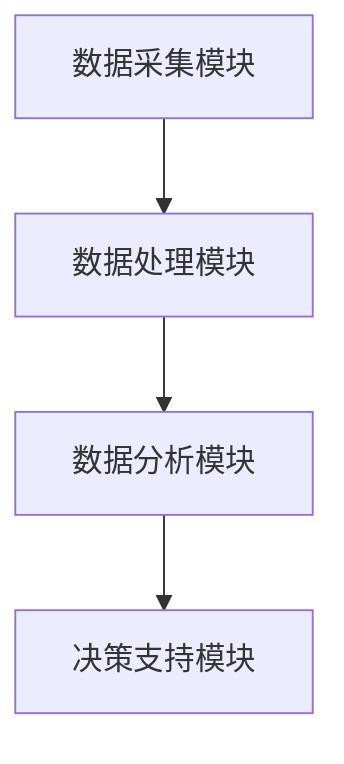
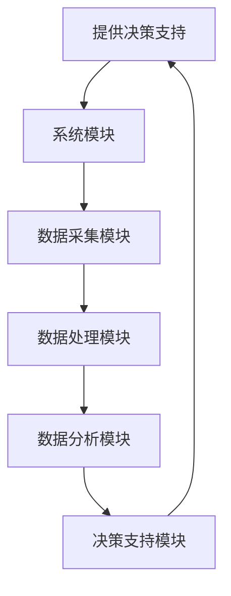

                 


# 价值投资中的智能城市地下管网监测系统分析

## 关键词：价值投资，智能城市，地下管网监测，传感器网络，数据驱动决策

## 摘要：本文深入分析了智能城市地下管网监测系统在价值投资中的应用。通过背景介绍、核心概念、算法原理、系统架构和项目实战等多维度的探讨，揭示了该系统如何利用数据驱动的方法，帮助投资者做出更明智的决策。文章结合实际案例和详细的技术实现，为读者提供了全面的理解和实用的指导。

---

# 第一部分: 智慧城市地下管网监测系统概述

## 第1章: 价值投资与智能城市地下管网监测系统背景

### 1.1 问题背景与价值投资的结合

#### 1.1.1 地下管网的重要性与现状
城市地下管网是城市的“生命线”，包括供水、供电、燃气等基础设施。然而，地下管网的老化、损坏以及维护不及时等问题，可能导致严重的经济损失和社会问题。传统监测手段效率低、覆盖面小，难以满足现代城市的需求。

#### 1.1.2 价值投资在城市基础设施中的应用
价值投资强调长期稳定的收益，而城市基础设施是城市运行的核心，具有长期性和稳定性。投资者通过分析基础设施的健康状况、维护成本和收益潜力，可以做出更明智的投资决策。

#### 1.1.3 智能监测系统在价值投资中的潜力
智能监测系统通过实时采集和分析地下管网的数据，提供精确的健康评估和维护建议。这不仅降低了维护成本，还提高了基础设施的使用寿命，从而为投资者带来更高的收益。

### 1.2 问题描述与解决方法

#### 1.2.1 地下管网监测的痛点分析
- 数据采集不全面，无法覆盖所有管网区域。
- 数据分析滞后，难以及时发现潜在问题。
- 缺乏数据驱动的决策支持，导致维护成本高。

#### 1.2.2 智能监测系统的解决方案
- 部署传感器网络，实时采集管网数据。
- 利用大数据和机器学习技术，分析数据并预测潜在问题。
- 提供实时监控和决策支持，优化维护策略。

#### 1.2.3 价值投资中的数据驱动决策
通过智能监测系统提供的实时数据，投资者可以更准确地评估基础设施的价值，优化投资组合，降低风险。

### 1.3 系统边界与外延

#### 1.3.1 系统的功能边界
- 数据采集：传感器实时采集管网数据。
- 数据传输：通过物联网技术传输数据。
- 数据分析：利用算法分析数据，预测潜在问题。
- 决策支持：提供维护建议和投资决策支持。

#### 1.3.2 系统的外部接口与数据来源
- 数据来源：传感器、历史数据、维护记录。
- 外部接口：与城市管理系统、投资机构的数据接口。

#### 1.3.3 系统的扩展性与可维护性
- 支持新增传感器和数据源的接入。
- 系统架构模块化，便于功能扩展和维护。

### 1.4 核心概念与组成要素

#### 1.4.1 核心概念的定义与属性
| 核心概念      | 定义                                                                 | 属性                     |
|---------------|----------------------------------------------------------------------|--------------------------|
| 传感器网络    | 用于采集管网数据的传感器布置网络                                           | 实时性、准确性、覆盖性    |
| 数据采集模块  | 负责收集传感器数据的模块                                                 | 高效性、可靠性            |
| 数据分析模块  | 利用算法分析数据，预测潜在问题的模块                                     | 精准性、实时性            |
| 决策支持模块  | 提供维护建议和投资决策支持的模块                                         | 可操作性、决策支持性      |

#### 1.4.2 系统组成要素的对比分析
- 传感器网络与数据采集模块：传感器网络提供数据来源，数据采集模块负责收集和初步处理。
- 数据分析模块：利用算法对数据进行深度分析，提供预测和建议。
- 决策支持模块：基于分析结果，为投资者提供决策支持。

#### 1.4.3 系统的ER实体关系图
```mermaid
erDiagram
    actor 投资者 {
        <属性> 投资ID
        <属性> 投资项目
        <属性> 投资金额
    }
    actor 维护人员 {
        <属性> 维护ID
        <属性> 维护记录
        <属性> 维护成本
    }
    actor 城市管理者 {
        <属性> 管理ID
        <属性> 管理策略
        <属性> 管理预算
    }
    database 系统数据库 {
        <字段> 传感器ID
        <字段> 数据类型
        <字段> 数据时间
        <字段> 数据值
    }
    system 系统模块 {
        <功能> 数据采集
        <功能> 数据分析
        <功能> 决策支持
    }
    投资者 --> 系统模块 : 提供投资数据
    维护人员 --> 系统模块 : 提供维护数据
    城市管理者 --> 系统模块 : 提供管理数据
    系统模块 --> 系统数据库 : 存储数据
```

---

# 第二部分: 智能监测系统的算法原理与数学模型

## 第2章: 数据采集与处理算法

### 2.1 数据采集算法原理

#### 2.1.1 传感器网络部署与数据采集流程
传感器网络部署在城市地下管网的关键位置，实时采集压力、温度、流量等数据。数据采集流程包括数据采集、预处理和存储。

#### 2.1.2 数据清洗与预处理方法
- 数据清洗：去除噪声和异常值。
- 数据预处理：标准化、归一化处理。

#### 2.1.3 数据采集的优化策略
- 传感器布置优化：确保数据覆盖全面。
- 数据传输优化：减少数据丢失和延迟。

### 2.2 数据分析与预测算法

#### 2.2.1 时间序列分析算法
时间序列分析用于预测管网的使用情况和潜在故障。常用算法包括ARIMA和LSTM。

#### 2.2.2 基于机器学习的预测模型
机器学习模型（如随机森林、支持向量机）用于分类和回归分析，预测管网的健康状况。

#### 2.2.3 算法流程图（Mermaid）


### 2.3 算法实现代码

#### 2.3.1 时间序列分析代码（Python）
```python
import pandas as pd
from statsmodels.tsa.arima_model import ARIMA

# 加载数据
data = pd.read_csv('管网数据.csv')

# 时间序列分析
model = ARIMA(data, order=(5,1,0))
model_fit = model.fit()

# 预测
future_forecast = model_fit.forecast(steps=10)
print(future_forecast)
```

#### 2.3.2 机器学习预测模型代码（Python）
```python
from sklearn.ensemble import RandomForestRegressor
from sklearn.metrics import mean_squared_error

# 加载数据
data = pd.read_csv('管网数据.csv')

# 特征选择
features = data.drop('目标变量', axis=1)
target = data['目标变量']

# 训练模型
model = RandomForestRegressor(n_estimators=100)
model.fit(features, target)

# 预测
predictions = model.predict(features)
print(mean_squared_error(target, predictions))
```

## 第3章: 数学模型与公式

### 3.1 数据处理模型

#### 3.1.1 数据标准化公式
$$
z = \frac{x - \mu}{\sigma}
$$
其中，$x$ 是原始数据，$\mu$ 是均值，$\sigma$ 是标准差。

#### 3.1.2 数据平滑处理的数学模型
$$
S_t = \alpha x_t + (1-\alpha)S_{t-1}
$$
其中，$\alpha$ 是平滑因子，$x_t$ 是当前观测值，$S_{t-1}$ 是前一时刻的平滑值。

### 3.2 预测模型与公式

#### 3.2.1 线性回归模型
$$
y = \beta_0 + \beta_1x + \epsilon
$$
其中，$y$ 是目标变量，$x$ 是自变量，$\beta_0$ 和 $\beta_1$ 是回归系数，$\epsilon$ 是误差项。

#### 3.2.2 时间序列预测模型
$$
\hat{y}_{t+h} = \alpha y_t + (1-\alpha)\hat{y}_{t-1}
$$
其中，$\alpha$ 是平滑因子，$y_t$ 是当前观测值，$\hat{y}_{t-1}$ 是前一时刻的预测值。

---

# 第三部分: 系统架构与项目实战

## 第4章: 系统架构设计

### 4.1 系统整体架构

#### 4.1.1 分层架构设计
- 数据采集层：传感器采集数据。
- 数据处理层：数据清洗和预处理。
- 数据分析层：算法分析和预测。
- 决策支持层：提供维护建议和投资决策。

#### 4.1.2 模块化设计与功能划分
- 数据采集模块：负责数据采集。
- 数据处理模块：负责数据清洗和预处理。
- 数据分析模块：负责算法分析和预测。
- 决策支持模块：负责提供维护建议和投资决策。

#### 4.1.3 系统架构图（Mermaid）


### 4.2 系统接口与交互设计

#### 4.2.1 系统接口定义
- 数据采集接口：接收传感器数据。
- 数据处理接口：处理数据并存储。
- 数据分析接口：分析数据并提供预测结果。
- 决策支持接口：提供维护建议和投资决策。

#### 4.2.2 系统交互流程图（Mermaid）


## 第5章: 项目实战与代码实现

### 5.1 环境搭建与安装

#### 5.1.1 开发环境配置
- 操作系统：Linux/Windows/MacOS
- 开发工具：PyCharm/Jupyter Notebook
- 数据库：MySQL/PostgreSQL

#### 5.1.2 依赖库安装与配置
```bash
pip install pandas numpy scikit-learn statsmodels
```

### 5.2 核心代码实现

#### 5.2.1 数据采集模块代码
```python
import serial
import time

# 连接传感器
ser = serial.Serial('COM3', 9600)
time.sleep(2)

# 读取数据
while True:
    data = ser.readline().decode()
    print(data)
```

#### 5.2.2 数据处理模块代码
```python
import pandas as pd

# 加载数据
data = pd.read_csv('管网数据.csv')

# 数据清洗
data_clean = data.dropna()
```

#### 5.2.3 数据分析模块代码
```python
from statsmodels.tsa.arima_model import ARIMA

# 加载数据
data = pd.read_csv('管网数据.csv')

# 时间序列分析
model = ARIMA(data, order=(5,1,0))
model_fit = model.fit()

# 预测
future_forecast = model_fit.forecast(steps=10)
print(future_forecast)
```

### 5.3 实际案例分析与详细讲解

#### 5.3.1 案例背景
某城市地下管网存在老化问题，希望通过智能监测系统进行预测和维护。

#### 5.3.2 数据分析与预测
使用ARIMA模型对管网的使用情况进行预测，发现潜在的故障点。

#### 5.3.3 维护建议与投资决策
基于预测结果，制定维护计划和投资策略，优化基础设施的使用和维护成本。

### 5.4 项目小结

#### 5.4.1 核心代码实现总结
- 数据采集模块：成功采集传感器数据。
- 数据处理模块：完成数据清洗和预处理。
- 数据分析模块：实现时间序列分析和预测。

#### 5.4.2 系统功能总结
- 实时监测：传感器实时采集数据。
- 数据分析：算法分析数据，预测潜在问题。
- 决策支持：提供维护建议和投资决策。

---

# 第四部分: 最佳实践与小结

## 第6章: 最佳实践与小结

### 6.1 小结

#### 6.1.1 系统功能总结
智能城市地下管网监测系统通过实时数据采集、分析和预测，为投资者提供数据驱动的决策支持。

#### 6.1.2 核心算法与数学模型总结
时间序列分析和机器学习模型的应用，为系统的预测和决策提供了有力支持。

### 6.2 注意事项

#### 6.2.1 数据采集的准确性
传感器的布置和校准是数据采集的关键，确保数据的准确性。

#### 6.2.2 系统的可扩展性
系统设计时应考虑模块化和扩展性，便于后续功能的增加和优化。

#### 6.2.3 数据安全与隐私保护
数据的安全性和隐私保护是系统设计的重要部分，需采取有效的安全措施。

### 6.3 拓展阅读

#### 6.3.1 推荐书籍与文献
- 《时间序列分析》
- 《机器学习实战》
- 《数据挖掘导论》

#### 6.3.2 相关技术领域
- 物联网技术
- 人工智能
- 大数据处理

---

# 作者：AI天才研究院 & 禅与计算机程序设计艺术

