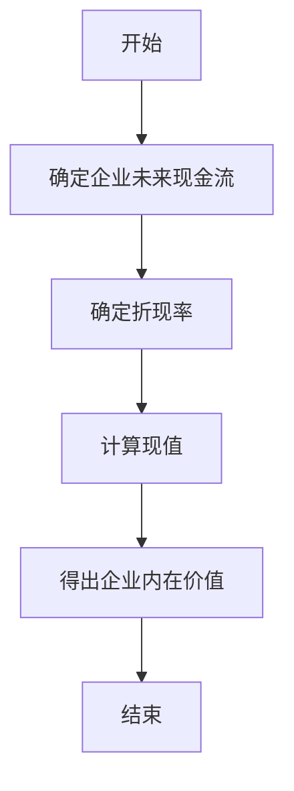
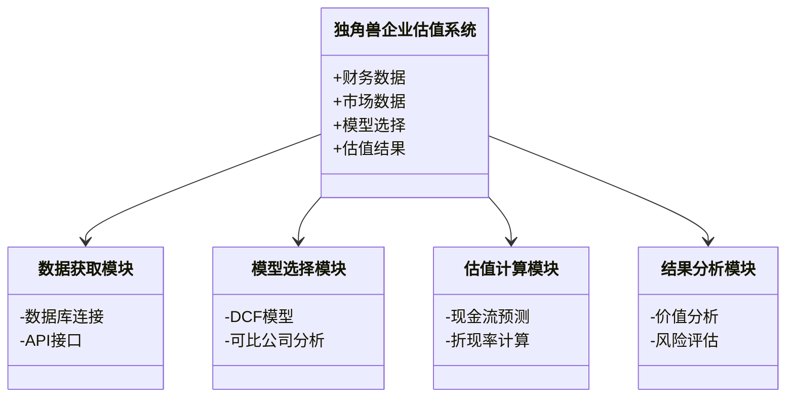
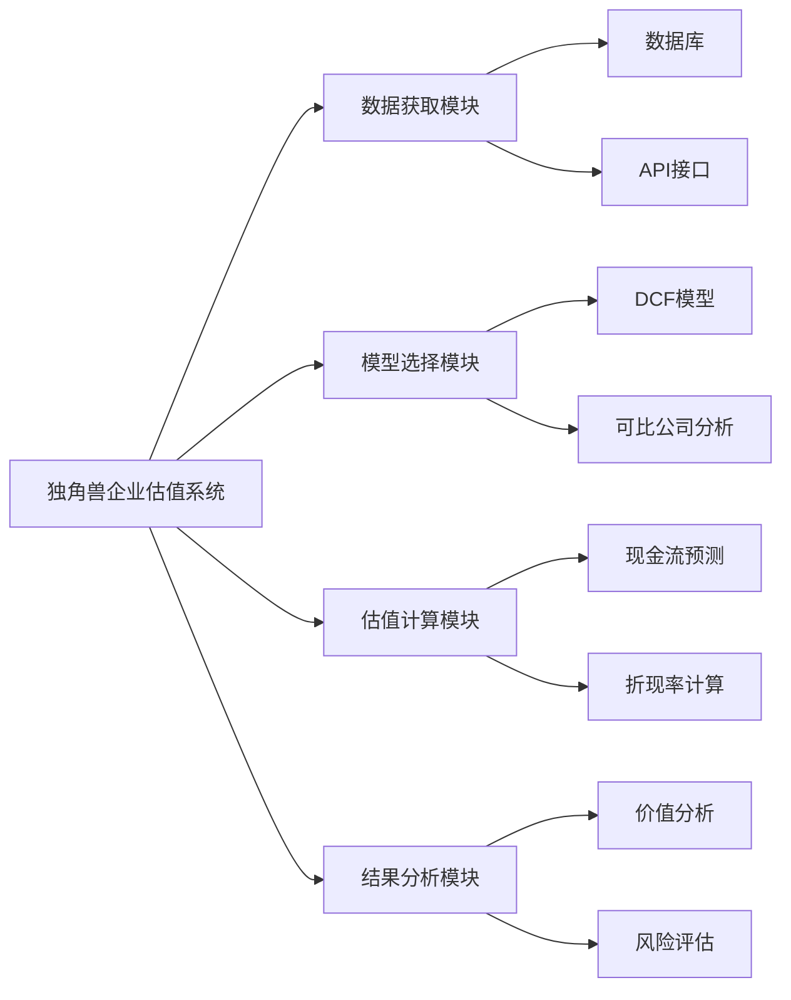

                 


# 价值投资视角下的独角兽企业估值

---

> 关键词：价值投资，独角兽企业，企业估值，现金流折现模型，DCF模型，投资分析

---

> 摘要：  
> 本文从价值投资的角度，深入分析独角兽企业的估值方法。通过结合价值投资的核心理念与独角兽企业的独特属性，探讨如何利用现金流折现模型（DCF模型）等方法进行企业估值。文章详细讲解了价值投资与独角兽企业的关系、估值算法的数学模型、系统架构设计，以及实际案例分析，为投资者提供了一套科学的估值框架。

---

# 第1章: 价值投资与独角兽企业的概述

## 1.1 价值投资的核心概念

### 1.1.1 价值投资的定义与核心理念

价值投资是一种以基本面分析为基础的投资策略，强调通过分析企业的财务状况、行业地位、管理团队等因素，寻找市场价格低于其内在价值的投资机会。其核心理念是“买入便宜”的股票，即当市场价格低于企业的内在价值时，投资该企业能够获得超额收益。

### 1.1.2 独角兽企业的定义与特征

独角兽企业是指那些估值超过10亿美元的初创公司。这些企业通常具有高增长性、创新性、市场领先性和强大的竞争优势。独角兽企业的特征包括：  
1. 高增长性：年增长率通常超过20%。  
2. 创新性：拥有独特的商业模式或技术创新。  
3. 市场领先性：在目标市场中占据领先地位。  
4. 高风险性：由于其高增长性和创新性，独角兽企业往往面临较高的经营风险和市场风险。

### 1.1.3 价值投资与独角兽企业的结合

价值投资与独角兽企业的结合体现在以下几个方面：  
1. **基本面分析**：通过分析独角兽企业的财务状况、行业地位和管理团队，评估其内在价值。  
2. **成长性与估值的平衡**：独角兽企业通常具有高成长性，但其估值往往较高。价值投资者需要在成长性和估值之间找到平衡点。  
3. **长期投资视角**：价值投资强调长期持有的理念，适合独角兽企业这种高成长性但短期波动大的投资标的。

## 1.2 独角兽企业的估值背景

### 1.2.1 独角兽企业的起源与发展

独角兽企业这一概念起源于硅谷，最早由风险投资机构Cowen在2013年提出，用来描述那些估值超过10亿美元的初创公司。随着全球科技行业的快速发展，独角兽企业数量迅速增长，尤其是在中国和美国市场。

### 1.2.2 价值投资在独角兽企业中的应用现状

尽管价值投资的核心理念是寻找市场价格低于内在价值的企业，但独角兽企业的高估值和高成长性使得其与传统价值投资标的存在差异。然而，价值投资的方法论仍然可以为独角兽企业的估值提供重要参考。

### 1.2.3 独角兽企业估值的挑战与机遇

独角兽企业的估值面临以下挑战：  
1. **高风险性**：独角兽企业的高增长性往往伴随着高风险。  
2. **非线性增长**：独角兽企业的增长往往是非线性的，难以用传统模型预测。  
3. **数据不全**：许多独角兽企业在早期阶段缺乏足够的财务数据。  

然而，独角兽企业的估值也带来了机遇，尤其是在市场波动较大时，价值投资者可以通过分析企业基本面找到被低估的投资机会。

## 1.3 本章小结

本章从价值投资和独角兽企业的基本概念出发，分析了两者的结合点以及独角兽企业的估值背景。通过理解价值投资的核心理念和独角兽企业的独特属性，为后续的估值方法分析奠定了基础。

---

# 第2章: 价值投资的核心概念与独角兽企业的联系

## 2.1 价值投资的核心要素

### 2.1.1 财务指标分析

价值投资者通常关注以下财务指标：  
1. **净利润率**：反映企业的盈利能力。  
2. **营业收入增长率**：衡量企业的成长性。  
3. **研发投入占比**：评估企业的创新能力和技术优势。  
4. **资产负债率**：分析企业的财务健康状况。  

### 2.1.2 行业地位与竞争优势

价值投资者关注企业的行业地位和竞争优势，包括：  
1. **市场占有率**：企业在目标市场中的份额。  
2. **竞争对手分析**：评估企业在行业中的竞争优势。  
3. **品牌影响力**：强大的品牌能够为企业带来长期竞争优势。  

### 2.1.3 管理团队与企业治理

管理团队的能力和治理结构是价值投资的重要考量因素。  
1. **管理团队的背景**：团队的经验和能力直接影响企业的经营成果。  
2. **治理结构**：良好的治理结构能够确保企业长期健康发展。  

## 2.2 独角兽企业的独特属性

### 2.2.1 高增长性与高风险性

独角兽企业的高增长性是其吸引投资者的核心因素，但同时也带来了高风险。企业需要在短时间内实现快速扩张，这可能带来管理风险和市场风险。

### 2.2.2 非线性增长与估值不确定性

独角兽企业的增长往往是非线性的，早期阶段的增长可能非常迅速，但随着市场饱和，增长速度可能会放缓。这种非线性增长使得传统估值模型难以准确预测。

### 2.2.3 市场地位与竞争壁垒

独角兽企业通常在目标市场中占据领先地位，并拥有较高的竞争壁垒。这些壁垒可以是技术专利、网络效应、品牌优势等。

## 2.3 价值投资与独角兽企业的关系

### 2.3.1 价值投资视角下的独角兽企业特征

1. **高成长性**：独角兽企业的高成长性与价值投资对成长性的关注相契合。  
2. **市场地位**：独角兽企业在市场中的领先地位与价值投资对行业地位的关注一致。  
3. **竞争优势**：独角兽企业的竞争优势是价值投资的核心考量因素之一。  

### 2.3.2 独角兽企业的估值逻辑与价值投资的契合点

1. **内在价值评估**：价值投资的核心是评估企业的内在价值，独角兽企业的高成长性使得其内在价值可以通过DCF模型等方法进行预测。  
2. **安全边际**：价值投资者注重安全边际，独角兽企业的高估值可能意味着较低的安全边际，但在市场波动时，也可能出现估值低估的机会。  

### 2.3.3 价值投资方法与独角兽企业估值模型的结合

1. **DCF模型的应用**：现金流折现模型是价值投资中常用的估值方法，适合用于评估独角兽企业的未来现金流。  
2. **可比公司分析**：通过分析同行业可比公司的估值，为独角兽企业估值提供参考。  

## 2.4 核心概念对比分析

### 2.4.1 价值投资与成长投资的对比

| 对比维度       | 价值投资                   | 成长投资                   |
|----------------|----------------------------|-----------------------------|
| 核心目标       | 寻找市场价格低于内在价值的企业 | 寻找高成长性的企业           |
| 关注点         | 财务状况、行业地位、竞争优势 | 未来增长潜力                 |
| 适用场景       | 企业估值相对稳定，风险较低   | 企业增长迅速，风险较高       |

### 2.4.2 独角兽企业与传统企业的对比

| 对比维度       | 独角兽企业                 | 传统企业                   |
|----------------|---------------------------|-----------------------------|
| 成长性         | 高                        | 较低                       |
| 市场地位       | 市场领先                   | 市场地位较低               |
| 竞争壁垒       | 高                        | 较低                       |
| 估值风险       | 高                        | 较低                       |

### 2.4.3 估值模型的适用性分析

1. **DCF模型的适用性**：适合用于评估高成长性的企业，尤其是那些未来现金流能够预测的企业。  
2. **可比公司分析的适用性**：适合用于行业成熟、竞争格局稳定的市场，但独角兽企业往往处于新兴行业，可比公司较少。  

## 2.5 本章小结

本章通过对比分析价值投资的核心概念与独角兽企业的独特属性，探讨了两者之间的契合点和差异。通过建立对比表格和流程图，清晰地展示了价值投资方法在独角兽企业估值中的应用。

---

# 第3章: 独角兽企业估值的算法原理

## 3.1 独角兽企业估值的核心算法

### 3.1.1 现金流折现模型（DCF模型）

现金流折现模型是价值投资中常用的估值方法，适用于评估独角兽企业的未来现金流。其核心思想是将未来现金流折现为现值，以确定企业的内在价值。

### 3.1.2 可比公司分析法

可比公司分析法通过分析同行业可比公司的估值倍数（如PE、PS等），为独角兽企业提供估值参考。

### 3.1.3 贴现现金流模型（DPT模型）

贴现现金流模型是一种基于未来现金流的估值方法，与DCF模型类似，但更注重现金流的时间价值。

---

## 3.2 DCF模型的数学公式与流程图

### 3.2.1 DCF模型的数学公式

$$ PV = \frac{CF}{(r - g)} $$

其中：  
- PV：现值（企业内在价值）  
- CF：未来现金流  
- r：折现率  
- g：现金流增长率  

### 3.2.2 DCF模型的流程图



---

## 3.3 独角兽企业估值的Python实现

### 3.3.1 安装必要的库

```bash
pip install numpy pandas
```

### 3.3.2 核心代码

```python
import numpy as np
import pandas as pd

def calculate_intrinsic_value(cash_flow, discount_rate, growth_rate):
    # 计算现值
    PV = cash_flow / (discount_rate - growth_rate)
    return PV

# 示例数据
cash_flow = 100000000  # 未来现金流
discount_rate = 0.10    # 折现率
growth_rate = 0.05      # 现金流增长率

intrinsic_value = calculate_intrinsic_value(cash_flow, discount_rate, growth_rate)
print(f"企业内在价值：${intrinsic_value:.2f}")
```

---

## 3.4 算法实现的详细解读

1. **现金流的确定**：需要预测企业未来几年的现金流，通常假设在永续期现金流以固定增长率增长。  
2. **折现率的确定**：折现率通常基于企业的风险等级和市场利率确定。  
3. **现值计算**：通过公式PV = CF / (r - g)计算企业内在价值。  
4. **案例分析**：以某独角兽企业为例，假设其未来现金流为1亿美元，折现率为10%，增长率5%，计算其内在价值。

---

## 3.5 本章小结

本章通过详细讲解DCF模型的数学公式和流程图，展示了如何利用现金流折现法对独角兽企业进行估值。通过Python代码的实现，进一步验证了模型的可行性和实用性。

---

# 第4章: 数学模型与实际案例分析

## 4.1 独角兽企业估值的数学模型

### 4.1.1 现金流折现模型的数学推导

$$ PV = \sum_{t=1}^{n} \frac{CF_t}{(1 + r)^t} + \frac{CF_{永续}}{r - g} $$

其中：  
- \( CF_t \)：第t年的现金流  
- \( r \)：折现率  
- \( g \)：永续期的现金流增长率  
- \( n \)：前n年的增长期  

### 4.1.2 永续期现金流增长率的假设

通常假设永续期现金流以固定增长率g增长，且g < r，以确保模型的收敛性。

---

## 4.2 独角兽企业估值的实际案例分析

### 4.2.1 案例选择

以某独角兽企业为例，假设其未来5年的现金流分别为1亿、1.5亿、2亿、2.5亿、3亿美元，永续期现金流增长率为5%，折现率为10%。

### 4.2.2 计算过程

1. **前5年现金流现值计算**：  
   $$ PV_t = \sum_{t=1}^{5} \frac{CF_t}{(1 + r)^t} $$  

2. **永续期现金流现值计算**：  
   $$ PV_{\text{永续}} = \frac{CF_5 \times (1 + g)}{r - g} $$  

3. **总内在价值计算**：  
   $$ PV_{\text{总}} = PV_t + PV_{\text{永续}} $$  

### 4.2.3 计算结果

通过公式计算，得出该独角兽企业的内在价值为X亿美元。

---

## 4.3 案例分析的详细解读

1. **现金流预测的合理性**：需要结合企业的实际经营情况进行预测，确保现金流增长率的合理性。  
2. **折现率的确定**：折现率通常基于企业的贝塔值和市场利率确定。  
3. **模型的局限性**：现金流折现模型假设企业能够持续增长，但独角兽企业往往面临较高的经营风险和市场风险，模型假设可能与实际情况不符。

---

## 4.4 本章小结

本章通过数学模型和实际案例分析，展示了如何利用现金流折现模型对独角兽企业进行估值。通过对案例的详细解读，强调了模型假设的合理性和实际应用中的注意事项。

---

# 第5章: 系统分析与架构设计方案

## 5.1 系统分析

### 5.1.1 问题场景介绍

独角兽企业估值系统需要解决以下问题：  
1. 如何快速获取企业的财务数据和市场数据？  
2. 如何选择合适的估值模型？  
3. 如何确保估值结果的准确性？

### 5.1.2 系统功能设计

1. **数据获取模块**：获取企业的财务数据和市场数据。  
2. **模型选择模块**：根据企业特点选择合适的估值模型。  
3. **估值计算模块**：基于选择的模型计算企业内在价值。  
4. **结果分析模块**：对估值结果进行分析和解读。  

### 5.1.3 领域模型（Mermaid 类图）



---

## 5.2 系统架构设计

### 5.2.1 系统架构图（Mermaid 架构图）



---

## 5.3 系统接口设计

### 5.3.1 数据接口

1. **数据库接口**：连接企业财务数据库，获取历史财务数据。  
2. **API接口**：通过第三方API获取市场数据，如股价、行业指数等。  

### 5.3.2 交互设计

1. **用户输入**：用户输入企业名称和相关参数。  
2. **结果输出**：系统输出估值结果和分析报告。  

---

## 5.4 本章小结

本章通过系统分析与架构设计，展示了如何构建一个高效的独角兽企业估值系统。通过模块化设计和流程图的绘制，明确了系统的功能和架构。

---

# 第6章: 项目实战与代码实现

## 6.1 环境安装

### 6.1.1 安装Python环境

```bash
python --version
pip install numpy pandas
```

---

## 6.2 系统核心实现

### 6.2.1 核心代码实现

```python
import numpy as np
import pandas as pd

def calculate_intrinsic_value(cf_list, discount_rate, growth_rate):
    # 计算前n年的现值
    PV_t = sum([cf / (1 + discount_rate)**t for t, cf in enumerate(cf_list)])
    # 计算永续期现值
    PV_perpetuity = cf_list[-1] * (1 + growth_rate) / (discount_rate - growth_rate)
    # 总内在价值
    PV_total = PV_t + PV_perpetuity
    return PV_total

# 示例数据
cf_list = [100, 150, 200, 250, 300]  # 前5年的现金流
discount_rate = 0.10
growth_rate = 0.05

intrinsic_value = calculate_intrinsic_value(cf_list, discount_rate, growth_rate)
print(f"企业内在价值：${intrinsic_value:.2f}")
```

---

## 6.3 代码实现的详细解读

1. **现金流预测**：需要根据企业的实际情况预测未来几年的现金流。  
2. **折现率的确定**：折现率通常基于企业的贝塔值和市场利率确定。  
3. **永续期现金流增长率**：假设永续期现金流以固定增长率增长，且g < r，以确保模型收敛。  

---

## 6.4 案例分析

### 6.4.1 案例选择

以某独角兽企业为例，假设其未来5年的现金流分别为1亿、1.5亿、2亿、2.5亿、3亿美元，折现率为10%，增长率为5%。

### 6.4.2 计算过程

1. **前5年现金流现值**：  
   $$ PV_t = \frac{100}{1.10} + \frac{150}{1.10^2} + \frac{200}{1.10^3} + \frac{250}{1.10^4} + \frac{300}{1.10^5} $$  

2. **永续期现金流现值**：  
   $$ PV_{\text{永续}} = \frac{300 \times 1.05}{0.10 - 0.05} = 6300 $$  

3. **总内在价值**：  
   $$ PV_{\text{总}} = PV_t + PV_{\text{永续}} $$  

---

## 6.5 本章小结

本章通过项目实战和代码实现，展示了如何利用Python进行独角兽企业估值。通过具体的案例分析，验证了模型的可行性和实际应用价值。

---

# 第7章: 最佳实践与总结

## 7.1 最佳实践

### 7.1.1 小结

价值投资与独角兽企业的结合为投资者提供了一种新的估值思路。通过现金流折现模型等方法，可以在一定程度上评估独角兽企业的内在价值。

### 7.1.2 注意事项

1. **数据的准确性**：独角兽企业的数据获取可能存在困难，需确保数据的准确性和完整性。  
2. **模型的局限性**：DCF模型假设企业能够持续增长，但独角兽企业往往面临较高的经营风险和市场风险。  
3. **长期投资视角**：价值投资强调长期持有的理念，投资者需具备耐心和信心。  

### 7.1.3 拓展阅读

1. **《价值投资实战策略》**：深入分析价值投资的实战策略。  
2. **《独角兽企业的成长与挑战》**：探讨独角兽企业的成长路径和面临的挑战。  

---

## 7.2 本章小结

本章总结了价值投资视角下的独角兽企业估值方法，强调了实际操作中的注意事项，并推荐了一些拓展阅读材料，以帮助读者进一步深入理解相关知识。

---

# 作者：AI天才研究院/AI Genius Institute & 禅与计算机程序设计艺术/Zen And The Art of Computer Programming

---

**摘要：** 本文从价值投资的角度，深入分析了独角兽企业的估值方法，结合现金流折现模型（DCF模型）等方法，探讨了如何在实际操作中进行企业估值。文章通过理论分析、数学推导和实际案例，为投资者提供了一套科学的估值框架。

