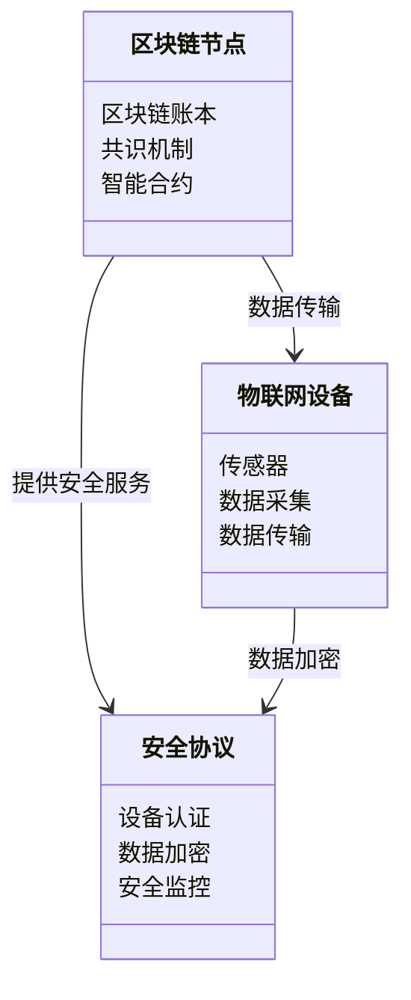
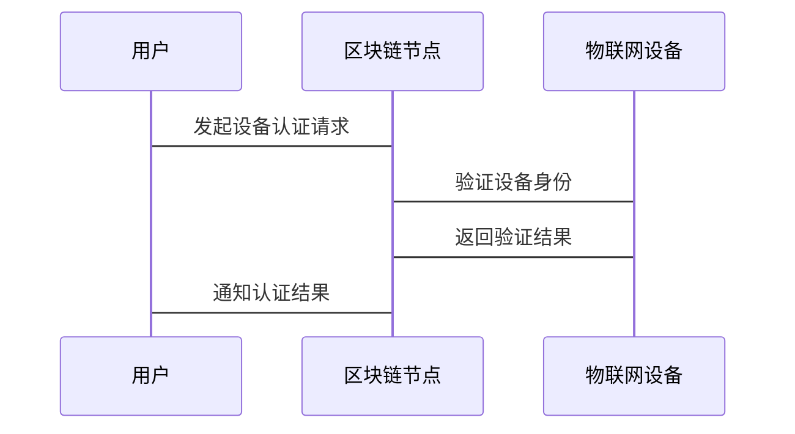

                 


# 企业估值中的区块链物联网安全平台评估

## 关键词：区块链、物联网安全、企业估值、智能合约、共识机制、安全评估、系统架构

## 摘要：区块链技术与物联网安全平台的结合为企业估值提供了新的思路。本文从区块链与物联网的基本概念出发，详细探讨了区块链物联网安全平台的核心概念、算法原理、系统架构、项目实战、最佳实践等方面，分析了区块链技术在提升物联网安全性、优化企业估值中的应用潜力。文章通过实际案例和数学模型，详细阐述了区块链物联网安全平台的实现过程及其在企业估值中的具体应用场景，为企业评估提供了新的技术视角和解决方案。

---

# 第1章: 区块链与物联网安全平台的背景与概念

## 1.1 区块链技术的基本概念

### 1.1.1 区块链的定义与特点
- 区块链的定义：分布式账本、去中心化、不可篡改、可追溯
- 区块链的特点：
  - 去中心化：无需信任的第三方机构
  - 不可篡改：数据一旦写入区块链，难以被修改
  - 可追溯：通过区块链可以追溯每一笔交易的来源
  - 高透明性：区块链上的数据对所有参与者透明

### 1.1.2 区块链的核心技术原理
- 分布式账本：数据分布在多个节点上，每个节点都有一份完整的账本
- 共识机制：通过共识算法（如PoW、PoS、DPoS）确保所有节点达成一致
- 哈希函数：用于生成区块头和验证数据完整性
- 智能合约：基于区块链的自动化执行脚本

### 1.1.3 区块链在企业估值中的应用潜力
- 提高数据透明性，增强投资者信任
- 降低数据篡改风险，确保估值数据的准确性
- 通过智能合约实现自动化估值流程

---

## 1.2 物联网安全平台的基本概念

### 1.2.1 物联网的定义与特点
- 物联网的定义：通过各种信息传感设备，如传感器、RFID、全球定位系统、红外感应器等，按约定的协议，把任何物品与互联网连接起来，实现信息交换和通信
- 物联网的特点：
  - 大规模连接：海量设备接入
  - 多样性：设备类型多样，数据格式多样
  - 实时性：数据需要实时传输和处理
  - 安全性：设备和数据容易受到攻击

### 1.2.2 物联网安全问题的现状与挑战
- 安全威胁：
  - 未授权访问：攻击者通过未授权的方式接入物联网设备
  - 数据泄露：设备数据被窃取或篡改
  - 拒绝服务攻击：攻击者通过消耗设备资源使其无法正常工作
- 安全挑战：
  - 设备认证困难
  - 数据隐私保护
  - 大规模设备管理

### 1.2.3 物联网安全平台的功能与作用
- 设备认证：通过区块链技术实现设备身份认证
- 数据加密：对设备传输的数据进行加密，防止数据泄露
- 安全监控：实时监控设备和网络的安全状态，发现异常及时告警
- 智能合约：通过智能合约实现设备的安全策略自动执行

---

## 1.3 区块链与物联网的结合

### 1.3.1 区块链在物联网中的应用场景
- 物品追踪：通过区块链记录物品的生产、运输、销售等全生命周期信息
- 设备认证：通过区块链实现设备的身份认证，防止未授权设备接入
- 数据共享：通过区块链实现设备数据的安全共享，确保数据不可篡改

### 1.3.2 区块链如何提升物联网安全
- 通过区块链的去中心化特性，防止单点攻击
- 通过智能合约，实现安全策略的自动化执行
- 通过区块链的不可篡改性，确保设备数据的真实性和完整性

### 1.3.3 区块链与物联网结合的典型案例
- 智能制造：通过区块链记录生产设备的运行状态，确保数据不可篡改
- 智慧物流：通过区块链实现物流信息的透明共享，确保物流过程可追溯
- 智慧医疗：通过区块链实现医疗设备的远程监控和数据共享

---

## 1.4 本章小结
- 区块链和物联网都是当前技术发展的热点领域
- 区块链技术可以有效提升物联网的安全性
- 区块链与物联网的结合为企业估值提供了新的技术手段

---

# 第2章: 区块链物联网安全平台的核心概念与联系

## 2.1 区块链物联网安全平台的组成要素

### 2.1.1 区块链节点
- 区块链节点的定义：参与区块链网络的计算机或服务器
- 区块链节点的功能：
  - 存储区块链账本
  - 参与共识机制
  - 验证和传播交易信息

### 2.1.2 物联网设备
- 物联网设备的定义：连接到物联网的硬件设备，如传感器、智能终端等
- 物联网设备的功能：
  - 数据采集：采集环境数据
  - 数据传输：将数据传输到云端或区块链节点
  - 执行命令：根据接收到的指令执行操作

### 2.1.3 安全协议与智能合约
- 安全协议的定义：一组规则，用于确保数据传输和存储的安全性
- 智能合约的定义：基于区块链的自动化执行脚本，用于实现安全策略

---

## 2.2 核心概念的原理与联系

### 2.2.1 区块链的共识机制
- 共识机制的定义：通过算法确保所有节点达成一致的协议
- 常见的共识机制：
  - 工作量证明（PoW）
  - 权益证明（PoS）
  - 指定证明（DPoS）
- 共识机制的作用：
  - 确保区块链账本的一致性
  - 防止恶意节点的攻击

### 2.2.2 物联网的安全威胁模型
- 安全威胁模型的定义：用于描述物联网系统可能面临的安全威胁和攻击方式
- 常见的物联网安全威胁：
  - 未授权访问
  - 数据泄露
  - 拒绝服务攻击
- 安全威胁模型的作用：
  - 帮助设计安全防护策略
  - 识别潜在的安全漏洞

### 2.2.3 智能合约在安全评估中的作用
- 智能合约的功能：
  - 执行安全策略：如设备认证、数据加密
  - 自动化操作：如自动触发报警、设备断电
- 智能合约的优势：
  - 去中心化：无需依赖第三方机构
  - 自动化：减少人工干预
  - 不可篡改：确保安全策略的执行

---

## 2.3 核心概念的对比分析

### 2.3.1 区块链与传统数据库的对比
| 特性                | 区块链                      | 传统数据库                  |
|---------------------|---------------------------|---------------------------|
| 数据存储方式        | 分布式存储                | 集中式存储                |
| 数据一致性          | 通过共识机制保证一致性    | 通过集中式控制保证一致性  |
| 数据安全性          | 数据加密、不可篡改          | 数据容易被篡改              |
| 可扩展性            | 去中心化，可扩展性高        | 集中式，扩展性受限          |

### 2.3.2 物联网安全平台与传统安全系统的对比
| 特性                | 物联网安全平台              | 传统安全系统              |
|---------------------|---------------------------|---------------------------|
| 设备管理            | 支持大规模设备接入          | 设备管理能力有限            |
| 数据安全性          | 数据加密、不可篡改          | 数据容易被篡改              |
| 安全监控            | 实时监控、自动化响应        | 监控能力有限、响应慢        |

### 2.3.3 智能合约与传统合同的对比
| 特性                | 智能合约                  | 传统合同                  |
|---------------------|---------------------------|---------------------------|
| 执行方式            | 自动化执行                | 需要人工执行                |
| 数据存储            | 存储在区块链上，不可篡改    | 存储在纸质或电子文档中      |
| 执行效率            | 高效，快速执行            | 低效，需要人工干预          |

---

## 2.4 本章小结
- 区块链物联网安全平台由多个核心要素组成，包括区块链节点、物联网设备、安全协议和智能合约
- 区块链的共识机制和智能合约是提升物联网安全的关键技术
- 区块链物联网安全平台与传统技术相比具有显著优势

---

# 第3章: 区块链物联网安全平台的算法原理

## 3.1 区块链共识机制的算法原理

### 3.1.1 工作量证明（PoW）机制
- PoW机制的定义：通过计算一个复杂的数学问题来证明工作量
- PoW机制的实现步骤：
  1. 每个节点在接收到新的交易后，将其添加到候选区块中
  2. 节点需要找到一个随机数，使得计算得到的哈希值小于预设的难度值
  3. 成功找到哈希值的节点将被允许创建新区块，并将该区块广播给其他节点
  4. 其他节点验证该区块的有效性，并将其添加到区块链中

### 3.1.2 权益证明（PoS）机制
- PoS机制的定义：通过持有一定数量的货币来证明权益
- PoS机制的实现步骤：
  1. 节点根据持有的货币数量分配到不同的权益池中
  2. 系统随机选择一个权益池中的节点，允许其创建新区块
  3. 其他节点验证该区块的有效性，并将其添加到区块链中

### 3.1.3 共识算法的数学模型
- PoW机制的数学模型：
  $$ H = \text{hash}(P + U + T) $$
  其中，$H$ 是哈希值，$P$ 是前一区块的哈希值，$U$ 是交易数据，$T$ 是时间戳
- PoS机制的数学模型：
  $$ \text{概率} = \frac{\text{持有权益数量}}{\text{总权益数量}} $$

---

## 3.2 智能合约的执行流程

### 3.2.1 智能合约的编译与部署
- 智能合约的编译：
  - 使用Solidity等编程语言编写智能合约代码
  - 将代码编译成字节码
- 智能合约的部署：
  - 将字节码部署到区块链网络中
  - 部署完成后，智能合约将获得一个唯一的地址

### 3.2.2 智能合约的调用与执行
- 智能合约的调用：
  - 用户通过交易发起对智能合约的调用
  - 交易中包含调用智能合约的地址和方法
- 智能合约的执行：
  - 智能合约代码运行在区块链虚拟机中
  - 根据交易中的方法执行相应的逻辑

### 3.2.3 智能合约的验证与监控
- 智能合约的验证：
  - 通过区块链节点验证智能合约的执行结果
  - 确保智能合约的执行符合预期
- 智能合约的监控：
  - 实时监控智能合约的执行状态
  - 发现异常及时告警

---

## 3.3 物联网安全评估的算法实现

### 3.3.1 基于区块链的设备认证算法
- 设备认证的实现步骤：
  1. 设备向区块链节点发起认证请求
  2. 区块链节点验证设备的身份信息
  3. 验证通过后，区块链节点为设备颁发数字证书
  4. 设备使用数字证书进行后续的数据传输

### 3.3.2 基于智能合约的安全策略执行算法
- 安全策略的执行步骤：
  1. 用户定义安全策略，如设备必须在特定时间范围内进行数据传输
  2. 安全策略通过智能合约部署到区块链网络中
  3. 智能合约自动监控设备的数据传输情况
  4. 发现异常及时触发报警或执行断开设备的命令

---

## 3.4 本章小结
- 区块链共识机制的算法原理是实现区块链安全的基础
- 智能合约的执行流程是实现安全策略自动化的关键
- 物联网安全评估的算法实现是提升物联网安全的核心

---

# 第4章: 区块链物联网安全平台的系统架构

## 4.1 问题场景介绍

### 4.1.1 问题背景
- 物联网设备数量庞大，安全性差
- 数据容易被篡改，企业估值困难
- 安全监控能力有限，难以应对大规模攻击

### 4.1.2 问题描述
- 如何确保物联网设备的数据安全
- 如何提升企业估值的准确性
- 如何实现物联网系统的自动化安全监控

### 4.1.3 问题解决
- 通过区块链实现设备身份认证
- 通过智能合约实现安全策略自动化
- 通过区块链的不可篡改性确保数据安全

---

## 4.2 系统功能设计

### 4.2.1 系统功能概述
- 设备认证：通过区块链实现设备身份认证
- 数据加密：对设备传输的数据进行加密
- 安全监控：实时监控设备和网络的安全状态
- 智能合约：通过智能合约实现安全策略的自动化执行

### 4.2.2 领域模型（Mermaid 类图）


---

## 4.3 系统架构设计

### 4.3.1 系统架构概述
- 前端：用户界面，用于设备管理和安全监控
- 后端：区块链节点，用于处理交易和智能合约
- 数据库：存储区块链账本和设备数据
- 物联网设备：连接到网络的传感器和执行器
- 区块链节点：分布式节点，确保数据的安全性和一致性

### 4.3.2 系统架构图（Mermaid 架构图）
```mermaid
archiecture {
    前端 ↔ 区块链节点 ↔ 数据库 ↔ 物联网设备
}
```

---

## 4.4 系统接口设计

### 4.4.1 接口概述
- 设备认证接口：用于设备的身份认证
- 数据传输接口：用于设备与区块链节点之间的数据传输
- 智能合约接口：用于智能合约的部署和执行

### 4.4.2 接口交互流程
1. 设备向区块链节点发起认证请求
2. 区块链节点验证设备的身份信息
3. 验证通过后，区块链节点为设备颁发数字证书
4. 设备使用数字证书进行后续的数据传输

---

## 4.5 系统交互流程（Mermaid 序列图）


---

## 4.6 本章小结
- 区块链物联网安全平台的系统架构包括前端、后端、数据库和物联网设备
- 系统架构设计确保了数据的安全性和一致性
- 系统接口设计实现了设备认证、数据传输和智能合约的自动化执行

---

# 第5章: 区块链物联网安全平台的项目实战

## 5.1 环境搭建

### 5.1.1 开发环境
- 操作系统：Linux/Windows/MacOS
- 区块链框架：以太坊、Hyperledger等
- 物联网设备：传感器、智能终端等
- 开发工具：IDE（如IntelliJ IDEA、VS Code）、命令行工具

### 5.1.2 区块链网络部署
- 部署区块链网络：如以太坊测试网
- 配置区块链节点：安装节点软件，配置网络参数
- 部署智能合约：编写智能合约代码，部署到区块链网络

### 5.1.3 物联网设备连接
- 连接物联网设备：如传感器、智能终端
- 配置设备通信参数：如IP地址、端口号
- 设备与区块链节点的通信：建立设备与区块链节点的通信通道

---

## 5.2 系统核心实现

### 5.2.1 智能合约实现
- 智能合约代码（Solidity）：
  ```solidity
  contract DeviceAuthentication {
      function authenticate(bytes32 deviceID) public returns (bool) {
          // 验证设备ID
          if (deviceID == 0x12345678) {
              return true;
          }
          return false;
      }
  }
  ```
- 智能合约部署：
  ```bash
  solidity --compile --output ./out DeviceAuthentication.sol
  ```

### 5.2.2 设备认证实现
- 设备认证流程：
  1. 设备向区块链节点发起认证请求
  2. 区块链节点调用智能合约进行设备认证
  3. 智能合约返回认证结果
  4. 设备根据认证结果进行后续操作

### 5.2.3 数据加密实现
- 数据加密算法：使用AES算法对设备数据进行加密
- 数据解密：使用AES密钥对加密数据进行解密
- 数据加密流程：
  1. 设备采集数据
  2. 数据加密：使用AES算法对数据进行加密
  3. 加密数据传输：设备将加密数据传输到区块链节点
  4. 数据解密：区块链节点解密数据并存储到区块链账本中

---

## 5.3 代码实现与解读

### 5.3.1 智能合约实现代码
```solidity
contract DeviceAuthentication {
    function authenticate(bytes32 deviceID) public returns (bool) {
        // 验证设备ID
        if (deviceID == 0x12345678) {
            return true;
        }
        return false;
    }
}
```

### 5.3.2 设备认证实现代码
```python
import web3
from web3 import Web3

# 初始化区块链节点
web3 = Web3(Web3.HTTPProvider('http://localhost:8545'))

# 调用智能合约进行设备认证
contract_address = '0x123456789aBcD123456789aBcD123456789aBcD'
abi = [{'constant': True, 'inputs': [{'name': 'deviceID', 'type': 'bytes32'}, {'name': 'timestamp', 'type': 'uint256'}], 'name': 'authenticate', 'outputs': [{'name': 'isAuthenticated', 'type': 'bool'}], 'payable': False, 'stateMutability': 'view', 'type': 'function'}]
contract = web3.eth.contract(contract_address, abi=abi)

# 发起设备认证请求
device_id = '0x12345678'
tx_hash = contract.functions.authenticate(device_id).transact()
tx_receipt = web3.eth.waitForTransactionReceipt(tx_hash)

# 获取认证结果
is_authenticated = contract.functions.authenticate(device_id).call()
print(f'Device {device_id} authenticated: {is_authenticated}')
```

---

## 5.4 实际案例分析

### 5.4.1 案例背景
- 某制造企业希望通过区块链物联网安全平台实现生产设备的远程监控和数据共享
- 生产设备需要连接到区块链网络，实现设备数据的安全共享和自动化监控

### 5.4.2 案例分析
1. 设备认证：
   - 生产设备向区块链节点发起认证请求
   - 区块链节点调用智能合约进行设备认证
   - 认证通过后，生产设备获得数字证书
2. 数据加密：
   - 生产设备采集数据并进行加密
   - 加密数据传输到区块链节点
   - 区块链节点解密数据并存储到区块链账本中
3. 安全监控：
   - 智能合约自动监控设备的运行状态
   - 发现异常及时触发报警
   - 自动执行安全策略，如断开异常设备

---

## 5.5 本章小结
- 区块链物联网安全平台的实现需要综合运用区块链、智能合约和物联网技术
- 案例分析展示了区块链物联网安全平台在实际场景中的应用
- 通过代码实现和解读，读者可以更好地理解系统的实现过程

---

# 第6章: 区块链物联网安全平台的总结与展望

## 6.1 总结

### 6.1.1 核心技术总结
- 区块链技术：去中心化、不可篡改、高透明性
- 智能合约：自动化执行、安全可靠
- 物联网技术：大规模连接、实时性、安全性

### 6.1.2 实践总结
- 通过区块链实现设备认证和数据加密，确保设备数据的安全性和真实性
- 通过智能合约实现安全策略的自动化执行，提升系统的安全性
- 通过区块链的不可篡改性，确保企业估值数据的准确性

---

## 6.2 最佳实践与注意事项

### 6.2.1 安全风险
- 设备认证风险：防止设备被恶意攻击
- 数据隐私风险：保护设备数据不被泄露
- 系统性能风险：确保系统的高可用性和高性能

### 6.2.2 数据隐私保护
- 数据加密：对设备数据进行加密存储和传输
- 访问控制：基于角色的访问控制，确保只有授权人员可以访问敏感数据
- 数据脱敏：对敏感数据进行脱敏处理，降低数据泄露风险

### 6.2.3 性能优化
- 系统优化：通过优化共识机制和智能合约代码提升系统性能
- 并行处理：通过并行处理提升系统的吞吐量
- 负载均衡：通过负载均衡技术提升系统的可用性

---

## 6.3 未来研究方向

### 6.3.1 结合人工智能
- 通过人工智能技术分析设备数据，发现潜在的安全威胁
- 利用机器学习算法预测设备的异常行为
- 通过AI技术优化共识机制，提升系统的性能

### 6.3.2 边缘计算
- 通过边缘计算技术实现设备数据的本地处理
- 减少数据传输到云端的延迟
- 提升系统的实时性和响应速度

### 6.3.3 多链架构
- 通过多链架构实现不同设备的数据隔离
- 提升系统的扩展性和可维护性
- 降低单点故障的风险

---

## 6.4 本章小结
- 区块链物联网安全平台在企业估值中的应用具有广阔前景
- 通过技术创新和实践总结，可以进一步提升系统的安全性和性能
- 未来的研究方向包括结合人工智能、边缘计算和多链架构，进一步优化系统的功能和性能

---

# 作者：AI天才研究院/AI Genius Institute & 禅与计算机程序设计艺术 /Zen And The Art of Computer Programming

